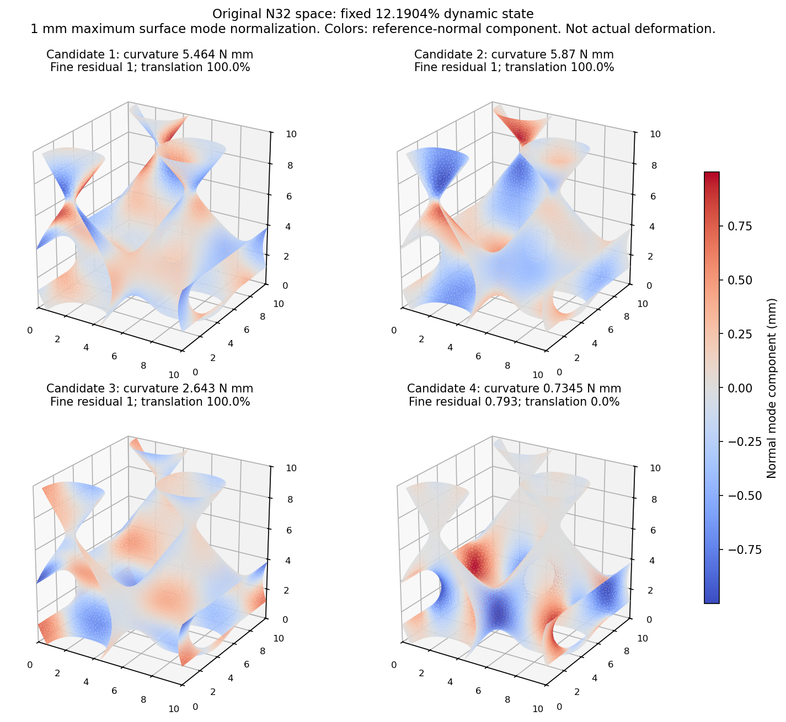

# 周期折叠模式诊断：r22收口与下一项

2026-10-07。**原N32矩阵自由机械模式细化已执行，但没有得到收敛的临界模式。** 找到了更软的变形候选，仍未解释壳与JAX观察峰位置差；第4步完整20%没有启动。前一轮详见[r21冻结报告](../validation/critical_mode_20261007_r21/REVIEW.md)，其科学原件与失败保持。

## 1. 问题、作用与固定条件

研究主线仍是可信薄壁TPMS背景压缩、保留有效梯度，服务后续构型/参数学习和逆设计；当前先解决跨构型前向。diverse_04快壳峰11.8241%、JAX峰15.9409%，相差4.1168个百分点，JAX峰力高约35.23%。速率对齐不足以解释差异。r21的较粗周期扰动空间找到一个正曲率变形候选，但它的原细空间残差约1、与壳折叠增量相关性很低。

本次只问：将这个候选放入原N32全部周期自由度细化，是否存在遗漏的更局部薄壁方向？使用原12.1904%动态保存态，固定宏观H；diverse_04中面、L=10mm、t=0.5mm、均匀NH E=10MPa/ν=0.3、XYZ周期波动/横向宏观应变0、HEX27 N32/27点、HRZ、η=1e−4、界面0.05mm和objective_void/C²核保持。没有改前向网格、积分、材料、质量或边界；未推进压缩时间，也未求设计AD。

## 2. 怎么算，什么才算通过

原周期自由度为786429。机械切线K仍来自同一材料能量的二阶位移导数；在原Gauss点构造dP/dF，再与原形函数梯度收缩得到K对向量的作用，不组装巨型全局矩阵。使用原HRZ对角质量M，将广义问题K v=λ M v写成质量白化算子A=M⁻¹ᐟ² K M⁻¹ᐟ²。

初始四方向为r21零附近前三个主平移方向与第4变形候选。原点固定保持，保留并分类平移，没有为了找期望模式增加前向约束。SciPy LOBPCG以这四方向为初块，求较小代数值；最多200迭代，用材料切线绝对行和/梯度所得正对角界预处理迭代。预处理只改善数值求解，不改变K或M。框架、收敛受初块与预条件影响的说明见[SciPy LOBPCG文档](https://docs.scipy.org/doc/scipy/reference/generated/scipy.sparse.linalg.lobpcg.html)。

协议先规定：独立重算的质量白化残差和原广义细空间残差都≤0.001，才称该候选模式收敛；直接完整域曲率还须有限并与算子作用一致。程序正常退出不等于本征问题收敛。动态保存态不是已认证静态平衡态，有限初块的迭代也不认证全局最小或全部方向稳定。

## 3. 实际结果及数字解释

| 返回方向 | 近似方向商λ，s⁻² | 表面最大1mm归一化曲率，N·mm | 平移惯性比例 | 原细空间残差 | 白化残差 |
| --- | ---: | ---: | ---: | ---: | ---: |
| 1 | 34009 | 5.46404 | 99.9865% | 0.999991 | 1.000000 |
| 2 | 36277.7 | 5.87032 | 99.9860% | 1.000000 | 1.000000 |
| 3 | 112953 | 2.64290 | 99.9570% | 0.999987 | 0.999999 |
| 4 | 1.31135e+07 | 0.73452 | 0.0010% | 0.793266 | 0.966156 |

四方向都未过模式残差门槛。前三个仍有99.96%以上惯性对应整体平移，不当作薄壁折叠。第4方向的平移惯性仅约0.001%，主要是变形；其近似质量方向商从r21约3.2083e7降到1.3114e7s⁻²（降低59.13%）。这里λ尚不是收敛特征值，下降说明迭代找到较低方向商，不是反力误差降低了59.13%。

同样把中面最大模式位移归一化到1mm，第4方向曲率由1.8825降至0.7345N·mm；模式形状/质量也有变化，不能把两者差直接称作实体弯曲刚度误差。没有给模型真的施加1mm扰动。

第4方向原细空间残差仍0.793266、白化残差0.966156，离0.001很远。两指标都在衡量K v与λM v的一致性，只是度量不同；它们**不是前向反力误差百分比**。本次没有通过临界模式提取，也不能用正曲率宣布全稳定。

该方向完整域曲率分项为深虚域0.08684、混合尾部0.01406、主要界面0.13392、几何核心0.49970N·mm。深虚域φ≤0.001与混合尾部0.001<φ<0.01合计份额13.74%，φ为几何占据。这个方向仍以实体核心为主；份额不是总储能、反力误差或虚域的因果贡献，不据它调η。

第4方向与r21候选的中面面积加权绝对相关性0.999660，仍是同一形态家族；与快壳11.8632%→13.8245%折叠增量相关性仅0.02755。相关性1表示同向、0表示正交；符号不影响模态。壳增量是有限动态变形，并不是壳特征模态，因此此比较是线索，不能作严格同模认证。

图中四方向分别归一化，颜色是参考中面的法向模式分量；颜色不能直接比较真实刚度。所有原材料域保留，不用正J子域代替总能量。

## 4. 科研判断与下一项

本轮证明矩阵自由机械切线可以在原N32规模运行，也表明原受限候选可以继续软化；**没有定位真正临界模式，更没有定位主要反力差或完成可迁移修正。** 简单对角预条件下的200次迭代仍有大残差；不能把本征迭代未收敛当成JAX前向积分不可靠或TPMS路线不可行。继续只加次数/换任意初块，目前缺少直接科研依据。

候选仍与壳折叠方向差异明显。初块/迭代可能没有覆盖相应变形家族，求解条件也可能不足；它们是待判断的因素，不宣称已证明对称性、锁定或虚域是唯一原因。下一项使用实际壳折叠信息作为诊断方向来源，可以更直接检查当前遗漏方向，而不是挑扰动去拟合峰值。

原第3步的下一项改为一个有物理来源的方向诊断：复用r20快壳现有ODB中11.8632%→13.8245%两帧U/UR，先只读提取转角；元数据已确认UR存在，现有NPZ仅有位移。执行前写清有限转角/中面至厚度方向转移、宏观仿射分量、原XYZ周期及平移固定、原N32插值误差与虚域延拓，再在同一12.1904%JAX保存态评价这个完整域方向的切线曲率/材料分项和与现有候选的耦合。该有限壳增量不是特征模态，方向转移本身有近似；正曲率不证明全稳定，负方向也不直接定位静态临界点。只用它判断是否漏掉壳观察到的折叠家族/表示差异，不依赖壳来校准后续生产前向。不扫幅值、η、界面、积分或阻尼，不追加本轮谱迭代或新压缩路径；第4步仍需针对性证据。目前尚未提取UR、生成转移方向或提交新诊断。

这仍是原四步的第3步。diverse_28三个厚度已有完整20%范围保持；diverse_04跨构型约10%目标仍未过，r18仍只到17.5363%，新核完整20%路径梯度未认证。建议继续有边界的仿真研究，不承诺通用替代，不把这轮算子导数当成设计梯度；训练后置。原准静态失败、壳人工能量与漂移不确定性保留，高KE单独不阻塞动态研究。

## 5. 执行事实、成本与核对

首次准备调用约249.83s后手动中断，未进入特征迭代；中断前刷新日志已有前两列材料切线。原日志/源码/退出−2保存在startup_attempt01，不改写为成功。它不能单凭中断位置定位之前耗时的唯一原因。

一次准备恢复补充阶段计时，并将批量3×3通用行列式换为r21已有的等价三重积表达式，16个真实点对通用行列式核对；实际F/J不夹断，科学输入/后端/谱参数保持。恢复约69.17s完成200迭代及材料解释，程序退出0，但四模仍未收敛。两次调用共319.00s（5.32min），从原900s总预算扣除首次成本，没有另开900s。这是机械诊断成本，不是新前向/反向训练成本；本轮不再谱重试。

质量投影与原HRZ相对差1.46e-15，原N8切线投影作用相对差6.39e-14，16点JVP/jacfwd相对差1.38e-16。材料切线对称性与完整域直接曲率核对有原数据；实现检查不认证机械精度。原NH必须正J区域的该态最小J约0.4157，只是该保存态采样事实，不认证全过程无接触/无翻转。

已有快壳INP请求U/UR/RF，实际帧元数据有UR；当前NPZ提取只保存U相关量。shell_data_inventory只读记录其可用性，没有新Abaqus作业或ODB修改。

## 6. 文件位置与整理

- 正式实验：`/home/xuehu/projects/tpms_jax/validation/fine_mode_20261007_r22/`；protocol为执行前范围，startup_attempt01保留中断，startup_recovery为成本恢复边界；result与iteration_history为返回候选及过程，analysis_summary/modes.png为解释，operator_checks为原算子核对。
- 当前报告：Windows本文件、正式docs同名和r22/REVIEW。r21原报告留r21/REVIEW及整理前备份，科学原件不改。背景/唯一规划/状态/地图同步r22。
- 本轮完成调用工具归档`history/completed_tools_20261007/fine_mode_20261007/`，不是第二套FEM；科研原件/ODB/用户论文不移动或删除。
- 旧r15～r21共490科学文件及共享核/入口/距离/PBC保持原字节。当前无运行中或排队作业；无新前向/Abaqus/设计AD，没有Git提交、推送或合并。
