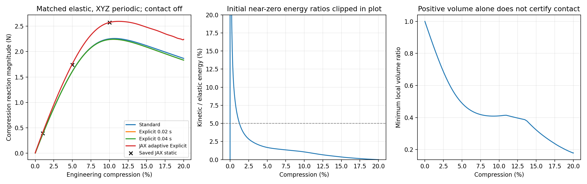
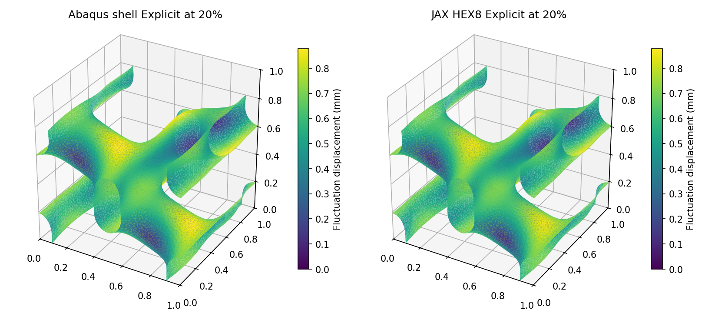
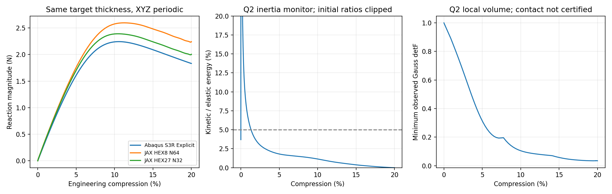
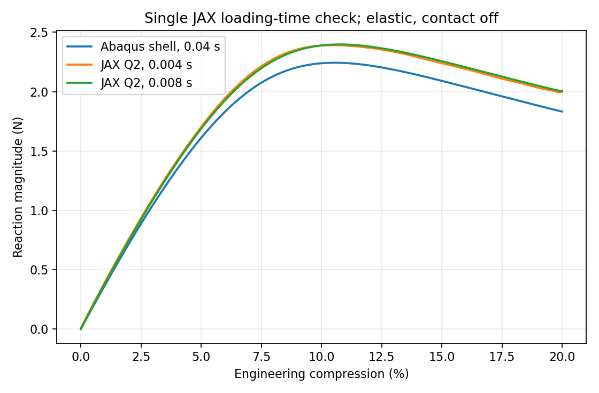

# 20%压缩推进：前向改善、速率复核与梯度检验

2026-10-05，本轮执行记录。最终结果以同轮JSON/日志为准；当前目标仍是t/L=0.05薄壁、XYZ周期的可信前向和有效梯度，训练后置。

## 最新结论（先读本节）

固定0.5mm薄壁及XYZ加载，二次背景JAX显式已完成0至20%，对Abaqus慢壳诊断的20%反力/整段曲线/功差为9.45%/5.87%/6.87%；加载时间加倍复核通过。第3步工作目标达到。原HEX8的22.41%是改善前记录，下文按阶段保留。

第4步已尝试20%总梯度：中心平衡与伴随方程完成，但厚度扰动重新平衡未过，梯度未认证。当前能承认该薄壁无接触弹性模型的前向可行性和响应改善，不能承认已经全面替代Abaqus或具备可靠20%设计梯度。训练继续后置。

## 本轮实际回答的问题

先直接尝试高压缩，观察现有静力路线到底卡在哪里，并实际建立物理显式候选。不因旧10%反力差14.19%停止探索，不加厚、不提高孔隙模量拟合壳参考，不另开边界或全面网格收敛研究。

锁定L=10mm、t=0.5mm、diverse_28中面、E=10MPa、nu=0.3、eta=1e-4。首个候选为N64背景HEX8、2097152个Gauss点；第3步采用同节点数量的N32 HEX27候选、884736个Gauss点。材料能量为现有可压缩Neo-Hookean；占据随参考材料点保持。Abaqus仍是同一中面的S3R壳、五个截面积分点、XYZ位移及转角周期、宏观横向应变固定。两边均无塑性和接触，本轮结果是初始弹性无接触诊断，不能认证真实自接触之后的响应。

## 已取得的Abaqus路径

| 路径 | 20%反力绝对值 | 20%弹性储能 | 实际分析时间 |
| --- | ---: | ---: | ---: |
| Standard静力 | 1.866571N | 3.573390N·mm | 约106秒 |
| Explicit，0.02秒加载 | 1.831441N | 3.513769N·mm | 350秒 |
| Explicit，0.04秒加载 | 1.831447N | 3.513768N·mm | 621秒 |

反力取宏观控制自由度；压缩为负，上表报告幅值。Explicit在加载后另保载加载时间的10%，使用末半段平均反力判断速率敏感性，两次保载平均反力仅差0.000846%。与慢Explicit相比，Standard终点差1.918%。Standard峰值约2.258914N，位于约10.7%压缩，之后力下降：只比较20%终点不足以判断整段正确。

Explicit声明基准质量密度1000kg/m³，即mm/N/MPa/tonne/s单位下1e-9tonne/mm³；没有质量缩放，双精度，默认体积黏性，平滑加载。该密度是弹性动力基准输入，未声称来自实际材料测量。

两条Explicit在压缩至少1%的加载段，动能/内能均低于5%；其95%分位约为0.185%和0.0464%。终点动能很小，时间加倍后的响应基本重合，有力减弱了惯性主导的疑虑。这里“动能”是运动储能，“内能”包括材料弹性与人工能；人工能来自壳数值控制，不能视为真实耗能。

参考仍有质量边界：Explicit总能量漂移相对最大输入功约1.33%，超过预设1%；人工能约占最大输入功1.43%。Standard总储能与外功差2.08%，人工能/外功1.34%，亦未通过旧1%检查。因此三条曲线只能先作一致性较好的诊断参考，不能标成严格精度认证。保持原判据，未放宽到“通过”；按用户指令，详细追因后置，继续探索JAX高压缩。

## JAX静力的具体阻塞

从冻结10%平衡状态直接续算15%，残差从初始值降到4.48e-5，但第3次Newton校正中的PETSc GMRES达到3000次迭代上限，未得到15%平衡结果。程序主体约1112秒，含启动/监护的总耗时约1218秒；没有因时间预算杀停。

停止前状态有限、所有Gauss点体积比为正，最小J约0.324，位于软孔隙；实体区最小约0.867。J表示当前体积/参考体积，J=1为不改变体积，J≤0为失去有效体积映射。该记录证明本次大型线性系统求解遇阻，不能证明15%物理平衡不存在，更不能证明JAX-FEM方法不可行。未提交依赖该平衡状态的静力20%续算，失败日志原样保留。

## JAX显式候选的定义

新增一个维护入口scripts/thin_target_explicit.py，直接调用现有JAX-FEM的Neo-Hookean残差。每步只算内力，使用集中质量中央差分，不组装或求解全局切线。周期类内力和质量分别归并；宏观仿射位移、速度、加速度进入方程，反力包括对应惯性贡献，不能只拿动态内力当控制反力。

材料质量按实体占据计算，软域另设与刚度下限相等的1e-4数值质量下限。这是维持虚域时间推进的数值质量，不是异质材料，也没有人为缩放真实实体质量。该初版没有阻尼、接触和塑性。参考波速估计给出约2.69e-7秒步长；在有限应变下这只是起始步长估计，不能宣称完整非线性稳定界。

一个短XYZ周期P波检验已通过：N8、极小初始振幅，与该HEX8集中质量离散波频率比较，模态误差0.0291%、总能变化0.0807%。这是积分/质量/周期基础证据，不是薄壁精度证据，也不是20%厚度梯度验证。

同一N64薄壁已实际运行32步成本探针：编译约13.2秒，含监测平均0.0604秒/步，峰值进程内存约9.36GiB。估算0.02秒加载加保载整段约82分钟，0.004秒加载约16分钟。随后实际提交0.004秒加载加0.0004秒保载的目标尝试，16337步，未缩小网格；最终用实际能量/速率判断能否作准静态证据，不能为节省时间假定短加载已经足够慢。

中央差分单步使用JAX运算，可微材料内力保持复用；当前CLI是前向实验，质量和占据在初始化冻结，尚没有可对厚度求导的整体路径接口。设计参数接入、检查点反向及20%梯度均未完成，不能声称已有经验证的20%性能总梯度。采用减步时还须保留有效时间步序列，在一致离散路径上处理导数。

方法出发点可查 [JAX-FEM官方显式波示例](https://github.com/deepmodeling/jax-fem/tree/main/applications/explicit_dynamics)；本项目自行接入XYZ归并、仿射惯性及现有NH材料，并作上述项目检验。准静态能量判断参照 [Abaqus能量说明](https://docs.software.vt.edu/abaqusv2025/English/SIMACAEGSARefMap/simagsa-c-qsienergybal.htm)，不把小动能单独当作准确性证明。

## 首个HEX8候选的JAX20%结果

JAX显式减步在同一N64薄壁上完成20%及保载；平均反力幅值2.241863N，对慢Explicit差22.41%，整段曲线RMS/参考特征峰值差13.47%，输入功差15.51%。实际主体耗时18.57分钟，1次无效块被拒绝，终态动能/弹性储能0.00005%，能量与输入功差0.008%。

“整段曲线RMS”是共同0.1%至20%压缩坐标上反力差的均方根，再除以Standard参考峰值2.258914N；它衡量整段，而不是每个接近零反力点的百分比。“输入功”是反力随压缩位移的积分。终点反力使用保载后半段平均，避免挑振荡中的一个点。

最小观察体积比为0.178537。终态实体区最小J为0.822847，低占据软域最小为0.178786。统一1e-4刚度下限能量占总弹性能2.5881%；这只量化下限项，不排除几何过渡带或位移表示误差。中面位移波动与壳参考余弦相似度0.999633，它表示主要形态相似，不等于反力准确或自接触正确。

第一次固定步尝试在16.2139%后保护停止；重试从有效块回退、减小时间步后达到20%，失败块不计入有效曲线，没有裁剪J或修改材料。记录支持“有限应变下原始时间步不足”这一算法判断，不能把减步当成改善空间精度。

**本轮证明同一目标薄壁能以显式方式算到20%，尚未证明能在约10%目标内替代Abaqus。** 响应工作目标是否达到：False；参考本身仍是质量有边界的无接触诊断。第1/2步实际尝试已经完成，第3步的必要时间步处理已执行，响应差异仍需下一项改进；第4步20%梯度未执行。没有训练、优化、厚度拟合或参数扫描。

下一项仍在原第3步内：结合终态实体/软域能量和变形，选择确实能改善大压缩响应的表示或虚域方法；如果需要接触，先匹配正确物理定义。参考质量和周期镜像接触边界继续保留，不能用目前数字直接作最终替代认证。

同一保存状态的统一下限项轴向内力为-0.039240N，约占总内部宏观反力幅值1.75%。这不是重新平衡后的因果误差分解，但不支持把全部22.4%差异简单归于下限项。下一项优先区分薄壁空间表示与壳/实体参考假设，保持原物理输入；不能直接从曲线扣去该分量取得“正确曲线”。

本轮共1项静力续算、1项周期波检验、1项N64成本探针、2项目标显式尝试；另有3项实际Abaqus分析和1项数据检查，无伴随、设计扰动或训练。14项相关已有维护检查通过（17.01秒），不是全套157项重跑。

## 首个HEX8阶段的文件位置与当时下一项

- 正式新实验：WSL /home/xuehu/projects/tpms_jax/validation/large_compression_20261005_r6/。static/a0p150000保存静力失败，abaqus/保存三条参考的小型提取结果，explicit/保存波检验、N64成本探针及实际目标尝试。
- Abaqus原始ODB：E:/ABAQUS/2026temp/Abaqus_Work/tpms_jax_abaqus/large_compression_20261005_r6_standard、_explicit_T0p020、_explicit_T0p040。ODB保持原位，没有重复复制到Git。
- 一次性调度、源码修改前快照及发布收据：本工作区work/forward20_step1_20261005/。正式维护入口只在WSL/scripts/，快照不维护为第二套FEM。
- 原薄壁实验validation/thin_target_20261004_r5/继续冻结，旧1%/5%/10%和梯度证据不改写。

仍按唯一四步推进：先收取实际显式高压缩结果，定位求解、软域或接触是否成为必要改进，再进入20%有效梯度。不能跳过尚未成立的前向结果直接训练，也不能把本轮停止记成整个长期路线失败。

## 模型定义核对与阶段结论（2026-10-05，只读调查）

本节核对生成程序、实际INP及保存结果，未提交新科学作业。原网格文件为F:/auto_abaqus/work/para_aly/Fine/T0p02/MS9/diverse_28/abaqus/ingredients/shell_mesh.inc，本次读取其SHA256与归档输入一致。保留原9351个节点坐标、标签及17986个三角形连接；本轮未独立重新划分壳网格。只复用中面，厚度改为用户指定的0.5mm，材料和加载采用本轮弹性基准，不沿用原塑性摩擦压板模型。

XYZ壳周期关系由scripts/thin_target_linear.py的XYZ分支重新生成：把归一化坐标1折回0，按九位小数分组，各周期等价组只选一个根节点，每个从节点只约束一次。共有366条节点关系，每条包含三个位移和三个转角方程，共2196条标量方程。位移满足u_slave-u_root=(Delta z/L) q_z e_z；横向和宏观剪切跳量为零，三个转角在对应节点相等。控制节点9352的U3=q_z，20%时q_z=-2mm；物理节点1只固定三个平移，未夹紧其转角。后续Standard/Explicit沿用这一约束。JAX则用规则网格周期等价类共享波动w，u=H X+w，H=diag(0,0,-a)，固定角点类的三个w分量。两者宏观加载相同，平移固定点不同；静力比较可去掉刚体平移，动态中还需关注相应惯性与固定点反力，不能把两条动力路径称为完全相同。

两边共同输入为L=10mm、t=0.5mm、E=10MPa、nu=0.3、Neo-Hookean、XYZ宏观横向应变为零、无塑性/接触。本轮实际Abaqus材料为C10=1.923076923MPa、D1=0.24/MPa，与JAX实体基材的mu=3.846153846MPa、kappa=8.333333333MPa对应。单位转换为JAX位移乘L、力乘L²、能量乘L³。匹配这些数值不代表壳与三维实体的运动学、厚度更新及离散积分相同。

Abaqus没有孔隙单元，也没有USDFLD/VUSDFLD：S3R只表示材料壁，壳截面使用五点Simpson积分，周围为空。它是尖锐实体/空隙的壳理想化，不是二值体素三维实体。JAX为完整64³背景HEX8、每单元八个体积Gauss点；参考点距周期中面d，通过phi=sigmoid((t/2-d)/ell)得到占据，ell=0.05mm/(2 ln9)。能量系数为s=1e-4+(1-1e-4)phi；孔隙有很小非零刚度，界面10%至90%的过渡宽度0.05mm。占据随参考材料点保持，变形时不在当前坐标重新填材料。当前对照是两种表示对同一目标薄壁的近似，不能把22.41%全部称为JAX求解器误差。

值得优先辨别的原因：

- 一阶全积分HEX8在弯曲中可能过硬，名义壁厚约3.2个背景网格宽度；新增Gauss点不会增加位移自由度。这是文献支持的候选原因，尚未证明是本项目主因。S3R自身也有弯曲/曲率离散近似，不自动是真值。[Abaqus全积分说明](https://docs.software.vt.edu/abaqusv2025/English/SIMACAEGSARefMap/simagsa-c-ctmfull.htm)、[壳单元说明](https://docs.software.vt.edu/abaqusv2025/English/SIMACAEELMRefMap/simaelm-c-shellelem.htm)。
- 相同名义厚度不保证相同局部厚度方向应变、界面载荷传递或弯曲刚度。JAX积分占据体积分数15.1649%，壳面积乘厚度的名义值15.2163%，总用料仅差约0.34%；不能简单用总用料解释22.4%，也不能因此排除局部界面影响。
- 本轮壳截面未显式指定POISSON。官方默认Standard为0.5、Explicit为MATERIAL，这里的截面参数控制厚度更新，不等于把材料nu改成0.5。Standard与Explicit因而除了时间算法还存在该默认差异；下一次参考应明确设置。当前主要22.4%比较基于慢Explicit，不能把Standard这一默认项当作全部差异原因。[SHELL SECTION定义](https://docs.software.vt.edu/abaqusv2025/English/SIMACAEKEYRefMap/simakey-r-shellsection.htm)。
- JAX加载0.004秒，Abaqus为0.02/0.04秒；实体质量密度相同，但JAX的占据/软域质量、壳转动惯量、固定点及Abaqus默认数值黏性并不相同。Abaqus时间加倍已有证据，JAX尚未做时间加倍。低终态动能支持准静态判断，但不能独立排除路径影响。此前静力10%已差14.19%，说明差异并非仅由本次显式快加载引入。
- 统一刚度下限项在保存20%状态的内力份额约1.75%，能量份额约2.59%。这不是重新平衡后的因果分解，不能直接从反力扣除；不过没有证据支持它直接贡献全部22.4%。低刚度域大畸变是已知困难，必要时可评估能量插值，不能在未定位前笼统归因或调eta拟合。[Wang等，2014](https://doi.org/10.1016/j.cma.2014.03.021)。

本节原HEX8阶段判断（后续改善见下文）：目标薄壁已以背景JAX方法算到20%并保载，曲线同样先升至峰值再下降，中面主要位移模式相近，可承认前向可计算性里程碑。仍未达到约10%的响应工作目标，未认证真实自接触压溃，也未验证20%设计参数总梯度。主规划不推倒：第3步先做同背景实体/参考材料场桥接，区分实现和表示，再选择必要改进；第4步继续验证20%梯度。原生Abaqus实体积分修正与JAX一般HEX8积分未必相同，桥接时须明示；独立壳/实体参考也需说明自身近似。训练继续后置。

## 第3步补充：共同材料场与变形的原生桥接

已实际完成Abaqus/Standard原生C3D8的两项检查。先用一个含明显占据变化的单元做20%仿射压缩，再把保存的JAX N64、20%全部节点位移指定给原生背景实体。完整导出2097152个原始参考Gauss点占据；SDVINI在初始坐标初始化并冻结占据，UHYPER使用同一Neo-Hookean能量和刚度下限。这里没有重新用当前坐标评估占据，也没有把孔隙改成空洞。

单元反力与解析值的相对差约6.46e-9，能量差2.63e-8；这是本构/接口基础检验。完整N64保存状态得到：

| 同一20%节点变形 | 内部宏观反力幅值 | 弹性储能 |
| --- | ---: | ---: |
| 原JAX一般HEX8积分 | 2.245048N | 4.063159N·mm |
| Abaqus原生C3D8 | 2.219663N | 4.107049N·mm |
| 相对JAX的差异 | 1.1307% | 1.0802% |

宏观内力是所有节点内部反力乘参考z坐标/L后求和，相当于保持波动位移不变时对宏观轴向伸长求能量导数。它不是动态控制反力或重新平衡后的反力。完整导出按坐标逐位核对；原生输出抽查32个Gauss值的最大占据差2.83e-8，来自ODB单精度输出。原生实体仍有其体积积分处理，不把它称为完全相同离散算子。

该结果没有显示足以直接解释原壳对照22.4%差异的大本构/单位/材料点偏差，因此优先检验薄壁空间表示是合理的。它仍不能排除独立求解路径、分支敏感性或壳/实体运动学差异，也不单独证明HEX8弯曲锁定是主因。

**所有节点位移被指定；这不是Abaqus独立求解的0至20%曲线。** 单步指定变形的ALLWK不作压缩路径功或能量守恒认证。原生分析主体124秒，无分析错误/警告。仅用C++实现两项材料/初始化接口，Abaqus原生单元负责有限元计算；本机预编译接口使用原安装DLL的未修改副本保留默认导出，没有复制FEM或改安装程序。

结果在正式validation/large_compression_20261005_r6/background_bridge；两项ODB在E:/ABAQUS/2026temp/Abaqus_Work/tpms_jax_abaqus/background_bridge_20261005/point_check及saved20。科学JSON、实际编译配置和源快照已留存。前面的链接失败仅为本机缺少Intel编译库的排障记录，不计为力学求解失败。[UHYPER](https://docs.software.vt.edu/abaqusv2025/English/SIMACAESUBRefMap/simasub-c-uhyper.htm)、[SDVINI](https://docs.software.vt.edu/abaqusv2025/English/SIMACAESUBRefMap/simasub-c-sdvini.htm)。

## 第3步补充：二次背景位移表示取得的实际改善

保持0.5mm壁厚、10mm单胞、同一周期中面、材料、界面宽度、孔隙下限和XYZ宏观加载，实际计算一个HEX27候选至20%及保载。N32在这里指32³个二次单元；每单元27个节点，整个背景仍为65³个节点，与原N64 HEX8的节点数相同。每单元3×3×3个体积Gauss点，共884736点，占据在这些真实参考点重新按同一距离带计算。用料体积分数15.16338%，相对原模型仅少0.01012%；没有调整厚度或材料模量。

普通行和质量在本例出现69296个单元局部非正项，不能直接照用HEX8的方式。采用HRZ正对角集中：积分形函数平方的对角项，再按单元总质量归一化；只重新分配质量，不增加质量。每单元总质量相对差不超过5.6e-16。出发点是二次位移更适合表达弯曲，一阶全积分实体在弯曲中可能偏硬；本次是有依据的单一候选，不是全面网格收敛。[Abaqus全积分说明](https://docs.software.vt.edu/abaqusv2025/English/SIMACAEGSARefMap/simagsa-c-ctmfull.htm)、[Hinton等，1976，质量集中](https://doi.org/10.1002/eqe.4290040305)。

| 对慢Abaqus壳Explicit的差异 | 原HEX8 N64 | HEX27 N32，0.004秒加载 |
| --- | ---: | ---: |
| 20%保载平均反力 | 22.41% | 9.39% |
| 整段曲线RMS/参考特征峰值 | 13.47% | 5.71% |
| 输入功 | 15.51% | 6.86% |

二次候选20%平均反力幅值2.003441N，三项响应指标均进入约10%的第一阶段工作目标。改变位移表示的一条路线显著改善了预测；同时也改变了积分点布局和质量集中方式，不能把全部改善单独归因于某一种锁定，也不能把壳参考视为真值。

计算主体15.59分钟，含启动/监护17.09分钟，峰值进程内存4.58GiB。曾有内存/显存准备阻塞，保留了停止记录；后续利用规则单元相同的参考映射共享几何、复用原JAX-FEM单元核和散射，未删内存保护、缩小节点数或另写FEM。与原完整残差的相对差2.62e-15；小周期波检验及14项相关维护检查通过。共享参考梯度与全数组最大相对舍入差约8.5e-14。

约14%压缩时拒绝一个无效块，回退并减半步长后成功完成。最小观察体积比0.034594；终态实体点最小0.846437、过渡点0.665337、低占据软域0.035378。低值来自虚拟孔隙的大畸变，正体积检查继续保留。终态动能/弹性能约0.000174%，能量与输入功差0.00795%；压缩至少1%的加载时间约96.84%满足动能占比不超过5%。这些是快路径的初步准静态证据；必要加载时间复核已完成，见下节。

在原中面节点上用真实二次形函数复原位移、移除刚体平移后，波动位移余弦相似度0.999853，相对差1.80%；主要变形也更接近壳参考。统一刚度下限项约占保存状态弹性能3.21%，仍是同状态分量，不作可直接扣除的因果误差。

正式结果在validation/large_compression_20261005_r6/quadratic_candidate：comparison.json、field_review.json为解释摘要，T0p004_compact保存路径、终态场、时间步回退及源码。原HEX8和壳数据原字节保留。当前仍是无接触弹性诊断；严格参考质量、周期镜像接触及20%总梯度尚未认证。加载时间加倍至0.008秒的唯一必要复核已完成，结果见下节；当前进入原第4步20%有效梯度检验。

## 第3步收口：加载时间加倍复核

同一HEX27 N32薄壁、质量和边界，把加载时间由0.004秒增至0.008秒，各另保载10%。这是一次必要的准静态复核，没有改变材料或几何。事先指定快慢端点反力、整段曲线和输入功的差异各不超过2%；三项均通过。

| 指标 | 0.004秒路径 | 0.008秒路径 | 快慢差异 |
| --- | ---: | ---: | ---: |
| 20%保载平均反力幅值 | 2.003441N | 2.004589N | 0.05729% |
| 输入功 | 3.758600N·mm | 3.758822N·mm | 0.00591% |
| 共同压缩坐标的曲线RMS/Standard峰值 | — | — | 0.60669% |

慢路径对Abaqus慢壳Explicit的反力/整段曲线/功差为9.45%/5.87%/6.87%，仍全部在约10%工作目标内。慢加载在压缩至少1%的全部采样加载时间满足动能/弹性能≤5%；终态该比值约0.0000600%，能量与输入功差0.00196%。最小观察J为0.034535，正体积保护保持。主体30.86分钟，含启动/监护33.76分钟，峰值内存4.59GiB；两条均拒绝一次无效块后减步。这支持改善不是依靠快速加载造成的惯性效应，不认证所有时刻稳定性或真实接触压溃。

当前最有希望的维护路线是同一固定背景上的二次位移表示、现有材料内力和必要显式减步。第3步响应工作目标据此收口；不自动开展更多网格/方法扫描。第4步仍需20%性能总梯度证据，严格壳参考能量质量和接触范围继续明示。

结果为quadratic_candidate/rate_check.json及T0p008_compact；原快路径、HEX8路径和壳数据保持原字节。

## 第4步：20%总梯度的实际检验与阻塞

检验的问题是“改变物理壁厚，结构重新变形后，20%反力如何变化”。总导数包括占据变化和位移重新分布；固定保存位移只对占据求导并不能回答这个问题。

慢显式末态作为选定分支起点，以原JAX-FEM材料内力重新平衡。通过自动微分计算切线与向量的乘积，用精确对角预处理的矩阵无关CG求解，避免存储巨大整体切线。静力波动位移采用零均值以去除刚体平移，宏观XYZ加载和物理方程不变。CG负责线性方程，Newton负责非线性重新平衡，二者通过判据分别记录；不加入阻尼或额外稳定化能量。

中心0.5mm成功达到预定平衡：

| 指标 | 实际值 | 意义 |
| --- | ---: | --- |
| 20%压缩反力幅值 | 2.00446576N | 比慢显式保载平均值只差约0.0062% |
| 缩减内力残差范数 | 3.5473e-09 | 小于事先要求1e-8；不是实体精度指标 |
| 最小Gauss体积比J | 0.03536388 | 全部积分点保持正体积，低值属于软域 |
| 弹性储能 | 3.75882191N·mm | 原无接触Neo-Hookean模型 |

中心四次Newton线性求解累计22.95分钟；伴随线性求解4.70分钟、2217次CG迭代，真实线性相对残差约9.98e-8。这说明本规模20%切线/伴随能够计算，也暴露出当前简单预处理的成本；不能因此认定总梯度已经可信。

具体地，令R(q,t)=0表示周期平衡，q为波动位移、t为物理厚度，Y为压缩反力。JAX提供切线K=∂R/∂q和厚度导数，伴随求解Kᵀλ=∂Y/∂q，随后总导数为∂Y/∂t−λᵀ∂R/∂t。计算所得候选dFz/dt=-10.84493580N/mm；压缩反力Fz为负，故候选含义为加厚后反力幅值增加。**候选仍未验证，不用于设计。**

预定核对是厚度0.4975/0.5025mm重新平衡的中心差分，与伴随相差不超过1%。减薄至0.4975mm实际试了两种线搜索：

- 残差下降策略：残差降到4.69e-7后进展缓慢，保存中心平衡/伴随和所有已检查状态，终止该策略并改试同一模型的能量下降。含启动监护耗时81.68分钟；这是主动算法切换，不是预算停止或物理失败。
- 能量下降策略：复用已通过的中心场；因校正方向不再满足能量下降要求结束。最后已检查残差1.5127e-06，最小J=0.03597074，储能3.71715172N·mm，仍未达到1e-8。含启动监护耗时52.28分钟。

正扰动0.5025mm未执行，因此没有可用中心差分，更没有通过1%的梯度检查。原型仅针对无历史弹性的选定端点分支；正负扰动的完整0至20%路径也尚未执行。它不是动态历史梯度、形态梯度或训练证据。

当前明确瓶颈是大压缩后的厚度扰动重平衡，而非无法调用自动微分。线性求解通过并不保证Newton高效；软域严重畸变、切线条件及分支敏感性均是待区分原因，不能由这一失败直接宣布导数不存在。保持平衡和梯度判据，没有调整厚度/eta去拟合反力。

能量下降重试的最后线性求解用3456次CG、442.12秒达到约9.99e-8的真实线性残差，但Newton方向的能量斜率为非负。该信号提示这个未平衡扰动状态附近的切线可能存在负曲率；CG残差通过并不能认证整体切线正定或稳定分支。中心解达到平衡也不独立认证稳定性。下一次完整扰动路径须观察分支；若发生分支跳变，不能强行将单一光滑末态导数当作设计梯度。

下一次仍做原第4步，先通过已经验证前向的显式入口计算少量正负厚度完整路径，判断分支与端点敏感性，再决定局部伴随是否适用或是否需要时间推进导数。若求动态路径梯度，厚度对应的占据和HRZ质量、仿射惯性、有效时间步序列均须纳入；当前前向CLI不能自动算出这种总导数。暂不继续无限延长本次Newton，也不添加新的网格扫描或训练。

## 本轮交付和使用范围

第1/2步获得20%曲线及实际显式算法；第3步前向响应和速率工作目标已过；第4步部分完成，20%梯度未认证。当前最有希望的简洁前向路线是同一背景方法的HEX27二次位移、既有材料内力、HRZ质量及必要减步。日常候选整段约15.59分钟；30.86分钟慢路径仅作一次速率复核。厚度梯度反向及扰动成本单独记录，不能混在前向15分钟数字中。

响应差是相对于本次Abaqus壳诊断；壳参考自身能量质量未严格通过，双方均无接触/塑性，周期位移约束也不自动建立周期镜像接触。因此证据支持此代表薄壁的弹性前向可行性，尚不足以支持全部TPMS、真实压溃或网络训练所需可靠梯度。

正式目录/home/xuehu/projects/tpms_jax/validation/large_compression_20261005_r6/中，background_bridge保存原生同状态对照，quadratic_candidate保存准备、快慢路径及速率摘要；gradient20/summary.json集中保存本次中心平衡、伴随候选、两种扰动停止及成本，endpoint和endpoint_energy保存原日志与场。experiment.py是实际运行的小型梯度试验输入，调用唯一维护FEM，不是第二套求解器或已认证通用接口。history_before_quadratic/status.json保留原HEX8阶段状态的原字节；当前status.json只作活动汇总。大场、ODB和运行源码快照本机保留，不全部上传GitHub。
