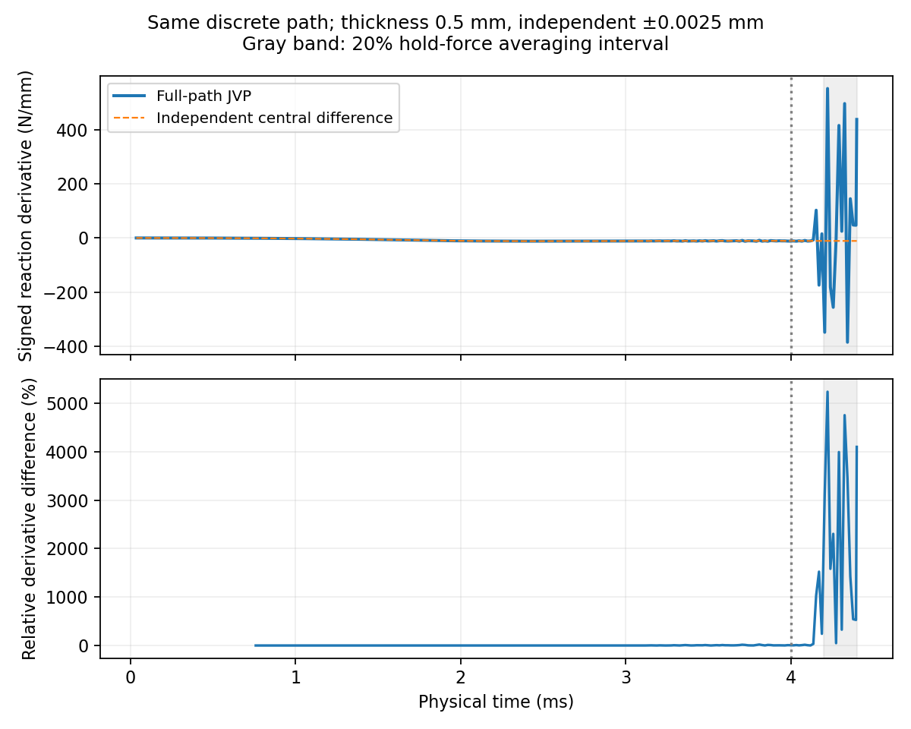

# 20%厚度完整路径与总梯度：执行记录

更新2026-10-05。当前工作是原大压缩第4步：已有HEX27前向目标接受，验证20%性能对设计厚度的总导数。保持diverse_28中面、L=10mm、t=0.5mm、界面0.05mm、η=1e-4、原Neo-Hookean、XYZ横向宏观应变固定、无接触/塑性/阻尼/质量缩放。

## 1. 正负厚度完整路径：完成

新增0.4975/0.5025mm，从未变形状态加载至20%并保载，复用现有显式CLI；原0.5mm中心不重算。这是±0.5%厚度扰动核对，不是修改目标厚度。

| 厚度mm | 20%保载反力幅值N | 主体分钟 | 最小观察J | 末态动能/弹性能 |
| --- | ---: | ---: | ---: | ---: |
| 0.4975 | 1.976725 | 15.46 | 0.03500 | 0.000038% |
| 0.5000 | 2.003441 | 15.59 | 0.03459 | 0.000174% |
| 0.5025 | 2.030713 | 15.44 | 0.03447 | 0.000260% |

新增两条各含一次无效块回退/减步，完成23586步。中心/正负的有效时间网格哈希均为`e22ff252f4f5f07c2d7402974e6386b5b00da94c31dca73a6776300bf4fc995b`。同网格允许复用两条独立扰动，不需另做FD路径。末态中面波动模式与中心的向量余弦约0.9999993、相对差约0.158%；这是同主要模式初筛，不能代替严格分支稳定性证明。

保载力中心差分为-10.797551N/mm；加厚增加压缩反力幅值。正负单边差分跨度约2.06%，中心点与正负平均力差约0.0139%。它们支持平滑局部响应，尚不能单独宣布AD通过。

差分是两条完整响应相减再除以厚度差，用来独立核对导数；JVP则是在推进位移、速度的同时，用自动微分推进它们对厚度的变化率。目标20%取后半段保载平均反力，减少端点瞬时振动影响。表中J是局部当前/参考体积比，约0.035主要提示软孔隙大畸变，不是整个实体压缩96.5%或力学误差。动能/弹性能表示运动储能相对于变形储能，不能独立证明空间精度。

三条20%末态的五环邻接排除、含周期镜像中面三角距离/近似映射壁厚包络筛查均无重叠候选。它不是精确偏置表面、完整接触检测或全路径接触认证，不新增接触模型。

## 2. 可微接口及实际短块探针：完成

只在现有ExplicitXYZ增加可微HRZ质量、材料数组传入和JAX标量响应，继续复用原JAX-FEM单元核与散射。占据、质量、仿射惯性、时间更新和反力均进入导数；默认入口保留原常量质量调用。核心hyperelastic_fem、材料、距离及环境锁未改。

初始化和保存20%状态各做32步JVP/独立差分。局部导数相对差约0.000223%/0.000205%，HRZ节点质量等价相对差不超过1.23e-15。位移尺度的新旧状态误差约3.31e-24/1.05e-15，反力差0。

这两个探针固定了32步之前的状态，只认证接口及局部时间块；它们没有此前完整加载历史对厚度的依赖，不能替代完整路径导数。

最初两次探针把位移、速度、时间的原始最大差混用同一绝对阈值，因速度末位约2e-9结束。测试量纲错误已更正为max(位移差,dt×速度差,50/s×时间差)，位移尺度1e-11门槛及导数1%门槛不变。原失败日志保留，不当物理失败。必要的小规模HEX8波检验通过，模态误差0.000291、能量漂移0.0807%，仅作默认接口回归。

## 3. 完整路径与曲线损失

完整路径JVP已完成；20%保载力导数76.093668N/mm，独立差分-10.797551N/mm，相对差804.730770%。曲线损失导数相对差288.549367%。当前状态：**path_gradient_not_passed**。

**20%未通过，不能用于逆设计。**10%/15%差约0.0047%；20%保载导数甚至符号不同。这里804.73%是导数核对差，不是JAX对Abaqus的前向反力差。下面损失数值只记录失败诊断，未开始训练或优化，不能称为有效损失梯度。

曲线损失用10%、15%和20%力值，其中20%取保载平均；目标为冻结Abaqus壳参考，按Standard峰值力归一化。只是性能损失导数核对，没有训练或厚度优化。

| 宏观压缩 | JVP厚度导数N/mm | 独立路径差分N/mm | 相对差 |
| --- | ---: | ---: | ---: |
| 10% | -10.648858 | -10.648356 | 0.004716% |
| 15% | -11.656391 | -11.655845 | 0.004686% |
| 20% | 76.093668 | -10.797551 | 804.730770% |

损失L=0.5Σ((F−F目标)/F峰值)²，是三个力误差的无量纲平方和。L=0.00723832；JVP候选厚度导数-1.91450413/mm，独立差分1.01538613/mm。只有通过核对才能作为性能误差回传到厚度的证据。

可微中心保载力与原中心相对差4.530e-14，整段曲线RMS/峰值差3.439e-14。所有观察状态有限、Gauss体积为正。共同网格包含减步时半步速度重定位；未对拒绝/减步决策求导。

完整JVP主体49.77分钟、峰值进程RSS4.59GiB。单方向JVP成本与前向分开；这不证明高维反向比差分快，后续逆向/检查点成本未实测。

含启动与监护55.32分钟；RSS是进程内存，不是显存。第1项中心复用，JVP时则必须重新推进中心状态及其敏感性，没有另跑一次纯前向中心。

## 4. 实际瓶颈与针对性判断

可微中心前向几乎逐位复现原中心，因此不是换了模型导致的差异。完整AD在保载前后出现大的状态敏感性；末态最大波动位移厚度导数约2656.6/mm，而±0.0025mm路径差分约4.04/mm。有限扰动的主要中面模式相近，并不证明虚域的无穷小敏感性温和。

按真实Gauss点重建，约99.9346%的变形梯度敏感性平方在φ<0.01域，最大点φ≈9.539e-11。这里量是∂F/∂厚度各分量的平方、按参考体积加权；不是能量比例、应力比例或实体体积分数。重建J与原末态差约3.23e-15，积分点/插值对应一致。实体点的敏感性也被放大，不能删虚域梯度当作修复。

局部质量归一化切线的正高频Rayleigh估计给出dt²λ≈3.7314，冻结正模态中央差分界限为4；当前dt≈1.35e-7秒，估计临界值约1.39e-7秒。没有直接证明超限，也没有认证完整谱或全路径稳定。把已放大的末态推进同一8.62微秒，原步/半步的位移敏感性质量范数增长约1.057215/1.057097，两者仍保留大导数。短探针不能排除完整路径减步的作用，却不足以承诺减步必然修好。

最强定位线索是虚域变分响应放大，尚未证明唯一因果机制。不能直接说JAX自动微分失效，也不能把这一结果叫有效20%梯度。旧端点静力伴随候选属于不同目标/平衡条件，虽数值接近有限扰动力斜率，仍不自动认证。

下一项应论证一个文献支持的虚域能量插值候选，并先作局部对比，再决定必要完整20%响应和导数验证；不调厚度、η、阻尼或保载区间拟合。[Wang等原文](https://doi.org/10.1016/j.cma.2014.03.021)提供实体有限应变能与虚域小变形能插值以缓解虚域畸变的依据，但没有认证本项目显式20%梯度。本轮未实施新能量模型。

## 5. 范围与文件

第1项完成，第2项实际完整JVP在20%未通过；第3项仅保留未通过诊断，第4项给出失败范围结论。原20%前向工作目标仍成立，当前不能认证有效20%总导数。Abaqus20%独立厚度导数、形态导数、跨构型、接触/塑性与严格物理替代不据此认证；旧末态伴随候选也不自动作通过。

正式实验：`validation/large_compression_20261005_r6/gradient20_path_20261005`；adaptive_minus/plus是实际路径，path_comparison.json是曲线/模式/时间网格，geometry_screen_*是末态近似筛查，path_ad_probe*保留探针/失败，path_ad_full为完整JVP，gradient_validation.json为独立核对与损失。大场/日志本机保留，不保证GitHub包含全部数据。

可微维护代码仍在scripts/thin_target_explicit.py；一次性JVP/审阅工具在Windows work/gradient_path_20261005，实际运行脚本保存到各作业experiment.py。旧source_before_path_ad原字节不改。主规划和状态是唯一活动入口，旧执行记录冻结。

## 补充：瞬时导数对照

图中阴影是20%平均力所用的保载后半段；竖线是加载结束。压缩≥1%的采样瞬时导数最大相对差5236.376841%，导数RMS差/差分最大幅值777.030832%。该图是补充诊断；本轮验收对象仍为约定平均力及三点损失。
