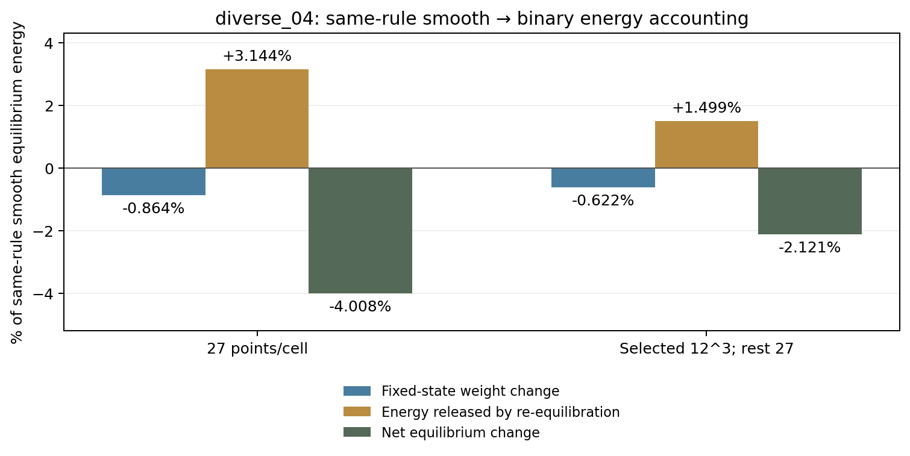

# 初始偏硬的机制审查：占据影响、能量解释与剩余疑问

更新：2026-10-08，实验完成至r43。r42为只读账目，r43新增3次初始静态平衡，无新Abaqus、长路径或设计AD。本文集中解释近期结果；执行只见[唯一规划](RESEARCH_PLAN.md)。

## 当前判断

**占据表示确实影响当前离散模型的初始刚度，但尚未找到全部偏差的来源。** diverse_04原平滑N32对匹配壳高5.7025%；二值原27点只高1.4656%，同部分密积分却仍高4.2430%。后者相对同规则平滑K下降2.1205%，是更有解释力的配对结果，但选区外未密检查，仍不是全域锐界面认证。

diverse_28当前原27点平滑零态对壳高3.0033%；r43自身部分密积分下平滑高3.5169%、二值高1.0910%，K下降2.3435%，与diverse_04的2.1205%占据效应重复。两构型剩余差异不同，不能预设统一的“5%修正系数”。新能量账目进一步说明，取消过渡带既改变直接材料权重，也改变整体平衡位移。只用总材料量或过渡层直接储能解释，会遗漏重要部分。

这支持继续研究背景方法，而不支持宣布普遍替代Abaqus至20%，也不支持把偏差归咎于JAX平台。代表构型的前向已有基础；迁移构型峰位、推进稳定性和完整路径梯度仍分别存在问题。

## 初始刚度把时间算法暂时移开

K是微小压缩下反力幅值与压缩位移幅值之比，单位N/mm。诊断取宏观应变0.0001，即0.01%；L10mm对应压缩位移幅值0.001mm。静态线性化周期平衡不含质量、阻尼和加载时长，因此已经确认的初始偏差不能由显式惯性解释。

diverse_04背景K=4.916454682，匹配Standard S3R壳K=4.651218897；diverse_28背景K=3.888255581，匹配壳K=3.774883745。对壳百分比以各自壳K为分母。r30/r41的求解残差、能量/功、周期关口通过，r41壳复现历史初始值；实现与共享材料切线有依据，但壳仍不是三维真值。

初始偏差不自动解释峰位。在相同静态边界下，若只是把全部弹性能统一乘c，则平衡残差与切线同乘c，平衡位移不变，零特征值位置也不因此改变。局部材料重新分布、动力质量和惯性不满足这一简单结论。故不能提前把大压缩约4.12个百分点的动态峰错位全部归给5.70%的K差。

## 平滑与二值改变了什么

生产采用到周期三角中面距离d的连续占据：

`φ_s=1/[1+exp((d−t/2)/ℓ)]，t=0.5mm，ℓ=0.05mm/(2ln9)`。

0.05mm是10–90%界面宽，不是板厚；材料权重`s=η+(1−η)φ`，η=1e−4。φ附着参考Gauss材料点，变形后不重新阈值化；这是几何近似，不是多种真实材料研究。

r40只换成`φ_b=1[d≤0.25mm]`，厚度、中面、η、实体本构、网格、周期压缩及固定平移保持。壁内权重恢复1，壁外恢复η，孔隙仍有人工弱材料，没有删除单元。这是Gauss点二值诊断，不是单元中心体素，也不是壳加填料。

二值化同时增加壁内近界面的权重、去除壁外平滑尾部。效果取决于各处应变和整体平衡，不能只看总材料体积。当前硬阈值的普通几何AD几乎处处为零、跨阈值跳变，不能直接作为可导生产方案；其他独立形状导数方法未实现。

## 二值结果：不能只选择最接近壳的数字

| diverse_04配对 | 平滑K/(N/mm) | 二值K/(N/mm) | 平滑对壳 | 二值对壳 | 二值相对同规则平滑 |
| --- | ---: | ---: | ---: | ---: | ---: |
| 全部原27点 | 4.916455 | 4.719389 | +5.7025% | +1.4656% | −4.0083% |
| 原1941单元12³点、其余原27点 | 4.953612 | 4.848570 | +6.5014% | +4.2430% | −2.1205% |

12³是选中单元每轴12点、共1728点。1941单元来自diverse_04冻结的高能中面区域映射，不能照搬给diverse_28；此规则只是诊断，不改变生产27点。

原二值27点保存位移在选区复积分时，12³点相对原点的选区能量增量相当于原全能量15.6024%。这是固定状态积分差，不是新K误差。8/12选区能量/体积关口通过后，一次独立重新平衡使对壳差回升到4.2430%。故原“只差1.47%”包含明显积分敏感性，不能认证二值充分准确。

配对后的2.1205%下降仍存在，说明占据影响不全是原27点采样假象。选区外未检查，不能把剩余4.2430%当成已经排净积分误差的真实实体/壳差。完整原检查、状态与图见[r40–r41报告](../validation/binary_occupancy_20261008_r40/REVIEW.md)。

## 新只读分析：位移重新分布比净权重改变更显著

r42读取四个已经求好的平衡：原27点平滑/二值、部分密积分平滑/二值。每对使用相同积分、周期位移空间及宏观压缩，不重新求解。初始能量为

`U_φ(q)=∫s_φ[λ/2·tr(ε)²+μ·ε:ε]dV`，

q是周期波动位移，ε包含给定宏观压缩；μ=E/[2(1+ν)]、λ=Eν/[(1+ν)(1−2ν)]，E10MPa、ν0.3，U单位N·mm。设q_s/q_b为保存的平滑/二值平衡，则严格账目是

`U_b(q_b)−U_s(q_s)=[U_b(q_s)−U_s(q_s)]−[U_b(q_s)−U_b(q_b)]`。

第一项固定原平滑位移，只换材料权重；第二项是二值从该位移到自身平衡的能量释放。两位移同属周期空间，变化相容；这不同于直接扣除各Gauss点法向/剪切能。初始正定弹性下，释放还应等于二者差位移的二值弹性能，本次也验证该恒等式。

| 相对于同规则平滑平衡全能量 | 原27点 | 原选区12³/其余27点 |
| --- | ---: | ---: |
| 壁内恢复权重：能量增加 | +3.1183% | +3.3070% |
| 去除壁外尾部：能量减少 | −3.9826% | −3.9286% |
| 两者相加：固定状态净权重影响 | −0.8643% | −0.6217% |
| 重新平衡释放的能量 | 3.1440% | 1.4988% |
| 最终能量变化：上一行要相减 | −4.0083% | −2.1205% |

分母全部是各自配对的**平滑平衡能量**，不是壳K。同一微小压缩下`U=½Kδ²`，最后一行也就是二值相对平滑的K变化。不能把−0.62%和−1.50%说成各解释了壳偏差多少个百分点。

四项原能量复现相对误差最差约6.5e−14；相容差位移恒等式误差约2.8e−12/2.1e−12，均以同规则平滑全能量为分母。冻结复现关口1e−9、恒等式关口1e−8均通过。分析36.73s，原科学文件哈希保持；正式配方、协议和结果在`validation/initial_bias_reassessment_20261008_r42/`。

**推断：占据过渡不仅改变直接储能，还影响位移协调和局部应变分布。** 在较充分的配对中，重新平衡部分大于固定状态净权重部分。后续改善连续表示应关注平衡后的响应，而非只校正总体积或固定场能量。

这是以平滑位移为起点的代数分解，依赖分解路径，不是唯一物理误差归因。尚未定位具体连接、法向模式或局部几何，不能命名为“过渡层桥接”“锁死”或唯一主因。二值仍含软孔隙、最近距离带和Q2位移空间，本分析也没有证明它已接近真实实体。

## r43跨构型复核：占据与重分布效应得到重复证据

diverse_28自身选区在二值计算前冻结为3896单元，覆盖原平滑全能量73.7772%；没有套用diverse_04的1941单元。原中面精确复现Gauss缓存距离；两套保存位移在两种占据场下的8/12能量、体积与距离矩关口均通过，最大差0.0637401%。之后只作一次选区12³/其余27点的平滑/二值配对。

| diverse_28规则 | 平滑对壳 | 二值对壳 | 二值相对同规则平滑K |
| --- | ---: | ---: | ---: |
| 原27点 | +3.0033% | −1.9405% | −4.7996% |
| 自身部分密积分 | +3.5169% | +1.0910% | −2.3435% |

配对能量分解为固定平滑位移净权重−0.6929%、相容重平衡释放1.6506%，合计−2.3435%；与diverse_04的−0.6217%、释放1.4988%、合计−2.1205%同趋势。分母仍是各自同规则平滑全能量，区域不同；不是壳误差唯一归因，也不是全域锐界面收敛证明。

**占据影响以及重平衡部分大于净权重部分，已在两个构型上复现。** 原27点二值对壳从负差转为部分密积分正差，说明不能凭最接近壳的原点结果挑方案。剩余二值对壳差依赖构型（4.24%与1.09%），位移空间、距离带、选区外积分及实体/壳差别仍保留。尚未定位具体局部机制，不称桥接或锁死。

完整数值、两图、成本及输入适配中断见[r43报告](../validation/binary_diverse28_20261008_r43/REVIEW.md)。主要关口没有放宽，生产未改；第1步完成，具体可导修正仍未选。

## 其他近期试验缩小了什么范围

| 试验 | 结果与有效信息 | 限制 |
| --- | --- | --- |
| r31平直膜向补片 | 同Gauss解析、泊松收缩正确；真实板偏软6.7956% | 不支持普遍平面应变实现错误，不认证曲面 |
| r32初始能量/位移迹 | 壳膜内95.32%、弯曲3.76%；迹膜能背景高1.79% | 非整体因果分摊，不能从5.70%中直接相减 |
| r33/r34部分密积分 | 固定场能量增加；重平衡偏差5.70%→6.50% | 未改善，不排除全部积分影响 |
| r35穿厚度剖面 | 界面法向拟合改善，壁主体差异保留 | 0.904不是刚度误差9.6%或锁死证明 |
| r36一个兼容模式 | 两级检查通过，释放仅0.0023715%全能 | 只说明该模式不重要，不排除所有位移限制；不追加模式 |
| r37宽度原27点 | 0.025/0.05/0.10mm偏差4.1304/5.7025/7.6700% | 越窄越难积分，不按最接近壳挑宽度 |
| r38宽度配对密积分 | 减半宽度使K下降0.9120%，仍偏硬5.5301% | 未认证全部根因，不采纳生产 |
| r39简单圆柱 | 解析/CAX8相符0.0000201%；实体比壳高0.6209% | 单曲率/中面径向载荷/轴向平面应变不同于TPMS |

r39背景原基函数轴向相消绝对量4.1922e−12超过1e−12，保持not_accepted；保存场实际轴向梯度7.65e−18的只读审计指向舍入，但不改原判据。保存背景解对实体偏软3.1837%，只作探索性判读，不能升级为成功。它不支持“背景总偏硬”或“实体/壳普遍差5%”。

原报告：[r30–r31](../validation/initial_tangent_20261008_r30/REVIEW.md)、[r32](../validation/initial_bias_mechanism_20261008_r32/REVIEW.md)、[r33–r34](../validation/local_quadrature_20261008_r33/REVIEW.md)、[r35](../validation/thickness_kinematics_20261008_r35/REVIEW.md)、[r36–r38](../validation/interface_width_mixed_20261008_r38/REVIEW.md)、[r39](../validation/curved_patch_20261008_r39/REVIEW.md)。原失败、数据和分母均保持。

## 原因优先顺序与文献依据

**占据影响已跨构型复现，下一定位其相容重分布。** 这是已有独立干预支持的因素，比继续扫网格、η、阻尼更有依据。diverse_28占据复核已完成，自身选区/分母冻结且局部积分关口通过。下一先定位相容重分布与几何的关系，再选择一项可导改进；不能强求统一壳修正系数。

**仍保留薄壁几何与背景位移空间的耦合。** 壁厚0.5mm名义跨1.6个0.3125mm单元；二次节点间距小不等于新增单元。增加Gauss点改善积分却不增加位移模式；最近三角片距离带也未必等于理想光滑中面的精确法向偏置。整体体积接近或一个模式释放很小，都不能排除高能区截面与运动学差别。ν0.3不接近不可压缩，初始又膜内主导，不能无证据命名为体积/剪切锁死。

[有限胞综述](https://arxiv.org/abs/1807.01285)将近似空间与几何积分列为不同组成；链接是2018年上传的2013年章节，并非新算法，也不认证我们的Q2/27点组合。本地Qiu等[TPMS五类网格比较](https://doi.org/10.1016/j.ijmecsci.2023.108657)PDF11–13页提示一两层二值体素可能丢失连接而偏软；含塑性/接触、多单胞，与当前连续场不同，不能推出“1.6层必然偏硬”。

**真实三维与壳差别仍保留。** [Abaqus壳说明](https://docs.software.vt.edu/abaqusv2025/English/SIMACAEELMRefMap/simaelm-c-shellelem.htm)区分参考面壳与体积实体；S3R并非完全没有横向剪切，但穿厚度假定与完整三维不同。t/L5%不保证所有局部曲率/连接都处于薄壳极限。r41匹配壳人工能量/功0.2103%降低明显人工刚度的优先级，不证明壳无误差。r39也不能排除TPMS真实实体/壳差别。不删法向/剪切能，不改平面应力拟合壳。

软孔隙、壳转角/实体平移差别仍是候选，本轮没有独立改变。现有PBC与功平衡通过降低一般实现错误优先级，不重新比较两种压缩方式。质量、时长、跳跃惯性与接触属于后期问题，不能解释已经无惯性的初始差。

Hu等[几何投影有限变形优化](https://doi.org/10.1016/j.cma.2024.117636)本地PDF5–7页支持固定网格、连续材料描述、虚域能量与伴随的理论路线，但不是当前C²显式路径直接验证。[高阶实体/壳研究](https://doi.org/10.1016/j.cma.2004.07.042)提示离散误差与壳理论误差须分开；此前仅取得摘要/引言，不引用其算例精度。[Shell Finite Cell](https://doi.org/10.1016/j.cma.2011.06.005)及[Trace-Finite-Cell壳](https://link.springer.com/article/10.1007/s00466-020-01956-5)是长期备选，需要独立运动学、曲面积分与导数验证，不作为现在换框架的理由。实际文献阅读范围见[文献索引](PAPER_ROUTE.md)。

## 科研可行性与收口原则

**值得继续，但普遍20%替代和正确完整梯度尚未证明。** diverse_28三个厚度完整20%在原约10%工作目标内；原NH10%/15%厚度总导数有证据。diverse_04峰位与数值中断、新核完整20%/形态梯度仍未通过，不能用初始改善替代这些验证。

最近不是毫无收获：已经确认占据是可测因素，并证明其影响包括相容位移重新平衡。困难在于把背景几何/积分/位移与壳模型差别分开。先跨构型复核，再依据可靠机制选择一项可导表示或积分改进，最后才验证两构型1–5%短段。若机制不重复则保留范围，不强行拟合壳；后续20%和完整梯度另行规划。
