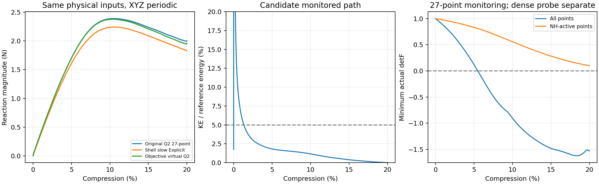

# 客观虚域接入：20%压缩有改善，混合尾部仍需修复

2026-10-06。当前主规划第2步的一次受控路径已经完成。**计算顺利到达20%并完成保载，对壳反力差从9.39%降到6.81%；但更密的保存场检查发现6个材料求值失效点，候选未采纳为默认。** 这是一项有明确收益和明确剩余问题的实验，不是全面替代Abaqus的认证。

## 研究问题与本轮做了什么

主线仍是：比较薄的TPMS能否用JAX-FEM固定背景实体网格可信计算到较大压缩，并保留未来有效梯度。训练后置。背景网格覆盖墙和空隙；平滑占据φ接近1表示墙、接近0表示孔隙，它是几何近似，不是异质材料。小比例η给虚域很弱的刚度。

原NH能量包含J^(−2/3)，其中J=detF是材料映射的局部体积比。J>0才属于其求值域；J≤0意味着局部翻转，不能继续把原NH当作有限能量。原27点解的密采样已暴露深孔隙翻转，因此这次处理虚域能量有直接依据。

上一轮通过了转动兼容的Stable-NH虚域纯核与冻结场检查，理论及来源见[核报告](OBJECTIVE_VIRTUAL_PROGRESS.md)。本轮仅在hyperelastic_fem.py和现有thin_target_explicit.py接入这一核，使能量、内力、反力和有效域判断一致；新增显式材料选项objective_void，默认仍nh。没有复制求解器。

代表输入保持：diverse_28中面、单胞边长10mm、厚度0.5mm（边长的5%）、XYZ周期波动、宏观横向应变为0；E=10MPa、ν=0.3、η=1e−4、占据10%到90%的界面宽度0.05mm；HEX27每方向32单元、65³节点、每单元27个积分点；同一HRZ质量、材料点占据和中央差分算法。加载时长0.004s，加10%时长的保载。18项物理/时间/离散输入与原快路径逐项相同；变化因素只有虚域材料能量。

候选在φ≤0.001使用全F可求值的客观延拓，在φ≥0.01使用原NH，中间C²混合。φ阈值事先固定；没有根据反力调厚度、η、界面或阻尼。h是混合中NH的权重；只要h>0，当前候选仍要求实际J>0。允许深虚域折叠，只表示数值延拓在那里有定义，不表示折叠被消除或真实材料可以翻转。

## 完整路径的结果

比较复用既有慢Abaqus/Explicit壳，未创建Abaqus模型或作业。两条JAX路径均采用0.004s加载，所以表中原版是9.39%的快路径，不是9.45%的慢路径。

| 指标 | 原NH快路径 | 本轮候选 | 含义 |
| --- | ---: | ---: | --- |
| 20%保载平均反力幅值 | 2.00344N | 1.95617N | 取最后半段保载的平均值，压缩反力原始符号为负 |
| 对慢壳保载反力差 | 9.39% | 6.81% | 与壳约1.83144N比较；不是实物误差 |
| 整段曲线指标 | 5.71% | 4.93% | 0.1%至20%均匀取1000点，力差RMS除以固定Standard壳峰值2.25891N；不是每点最大相对差 |
| 输入功 | 3.75860Nmm | 3.72731Nmm | 反力沿宏观位移积分，反映整段压缩做功 |
| 对壳输入功差 | 6.86% | 5.97% | 使用同一壳输入功基准 |
| 计算主体时间 | 15.59min | 11.17min | 含路径监测；总启动至退出约11.22min |
| 减步次数 | 1 | 0 | 本轮保持初始步长2.69327e−7s，不说明任意工况都稳定 |

反力降低2.36%，曲线仍保持同样的上升、峰值及后续下降趋势。本轮峰值约2.37875N，位于10.32%压缩。它确实改善了当前对壳一致性，但余下差异不能全部归于虚域，也不能因为曲线更近就证明真实三维精度更高。

能量加动能与输入功的相对缺口为0.0081%；结束时动能/弹性能约0.000017%。从1%压缩开始统计的加载时长中，96.84%的时间动能占比≤5%，起始阶段仍有惯性。新材料不能直接继承原快慢速率认证；当前准静态范围尚待新速率检查。

中面周期波动位移经同一HEX27插值、去除平移后，与原快路径的加权差约0.224%，与壳约1.825%，与壳向量余弦0.999840。这支持主要变形模式相近；不认证局部应力、自接触或周期镜像接触。

右图只显示路径使用的27点监测。更密检查的失败不能由这张图中的NH区域正J抵消。

## 为什么尚未采纳：125点发现低占据尾部失效

125点检查是在**同一最终保存位移**上增加采样，未重求解，也不是另一个物理工况。它用真实参考位置重新计算同一距离占据，避免把旧Gauss数组错用到新位置。约409.6万个采样点中发现17749个实际J≤0点，17743个在纯延拓深虚域，另外6个在仍混有NH的低占据尾部。因此125点全域候选能量/内力记为null，未用正J子域的和冒充总响应。

| 125点所在区域 | 最小实际J | 判断 |
| --- | ---: | --- |
| φ≤0.001，纯深虚域 | −3.94290 | 延拓有定义，但实际折叠保留 |
| 0.001<φ<0.01，混合尾部 | −0.03813 | 6点原NH项无定义；当前候选失败原因 |
| 0.01≤φ<0.05 | 0.21526 | 本次采样未发现翻转 |
| 0.05≤φ<0.95，主要平滑界面 | 0.49276 | 本次采样未发现翻转 |
| φ≥0.95，实体内部 | 0.73381 | 本次采样未发现翻转 |

6点分属6个单元，占据φ为0.002956～0.004081（约0.30%～0.41%），在名义墙边界外0.06255～0.06623mm；它们不是实体内部。**φ很小不代表NH混合权重很小：这里h仍为7.21%～22.33%，乘上小刚度也不能把无定义能量变成有效数值。** 同单元原27点中的NH启用点最小J仍在0.0996～0.1350，说明运行积分点没有捕捉到这些尾部翻转。

本轮27点最终能量/内力重建相对差为1.11e−15/1.93e−14，与求解输出一致；因此不是结果提取脚本把两种材料混用导致的问题。全域125点材料失败是明确的剩余限制，尽管只有6点，也不能删除或忽略。深虚域翻转数比原NH场增加，延拓释放约束后的场更容易在孔隙折叠；不能声称这个候选改善了所有区域的几何映射。

## 科研判断与下一项

这次增强了“背景网格方法可以计算代表薄壁至20%，并形成接近壳的整体弹性响应”的可行性依据；计算没有因为JAX平台或显式算法无法运行而失败。更明确的障碍是低占据虚域的材料求值域和采样间位移映射，问题已比全面重建Abaqus小得多。当前证据支持继续这条路线，但当前候选尚不是可信默认版本；6.81%也不能写成真实误差保证。

下一项只处理**低占据混合区的能量求值域**：先研究原NH奇异因子J^(−2/3)在虚域内的C²能量延拓，要求客观性、零状态应力、原小应变刚度、正J安全区的一致性和真实墙NH保持。能量及其导数须统一定义，实际J继续如实记录；不移动占据阈值来覆盖这6点，也不根据壳曲线调参。这是待验证的针对性方案，不是已证明有效的方法。

先做纯核及当前冻结场门槛；过关后才安排一次同输入路径和必要速率检查。若候选本身不满足客观/域/导数要求，就保留范围结果再调整，不连续试大量单元、积分或η。执行仅看[唯一主规划](RESEARCH_PLAN.md)。原20%路径梯度符号失败保持，35项接口检查及本轮前向改善不认证20%有效梯度；不启动完整AD、训练或接触/塑性。

## 文件及复现范围

正式实验目录：/home/xuehu/projects/tpms_jax/validation/objective_path_20261006_r11。

| 文件 | 内容 |
| --- | --- |
| T0p004/input.json、result.json、field.npz | 实际输入、完整路径、最终位移/速度场；大场本机保存 |
| T0p004/source_at_run/、source_before/、run.log | 本次运行及修改前源码字节、日志；不维护源码副本 |
| stage_input.json、run_manifest.json、run_receipt.json | 变更范围、命令、环境/输入哈希、成功退出及哈希未改证明 |
| checks.json、checks.log、tests/test_objective_explicit.py | 35项针对性验证，7项新增接口检查 |
| comparison.json、curves.csv、response.png、mode.json | 对壳和旧JAX指标、曲线、模式 |
| domain_probe/rule_4.json、rule_8.json、invalid_points.json | 全域/各区域J、完整材料域判据、6点位置及占据 |
| experiment.py、locate_domain.py、analysis_manifest.json | 保存场分析和点定位，复用正式材料核，不是新求解器 |
| decision.json、evidence_manifest.json | 未采纳决定及新旧科学证据校验 |

旧r6/r8/r9/r10科学数据未覆盖。默认NH保留，objective_void仅是未采纳的显式实验选项；旧静力提取对该选项明确拒绝，避免错用NH恢复。Git保留源码、关键摘要、报告/图；大场、源码快照和原始日志按现有规则留本机，不把Git克隆说成完整档案。
