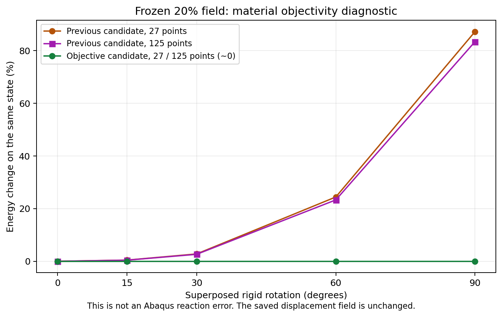

# 转动兼容虚域：理论、小核与原20%保存场验证

更新2026-10-06。**主规划第2步的这一项已通过，可以进入一次受控20%新路径；尚未替换默认材料，也没有新的压缩曲线。** 本轮只做一个客观虚域候选，23项候选与5项原回归共28项通过，保存场探针233.52s。科研目标仍是可信薄壁背景压缩及未来有效梯度；训练后置，唯一任务看[主规划](RESEARCH_PLAN.md)。

## 1. 为什么这项工作与最终目标有关

原HEX27 N32、27点离散模型已经完成代表薄壁20%压缩，对慢壳反力差9.45%，是有范围的仿真可行性证据。后来125点检查发现孔隙中有3378个实际负体积比点，原NH在那里不能求值。这是虚域延拓的有效性问题，不是“TPMS真实材料有异质性”。

上一[经典候选](VIRTUAL_KERNEL_PROGRESS.md)使材料映射可求值，却会把刚体转动算成能量。此次只回答：能否保留真实壁和小应变刚度，同时给深孔隙一个不受刚体转动影响的能量及局部导数。它关系到大压缩的可信前向和未来梯度，不是为了把曲线调得更近。

## 2. 一个有文献基础的客观候选

采用[Smith、de Goes、Kim的Stable Neo-Hookean模型](https://www.tkim.graphics/NEO/StableNeoHookean2018.pdf)式14及3.4节的参数换算；核对了原PDF第4至5页。该论文研究弹性材料求值与退化状态，不是本项目薄壁TPMS的精度验证。我们的占据分段和仅用于虚域的混合是项目候选。

F是材料点的三维变形梯度；J=det(F)是实际局部体积比，I₁=ΣFᵢⱼ²。μ、κ分别为现有材料的剪切、体积模量。对原E=10MPa、ν=0.3：μ=3.846154MPa，κ=8.333333MPa。虚域能量写为：

`μs=4μ/3`，`λs=κ+μ/6`，

`Wv = μs/2·[I₁−3−ln((I₁+1)/4)] − μ·(J−1) + λs/2·(J−1)²`。

它等于文献模型减去参考态常数，故Wv(I)=0；没有ln(J)、负数分数幂、逆F或SVD，所有有限F均有定义。原壁材仍为：

`WNH = μ/2·[J^(−2/3)·I₁−3] + κ/2·(J−1)²`，仅J>0有定义。

φ是固定参考Gauss点的几何占据，s=η+(1−η)φ，η=10⁻⁴不改。采用一个事先固定的C²权重h：φ≤0.001时h=0，φ≥0.01时h=1，中间令x=(φ−0.001)/0.009，`h=10x³−15x⁴+6x⁵`。候选为：

`W = s·[h·WNH + (1−h)·Wv]`。

0.01沿用上轮虚域界限；0.001对应此前已记录的深虚域分组，提供恰好不启用NH的区间。两者是新的数值约定，**没有根据壳反力挑选或扫描，也不是几何厚度或界面宽度**。φ≥0.01的原能量、应力完全保持；真实几何t=0.5mm、L=10mm、界面10%至90%宽0.05mm均不变。两个能量在参考态的切线相同，故混合也保持s倍的原小应变刚度。

对任意正规刚体转动Q，I₁(QF)=I₁(F)、det(QF)=det(F)，所以W(QF)=W(F)，纯转动无应变能；能量导出的第一Piola应力满足P(QF)=Q·P(F)。这就是“转动兼容/客观”，不是采用新的加载方式。

实现中仅在h恰为0时，用单位矩阵跳过完全不参与能量的NH分支，避免0乘NaN；**实际F和J从未改写或夹断**。只要h>0，实际J≤0仍判为无效。这不是任何占据、任何畸变都能任意继续计算的模型。

## 3. 核检查通过，并修复一个实际AD实现问题

28项检查用时15.18s，包含零应力/小应变切线、实体及深虚域极限、纯转动/叠加转动/应力协变、翻转及降秩状态的能量与一二阶导数、应力与占据导数的独立差分、C²权重边界，以及原XYZ/积分回归。

首次检查27项通过、1项失败：恰好压成平面的F上，JAX通用行列式的二阶AD出现NaN。将**虚域核内部**的det(F)改为列向量标量三重积，保持数学能量完全等价后，二阶导数有限且与应力差分一致。原NH函数及原求解器未修改，初次失败日志保留。它说明材料公式有定义，还需要检查AD的实际实现；不据此宣称修复旧20%路径梯度。

权重在共同有效域内为C²。若J<0且φ恰位于0.001上界，增大φ会进入无定义的NH区域；这样的状态不具有已经认证的双侧设计导数。未来设计扰动仍须满足求值域，局部AD能返回数字并不自动代表有效设计梯度。

## 4. 原20%保存场：全域求值和客观性结果

复用原快路径最后保存位移，不重新平衡、不推进时间。27点为原离散规则；125点在同一二次位移场上更密采样，并在这些真实参考点重新计算同一距离占据。125点是诊断，未作为新求解规则。

| 同一个保存场的量 | 27点/单元 | 125点/单元 |
| --- | --- | --- |
| 实际最小J | 0.035378 | -2.072830 |
| 实际J≤0点数 | 0 | 3378，全部φ≤0.001 |
| 启用原NH区域的最小实际J | 0.408643 | 0.212140 |
| 原全域NH能量 | 3.758892N·mm | 无定义，不能给总量 |
| 候选全域参考能量 | 3.736297N·mm | 4.059067N·mm |
| 候选宏观内部Fz | -1.992128N | -2.042513N |

内部Fz是积分Piola应力得到的保存状态宏观内力，负号表示压缩；**不是新路径的保载平均反力**。27点原内力−2.006860N，候选幅值降低0.7341%，能量降低0.6011%；仅说明同一状态的材料改变有限，不证明对壳误差已经下降。125/27点的候选能量仍有约8.64%采样差，不能把求值有定义当成积分精度认证，也不据此自动追加积分扫描。

3378个实际翻转未消失，最大占据0.000150104，仍完全处于人工延拓域。125点φ≥0.05的过渡区最小J=0.446034、φ≥0.95的壁区最小J=0.727051。候选全域求值包括所有深虚域点，没有用正J子域和冒充总响应；没有“映射J变正”的说法。参考能量及Piola内力可定义不等于虚域当前体积真实，也不认证自接触。

对同一场叠加15°/30°/60°/90°整体转动，27/125点候选能量最大相对变化4.44×10⁻¹⁶；应力协变最大绝对残差9.77×10⁻¹⁵MPa。上一候选60°/90°约23%至24%/83%至87%的人工能量问题在本核中已消除。这些量是材料客观性诊断，**不是Abaqus反力误差**。

## 5. 判断和下一项

**保留这个候选，值得进入一次代表20%新路径。** 已有项目证据是客观性、匹配的小应变/壁材、当前冻结场全域求值和局部导数；尚无证据说新曲线更准确、显式推进必然更稳定或20%路径梯度有效。文献名字中的Stable也不代表所有状态切线正定；没有复制其Hessian投影或新的求解器。

下一项仅在既有显式入口中一致接入这个共享核，冻结厚度/材料/η/界面、HEX27 N32和27点规则，做一次20%加保载。能量、内力、回复量与有效域判据必须使用同一候选；监测h>0区域的实际J，深虚域折叠另列。再对新保存场做125点检查，并与原JAX路径/既有慢壳比较反力、整曲线、输入功、模式、惯性/能量及成本。约10%为原有范围的工作目标，约5%是改善方向，不按结果更近就采纳；需要时再做相称的速率或短块接口核对。

不同时启动η/积分/界面扫描、HEX20或混合单元，不新建Abaqus，不重试完整20%AD或训练。原前向约10%结果、壳质量边界和20%梯度失败保留。若新路径未改善，再依据机制决定后续，避免无限换参数。

## 6. 文件及复现范围

正式目录：`/home/xuehu/projects/tpms_jax/validation/objective_virtual_20261006_r10`。input/literature记录固定候选及来源；checks/decision/result与rule_4/rule_8记录核和场；probe_manifest/evidence_manifest记录源码、环境、输入与结果哈希；初次失败checks_initial.log及probe.log本机保留。source_before/source_attempt/source_at_run只用于原字节追溯，不维护第二套FEM。上一r8/r9等45项冻结证据核对未变。

唯一材料文件`hyperelastic_fem.py`新增46行纯核；`tests/test_objective_void.py`为23项候选检查。原材料函数/类AST保持，显式入口源码SHA不变。候选**未连接**当前默认压缩程序，不能运行默认入口后声称得到新模型。

在含本候选的独立检出中，可运行核测试；冻结场探针`experiment.py`需保留本机旧大场，使用`--repo`和全新`--output`，拒绝覆盖。GitHub有精选文本/图证据，不含完整大场与日志。Windows辅助工具`work/objective_virtual_20261006`是一次性调度/阅读/发布工具，不从其中模板维护FEM。没有新完整压缩、Abaqus、全路径AD或独立物理案例。
