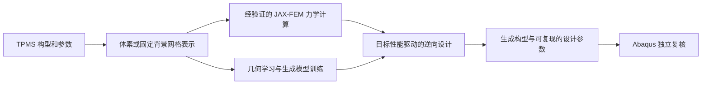

# TPMS 体素力学、学习与逆向设计：研究主规划

更新：2026-10-03。依据用户明确的长期目标和“先验证线弹性精度”的阶段安排。本文件规定研究问题和推进顺序；[研究状态](RESEARCH_STATUS.md) 只记录当前证据，[文件地图](FILE_MAP.md) 只说明程序与数据位置。以后从本文件继续，不根据历史实验里的“下一步”另起主线。

## 1. 研究问题与最终目标

**能否把 TPMS 构型和参数统一为体素或固定背景网格表示，用经过独立验证的 JAX-FEM 计算力学响应，并进一步通过学习模型与可导力学，实现由目标力学性质到 TPMS 构型和参数的逆向设计？**

完整主线为：

JAX-FEM 体素计算的可行性与精度验证是第一阶段，服务于后续训练和逆向设计；完成验证不代表整个研究完成。经验证后，可在已验证的几何、材料、加载及响应范围内，用 JAX-FEM 承担原先需要 Abaqus 的重复力学计算。Abaqus 继续承担独立参考和最终设计复核。

需要逐步回答四个问题：

1. 背景方法与实际 TPMS 实体的全局力学响应差多少，什么网格和数值设置足够可靠？
2. 不同 TPMS 构型及参数能否采用一致表示，力学计算与相应梯度是否可用于学习？
3. 学习模型能否表达有效的 TPMS 构型，逆向设计能否达到目标性能，并给出可复现的几何或参数？
4. 得到的设计经二值化、几何重建及独立 Abaqus 计算后，性能目标是否仍成立？

研究对象先采用均质基材与真实孔隙的 TPMS。背景模型的连续密度、界面过渡和虚拟孔隙刚度是计算近似，需要验证；它们不构成另一个异质材料研究目标。训练规模、网络细节和全部形态清单按阶段确定，不预设几千个算例。

## 2. 现在在哪里

**当前处于阶段 1：Gyroid 固定背景网格的线弹性精度验证尚未收口。** 已有均匀基准、同离散方程对照、二值实体及加密结果；当前一个 Gyroid 设置下，背景模型与实体参考的反力幅值差仍约 4.640%/4.907%（固定/自由横向）。详见 [研究状态](RESEARCH_STATUS.md)。

小网格四参数一阶梯度检查已完成，可作为后续可导接口的基础；直接体素场梯度、生成网络、训练和逆向设计均未完成。验证过的四参数不是最终设计空间的上限，也不要求先完成单一 Gyroid 四参数优化才能开展学习。

## 3. 六个阶段及完成条件

| 阶段 | 要解决的问题 | 主要产物 | 完成条件 | 状态 |
| --- | --- | --- | --- | --- |
| 1. 可信力学计算 | 背景方法能否准确计算 TPMS？ | 线弹性验证报告、可用网格/设置和误差范围 | 实现一致性、实体精度及参考模型可信度分别说明，给出可用范围 | 正在进行 |
| 2. 构型与可导接口 | 多构型、参数和体素如何进入同一计算链？ | 统一几何/体素约定、最小数组输入及梯度验证 | 代表构型能正确求解，目标所用梯度通过方向差分检查 | 尚未实施；已有部分参数梯度基础 |
| 3. 学习任务与数据 | 学什么、输入输出是什么、力学目标是什么？ | 一份任务定义、受控几何数据和固定验证划分 | 训练范围、性能目标及数据来源清楚，小批计算和存储可承受 | 尚未实施 |
| 4. 模型训练 | 能否学习有效 TPMS 构型及参数关系？ | 一个主模型、检查点、独立几何评估 | 未参与训练的构型可评估，周期/连通性/形态有效性符合定义 | 尚未实施 |
| 5. 力学逆向设计 | 能否从目标性能得到符合约束的设计？ | 目标→设计→JAX 响应的完整闭环 | 多个预先定义目标达到误差要求，与简单基线公平比较 | 尚未实施 |
| 6. 独立复核与研究总结 | 学到的设计在真实几何中是否仍有效？ | Abaqus 复核、误差归因、可复现研究结果 | 二值/真实几何性能复核通过，清楚界定成功范围与失败案例 | 尚未实施 |

下面是阶段工作安排；此规划不启动新的求解、训练或自动任务。

### 阶段 1：先完成线弹性精度判断

沿用原 B1–B4 的验证目的：B1 均匀实体检查约束和反力；B2 小型分层诊断检查材料赋值；B3 同离散问题检查积分、组装和求解；B4 真正二值 TPMS 实体检查背景几何近似。已通过的基准不无故重算，未完成的原生路径如实列明。

接下来先做三件事：

1. 用现有结果统一几何、材料、体积分数和边界定义，比较轴向刚度 K=|Fz|/|uz|、反力及应变能。当前是 XY 周期/平整加载面下的轴向响应；不能直接称为完整三维均匀化张量。
2. 围绕现有约 5% 响应差，仅补能区分网格分辨率、投影过渡和虚拟孔隙刚度影响的必要对照。固定物理几何定义；若改阈值、体积分数标定或实体构造规则，单独记录为模型变化。不能通过调整物理参数强迫反力贴合参考。
3. 输出阶段结论：可用的数值设置、误差预算、运行时间/内存和适用范围。若仍不够准确，修正背景方法或限制使用范围，再决定是否进入训练，不用训练绕过这个问题。

以下是**下一轮精度验收的规划建议，并非已取得结果或用户原定阈值**：独立实体参考的相邻加密全局响应变化控制在 1% 内；背景模型相对参考的刚度/能量差争取 2% 内，5% 仅作为初步可用性筛选。具体对照执行前记录工作判据及其理由；不能因为当前结果恰好接近 5% 就宣布阶段通过。固定加载下刚度、反力和能量误差有相关性，三者一致主要用于核查，不算三份独立精度证据。局部最大应力不在本阶段验收范围。

`F:\auto_abaqus\work` 仅作壳建模参考，旧厚度和参数无需照搬。需要评估壳单元替代时，选受控参数，匹配中面、厚度/偏置、三维实体几何及加载，另设线弹性壳/实体对照；相同 Gyroid 名称或体积分数并不保证相同几何，当前等值带 |G|≤c 的 c 也不是常厚壳的厚度 t。

原 B3 的 USDFLD 路径尚未完成，已有独立 NumPy 积分线性用户单元矩阵对照。需要原生积分点材料场证据时，先验证编译环境并做最小场变量/坐标检查；原生 C3D8 与当前 JAX HEX8 的算子差异仍须单独处理。USDFLD 工具的完成本身不是研究目标。

### 阶段 2：统一多构型表示与可导接口

先在 Gyroid 之外增加一个代表形态，检查路线能迁移；再按学习任务扩展所需 TPMS 族，候选可参考两篇论文的 G/D/P/I-WP 或混合构型，不一次实现全部。每个族记录隐式函数、参数含义、实体构造规则、周期和体积分数定义，不能只记录一个图像名称。

区分两种输入：已有解析场在 HEX8 的真实 Gauss 点上取值，继续用于精度验证；未来网络体素数组则必须约定轴序、采样位置、值域和到单元/积分点的映射。二者共享求解器，但更换采样/映射后需核查误差，不能直接继承旧结果的精度结论。

只补必要的数组输入适配，复用现有材料插值、周期约束和求解代码。验证族/参数→场→力学，以及体素场→力学的目标梯度；用小网格方向差分和多个步长核查，避免对每个体素逐一差分。边界松弛、体积分数标定等如果位于目标链内，其导数也要处理。硬二值化放在最终复核，不直接作为可导主链。

完成时应能给出至少两个代表构型的前向计算、数组映射检查和目标所用梯度报告。参数梯度通过不等于任意体素梯度通过；小网格梯度检查通过也不等于该网格的物理精度足够。

### 阶段 3：定义学习任务，再确定数据

先写清楚输入、输出和性能目标。初始力学目标可选已验证的轴向线弹性刚度/表观模量，记录其边界定义。线弹性力–位移曲线本质上由刚度决定；画多个加载点不增加非线性响应信息。

若后续目标改为大压缩曲线、屈曲、接触、塑性或吸能，在制备相应标签或开展逆向设计之前，先增加该本构和加载范围的 JAX/Abaqus 独立验证。这是条件性扩展，不是现在已经完成或必须马上开展的任务。

为解析几何样本保留构型族、连续参数、体积分数、生成方式等元数据。训练/验证按参数组合或几何分组，避免同一几何的重复/平移表示泄漏。先用受控小批次测量计算和存储成本，再定分辨率、数据数量及采样范围；训练网格也必须具有相应精度证据。

**首条方法路线暂定为“TPMS 几何扩散先验 + JAX-FEM 力学引导”**，参考第一篇论文。几何先验训练不要求每个训练样本都有力学标签；在线引导和独立评估仍需要求解。若选择性能条件生成或力学代理模型，才为所需部分制备配对标签。第二篇论文提供多构型/参数组织及条件生成参考，不把两套完整网络都列成必做任务。模型规模与训练资源在本阶段确定。

### 阶段 4：训练一个主模型

在阶段 3 确定的表示和数据上训练一个最小可用的生成模型，先检查是否学习到有效 TPMS 几何，再扩大模型或数据。记录数据划分、随机种子、训练配置和检查点；检查周期边界、连通性、特征尺度、体积分数分布、重复程度及未参与训练的构型表现。

解析样本的族和参数作为元数据保留，可用于条件输入和评估。参数化基线输出明确的构型族与参数；直接体素生成输出可复现几何。自由生成的体素不一定对应唯一解析参数，若要求显式参数输出，需要参数条件生成或拟合回参数化族，并重新计算拟合后几何的性能，不能把灰度数组冒充解析参数。

作者公开代码可以作为方法参考，但三维、周期 TPMS、当前环境兼容性和许可要求需核查后再复用；不把论文二维示例视为本项目三维实现已完成。此阶段保留一次必要的小批训练基线，不同时搭建扩散、GAN和多套代理系统。

### 阶段 5：接入力学目标，完成逆向设计闭环

对所选扩散路线，先检查生成映射→连续几何场→JAX-FEM→目标损失的梯度，再冻结生成先验，通过输入噪声/潜变量的力学引导寻找满足目标的构型。损失采用已验证的响应量，并按任务加入体积分数、周期、连通性等必要约束。

目标不是简单重复已有样本。用未参与训练或调参的目标，评估性能误差、成功率、有效几何比例和计算成本；相同标量性能通常对应多个构型，不以恢复唯一原始参数为默认成功标准。目标范围应先由前向计算确认可达。

设置一个轻量的参数搜索或直接参数优化基线，与生成逆向设计采用相同材料、边界、约束和求解预算，判断学习方法带来什么收益。这项基线服务于评价，不能再次取代多构型学习/逆向设计主线。取得最小闭环后，才按结果决定是否增加条件生成、更多性质或更丰富构型。

### 阶段 6：真实几何复核与研究完成

选代表性设计及失败/边界案例，将连续生成场二值化或拟合为明确几何，用更细背景网格和独立 Abaqus 贴体实体/适用壳参考计算。分别记录生成/拟合差异、网格差异、背景近似差异和最终性能目标误差；模型自身的低损失不能代替独立复核。

研究完成的标志是：可信计算范围明确，TPMS 学习与逆向设计闭环可复现，未见目标和真实几何复核有结果，且与简单基线的比较能支持具体贡献。验证报告本身、测试数量或一次参数优化成功都不能代替这些结果。

待证实的贡献可来自：TPMS 背景计算的误差与适用域、可靠的三维构型/体素可导接口、生成先验与力学引导在多构型设计中的效果。文献检索和对照结果决定最终创新表述，本规划不承诺“首次”或发表结果。

## 4. 后续继续工作的规则

每次推进先对照上述阶段，说明当前研究问题、必要工作、完成证据和下一步。一次实验只解决一个明确的不确定性；已有结果能回答时先复用，避免无目的加密或参数扫描。

新几何、材料、边界或力学目标要更新适用范围；超出线弹性时先安排物理验证，再使用新的学习标签。长期目标保持“TPMS 力学学习与逆向设计”，不能缩为单一求解器验证或单一四参数优化；也不能把未来训练全部提前到阶段 1。

阶段变更先在本文件写明原因、已有证据和影响。常规实现选择由 agent 推进；改变研究问题或目标响应时由用户确认。用户负责研究取舍和对最终结果的判断，Codex 负责最小必要代码、JAX/Abaqus 自动执行、结果核查与文档维护；GLM 不是必需环节。

保留现有核心模块。等阶段 2/4 真正实施时，再增加必要的体素适配或 learning/ 目录，不为规划先搭框架。数据、检查点及 ODB 存本机；轻量清单、结果和必要代码纳入版本控制。

旧 R1–R4/G1–G5 草案及机器记录只供追溯，不作为执行入口。这里保留长期训练目标并规定先后顺序，而不是取消后续学习工作。两篇论文的事实与方法选择见 [论文参考](PAPER_ROUTE.md)。
