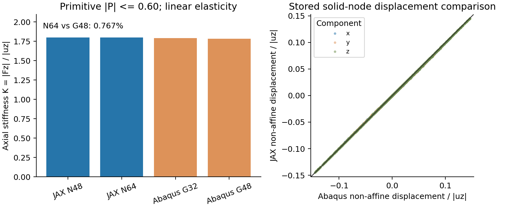

# 第四轮第2步：另一构型的小变形对照与薄壁验证边界

日期：2026-10-04。状态：**按预定停止条件收口；Primitive整体响应通过工作筛查，薄壁Gyroid参考未成立。** 执行入口仍是[唯一主规划](RESEARCH_PLAN.md)，长期问题见[研究背景](RESEARCH_BACKGROUND.md)。

## 1. 本步回答了什么

我们要检验：此前固定背景JAX-FEM对中等壁厚Gyroid的结果，能否延伸到另一种TPMS构型，以及明显更薄的壁。本步没有训练网络，也没有再做梯度或已知答案反推。

**结果增加了一个积极证据：** 约34.3%用料的Primitive片状实体，在本次小应变线弹性、指定单胞约束下，N64背景模型与G48无孔隙材料的贴体实体参考，整体刚度相差0.767%，代表性位移场也一致。背景与参考的两级加密变化分别为0.121%和0.288%，均满足运行前锁定的工作标准。

**薄壁项暂时没有精度答案：** Gyroid c=0.25的G32几何可生成，但G48参考在等值面经过格点时未通过裁剪几何检查。按计划，这个对象未进入力学计算。它是参考生成程序在这一输入上的限制，不能据此认定背景JAX-FEM算不准，也不能认定薄壁已经验证成功。

两项均已形成明确状态，所以本步可以收口。整体通过不代表局部最大应力、整个Primitive族、大变形或原壳试件均已认证。

## 2. 几何、材料、加载与符号

单胞边长L=1，坐标为x、y、z。隐式场采用常用三角函数近似：

- Gyroid：G=sin(2πx)cos(2πy)+sin(2πy)cos(2πz)+sin(2πz)cos(2πx)，实体是|G|≤c，本次薄壁c=0.25。
- Primitive：P=cos(2πx)+cos(2πy)+cos(2πz)，实体是|P|≤c，本次c=0.60。P的方程可见[原始研究的式(1)](https://pmc.ncbi.nlm.nih.gov/articles/PMC9861189/)；本文献采用的后续偏置厚度建模与我们这里的对称隐式带并不相同。本项目没有借用其试验或塑性压缩结论。

c是隐式值的阈值宽度，**不是恒定毫米壁厚**。同一个c在不同构型中也不代表相同用料或相同壁厚。这里的两种三角函数曲面是几何近似，不是精确最小曲面的误差认证。

背景N表示每个方向划分N个HEX8单元；N48与N64分别有110,592和262,144个单元。每单元使用2×2×2个真实物理Gauss点。在这些点直接求解析隐式场f，并用

`φ = sigmoid[β(f+c)] − sigmoid[β(f−c)]`

得到0到1之间的占据程度。φ表示几何/数值占据，**不是材料真实质量密度**。本次β=40，弹性模量为`E=Emin+(Es−Emin)φ`，Es=10、ν=0.3、Emin/Es=10^-4；因此孔隙区域仍有很小的数值刚度。这是单一基材实体的近似，没有变成异质材料研究。β的物理过渡宽度还取决于隐式场梯度，不能仅凭两种构型使用同一个β认定界面同样容易解析。

贴体G表示几何采样分辨率。本次G32/G48先构造同一阈值定义的分片平面实体表面，再生成C3D10四面体。孔隙中没有材料，也没有USDFLD。G不是背景HEX8的N；两者不能只按数字大小比较精细程度。

两边使用相同基材、小应变线弹性和宏观加载：沿z压缩，顶面位移uz=-0.01，即单胞边长的1%；z端面保持平面，x/y方向周期，宏观横向应变固定为0。端面可以发生规定允许的面内非均匀位移。这不是横向完全自由的单轴应力，也不是有压板接触的多胞试件。

Primitive的立方体角点落在孔隙中，参考模型无法在该角点定位。程序只在实际实体底面选一个节点固定x/y的整体平移；它不额外限制宏观横向变形，位移比较也只对齐这两个自由平移。本次未扩展非角点情况下的横向松弛功能。

## 3. 计算前的几何检查

参数在力学计算前锁定，没有根据反力调c或材料。

| 检查项 | 薄壁Gyroid | Primitive |
| --- | ---: | ---: |
| c | 0.25 | 0.60 |
| 解析二值用料采样估计 | 16.110% | 34.303% |
| 抽样最薄壁宽/L | 0.04616 | 0.11102 |
| N48对应的最薄壁单元数 | 2.22 | 5.33 |
| N64对应的最薄壁单元数 | 2.95 | 7.11 |
| G16预检查周期实体连通分量 | 1 | 1 |

用料估计来自4次扰动Sobol采样，每次2^18点。壁宽来自4096个抽样中面的法向线与两侧阈值面求交，**不是严格全局最小厚度或最短距离证明**。单元数是壁宽除以网格间距的直观诊断，不是必然准确的判据。薄壁只跨约3个N64单元，确实是与此前中等壁厚不同的测试条件。

## 4. Primitive的独立对照结果

K定义为`|Fz|/|uz|`：给定压缩位移下的整体轴向刚度。L和端面总体面积均为1，所以当前数值上K也等于以总体截面积归一化的约束表观模量；换尺寸后须按`Eapp=K·L/A`换算，不能把任意几何的K直接当材料模量。

| 模型 | K | 顶部Fz | 线性应变能U |
| --- | ---: | ---: | ---: |
| JAX背景N48 | 1.800929791 | -0.018009298 | 9.004648956×10^-5 |
| JAX背景N64 | 1.798745882 | -0.017987459 | 8.993729411×10^-5 |
| Abaqus贴体G32 | 1.790193322 | -0.017901933 | 8.950966003×10^-5 |
| Abaqus贴体G48 | 1.785052235 | -0.017850522 | 8.925260772×10^-5 |

Abaqus的K使用ODB实际宏观位移计算；其单精度存储位移约为-0.009999999776。反力、总体应力、实体平均应力的归一化口径在原提取中分别保存，没有混用。

三项工作指标均在运行前锁定：

| 指标 | 定义 | 实测 | 工作目标 |
| --- | --- | ---: | ---: |
| 背景加密变化 | abs(K_N48−K_N64)/K_N64 | 0.1214% | ≤1% |
| 参考加密变化 | abs(K_G32−K_G48)/K_G48 | 0.2880% | ≤1% |
| 模型间差异 | abs(K_N64−K_G48)/K_G48 | 0.7671% | ≤2% |

这里的“百分比”描述指定两个数值结果之间的相对差。它不是相对真实物理答案的误差界。G32→G48同时改变了表面几何采样和四面体离散，**没有独立拆分这两种误差**，也未做Primitive自身的同边界有限元加密/质量改善对照。因此本项定位是整体响应的工作筛查通过，不能写成完整参考误差认证。

两级背景解均通过有限性、缩减平衡残差、顶底反力平衡、反力与总体应力一致、内能与宏观功、周期和加载端面位移检查。N64缩减残差约4.69×10^-17。Abaqus两级也通过实体体积、实际ODB坐标、积分能量/ALLSE/宏观功、反力平衡和实际周期位移检查。这些是内部一致性；独立贴体对照才为物理近似增加证据。

位移场比较使用G48实体节点中的4096点，按实际物理坐标插值N64总位移，减去共同的宏观仿射位移，并仅对齐整体x/y平移：

- 总位移差的均方根为压缩位移的0.0491%。
- 非仿射位移（实体内部相对于整体均匀压缩的局部偏离）差的均方根，占参考非仿射位移均方根的0.904%。
- 三分量合并相关系数为0.999982；它描述样本趋势一致程度，本身不是误差保证。

样本未显示明显不一致的变形模式。这里没有验证整个应力场，也没有认证局部极值。图右侧为4096点中的固定子样本，横纵轴都除以压缩位移；对角线表示两边位移一致。

## 5. 用料、参考质量与成本

| 用料口径 | Primitive数值 |
| --- | ---: |
| N48光滑占据积分 | 34.29747% |
| N64光滑占据积分 | 34.29859% |
| N64同Gauss点二值判定 | 34.28497% |
| 解析二值采样估计 | 34.30338% |
| 贴体G32实体体积 | 34.40943% |
| 贴体G48实体体积 | 34.34619% |

N64光滑积分与G48实体用料相差约0.0476个百分点，约为G48用料的0.139%。这些不同口径已分开记录，没有按用料或反力重新拟合几何。体积相近不自动保证刚度相近；本步也没有把0.767%差异全部归因于某一种近似。

G48有509,205个实体节点和305,647个C3D10单元。几何检查给出正映射、封闭边界及周期连接；但质量警告仍在：Abaqus标记32,464个畸变单元，占数量10.621%，占实体体积1.078%，占应变能1.375%。形状平均比质量指标的最小值约8.67×10^-5（越接近1通常越规则）；低于0.1的单元占数量4.159%，体积0.0377%，能量0.0485%。**数量占比、体积占比和能量占比都不是误差占比。**

G48还采用外存求解，影响耗时和磁盘使用。该警告与单元质量警告不同；不能用“作业成功”把两者抹去。局部应力最大值仍不作为认证输出。

| 工况 | 实际成本 |
| --- | --- |
| JAX N48 | 建立2.53s、求解24.38s；整次命令28.79s；主机RSS峰值约5.78GiB |
| JAX N64 | 建立2.93s、求解88.66s；整次命令94.34s；主机RSS峰值约12.14GiB |
| Abaqus G32 | 几何准备26.23s；datacheck、分析及提取合计77.56s |
| Abaqus G48 | 几何准备71.11s；datacheck、分析、提取及质量/节点诊断合计398.26s |

JAX使用现有PETSc CG/GAMG平衡求解，JAX记录设备为CUDA；不能把它称为全过程只在GPU上求解。RSS是本进程主机内存高水位，不是GPU显存、系统总占用或伴随开销。Abaqus使用2核、8gb内存设置，未另测其峰值内存。各列工作量不同，以上记录不构成标准化的“加速倍数”。也没有测量本次Primitive梯度成本。

## 6. 薄壁为什么停止，程序改了什么

薄壁G32参考输入生成成功，体积约16.213%。但G48在几何裁剪阶段拒绝输出，没有INP、datacheck或Abaqus分析：

1. 原G48：等值面经过格点，裁剪多边形重复引用同一节点，生成零体积四面体。
2. G48_clipfix：去除重复节点引用后，发现另一个纯顶点接触。解析值0.24999999999999922与0.25只差约7.8×10^-16，坐标归并后只剩一个点。
3. G48_contactfix：全局采样只在16倍机器精度的范围内统一等值，排除无三维体积的纯接触；随后仍遇到“切点不在原四面体边上”的检查拒绝。只读诊断发现：恰在等值面上的原顶点，没有包含在当前边交点候选中，因而被错误地要求匹配其他边上的交点。这个处理缺口尚未修复。

最后一项是参考裁剪器的已定位限制，不是负Jacobian的JAX求解结果。三个失败目录和日志均保留。按宣布的停止条件，本轮不再修网格器或换c绕过问题；也不对没有细参考的薄壁运行两级背景和粗参考去凑对照。薄壁项分类为**参考未成立**，其计算精度仍待验证。

维护修改只涉及8个已有文件：geometry.py与binary_gyroid.py的Primitive入口/已定位接触处理，prepare_abaqus_binary.py的构型和实体平移定位，m4_numerical_study.py的正确二值体积字段，capture_binary_projection_reference.py的构型/位移导出，run_abaqus_binary.ps1的Primitive名字与可选诊断，abaqus_mesh_quality.py的节点样本导出，以及test_abaqus_binary.py。原FEM、密度本构、PBC和梯度求解器不变，没有复制FEM、引入新框架或安装依赖。

Windows首次启动使用旧PowerShell5，因继承的跨版本模块路径无法使用Get-FileHash，在datacheck前退出。后改用当前桌面已有PowerShell7后，两项分析成功。没有修改全局模块路径。

首次扩展后的136项完整回归通过；重复顶点修复后的27项相关检查通过；最终程序**138项完整回归通过**，含已知正体积域、纯顶点接触以及微小但有限切割体积检查。独立测试还修正了JAX精度声明对导入顺序的依赖；中途失败日志全部保留。测试通过不等于薄壁整网格通过，报告将两者明确区分。

## 7. 预算执行、文件与下一步

上限为4次基础背景前向、4项Abaqus分析及4项datacheck，精度失败且参考成立时最多增加1次孔隙模量诊断。**实际只做2次背景前向、2项Abaqus分析及2项datacheck，额外孔隙诊断0次，梯度/训练0次。** 三次薄壁G48准备都在作业提交前失败；Windows启动失败也没有产生分析作业。成功Abaqus分析/矩阵诊断的历史总数由28增至30，datacheck另计，数量本身不代表精度。

正式证据：`/home/xuehu/projects/tpms_jax/validation/mechanics_trust_20261003_r4/step2/`。

| 文件/目录 | 内容 |
| --- | --- |
| plan_initial.json、plan.json | 力学计算前锁定的输入/预算及有记录的几何执行修订 |
| geometry_precheck.json | 两个候选的采样用料、法向壁宽与G16拓扑检查 |
| primitive/N48.json、N64.json及对应.log | 背景原始结果、内部一致性、成本、源程序指纹 |
| primitive/N64.displacement.npz、mode_sample.npz、comparison.json | 位移场、共同坐标对照和精确指标 |
| thin_gyroid/*prepare.log及reference*failure_detail.json | 三次参考拒绝及只读原因诊断；没有薄壁力学结果 |
| execution.json、driver*.log、summary*.json、closure.json | 实际执行账本、分阶段汇总和最终分类 |
| regression*.log/json、clipfix_regression.*、contactfix_regression* | 初始/最终完整检查、相关检查与中途失败记录 |
| source_before/after、source_changes.diff、verification.json | 最小程序修改、环境/历史证据不变核查 |

Abaqus新根：`E:\ABAQUS\2026temp\Abaqus_Work\tpms_jax_abaqus\mechanics_trust_20261004_r4`。其中`primitive/G32`和`primitive/G48`保留INP、mesh.npz、expected及实际执行脚本；其work目录保留ODB、dat/msg/sta、datacheck、提取、验收和诊断。`thin_gyroid/G32`仅是已准备输入，三个G48目录仅是失败记录。不要把这些未分析目录当成力学结果。

Windows阅读报告是本文件，一次性执行工具及图在`work/mechanics_trust_20261004_r4_step2/`；它们是阶段取证，不是新维护求解器。正式源程序仍在WSL，历史Windows Git传输副本不改。第一、二、三轮与第四轮第1步证据保持原字节；没有Git提交、推送或合并。

**下一步仍是原第3步：完整均匀实体的有限应变基准。** 它不依赖本次失败的薄壁裁剪，能先隔离运动学、本构、加载路径和能量提取问题。启动前锁定与Abaqus完全一致的可压缩超弹性能量、增量/检查点及小规模资源预算。第3/4步当前未启动；第4步仍仅采用第1步已验证的中等壁厚Gyroid。薄壁限制保留，不把当前积极结果外推为20%以上压缩可行。训练、生成、逆设计继续后置。
