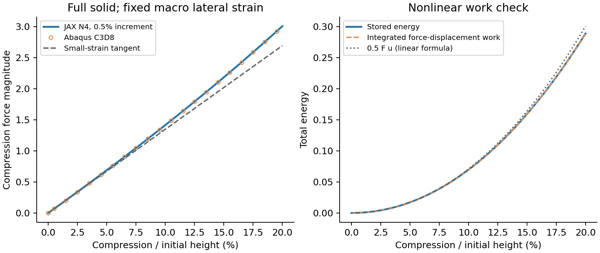

# 第四轮第3步：完整均匀实体有限应变基准

日期：2026-10-04。状态：**通过；第4步尚未启动。** 执行依据是[唯一主规划](RESEARCH_PLAN.md)，研究目的见[背景](RESEARCH_BACKGROUND.md)。本步检验有限应变基础实现，为下一步TPMS压缩对照排除运动学、本构和结果提取错误。

## 1. 结论与适用边界

完整均匀实体从零压缩到20%的三条JAX路径与两条独立Abaqus路径均完成。两者反力、储能的整条路径差分别不超过参考最大值的约0.0000035%和0.0000039%，小应变极限、非零扰动Newton收敛、平衡、全部节点位移和加载功检查也通过。

这个精度符合均匀仿射解可以被HEX8精确表示的预期，主要说明**材料、有限应变运动学、周期/端面约束、非线性求解接口和提取口径一致**。它不是TPMS的20%压缩认证，不是实际金属或聚合物本构标定，也不是大网格成本预测。均匀体没有孔隙、局部弯曲、失稳分支或自接触，这些问题要由原第4步检验。

此前薄壁Gyroid的参考裁剪限制保持原状态，本步没有续修或换c。Primitive的小变形结论也不被外推到大压缩。

## 2. 为什么选这个材料与加载

采用可压缩Neo-Hookean能量：

`W(F) = μ/2 · [J^(-2/3) · tr(FᵀF) − 3] + κ/2 · (J−1)²`

这里F是变形梯度，描述初始小体积怎样伸长、剪切和转动；J=det(F)是当前体积与初始体积的比，必须大于0。W是每单位**初始体积**的储能，μ是初始剪切模量，κ是初始体积模量。这与[JAX-FEM官方有限应变示例](https://deepmodeling.github.io/jax-fem/learn/hyperelasticity/example.html)一致。

初始E0=10、ν0=0.3，沿用此前基准，因此μ=3.846153846、κ=8.333333333。Abaqus采用原生`*HYPERELASTIC, NEO HOOKE`：C10=μ/2=1.923076923，D1=2/κ=0.24。[Abaqus材料文档](https://docs.software.vt.edu/abaqusv2025/English/SIMACAEMATRefMap/simamat-c-hyperelastic.htm)给出的能量形式与上述定义相同；本次实际使用Abaqus 2026完成独立对照。没有用其他同名、但体积项为log(J)的Neo-Hookean形式混作同一材料。

E0和ν0描述零应变附近的弹性参数，大压缩曲线由选定能量函数决定。选择它是为了验证算法，不表示TPMS的实际基材必然服从这个模型。数值尺寸、力和能量采用与此前一致的单位系统，并非新增实验材料参数。

几何是边长L=1的完整立方体，初始体积和初始端面面积均为1。加载延续现有单胞定义：x/y方向周期、宏观横向应变固定为0，底部z位移为0、顶部z位移为−a，a是压缩量除以初始高度。侧面及内部允许约束规定范围内的非均匀位移，并没有给全体节点强制解析仿射场。

总位移写成`u(X)=H·X+w(X)`，H=diag(0,0,−a)，w是有限元求解的周期非均匀位移。所以`F=I+H+∇w`。均匀基准的解析解为w=0、F=diag(1,1,1−a)。20%压缩时轴向伸长比为0.8、J=0.8；这不是体积不变的横向自由压缩。

## 3. 验证方法与计算前锁定预算

本次实际执行：

| 路径 | 网格 | 压缩增量 | 保存状态数 |
| --- | --- | --- | ---: |
| JAX基础路径 | N2：8个HEX8单元 | 初始0.01%小应变点，随后每1个百分点到20% | 22 |
| JAX网格检查 | N4：64个HEX8单元 | 同上 | 22 |
| JAX增量减半 | N4 | 初始小应变点，随后每0.5个百分点 | 42 |
| Abaqus基础路径 | N4：64个原生全积分C3D8 | 与JAX基础路径相同 | 22 |
| Abaqus增量减半 | N4 | 与JAX减半路径相同 | 42 |

N表示每个方向的单元数。每个HEX8/C3D8有8个积分点；N4有125个物理节点。所有保存状态包括零状态。Abaqus采用NLGEOM=YES，每个非零目标一个命名静力步、一个直接加载增量；两项分析分别有21和41个加载步，均有独立datacheck。

JAX复用安装版本的Newton求解器和现有XY周期降维/定位约束，小网格的线性校正用SciPy稀疏直接求解。在零状态及20%处刻意加非零、满足约束的位移扰动，避免仅把w=0代入后称为“非线性求解通过”。N4扰动的初始缩减残差约0.113和0.106，实际日志在两处各记录3次Newton校正，最终回到解析均匀解。其他点延续前一步的收敛场，在该均匀问题上通常无需再校正。

材料点还检查了：无应变零应力/能量，旋转客观性，独立一般F应力公式，零应变切线与原线弹性一致，有限应变切线与差分一致，简单剪切能量，以及体积翻转不被裁剪成合法状态。这里的本构自动微分用于应力/切线，不算新增设计梯度或网络训练试验。

运行前工作目标为反力/能量全路径差≤1%，网格/增量变化≤0.1%，末端路径功与储能差≤0.1%，并要求平衡、位移约束、正J及解析检查通过。目标是本阶段算法筛查标准，不是实际材料误差标准。本步按原3条JAX路径、2项Abaqus分析和2项datacheck预算完成，没有扩大网格或扫描本构参数。

## 4. 数值结果怎么理解

先用独立闭式式子作第三方检查。令s=1−a，则轴向名义应力为：

`Pzz = (2μ/3) · [s^(1/3) − s^(-5/3)] + κ · (s−1)`

名义应力以初始面积归一化；Cauchy应力以当前面积归一化，一般通过`σ=P·Fᵀ/J`换算。本例轴向面积保持1，故Pzz、σzz和总轴向力数值相同；横向分量却有Pxx=s·σxx的区别。不能把这个特殊相等直接用于任意TPMS变形。

负号表示压缩。下表使用N4、0.5个百分点增量的结果：

| 压缩量a | JAX轴向力 | Abaqus轴向力 | JAX储能 | Abaqus储能 | 最小J约值 |
| --- | ---: | ---: | ---: | ---: | ---: |
| 1% | −0.135220881 | −0.135220885 | 0.000675089198 | 0.000675089192 | 0.99 |
| 5% | −0.688979014 | −0.688979030 | 0.017087879535 | 0.017087878659 | 0.95 |
| 10% | −1.414032868 | −1.414032817 | 0.069498228081 | 0.069498226047 | 0.90 |
| 20% | −3.005586523 | −3.005586624 | 0.288683263175 | 0.288683265448 | 0.80 |

全路径反力差指标是`最大 abs(F_JAX−F_Abaqus) / 参考全路径最大 abs(F)`；储能用同样的最大值归一化。这样零载荷附近不出现除零或夸大的相对误差。42个共同状态的指标分别约3.50×10^-8和3.89×10^-8；**比例乘100才是百分比**，即约0.0000035%和0.0000039%。差异已接近ODB输出浮点存储精度，不能据此声称复杂几何也有这个精度。

N2→N4的路径力/能量变化为浮点舍入级。增量减半后，共同状态的JAX和Abaqus响应分别相同至存储精度。这是无历史依赖、无失稳的均匀解应有的结果，不是TPMS网格收敛证据。

在0.01%压缩处，JAX割线模量约13.4621368，零应变约束模量为13.4615385，相差约0.00445%；独立Abaqus也一致。约束模量大于E0=10，是宏观横向应变固定造成的，不是材料参数错误。材料点切线直接恢复原线弹性公式；很小但非零压缩处的割线还有正常的有限应变修正。

JAX N4全路径缩减残差最大约1.11×10^-14，顶底反力平衡及反力/平均第一Piola应力一致。两条Abaqus分析及datacheck均零错误、零警告、零畸变单元警告，也没有外存求解。125个节点逐点核对输入坐标、解析位移、实际周期/端面约束，并在共同坐标上比较两套程序的完整位移；全路径最大位移差约7.15×10^-9。J的体积比还与积分点对数应变的迹独立核对。

## 5. 非线性能量不能用线性公式

JAX积分W得到总储能；Abaqus既读取ALLSE，也检查`Σ(SENER·IVOL)`。按[Abaqus积分点输出定义](https://docs.software.vt.edu/abaqusv2025/English/SIMACAEOUTRefMap/simaout-c-std-elementintegrationpointvariables.htm)，SENER是**当前体积**下的弹性能量密度，所以必须乘当前IVOL，不能错乘初始体积。

从保存的反力与位移独立做梯形路径积分得到外功，不能在非线性阶段继续套用U=0.5F·u：

| JAX N4路径 | 20%处路径积分功 | 直接储能 | 相对差 |
| --- | ---: | ---: | ---: |
| 1个百分点增量 | 0.288713331843 | 0.288683263175 | 0.010416% |
| 0.5个百分点增量 | 0.288690780664 | 0.288683263175 | 0.002604% |

增量减半后，该差约缩小4倍，符合梯形积分误差的趋势。Abaqus外功ALLWK及独立反力积分也与此一致；有限步长下它们与精确储能存在小的积分差，不能要求外功数字逐位相等。

若20%处误用0.5F·u，会得到约0.300559，比直接储能高约4.114%。这不是材料或求解器误差，而是使用了不适用的线性关系。图左为压缩反力，虚线只表示零应变切线；图右比较直接储能、路径积分功及错误套用的线性公式。

## 6. 成本、程序与可追溯性

| 工况 | 成本记录 |
| --- | --- |
| JAX N2基础路径 | 22个状态；程序内约3.74s；主机RSS峰值约0.93GiB |
| JAX N4基础路径 | 22个状态；程序内约4.44s；主机RSS峰值约0.97GiB |
| JAX N4减半路径 | 42个状态；程序内约5.52s；主机RSS峰值约0.98GiB |
| Abaqus N4基础路径 | datacheck、分析、提取合计约50.89s |
| Abaqus N4减半路径 | 同样流程约42.86s |

JAX本次在CPU上执行，SciPy求解小系统；RSS是进程主机内存峰值。Abaqus使用2核、2gb内存设置，未测其峰值内存。两种流程的启动/提取工作量不同，Abaqus的较短增量路径也未必耗时更少；这些小问题时间不作为性能排名或大网格预测。均匀体多数状态没有Newton校正，真实TPMS的非线性成本可能显著增加。

仅新增4个正式文件，原数值文件和依赖环境不改：

| 正式文件 | 职责 |
| --- | --- |
| hyperelastic_fem.py | 有限应变能量、第一Piola应力和响应；继承已有周期运动学、复用现有求解器 |
| scripts/finite_strain_uniform.py | JAX路径捕获和完整实体INP准备，复用现有网格/约束生成 |
| scripts/extract_finite_strain.py | 完成ODB的路径、位移、参考/当前口径和能量检查，复用现有读取工具 |
| tests/test_hyperelastic_fem.py | 六项新增物理检查 |

没有复制FEM或Newton求解器，没有提前加接触、塑性、训练或通用非线性平台。Abaqus调用是实验包中的一次性脚本，复用原作业日志诊断函数；两条路径的真实执行副本与指纹保留。新增6项检查通过，最终完整回归**144/144通过**；本构AD不计为设计梯度计算。

正式证据目录：`/home/xuehu/projects/tpms_jax/validation/mechanics_trust_20261003_r4/step3/`。

- plan.json：计算前锁定的材料、加载、预算与指标。
- N2_d010.json、N4_d010.json、N4_d005.json及.log：三条原始路径、每点检查和实际Newton日志；d010/d005分别表示1/0.5个百分点增量。
- 同名.displacement.npz：所有保存状态的物理坐标、总位移和非均匀位移。
- summary.json、details.json、uniform_response.png：完整路径比较、细节和科研图；没有新增求解。
- execution.json、driver.log、paths_complete.json：实际执行账本；3条JAX路径共86个保存平衡状态，2项Abaqus分析及2项datacheck。维护测试另计。
- new_physics_tests.*、regression_final.*：新增物理和完整维护检查。
- source_at_run.json、source_after/、verification.json、closure.json：实际源程序与冻结历史核查、完成判定。

Abaqus新目录：`E:\ABAQUS\2026temp\Abaqus_Work\tpms_jax_abaqus\mechanics_trust_20261004_r4\step3_uniform\N4_d010`及`N4_d005`。包根保留INP、expected和执行源指纹，scripts为实际执行副本，work保留ODB/dat/msg/sta、datacheck、验收JSON及完整节点路径。

Windows阅读报告为本文件，图和一次性执行工具在`work/mechanics_trust_20261004_r4_step3/`。它们是阶段证据，正式程序仍在WSL；历史传输副本不改。前三轮、第四轮第1/2步和旧Abaqus包保持原字节，环境未安装或升级；HEAD仍为5e1d03d，没有Git提交、推送或合并。历史成功Abaqus分析/矩阵诊断总数由30增至32，datacheck另计；数量不证明精度。

## 7. 下一步仍是原第4步

本步提供了进入TPMS有限应变探查的基础条件。接下来只选第1步已验证的中等壁厚Gyroid基准，先锁定能量插值、参考加载路径、精度/资源门槛和预算，再从1%接到5%、10%；只有此前检查通过且没有遗漏接触/失稳机制才尝试20%。

完整实体的小网格结果不能指定TPMS精度网格或保证N64非线性资源可行。小规模检查只能用于实现/资源排查；实体与软孔隙的能量、最小detF、变形模式、网格/增量变化仍须分别记录。若遇到软孔隙畸变、失稳、自接触或资源瓶颈，按原停止条件给出适用上限，不强行到20%。第4步当前未启动，训练和逆设计继续后置。
