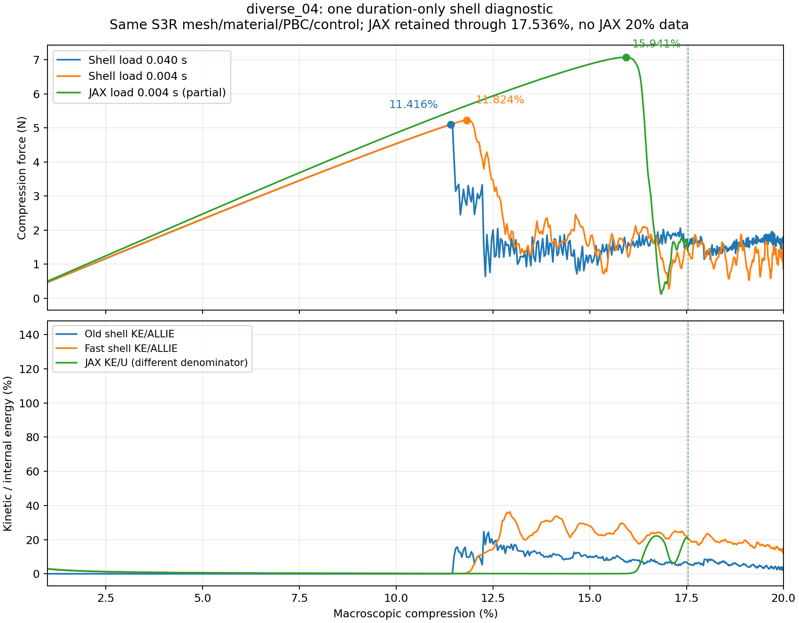
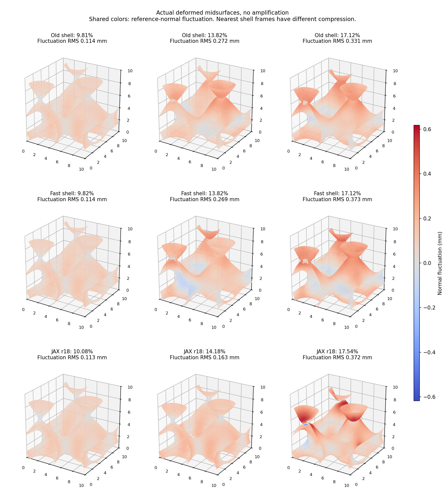

# 一次壳速率诊断与保存态折叠方向：r20执行报告

更新2026-10-07。按用户“开始按照规划进行”授权，完成唯一近期规划第2步，并进行第3步的一次限定保存态诊断。新增Abaqus作业1项，零新JAX时间路径、零设计AD；共享求解器/材料/HRZ和旧科学结果均保持。

## 1. 研究问题、做法和主要结论

科研问题：此前壳加载0.040s、JAX0.004s，10倍时间差是否足以解释JAX更晚跳跃？本轮复用diverse_04同一S3R壳，只将加载/保载0.040/0.004s改成0.004/0.0004s，目标仍20%。边长10mm、厚0.50mm、均匀NH E=10MPa/ν=0.3、密度1000kg/m³、XYZ周期/横向宏观应变0、网格、材料、初值和数值控制不变。

**结果：加载速率有可测影响，但不是当前主要位置差异的充分解释。** 原壳观察峰11.4161%，快壳11.8241%，只推迟0.4080个百分点；JAX原受控峰15.9409%，仍比快壳迟4.1168个百分点。观察位置差缩小约9.02%，只是描述此次两个差值的比例，不是宣称“速率贡献精确占9%”的因果分解。

## 2. 输入一致性与计算内容

新旧INP仅三行差异：SMOOTH STEP时间、总步时间、按0.1比例缩短的历史输出间隔。反向替换后逐字节等于原INP；40个场输出间隔不变。8372个物理节点、15914个S3R、5个截面积分点、423组XYZ周期关系沿用。没有新网格、厚度校准、质量缩放或黏性覆写。原反力/能量提取和已有中面场提取程序复用；Abaqus2026，4CPU，double=both，后台命令运行。

新壳完成20%及保载，求解81.00s，反力/能量提取1.07s，中面场提取3.17s。输入包及原E盘INP/输入/提取器/ODB保持原字节。本轮第2步是单速率因果诊断，不把快壳当作更准确的准静态参照。该试验不认证JAX自身的速率不敏感，也不排除两种表示的刚度/质量与惯性相互作用。

## 3. 响应与能量解释

| 项目 | 原壳0.040s | 快壳0.004s | 既有JAX0.004s |
| --- | ---: | ---: | ---: |
| 观察峰压缩量 | 11.4161% | 11.8241% | 15.9409% |
| 观察峰力幅值 | 5.0983N | 5.2300N | 7.0724N |
| 10%压缩力幅值 | 4.5358N | 4.5364N | 4.8493N |
| 20%末半段保载平均力幅值 | 1.6281N | 1.3464N | 无数据 |

压缩力原符号为负，表报幅值；压缩百分比为10mm单胞轴向缩短比例。快壳峰力比原壳增加约2.58%，JAX峰力仍比快壳高35.23%；不能因此宣布约10%的跨构型目标通过。早期10%力几乎不受这次壳速率改变，但峰后振荡/保载值明显受影响。

对JAX只比较已有0～17.5363%接受记录。1%～17.5363%原压缩对齐的曲线RMS差，以各自匹配壳峰归一，旧壳约52.59%、快壳约45.87%；原固定2.25891N分母的值另存comparison.json。RMS是整段平方差均值开根号，不是每点误差；这里大值主要包含跳跃位置错开，不做曲线平移掩盖差异，也没有完整20%JAX指标。

执行前固定的17%～17.5%加载窗口，按501个均匀压缩采样插值，平均力原壳1.8165N、快壳1.0164N、JAX1.4435N。窗口很短且包含动态振荡，三者事件经过时间不同；它不是稳定平台平均力，也不拿某一瞬时吻合当精度证明。

快壳有限值、目标压缩量、节点数及XYZ周期位移/转角检查通过。原提取器保留原准静态规则：快壳末端KE/ALLIE12.15%、加载低动能时长44.99%、总能量漂移7.17%、人工能量/最大输入功12.17%，原门槛均未过。高KE不单独否决本轮动态研究；人工能量/漂移仍是参考不确定性，不能因放松准静态要求说快壳准确。原壳相应质量事实保持。

## 4. 真保存场显示了什么

复用同一个原中面的面积权重，扣除宏观仿射位移与整体平移；JAX用既有纯HEX27插值函数。快慢壳参考节点/三角连接/权重逐位一致。绘图为实际变形，无位移放大，颜色为参考法向波动位移。

约10%附近，JAX对快慢壳方向余弦都约0.9985，说明早期形态很接近。约12%附近，快壳11.863%与JAX12.190%的方向余弦约0.9964，原慢壳已明显折叠，约0.8159；加载速率改变了早期跳转的时间位置。约14%附近两种壳都已折叠，JAX仍在原分支，JAX对快壳余弦降为约0.7265。到JAX17.536%降载后，对快壳17.125%的余弦约0.8041；相近波动幅值不证明相同空间折叠。

方向余弦1表示两个位移向量的方向一致，不是“准确率100%”。这些是最近保存帧、实际压缩量不完全相同，不是特征模态或严格同应变误差。41帧不能精确还原临界瞬间，后续需针对真正临界方向，不能单靠这些图认证模式相同。

## 5. 第3步限定方向诊断：已完成此诊断，原因尚未定位

在先写协议后，固定JAX实际跳跃增量方向`q(17.5363%)−q(16.0071%)`，在五个真实保存态用共享材料应力的方向导数、相同27点/JxW及完整周期自由度计算二阶能量变化。零时间推进，零设计AD，不修改F/J或任何物理参数，CPU约18.32s。一次单胞只取既有基函数/参考映射，不求解新平衡。

结果在10.077%、12.190%、14.185%、16.007%、17.536%均为正，依次约67.49、62.72、56.87、39.22、62.46 N·mm。这里方向幅值固定为上述实际增量，微小标量乘该方向得到局部变化；数值不是通常N/mm刚度，不能与壳模量直接比较。该方向随压缩局部软化，仍没提供“12%已经负曲率、只缺触发”的证据。

该方向大部分曲率来自几何核心及主要界面，深虚域＋混合尾部约0.5%～1.9%；这是该方向的曲率份额，不是总反力或所有临界模态。它与此前最高频率方向由深虚域主导不矛盾：方向不同、衡量的问题不同。不能因此排除虚域对另一临界方向的支撑。

正曲率只说明这一方向，**不证明全空间稳定**。有限跳跃增量含跳后变形，不是真正最弱特征方向；冻结态是动态态，不是认证平衡。因此第3步只有限定诊断完成，尚未找到唯一误差原因或可迁移修正；不能将第3步整体或第4步宣布完成。

## 6. 当前结论及下一项

已经证明：时间步爆发与较早分支差异需分开；10倍速率差不足解释主要峰位置差；同速率下仍有35%峰力差，早期整体响应却接近。继续研究有依据，但当前diverse_04尚不能称相对准确替代，旧diverse_28范围不改。

下一项仍在原第3步：**比较真正临界折叠方向的机械响应，区分表示刚度与触发延迟。** 先定一次针对性周期临界模式诊断的具体子空间、状态、成本与解释边界；不把任意有限跳跃增量当临界模态，不凭现有正方向曲率植入扰动/调阻尼拟合，也不盲扫积分/η/厚度。确定可解释因素或修正后再执行第4步一次完整JAX20%；当前条件未成立，不延长旧路径凑完整结果。

完整设计梯度依然后置；机械方向导数不是设计路径AD。旧NH20%符号失败与新核完整梯度未认证保持。两次后处理修正（1%支持点截断、零时刻绘图分母）留在analysis_attempt01/02，不是新仿真失败或材料改动；最终共同1%值与冻结r18核对一致，峰值/模式判断未因修正改变。

## 7. 文件位置与复现

正式证据：`/home/xuehu/projects/tpms_jax/validation/shell_rate_20261007_r20/`，含唯一协议、三行INP差异、规范包、launch_receipt、comparison/mode_comparison、方向protocol/result、源码与冻结验证。原生ODB：`E:/ABAQUS/2026temp/Abaqus_Work/tpms_jax_abaqus/shell_rate_20261007_r20_diverse04_explicit_T0p004/thin_shell.odb`；ODB留原位不复制到Git。提取JSON/NPZ/日志在r20/abaqus/explicit_T0p004/results。

阅读镜像为本报告；两张图在Windows output/figures。旧入口备份在history/before_shell_rate_20261007，正式对应docs/history同名；本轮已完成工具归档后不作运行入口。旧r15～r19共264个科学文件冻结，共享内力/距离/PBC/显式入口原字节不改。本轮无提交/合并GitHub、无运行中或排队作业。
