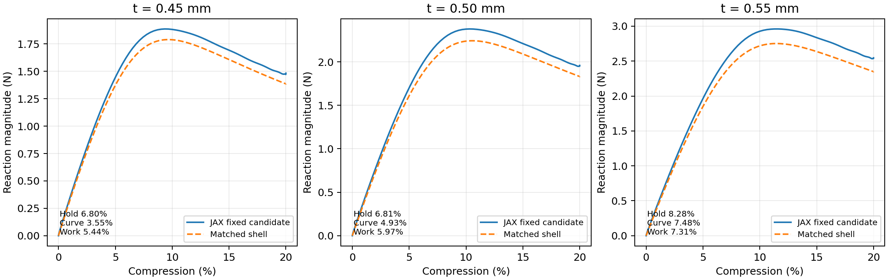

# 匹配厚度范围：固定方法的薄壁20%前向检验

2026-10-06，唯一主规划第3步。两个新增厚度均通过固定的前向工作门槛，说明改善不是只在0.50mm这一点成立。 同一中面在0.45至0.55mm附近的这三个采样厚度、0至20%弹性周期无接触响应，有条件地支持作为Abaqus的前向替代工具；不是连续整个区间逐点认证。

## 科研问题与输入

这轮回答固定背景方法在相邻实际薄壁厚度下是否仍有效，服务将来构型/参数探索，而非调整厚度来拟合原曲线。diverse_28同一周期中面、单胞边长L=10mm；厚度0.45/0.50/0.55mm分别为边长4.5%/5%/5.5%。0.50mm复用r12，两个新厚度同步改变壳截面和JAX距离带占据、HRZ质量。

基材仍均匀可压缩Neo-Hookean，E=10MPa、泊松比ν=0.3。软孔隙是几何/数值近似，不是异质材料。JAX固定HEX27 N32、27点、HRZ、objective_void+C²续接；η=1e−4、界面10%-90%宽0.05mm、φ界限0.001/0.01、最大续接截点0.1均不变。默认NH未改，无网格、积分、人工刚度或阻尼扫描。 N32表示每轴32个背景单元；HEX27是二次27节点六面体，27点是每单元的积分采样点，不是节点数。HRZ为保持正值的对角质量近似；φ为材料占据，η是虚域相对实体的最小刚度比例。C²候选细节见[冻结核报告](VOID_CONTINUATION_PROGRESS.md)。

Abaqus复用9351节点、17986个S3R单元、366组原XYZ周期关系和原中面；每份INP只改一行壳厚，逆替换能精确恢复原始字节。仍为三向周期波动、宏观横向应变零，压缩20%；不是压板试样。JAX加载0.004s，壳慢Explicit加载0.040s，均另保载10%时长；不同加载时间是既定准静态选择，不能称时间历史完全相同。新厚度速率独立加倍未执行，不继承0.50mm的速率认证。

## 响应与工作门槛

| 厚度 | JAX保载力幅值 | 壳保载力幅值 | 反力差 | 曲线指标 | 输入功差 | JAX主体时间 |
| --- | ---: | ---: | ---: | ---: | ---: | ---: |
| 0.45mm | 1.479899N | 1.385734N | 6.80% | 3.55% | 5.44% | 10.71min |
| 0.50mm | 1.956170N | 1.831446N | 6.81% | 4.93% | 5.97% | 10.74min |
| 0.55mm | 2.543136N | 2.348704N | 8.28% | 7.48% | 7.31% | 10.73min |

压缩力原始符号为负，表报幅值。保载力取末半段平均；反力差为|JAX−壳|/|壳|。曲线指标在0.1%-20%取1000个共同压缩点，力差均方根除以冻结Standard峰值2.258914N；它不是逐点最大相对误差。功为宏观反力沿位移的积分，单位N·mm。三项≤10%是本研究工作目标，不是物理精度认证。0.50mm表使用既有快路径，与两点相同加载时长；其既有慢路径反力/曲线/功差6.85%/5.05%/5.98%，速率证据保持。

两侧随真实厚度增加的力级与峰值变化一致，支持方法能表现厚度引起的响应变化。反力差从约6.8%上升至约8.3%，不能把它当作所有厚度/构型的统一校正倍率。曲线指标使用同一个固定分母，较厚工况力级较大也会影响该指标；不能据三点单独定位误差原因或认证局部设计导数。

| 厚度 | JAX峰值 / 位置 | 壳峰值 / 位置 | 峰值差 | 中面波动向量余弦 | 中面波动相对差 |
| --- | ---: | ---: | ---: | ---: | ---: |
| 0.45mm | 1.88669N / 9.35% | 1.78978N / 9.65% | 5.41% | 0.999882 | 1.59% |
| 0.50mm | 2.37875N / 10.32% | 2.24308N / 10.55% | 6.05% | 0.999840 | 1.82% |
| 0.55mm | 2.96006N / 11.60% | 2.75153N / 11.46% | 7.58% | 0.999764 | 2.23% |

峰值位置为宏观压缩量。模式在原中面节点用安装版HEX27插值，移除宏观仿射运动与刚体平移，再按原三角形参考面积加权。余弦接近1说明运动方向相近，相对差衡量波动幅度/分布偏离；它们不认证局部应力或接触。

## 材料域、动力学与参照限制

| 厚度 | JAX能量/功缺口 | 加载时长KE/U≤5% | 末态KE/U | 125点严格NH最小J | 125点虚域非正J数量 | 壳能量漂移 |
| --- | ---: | ---: | ---: | ---: | ---: | ---: |
| 0.45mm | 0.0085% | 95.79% | 0.000091% | 0.16462 | 14005 | 1.17% |
| 0.50mm | 0.0081% | 96.84% | 0.000017% | 0.21526 | 17749 | 1.33% |
| 0.55mm | 0.0076% | 97.89% | 0.000031% | 0.20916 | 21030 | 1.48% |

J=detF为实际局部体积比。严格NH区指φ≥0.01、不能使用负J延拓的区域；新工况材料求值数与27/125点完整能量、应力检查见原JSON。125点是同一最终保存位移场的密采样，共409.6万个点，不是额外求解或全过程处处有效证明。人工虚域非正J如实保留，完整候选能量不是只对正J子域求和。

KE/U是动能与弹性能之比，从1%压缩起按实际加载时长加权；末态与加载段分别报告。能量/功缺口<1%、末态KE/U<5%、加载时长中KE/U≤5%占比≥95%是原JAX门槛。新增点各自估算稳定时间步；其步长如相同也是计算结果，不是强制沿用。

两条新JAX路径均零减步，主体约10.7分钟；最终场分析各约23-26秒。两份原生壳Explicit主体989/984秒，即16.48/16.40分钟，均成功完成。壳各4CPU并行、JAX单GPU顺序运行；加载时间、单元和工作量不同，这些是本轮成本记录，不能当公平的软件速度比较。

壳自身仍按原1%全局能量漂移门槛评价，是否通过见shell_checks，不能放宽门槛将参照问题转成JAX通过。即便主响应接近，壳/背景运动学不同，缺少独立实体真值；结论是有条件工程一致性。实际自接触、周期镜像接触和塑性压溃均未认证，软孔隙不代替接触。

## 对长期目标和其他参数的判断

同一中面在0.45至0.55mm附近的这三个采样厚度、0至20%弹性周期无接触响应，有条件地支持作为Abaqus的前向替代工具；不是连续整个区间逐点认证。 当前可行性的积极证据是能够持续计算薄壁较大压缩、对匹配壳比较完整曲线并保留可微材料接口。不能承诺全面替代Abaqus。

曲面参数、构型和材料当然可以逐步扩大验证范围；这正是后续学习/逆设计需要的能力。应选择有区分力的变化，先查已有可用周期中面与参照，固定真实壁厚和算法；不预设四参数或大量样本。

| 后续候选因素 | 回答的问题与前提 |
| --- | --- |
| 同族曲面参数 | 曲率、薄弱连接变化后方法是否仍可信；需要新中面/距离场和匹配壳，解析阈值c不能当恒定壁厚 |
| 一个不同构型 | 弯曲/连通模式改变后能否迁移；优先已有可用周期壳中面，沿用已固定方法，不先开发复杂实体网格 |
| ν或另一弹性本构 | 体积/剪切比例或非线性材料不同后是否适用；双方真实实体规律必须匹配，虚域能量与稳定性另行验证 |
| E单项变化 | 同ν的NH静力能量/力有同比例缩放成分，证明力级可变不等于验证了新变形机制；显式还需考虑惯性及稳定步长 |

这是下一阶段的候选顺序与依据，不是本轮新增扫描清单。JAX-FEM论文支持可微材料和逆问题的基础能力，[原论文](https://arxiv.org/abs/2212.00964)，但没有替当前三维薄壁显式20%路径或任意本构完成认证。现有距离/最近面片预处理未认证形态AD，换构型算出力不等于已获得形态梯度。

新核局部/短块AD通过，但完整20%路径导数未认证；原NH20%JVP与FD符号相反的记录保留。本轮±10%厚度物理变化不是梯度检验，零新完整AD和训练。按唯一主规划第4步收口范围，再选择最小下一项；不提前建立训练框架。

## 文件与可追溯性

正式实验：`/home/xuehu/projects/tpms_jax/validation/thickness_range_20261006_r13`。`input.json`先固定方法/门槛，`preparation.json`记录原INP单行差异；`t0p45/`、`t0p55/`各含`T0p004/`、匹配`abaqus/explicit_T0p040/`与`analysis/`。完整场和日志留本机，JSON/分析工具/图及输入证据进Git。`decision.json`报告范围，`evidence_manifest.json`与`verification.json`核查哈希；r6-r12科学原件不覆盖。

原生壳ODB：`E:/ABAQUS/2026temp/Abaqus_Work/tpms_jax_abaqus/thickness_range_20261006_r13_t0p45_explicit_T0p040`、同名`t0p55`目录。Windows `work/thickness_range_20261006`仅一次性准备/提取/报告/发布收据，不是第二套FEM。准备时初次严格字节匹配因原INP的CRLF停下，随后保留原换行完成；原脚本/说明留存，没有改科学常数凑通过。
