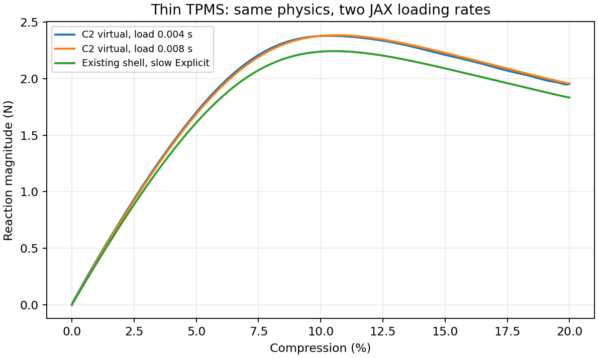

# 薄壁TPMS可导背景力学：方法、证据和可行性

更新2026-10-09，近期证据补至r46。本说明解释研究内容与结果含义；逐轮细节在冻结报告，当前任务只在[唯一规划](RESEARCH_PLAN.md)。2026-10-07[周总结](WEEKLY_RESEARCH_SUMMARY.md)是当时的事实快照，不混入后来结果。

## 1. 研究问题与当前回答

我们希望用JAX-FEM在固定背景网格上计算薄壁TPMS压缩，再利用有效梯度服务构型/参数设计。优先建立可信仿真，后续学习和逆设计尚未开始。不是研究异质材料，也不以重新实现Abaqus所有接触/塑性功能为目标。

现有回答是有限范围肯定：代表diverse_28的三个厚度在20%压缩对壳工作目标内；迁移diverse_04仍有明显峰位和数值困难，通用20%不能宣布成功。原低压缩厚度梯度有证据，完整20%和形态链尚未通过。当前diverse_04/diverse_28平滑无惯性K₀分别比匹配壳高5.70%/3.00%；占据因素已有影响证据，全部来源未认证。

## 2. 几何如何放进固定背景网格

当前L=10mm、t=0.5mm，仅借用户三角壳中面。N32表示每轴32个背景单元，单元边长h=0.3125mm。HEX是六面体；HEX27采用27个二次插值节点，比线性HEX8能描述更丰富的位移和弯曲。当前每单元27个Gauss积分点，**节点数与积分点数相同是当前配置，不是同一概念**。二次节点间距0.15625mm不等于有3.2层单元；名义厚度跨约1.6个单元，局部倾斜/曲率也影响解析能力。

对参考Gauss点计算到周期中面的距离d，以

`φ(d,t)=1/[1+exp((d−t/2)/ℓ)]，ℓ=0.05mm/(2ln9)`

定义连续占据。φ接近1代表壁内，接近0代表孔隙，10–90%界面宽0.05mm。它是几何的数值近似，不是宣称实际壁是连续变化的多种材料。原几何不随变形重新阈值化，φ附着参考材料点。早期解析阈值c不是当前恒厚t。

与删空单元二值体素相比，连续场让厚度等参数的小变化连续地进入积分，减少硬阈值下导数几乎处处为零/跳变的问题。固定网格也便于数组输入和批量求解，不必每次重划复杂贴体网格。代价是窄界面需要足够积分、存在人工过渡材料与软域耦合，三角面最近距离本身还可能在面片切换时非光滑；连续φ并不自动使整条形态链可导。

[有限胞综述](https://arxiv.org/abs/1807.01285)与[几何投影非线性研究](https://doi.org/10.1016/j.cma.2024.117636)提供这种背景/虚域方法家族的依据。我们的固定Q2、sigmoid与C²核是具体研究实现，不是上述方法的精度认证。二值几何、贴体实体和壳均有独立价值，不能仅以是否方便求导判断力学优劣。

## 3. 材料、Gauss积分与周期边界

基材Neo-Hookean能量为

`W_NH=μ/2·(J^(−2/3)I₁−3)+κ/2·(J−1)²`，

其中F=I+∇u是变形梯度，J=detF是局部体积比，I₁=ΣF²；E=10MPa、ν=0.3，μ=E/[2(1+ν)]，κ=E/[3(1−2ν)]。初始切线匹配线弹性。占据权重s=η+(1−η)φ、η=1e−4使孔隙有很小人工刚度。

各单元由节点位移插值求∇u，在各真实Gauss点求F、φ、材料能量与应力，再以参考积分权重求和。全模型能量是各点`W×权重`之和，内力和切线由同一能量求导。Gauss点没有独立位移自由度；加点改善积分但不增加变形模式。HRZ把一致质量按既定规则集中到节点，厚度变动时占据和质量也变。

压缩采用`u(X)=H·X+w(X)`，w在XYZ相对周期面相同；宏观Hzz为负，Hxx=Hyy=0，周期节点归并并固定一个平移自由度。宏观横向应变零不意味着每个壁点都是平面应变。壳具有转角周期约束，实体没有独立转角，不能因此认为局部运动学已完全一致。PBC不构成周期镜像接触。

## 4. 为什么加入显式与C²虚域处理

大转动、屈曲和跳跃使静力Newton路径困难，项目显式入口复用JAX-FEM材料/内力，以中央差分和HRZ质量推进。显式避免每步全局Newton，但仍有稳定步长、惯性和质量近似；慢加载或完成20%并不自动说明准静态或空间精度正确。

原NH在J≤0时含无定义项。软孔隙在大变形下容易畸变，曾出现经典虚域转动不客观、客观混合尾部材料无定义等失败。当前objective_void显式选项采用φ=0.001/0.01分界与客观人工虚域，在低占据混合区用C²续接补全能量。实际F/J不夹断，实体φ≥0.01仍要求实际J>0；续接不是把真实材料翻转修正为物理有效。

纯核/接口45项及局部/短块导数有证据，代表两条20%路径能求值；仍保留虚域翻转，不证明全局无接触、全过程处处有效或完整设计AD。required_positive_J与旧NH_active统计域不同，不能直接同比。默认NH保持，候选明确选择。

## 5. 已完成工作的逻辑

先用均匀实体、解析周期线弹性和相同离散材料场检查实现，再检查解析/数组几何输入、基准导数，随后转向恒厚薄壁壳对照和大压缩。原HEX8大压缩偏差较大，HEX27明显改善；积分加点、虚域能量与客观性诊断有成功也有失败。C²修复求值域后，diverse_28前向及厚度范围取得有界结果，迁移diverse_04暴露峰位和推进困难。

最近不再盲扫网格或训练，而将初始偏硬单独抽出：r30静态复现5.70%，r31平直膜向正确但采样偏软，r32膜内主导，r33/r34局部积分干预未改善，r35界面改善而主体差异保留。随后r36一个兼容模式只能微小释放能量；r37/r38说明界面宽度有影响，但同部分密积分窄界面仍对壳高5.53%。这些结果缩小了原因范围，没有完成唯一归因；生产宽度不变。

r40又确认取消平滑占据在同部分密积分使K下降2.1205%，仍对壳高4.2430%；原27点1.4656%具有积分敏感性。r41补齐diverse_28当前平滑零态，偏硬3.0033%，其占据复核随后由r43完成。r42只读能量账目将同规则2.1205%下降分为净权重影响0.6217%与相容重平衡释放1.4988%，分母是同规则平滑能量，非壳误差分摊。

r43完成diverse_28自身选区配对：平滑对壳3.5169%、二值1.0910%，K下降2.3435%；净权重−0.6929%与重平衡释放1.6506%，重复diverse_04趋势。选区外未密检查，不直接二值生产。详细理论、负面结果及判别见[机制审查](MECHANISM_ANALYSIS.md)，当前数值汇总见[状态](RESEARCH_STATUS.md)。

## 6. 前向结果及百分比如何读

| diverse_28对同一既有慢壳 | 原HEX8 | 原HEX27慢路径 | C²虚域慢路径 |
| --- | ---: | ---: | ---: |
| 20%保载反力幅值/N | 2.24186 | 2.00459 | 1.95699 |
| 保载反力差 | 22.41% | 9.45% | 6.85% |
| 曲线指标 | 13.47% | 5.87% | 5.05% |
| 输入功差 | 15.51% | 6.87% | 5.98% |

壳保载约1.83145N，原压缩反力为负，表报幅值。保载取后半段平均，差异以匹配壳反力为分母。曲线指标在0.1–20%上均匀取1000点，反力差RMS除以固定Standard壳峰2.25891N；5.05%不是每一点均低于5.05%。输入功沿位移积分，单位N·mm。三厚度最差反力/曲线/功8.28%/7.48%/7.31%，仅代表这三个点。

C²快/慢加载0.004/0.008s，另保载10%时长，主体墙钟10.74/21.14min；快慢保载、曲线、功差0.0418%/0.6088%/0.0060%。这支持该代表工况并非宏观惯性主导，不证明空间精度或所有局部振动。壳能量漂移约1.33%未过旧严格1%门槛，因此保留工程参照限制。

diverse_04同速率观察峰为壳11.8241%、JAX15.9409%，峰力差35.23%；后续从零只到17.5363%预算停。N64一次试验到14.7320%触步长底线，不能称完成20%或网格收敛。峰附近跳跃动能升高可能正常，但数值失败仍须单独解释。壳不能作为无误差真值，初始差缩小也不会自动消除峰错位。

r44随后完成二值N32的完整20%及保载，初始对壳1.47%但曲线/功/保载差35.90%/40.21%/47.89%；取消过渡不是全部大压缩误差的解释。r45二值N64 T1ms只至13.59%预算停，反力仍增载，未捕获峰。r46只读复盘表明共同0–10%平均差N32/N64为0.80%/1.90%，共同0–13.59%为22.12%/4.85%；T4/T1ms不同，不作纯网格排名。N64末端35.39%是点差，不是峰力差。详见当前状态和机制审查，原验收与失败保持。

## 7. 梯度优势究竟保留到哪里

JAX-FEM可对离散残差和能量自动求导，隐式平衡可伴随，时间路径可JVP/VJP；高维设计理论上能避免逐参数完整差分。但导数是对当前离散模型的导数，不能替代前向精度，也不能自动处理非光滑分支、接触或面片切换。[JAX-FEM论文](https://arxiv.org/abs/2212.00964)验证一般固体/逆问题，不认证当前薄壁20%。

| 原NH厚度总导数 | JVP/(N/mm) | 完整路径FD/(N/mm) | 结果 |
| --- | ---: | ---: | --- |
| 10%反力 | −10.648858 | −10.648356 | 差约0.0047%，通过 |
| 15%反力 | −11.656391 | −11.655845 | 差约0.0047%，通过 |
| 20%保载平均反力 | +76.093668 | −10.797551 | 符号失败 |

原JVP主体约49.77min，差分厚度扰动±0.0025mm；新核局部导数不能继承旧完整路径认证。总设计导数需包含占据、HRZ质量、仿射惯性、推进与目标，已有JVP不含拒绝/减步控制决策导数。固定状态偏导、单次FD或错误末态伴随不能称有效AD。

未来形态/参数→占据→响应→损失的完整链尚需验证，最近三角形预处理目前不提供有效形态AD。训练后置是合理排序，不代表以后训练没有其他困难。

## 8. 当前客观判断

“在限定弹性、周期、无接触范围，一定程度替代Abaqus并保留可导实现”已有实际依据，值得继续。更强的“任意薄壁、20%后屈曲、自接触、完整有效梯度”没有成立；不赋予无依据的成功概率，也不因失败直接判定JAX平台不准确。

r39圆柱与r40–r43占据诊断保留原限制；r44/r45说明初始接近仍不能保证降载时机。下一先看已有变形，再同速率短对照分离时间与空间影响，有必要才接续N64峰，由证据选一项确认或可导改进。不调物理参数、删法向/剪切能或拟合壳。继续方式只见[唯一四步规划](RESEARCH_PLAN.md)；本次零新求解/AD，完整20%梯度未认证。原报告、科学失败和大文件位置见[文件地图](FILE_MAP.md)。
