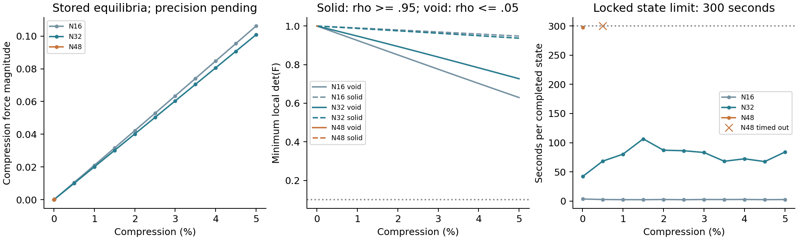

# TPMS 背景网格计算：目前证据、方法边界与下一步

**研究进度与方法评估｜2026-10-04，薄壁目标纠正后**

本文面向首次了解项目的研究者，也作为后续工作的背景。它综合已有冻结结果，并补充用户参考壳模型的只读审查和几何厚度统计；不增加有限元求解、Abaqus 作业或训练。具体执行只看 [近期主规划](RESEARCH_PLAN.md)，逐项原始结果看各轮报告。2026-10-03版说明已原样归档，避免把旧进度当成当前进度。

## 1. 我们要回答什么，目前能回答到哪里

长期目标是：让可信且能够提供有效梯度的 TPMS 力学计算，服务构型和参数的学习、生成与性能驱动逆设计。希望以后用目标刚度、力-位移曲线等要求反推结构。现在先解决力学评价是否正确、适用范围多大、代价是否可承受；训练暂缓。

**固定背景 JAX-FEM 计算 TPMS 的路线有理论依据，项目已有小变形整体响应的积极证据，值得继续。有限应变基础实现已通过，但 TPMS 非线性精度仍未认证。** 更关键的缺口是：此前主要验证的Gyroid比用户最终需要的薄壁明显更厚，尚未直接验证目标厚度的弯曲、压缩和梯度。几分钟的求解成本不是方法失败；旧300秒门槛已按用户要求取消。不能把厚壁或极粗网格的成功外推到目标薄壁。

| 问题 | 当前结论 | 证据边界 |
| --- | --- | --- |
| TPMS 小变形压缩能计算吗？ | 能，实际完成了 Gyroid 和 Primitive 的指定案例 | 是特定几何、材料及单胞约束的整体响应 |
| 能替代 Abaqus 吗？ | 在已检查范围有作为前向评价器的基础 | 不能声称替代所有壳试样、局部应力、构型或压溃计算 |
| 光滑占据加软孔隙合理吗？ | 是已有虚拟域近似，可用于可微设计 | 网格、界面积分、孔隙刚度和实体参考必须分别检查 |
| 5% TPMS 压缩准确吗？ | 尚不知道 | N16/N32 的内部检查通过；精细网格与独立非线性参考没有闭环 |
| 20% 或更大压缩能算吗？ | 完整均匀实体基准通过至20%；TPMS未知 | 均匀体不包含孔隙畸变、薄壁失稳、接触和塑性 |
| 梯度能帮助未来逆设计吗？ | 理论上能，部分离散梯度已验证 | 没有完成网络反传、有限应变设计梯度或实际生成设计收益验证 |

这是均质基材 TPMS 的几何与力学研究。占据场不是基材质量密度分布；四个参数是过去的临时例子，不是最终设计空间上限，也没有预设几千个训练算例。

### 1.1 厚度确实没有对准最终薄壁目标

本次读取用户指定目录的实际输入，而不是从文件夹名推断：`F:\auto_abaqus\work\para_aly\Fine\T0p02\MS9\diverse_28\abaqus\blocks\material_section.inc`写明壳厚0.3285947046mm，`case_used.json`写明单胞边长10mm。厚度与边长之比为3.286%。壳中面面积约304.326mm²，t由名义用料10%按面积×厚度选取；这不是精确偏置实体体积分数。目录T0p02不表示实际厚度0.02mm。

当前Gyroid实体为|G|≤c，不是壳厚直接输入。沿4096个中面采样法线求与两侧边界的交点，得到下表；样本不按面积加权，范围不是严格全局极值。只测几何，没有新力学求解。

| 对象 | 厚度/单胞边长t/L | 若L=10mm | 已有力学证据 |
| --- | --- | --- | --- |
| 主要Gyroid c=0.541062 | 约10.17%～12.50%，样本中位11.78% | 约1.02～1.25mm | 小变形整体响应；粗网格有限应变到5% |
| 旧“薄壁”Gyroid c=0.25 | 约4.62%～5.66% | 约0.46～0.57mm | 独立参考裁剪失败，无薄壁力学对照 |
| 用户diverse_28参考壳 | 恒厚3.286% | 0.3286mm | 有旧Explicit曲线，但物理条件与当前JAX不同 |

因此主要Gyroid比参考厚约3～4倍，旧薄壁例也厚于参考。过去的验证支持实现基础，但没有直接回答最终薄壁对象。新的薄壁研究输入是用户目标纠正，不能被误读为为成本调小c，也不能用加厚凑通过。

参考形态为一般周期隐式中面：`-3.4 cos(X) cos(Z)+4.6 sin(X) sin(Y) sin(Z)+2=0`，这里X/Y/Z为2π乘物理坐标除以L。它不是当前经典Gyroid，不强行称其满足严格极小曲面条件。参考只说明目标尺度和一种形态，不要求后续全部照搬。

最新输入已由用户改为厚度/边长5%（L=10mm时t=0.5mm），与上表旧壳参考分开。新第1步复用该中面构造周期距离带，N64下2097152个真实Gauss点的表示、周期/覆盖/连接初筛通过，用料约15.16%；三处局部折面法向截线厚度多约1.05%～1.21%。这只说明几何输入可进入小变形对照，不认证弯曲/压缩力学或平衡梯度。详情见 [第1步记录](../validation/thin_target_20261004_r5/README.md)。

### 1.2 薄壁背景法的关键困难，是能否表示弯曲

壳用中面位移、转动及厚度方向的专门假设表达膜内伸缩和弯曲，不需要把厚度铺成多层实体单元。我们现有背景法把薄壁作为三维实体，原则上也能产生弯曲，但当前HEX8位移是低阶插值，材料边界又穿过单元；表示困难与壳不同。

以原参考厚度计，N32/N48/N64分别约跨1.05/1.58/2.10个单元宽；最新5%目标在N64跨3.20个单元宽。N是每轴单元数，h=L/N，t/h是尺度提示，受壁方向、界面位置和形函数影响；不是“至少几层一定准确”的通用定理，也不是N64必然失败的证据。当前八个Gauss点可能很好地测到用料，却未必充分表达壁厚方向的弯曲应变；只增加积分点也不能自动提高位移近似阶次。

薄板线弹性弯曲刚度与Et³/[12(1-ν²)]成正比。它说明少量厚度偏差可能被弯曲放大，但TPMS整体含膜内受力和曲率，不能简单把整个单胞刚度都按t³缩放。光滑界面会改变材料截面的刚度分布；低阶实体也可能产生额外剪切刚度。漏壁/断连可能使结果偏软，锁死或软孔隙约束可能使结果偏硬，误差方向不能预设。

旧Gyroid β=40按中面梯度一阶估算，单界面占据从10%到90%的空间宽约0.010～0.012L。与原厚壁比较小，与t/L≈0.033薄壁相比已是相当大的一部分。这只是局部尺度估算，不是新薄壁精度结果。应按物理厚度和界面宽度定义新输入，不能原样复制β，也不能任意调β拟合Abaqus。

用户目录Qiu等2024研究比较了壳、贴体实体与二值体素：薄壁FK20的一两层体素存在弱连接、遗漏特征，薄壁壳更有优势；较厚对象体素表现更好。它研究的是二值C3D8R体素，不是当前光滑Gauss场，不能直接证明我们失败，但明确不支持“体素对薄壁普遍最好”。[原论文](https://doi.org/10.1016/j.ijmecsci.2023.108657)，本地第11～13页正文及图12/13复核。

### 1.3 不同压缩量，必须看机制而不是只看百分比

宏观压缩1%、5%或20%是端面位移除以初始高度；局部薄壁可能更早弯曲、屈曲、屈服或接触。当前JAX有限应变模型是无接触、无塑性的Neo-Hookean弹性，不是现成的真实压溃求解器。

参考旧模型是S3R壳、E=484MPa、ν=0.4、屈服应力8MPa的塑性材料，刚性压板、摩擦0.6、自接触、XY周期及Explicit动力计算。旧结果保存的历史在约5%/10%/20%压缩时，塑性耗散ALLPD与总内能ALLIE之比约45%/62%/77%。这些是旧CSV诊断，ALLIE包含耗散，比例不是“误差”或纯储能比例；没有重新审查ODB或认证准静态。它至少说明该参考的中大压缩不能拿纯弹性模型直接复现。

旧结果的全路径最大动能/内能比约1出现在小能量阶段，不能据此宣布整条曲线无效；上述代表点的动能/内能比明显更低。仍须区分求解成功与准静态/接触/材料模型验收。旧参考用来理解目标，不把其曲线自动当金标准。

| 目标 | 对本路线的判断 | 本项目目前缺口 |
| --- | --- | --- |
| 目标薄壁小变形、刚度与变形 | 有较强理论基础，值得优先直接验证 | 目标厚度的实际前向/弯曲及匹配壳对照均未完成 |
| 稳定有限应变弹性压缩 | 有条件可行，不能预设5%以内都安全 | 薄壁模式、软域畸变、分支跟踪和独立对照 |
| 薄壁20%真实塑性/自接触压溃 | 长期有研究路线，现有代码能力不够 | 有限应变塑性、接触、失稳路径及对应导数，不是单纯增加压缩量 |
| 薄壁性能梯度服务设计 | 在可信光滑分支有明确优势 | 薄壁导数、有限应变参数入口和实际响应趋势尚待验证 |

普通软孔隙不是摩擦/接触定律。稳定收敛、正局部体积比也不证明自接触处理正确。单胞周期条件还会限制允许的屈曲波长；今后若失稳主导响应，可能需要更大周期单元，但不是本轮自动扩大模型。

研究可行性应分层判断：我对建立薄壁弹性前向及可用性能梯度较有信心，但对“现有低阶背景实现无需改进就能覆盖目标薄壁”保留判断；对直接替代旧壳的20%塑性接触全过程，当前没有证据，也不能承诺。已有基础足够进入一次目标相关的验证，不需要先做完所有厚壁精度和成本工作。

## 2. 背景网格怎样表达 TPMS

### 2.1 先定义实体，再定义数值近似

当前 Gyroid 使用常见的三角函数近似：

`G(X)=sin(2πx/L)cos(2πy/L)+sin(2πy/L)cos(2πz/L)+sin(2πz/L)cos(2πx/L)`。

`X=(x,y,z)` 为初始位置，`L` 为单胞边长。中面由 `G=0` 定义；片状实体为 `|G|≤c`，其余是孔隙。`c` 是函数值带宽，不是毫米壳厚。G 不是距离函数，所以同一个 c 一般对应位置变化的实际厚度。局部薄带近似为 `t≈2c/|∇G|`，仅作解释，不能当作精确恒厚几何。

Primitive 使用 `P(X)=cos(2πx/L)+cos(2πy/L)+cos(2πz/L)`，实体同样按函数值带宽定义。两者都是 TPMS 曲面的隐式近似，不是对极小曲面几何误差的证明。

硬开关在界面跨过采样点时会跳变，不方便求导。代码用光滑开关表示实体占据：

`s(a)=1/(1+exp(-a))`；`ρ(X)=s[β(G+c)]-s[β(G-c)]`。

ρ 接近1表示实体内部，接近0表示孔隙，中间值表示数值过渡。β 控制函数值空间中的开关陡峭程度；物理过渡宽度还与空间梯度有关。β 增大不保证精度提高：过渡带可能比积分点间距更窄。当前主要采用 β=40，它是锁定的近似参数，不是自然材料参数。

### 2.2 HEX8 单元与八个积分点

整个立方背景铺规则八节点六面体，即 HEX8，包括孔隙位置。每个节点有三个位移分量。单元内位移由节点形函数插值，使用2×2×2共八个 Gauss 点近似体积积分。

小变形的单元刚度可写成 `Ke≈Σq Bqᵀ C(Eq,ν) Bq JxWq`。Ke 是单元刚度；B 把节点位移转为应变；C 是弹性关系；JxW 是初始单元的体积映射因子乘积分权重。程序在 Problem 自己的真实空间 Gauss 点上计算 G、ρ和材料权重。一个切界面单元的八个点可以有不同模量，但它们共享同一组节点位移，并不是八个独立小实体。

因此，积分点材料场表达较细，不等于位移空间足够细；薄壁弯曲和尖锐界面积分仍可能欠解析。当前是低阶 HEX8、常规八点积分和光滑虚拟材料近似，没有采用高阶有限胞元或专门 CutFEM 切割积分，不能继承那些方法的完整精度保证。

### 2.3 为什么孔隙有很小刚度

线性模型采用 `E(X)=Emin+ρ(X)(Es-Emin)`，泊松比固定。Es 是基材杨氏模量；η=Emin/Es 是孔隙与基材模量比。当前主要 η=10^-4，即孔隙只有基材万分之一的刚度；历史 M4 中另有 η=10^-3 的数据，原样冻结，不能混作当前参数。

保留 Emin>0 可以避免空隙自由度完全没有约束。这常称 ersatz material 或虚拟域处理。代价是孔隙也会传力，过渡区也会改变响应；减小 Emin 通常减少虚拟孔隙影响，却可能增加求解困难。ρ 描述的是几何占据近似，当前模量插值为线性，不是自动采用立方 SIMP 惩罚。

该思路有 [PIMM 的 TPMS 隐式投影先例](https://doi.org/10.1007/s11837-021-04659-1)，但其采样及投影细节不同。文献可行性是采用这条路线的理由，本项目的精度仍须靠独立对照建立。

### 2.4 数组、实体体素、贴体网格与壳模型的区别

| 路线 | 孔隙怎么处理 | 本项目的关系 |
| --- | --- | --- |
| 光滑固定背景 HEX8 | 保留很软的背景材料 | 当前主要可微路线，改变几何不必重网格 |
| 二值实体体素 | 删去孔隙单元，边界呈台阶 | 与当前方法不同，文献成功不能直接认证软孔隙 |
| 贴体实体 | 曲面附近生成实体网格，孔隙无单元 | 当前独立 Abaqus 参考采用 C3D10 二次四面体 |
| 壳模型 | 中面加壳厚，描述薄壁 | 用户过去的路线；几何、本构和加载要一致才能比较 |

目前维护程序实现的是实体 HEX8，并未实现壳。不能把这个实现范围说成“可微有限元理论不能用壳”。也不能将函数值带宽 Gyroid 与恒厚壳自动视为同一个实体。

M 表示几何数组每轴采样数，N 表示 FEM 每轴单元数。第二轮通过的路线是先周期三线性插值有符号隐式 G 数组，再在真实 Gauss 点做一次投影。直接插值已经投影的占据数组会再次模糊界面，那条旧路线当时未通过。M64→N64 是两种不同采样的连接，不是两个“64”代表相同位置。

N64 有262,144个 HEX8、274,625个节点，约82.4万个位移自由度尚未施加约束。背景单元包含孔隙，所以成本不会只按实体用料比例缩小。网络将来可以输出参数、隐式场或其他表示，体素 FEM 不规定网络必须输出体素。

## 3. 实际加载、输出及有限应变定义

### 3.1 当前算的是受约束单胞

主要案例使用 L=1、Es=10、ν=0.3 的一致单位。X/Y 相对面施加周期位移波动约束；z端面保持平整，施加轴向压缩。fixed 表示宏观横向应变为零；relaxed 表示求宏观横向平均应力为零，但仍有周期约束。它们不能等同于有限试样侧面自由、带摩擦压板的实验。

Fz 是轴向反力，负号表示压缩；U 是储存的弹性能。线性结构刚度 `k=|Fz|/|uz|=2U/uz²`；表观轴向模量 `Eapp=kL/A`，A 是背景完整横截面面积。由于当前 L=A=1，两者数值相同，历史文件多记作 K。改变尺寸后必须区分结构刚度、表观模量和基材 Es。

### 3.2 新增有限应变模型是什么

第四轮首先验证可压缩 Neo-Hookean 算法基准，其基材能量按初始体积定义：

`Ws(F)=μ/2 [J^(-2/3) tr(FᵀF)-3]+κ/2 (J-1)²`。

F 是变形梯度，表示局部伸缩与转动；J=detF 是变形前后局部体积比。μ 是剪切模量，κ 是体积模量。E0=10、ν0=0.3 时，μ=3.846154、κ=8.333333。Abaqus 对应 C10=μ/2=1.923077、D1=2/κ=0.24。这里选择材料是为了两程序对齐，不代表已经选定实际金属或聚合物本构。[JAX-FEM 官方超弹性示例](https://deepmodeling.github.io/jax-fem/learn/hyperelasticity/example.html)提供了本构导数和有限应变实现依据。

Gyroid 背景采用 `Wbg(X,F)=[η+(1-η)ρ(X)] Ws(F)`。占据保持在**初始参考 Gauss 位置**，不随当前位置重新生成几何；F=I+H+∇w，H 表示施加的宏观位移梯度，w 表示周期波动。节点会随位移移动，“固定背景”指设计时的参考网格连接关系固定。

总能量对位移的一阶导数形成内力，对内力再求导形成切线矩阵；Newton 每次校正需求解切线方程。当前局部导数/装配使用 JAX GPU，PETSc 全局稀疏求解主要在 CPU。不能把这套组合当作已经全面 GPU 加速。

压缩20%表示端面位移为边长的20%，不是每个局部材料点都压缩20%。有限应变储能应与加载路径积分功比较，不能继续套线性 `0.5F·u`。J>0 表示没有体积翻转；它不能单独认证变形模式稳定、没有自接触或材料物理正确。变形J、初始网格JxW与设计输出导数是不同概念。

## 4. 到目前为止完成了什么，各项检查有什么用

| 阶段 | 已完成的主要工作 | 回答的问题或边界 |
| --- | --- | --- |
| M0～M4及基础对照 | 环境、几何、周期/完整体基准；M4修复和10行参数结果；同离散对照 | 实现和材料放置是否一致，不替代实体精度 |
| 第一轮 | 解析 Gyroid 前向及参考；占据数组保真未达标；导数作诊断 | 解析背景有基础，旧占据输入不能直接沿用 |
| 第二轮 | 有符号隐式数组映射、三个常数 Gyroid 锚点、导数和成本 | 一条数组输入路线可用，范围仍是指定锚点 |
| 第三轮 | N64专用刚度/用料梯度通过；变量壁宽示例筛查 | 性能跨度不足且新参考失败；未进入训练 |
| 第四轮第1步 | 审计旧参考实际输入、约束、拓扑、映射及响应 | 已有整体响应参考可限定复用，零新增FEM |
| 第四轮第2步 | Primitive对照通过；薄壁 Gyroid 的G48参考失败 | 方法并非只有一种构型证据；薄壁仍未知 |
| 第四轮第3步 | 完整均匀实体有限应变至20%，解析/材料点/Abaqus对照 | 基础运动学、本构、约束与提取通过 |
| 第四轮第4步 | Gyroid N16/N32至5%预检查；N48小应变极限通过，后一点超时 | 前向实现有内部证据，TPMS有限应变精度未认证 |

同离散 Abaqus 对照使用独立 NumPy 积分生成的线性用户单元矩阵，再由 Abaqus 求解。它认证相同 HEX8 积分点材料场的实现一致性，**不等于原生 C3D8+USDFLD 已通过**。原生完整均匀 C3D8 另有基准。

M4-A 将宏观功改为使用实际应变，区分相邻网格变化与最细网格差异，保证失败停止，并在唯一 Problem 的真实积分点求占据。最终 CSV 为9个N×β组合和1个额外孔隙模量组合，共10行，β对照只有横向fixed。后续采用的新参数不覆盖这些历史数据。

累计32项成功 Abaqus 分析/矩阵诊断，datacheck另计。这个数量包含不同问题、基准和重复敏感性，不是32个独立TPMS精度认证。原第四轮末148项维护测试通过；最新整理测试数在状态与维护收据。测试通过与科研适用范围通过须分开，本次没有新增科研算例。

## 5. 主要结果怎样理解

### 5.1 小变形：当前最强的实体精度证据

宏观横向fixed、β=40、η=10^-4的三个常数阈值 Gyroid：

| c | 解析G→N64的K | M64→N64的K | 二值G48的K | 解析/实体差 | 数组/实体差 |
| --- | ---: | ---: | ---: | ---: | ---: |
| 0.480000 | 1.670837 | 1.675455 | 1.648852 | 1.333% | 1.613% |
| 0.541062 | 1.976484 | 1.982142 | 1.952391 | 1.234% | 1.524% |
| 0.600000 | 2.295743 | 2.302505 | 2.269907 | 1.138% | 1.436% |

例如1.234%表示两种模型刚度差除以二值实体刚度。它说明响应接近，不是相对已知真实答案的严格误差。背景N48→N64变化约0.33%～0.38%，实体G32→G48变化约0.58%～0.61%；后者包含几何采样和有限元变化，不能完全拆开。基准同几何有限元加密变化约0.27%～0.29%。这些共同支持整体响应工作参考，并非严格误差界。

基准c=0.541062在relaxed条件下，背景K=1.520178、实体K=1.501408，相差1.250%。它比fixed小，是约束不同的结果。另两个锚点没有新增relaxed认证。

Primitive c=0.60的实体用料约34.3%，背景与实体刚度差0.767%，背景两级变化0.121%，参考两级变化0.288%；样本变形一致，通过整体响应筛查。参考质量警告仍保留，不能认证局部最大应力。

薄壁 Gyroid c=0.25、用料约16.1%的G48裁剪参考在提交前失败，没有力学计算。因此结论是**参考未成立，精度未知**，不是薄壁背景法已经被证明失败。第三轮变量壁宽新域同样未认证，不自动续修或换c绕过。

详细证据：[第一轮](../validation/near_term_20261003/README.md)、[第二轮](ROUND2_REPORT.md)、[参考审计](ROUND4_STEP1_REPORT.md)、[构型/薄壁筛查](ROUND4_STEP2_REPORT.md)。参考G48存在畸变及外存警告；通过拓扑与正映射检查并不意味着所有单元形状理想。Abaqus参考本身有近似误差。

### 5.2 梯度：已经验证哪一段

N64专用K/Vf方向梯度通过检查；Vf是积分占据除以背景体积，即数值用料比例。该路径利用线性平衡能量关系，不是任意损失的通用伴随认证。一般目标网格伴随尚未认证；小网格导数正确也不证明实体响应准确。

基准线性前向约100秒，历史峰值主机内存约12.15GiB，说明成本需要实际测量。第三轮相近用料壁宽例的刚度跨度仅0.304%，低于其约1.107%的筛查尺度，不能作为有分辨力的学习目标；其G48拓扑也未通过。第三轮第3/4步按条件不执行，没有训练或性能引导。详见 [第三轮报告](ROUND3_REPORT.md)。

### 5.3 完整均匀实体：20%通过的确切含义

第四轮第3步实际3条JAX路径和2条原生Abaqus路径，均到20%，检查网格、加载增量减半、小应变极限、非零兼容扰动的Newton校正、全节点位移和路径功。JAX/Abaqus全路径反力与能量差按参考最大值归一化，约0.0000035%和0.0000039%。

这个极小差异来自均匀仿射解能被小网格精确表示，以及两程序本构和口径匹配，不能外推到TPMS。20%时错误套用0.5F·u会高估能量约4.11%，也说明非线性结果必须按正确口径提取。详见 [完整实体报告](ROUND4_STEP3_REPORT.md)。

### 5.4 Gyroid有限应变：哪些点完成，哪些没有

模型锁定为c=0.541062、β=40、η=10^-4，沿用同一材料和边界。N是每轴单元数；0.5个百分点增量表示压缩率由0.5%到1.0%等，不是每次乘1.005。

| 网格 | 已完成最大压缩 | 完成点的内部检查 | 实际状态 |
| --- | --- | --- | --- |
| N16 | 5% | 平衡、周期、能量及J检查通过 | 12个保存状态，含零点 |
| N32 | 5% | 同上 | 12个保存状态，含零点 |
| N48 | 0.01% | 与冻结线性刚度相差0.001712% | 零点和小应变点保存；0.5%点超时 |
| N64 | 未启动 | 无结果 | 资源门槛后未执行 |

共3条路径尝试、26个保存状态，其中23个非零状态。N48没有完整成功路径JSON；不能把progress文件当完整结果。TPMS的加载步长减半和独立有限应变Abaqus参考均未启动，10%/20%也未启动。

5%时，N16反力为-0.106132，N32为-0.100820；用N32路径最大力作分母，两级全路径差5.268%。能量同口径差5.124%。它们是粗网格差异，不是真实误差，说明这些粗网格不构成精度认证；新一轮先对准薄壁对象，不自动续跑原加密序列。

N32的5%点，总储能0.002516，最小J约0.7269，实体诊断区最小J约0.9368。按初始ρ≥0.95划实体诊断区、ρ≤0.05划孔隙诊断区，其余为过渡区；这不是精确二值边界。低占据区能量占总能量0.586%，过渡区约18.30%，实体区约81.11%。低占据能量小不能当作力误差上界；过渡区也不能直接叫“18%误差”。

N32路径积分功与储能差0.001760%，支持内部功口径一致；小残差、功平衡和正J共同说明已经求到所定义离散模型的平衡，却没有证明它接近不含虚拟孔隙材料的二值实体解。

图左为压缩率与反力，中间为实体/低占据诊断区的最小局部体积比J，右侧为各加载点耗时。仅连接完成点；右侧叉号为N48在0.5%尝试点的预算停止，不是已接受的力学状态。详细数据与诊断定义见 [第四轮第4步报告](ROUND4_STEP4_REPORT.md)。

## 6. 当前瓶颈及文献对它的实际启示

### 6.1 已测得什么，还不知道什么

N32多数非零加载点约68～107秒，其中线性方程部分占约93%～95.5%；部分计时与维护检查重叠，不能作为标准性能基准。N48独立运行的小应变点约298秒，其中两次线性校正合计281秒；下一0.5%点第一次线性校正约210秒，第二次期间触及每点300秒上限而被监测程序终止。

N48主机内存采样峰值约5.53GiB，完成点历史峰值约5.97GiB；采样可能漏过短峰值。设备总已用内存约2.57GiB还包括其他使用。**本次触发的是时间上限，没有触发内存上限，也没有记录负J或发散。** 未完成点的最后试探状态不能作物理结果。N64成本只有估计，没有实测。

现有日志尚未把预条件器建立与迭代拆开，也没有完整迭代计数/谱诊断，所以不能确定慢在哪里。可能涉及高刚度对比、预条件器适配、反复建立求解对象等，但这些仍是待验证原因。

### 6.2 求解成本真正阻碍薄壁推进时的候选工具

上次只读核查了实际安装的jax_fem/solver.py，而非只看网络示例。当前petsc_solve每次创建KSP对象，按GMRES/GAMG运行；源码没有给缩减矩阵附加弹性近零模态或块信息。近零模态可理解为“变化很缓、能量很低”的位移模式，帮助多重网格识别难以消除的误差。[PETSc GAMG文档](https://petsc.org/release/manualpages/PC/PCGAMG/)说明矢量问题使用这些信息的重要性。

这提供了可检验的改进方向，不保证加速。周期合并和个别分量删除后，N48缩减自由度数334,078并非三个一组；**不能直接把块大小设为3，或盲目把自由实体的六个刚体模式塞入缩减问题**。应核对约束映射，构造兼容的候选低能模式，验证矩阵/右端项及求解结果保持相同。

GMRES是当前迭代法，GAMG是其多重网格预条件器；预条件器旨在改善求解难度，并不修改物理方程。另一个常见方法CG要求矩阵和预条件器适合对称正定问题；有限压缩切线可能出现不定性，不能因为能量导数对称就直接使用CG。[PETSc CG要求](https://petsc.org/release/manualpages/KSP/KSPCG/)给出了适用条件。

先对同一保存状态重建一次切线方程，固定矩阵和右端项，拆分建立与迭代计时，再比较少量有理由的配置，能减少重复整条压缩求解。原包没有冻结切线矩阵，重建必须记录状态、映射、矩阵和右端项哈希。这只是求解诊断，不是新增已认证压缩点。[PETSc性能分析](https://petsc.org/release/manual/profiling/)提供对应工具；验收还应重算Ax-b，避免把预条件残差当作实际平衡残差。[真实残差说明](https://petsc.org/release/manualpages/KSP/KSPMonitorTrueResidual/)解释两者的区别。

这里查的是安装环境PETSc 3.25.1；网页release文档当前为3.26。有关接口启用前须核对本机版本，本次没有升级环境。

### 6.3 本地文献支持路线，也说明不能跳过验证

本次复核用户目录23篇PDF身份，重点补读以下三篇的力学方法章节；沿用以前的训练论文阅读，不声称全目录精读。

| 研究 | 对本项目的启示 | 不应直接照搬 |
| --- | --- | --- |
| Hu等，几何非线性投影，2025 | 隐式/几何投影接有限应变和伴随有理论路线，低刚度域畸变可需能量过渡 | 不是当前简单能量缩放或本次超时原因的证明 |
| Thillaithevan等，周期微结构非线性逆设计，2024 | 周期约束、修正St. Venant-Kirchhoff超弹性、软孔隙和AD可用于目标应力-应变；文中先验证孔隙刚度影响，必要时插入中间应变点 | 主要二维案例，不认证本项目3D TPMS；半步解决收敛不能自动解决线性求解慢 |
| Scherz等，条件数稳定化，2024 | 软域严重畸变可以采用专门稳定化，需单独控制其影响 | 所用变形梯度条件数不等于全局切线条件数，也不能未经故障识别改变能量 |

对应原始研究：[Hu等](https://doi.org/10.1016/j.cma.2024.117636)、[周期微结构逆设计](https://doi.org/10.1007/s00158-024-03761-7)、[条件数稳定化](https://doi.org/10.1002/nme.7574)。本地核查页码、文件哈希、以前PIMM/体素/扩散/GAN等研究的适用差别，统一见 [文献记录](PAPER_ROUTE.md)。

这些成本线索保留为条件工具，现阶段不再先优化中等壁厚N48。用户没有100秒限制，约15分钟主要尝试可以接受；不把预算停止叫数值失败。先做目标薄壁，实际受阻再判断是表示、求解、软域还是物理机制问题；不提高η或加厚拟合参考。新薄壁的几何与界面参数按目标物理尺度锁定，与旧基准分开。

## 7. 未来梯度优势为什么还值得保留

若离散平衡写为R(u,θ)=0，θ为几何参数或生成场，切线T=∂R/∂u，则 `du/dθ=-T^(-1)∂R/∂θ`。对于性能损失ℒ，可解伴随 `Tᵀλ=(∂ℒ/∂u)ᵀ`，再算 `dℒ/dθ=∂ℒ/∂θ-λᵀ∂R/∂θ`。λ是帮助算总梯度的辅助量，不是实体位移。

这里的T是切线，避免与历史输出K刚度混淆。AD能自动得到局部导数，伴随可避免为每个设计变量另跑完整前向，这正适合高维几何或网络输出。但仍需求解一个全局线性问题，因此当前线性求解成本也会影响未来梯度。[JAX-FEM原始论文](https://doi.org/10.1016/j.cpc.2023.108802)给出了相应方法。

该公式要求对应的平衡分支足够光滑、切线可逆；失稳、接触切换及塑性路径不能靠“JAX可以求导”自动解决。梯度正确也不能纠正几何近似的物理偏差。未来应在可信范围内验证有效性能梯度，再连接学习或生成。当前专用线性梯度仍有价值，新增有限应变模块尚未认证设计反传。本次维护保留set_params对具体输入的校验，另有纯JAX字段更新，并以固定状态残差导数检查接口。它只是∂R/∂θ的基础检查，没有包含平衡位移随设计的变化，有限应变隐式伴随和薄壁有效梯度仍需验证。不是加一个jax.grad就全部完成。

原来的扩散与GAN论文仍是长期参考：生成先验、性能条件与物理引导可有不同组合。Style-Constrained研究把已训练的无条件生成器接到可微力学，优化生成噪声以匹配性能；不是要求每个网络训练轮次都先跑大量FEM。其3D例为软/硬两相拉伸/剪切，2D塑性例为小应变J2模型，不能替代薄壁孔隙压溃验证。[作者预印本](https://arxiv.org/abs/2601.06469)，本地期刊版本第15/18/22页核查。

例如以后可计算“厚度或构型改变时，1%、5%等多个加载点的反力如何改变”，将曲线偏差的梯度传回参数/隐式场/生成潜变量。一次伴随可给一个标量损失对很多设计变量的导数，不需要每变量另跑前向；并不免除前向，多个状态或有塑性历史时反向工作也会增加。只要前向薄壁近似错误，梯度就可能引导优化利用数值伪影。

训练不是当前首要瓶颈，但不能保证以后毫无困难：设计表示、几何可制造性、生成分布和力学分支仍需匹配。先证明目标薄壁的前向与有效梯度，不把四参数或已知答案反推当最终训练。

## 8. 下一步：直接补目标薄壁的可行性证据

此前“中等厚度Gyroid0～5%精度闭环”的计划尚未执行，按用户纠正被替换。它过早把成本/加密当主任务，没有优先回答目标薄壁。旧结果保留，不否定已完成的实现验证。

1. **锁定目标薄壁表示。** 最新用户指定t/L=0.05，L=10mm时t=0.5mm，复用参考中面；原壳0.328595mm仍是历史值。定义恒厚实体、物理界面宽度和真实Gauss占据；检查覆盖/连接，避免单纯调c或复制β。只建一个输入。
2. **直接做小变形壳对照。** 同中面、厚度、弹性材料和匹配边界，比较刚度、反力/能量及主要弯曲模式；不等待薄壁四面体裁剪参考修好。精度初筛与完整认证分开。
3. **分段探索压缩范围。** 先1%、5%，实际机制允许再10%、20%；观察曲线、模式和软域，必要时用匹配几何非线性壳路径对照。遇到塑性/接触/分支问题先划定适用上限，不临时添物理模型。
4. **检验有效梯度。** 在已经有意义的区间验证厚度及一个可微形态方向、必要时多个反力点损失；不要求先到20%，不启动训练。

具体输入、初筛口径及分段时间原则在 [唯一主规划](RESEARCH_PLAN.md)。约15分钟是主要尝试参考，单点和整段时间分别记录，不暗设新的100/300秒限制。完整网格收敛和大规模成本优化后置；如果基本弯曲表示不成立，才做一个针对性改进或讨论可微壳，不能在错误近似上训练。

## 9. 文件位置、整理规则与可追溯性

正式计算目录：`/home/xuehu/projects/tpms_jax`，从Windows可访问 `\\wsl.localhost\Ubuntu-24.04\home\xuehu\projects\tpms_jax`。环境在`.pixi/envs/default/`，锁文件pixi.toml/pixi.lock保留。整理前基线为5e1d03d，本轮维护及此前完成研究记录随Git提交保存；精确版本查git log与维护发布收据。历史Windows仓库不是维护入口。具体源码职责见 [文件地图](FILE_MAP.md)。

| 查什么 | 去哪里 |
| --- | --- |
| 当前结论、下一步 | Windows根目录PROJECT_OVERVIEW.md、RESEARCH_PLAN.md；WSL docs/RESEARCH_STATUS.md、RESEARCH_PLAN.md |
| Gyroid最新有限应变证据 | WSL validation/mechanics_trust_20261003_r4/step4/；完整N16/N32、部分N48、日志/位移/停止决策 |
| 均匀实体有限应变 | 同一第四轮step3/；Abaqus在E盘mechanics_trust_20261004_r4/step3_uniform/ |
| 小变形/数组/梯度 | WSL validation/near_term_20261003、geometry_interface_20261003_r2、learning_bridge_20261003_r3及早期验证目录 |
| Abaqus原始INP/ODB | E:\ABAQUS\2026temp\Abaqus_Work\tpms_jax_abaqus，各阶段包保持原位 |
| 当前可分享说明 | Windows output/pdf/TPMS_RESEARCH_REVIEW.pdf；WSL docs/同名PDF |
| 旧导出包、计划快照与Git传输包 | Windows history/early_exports_20261002、planning_snapshots_20261003、git_transport |
| 整理与核查收据 | Windows work/documentation_review_20261004/ |

上次将早期导出、过期规划快照和6个Git传输bundle共144个文件可逆归档，逐文件核对哈希；归档不删除内容。旧综合说明/PDF和第四轮原计划保存原字节。活动状态和主规划精简，已完成详细过程只在冻结报告中保留；正式WSL文档同步。

源码复现快照与原始输入/结果/日志不是可删的“重复代码”。它们留在冻结validation目录；维护程序只有正式WSL这一套。本轮仅合并重复的有限应变构建、区分输入校验与可追踪字段更新，并修正入口说明；能量定义、求解器、环境和旧作业包不变。未跟踪源码快照、原始日志和旧PDF不再新增到Git，仍保留在本机；维护源码、关键摘要和报告发布。克隆仓库不等于完整实验档案。842个冻结证据按哈希核对。

本次修订核查保存在`work/thin_tpms_feasibility_20261004/`：参考实际输入哈希、几何统计、旧CSV诊断、文献选页、修订前文档及同步收据。旧未执行计划按“已替换”归档，不能标作完成。这是此前只读纠正的记录。本轮整理另在work/repository_cleanup_20261004/保存前后清单、测试和发布收据；该维护提交d78cc58未新增科研作业或执行薄壁四步。其后用户明确5%目标并授权开始，第1步几何/真实Gauss检查已完成并单独记录在validation/thin_target_20261004_r5；进程15.55分钟、峰值RSS3.92GiB，维护152项通过。位移响应、独立壳对照和有效梯度尚待验证。

下一步的问题是：**最终需要的薄壁，在当前背景表示中是否能产生合理的压缩变形及有效梯度？** 这次以目标相关可行性为主，随后才决定值得补哪些精度、构型或非线性能力。
