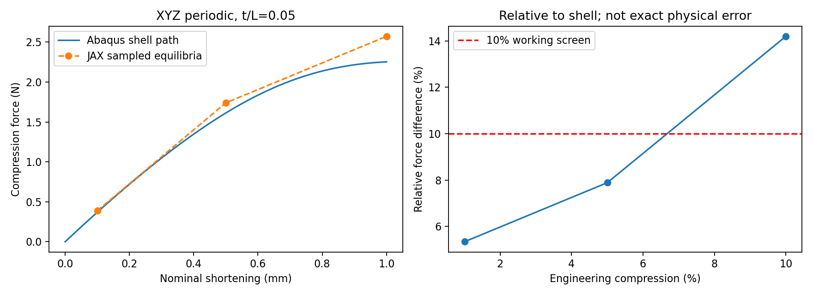

# TPMS背景网格计算：现有证据与大压缩研究判断

**研究进度与方法评估｜2026-10-05**

这份报告替换上一版综合说明，作为理解项目的主阅读入口。它解释研究问题、模型、已有证据、大压缩差异及下一轮四步；逐次运行细节继续保存在冻结实验报告中。正式程序在WSL /home/xuehu/projects/tpms_jax；Windows工作区是阅读副本和历史资料。本文没有新增力学计算。

## 1. 要解决的问题与当前判断

长期目标是：让较薄TPMS在体素/固定背景JAX-FEM中得到可信的压缩响应，并得到有物理意义的梯度，随后服务构型和参数学习、生成及性能驱动逆设计。训练方法不是现在的瓶颈，力学评价的可信性才是。小变形只是起点，最终可能需要20%以上压缩；不能拿均匀体、大厚度结构或小网格导数代替目标薄壁的大压缩证据。

目前已经证明：一个厚度为单胞边长5%的周期薄壁代表，可以在固定背景网格上求解；三向周期的小变形整体响应与壳参考接近；1%和5%压缩通过有限范围的弹性前向初筛，并得到经重新平衡差分核对的厚度梯度。尚未证明：10%及更大压缩的准确性、自接触、塑性压溃、全部TPMS构型或形态梯度。

对大压缩的判断是“有理论与实现基础，值得按机制继续验证”，而不是“已经成功”或“方法不行”。JAX-FEM官方已有显式动力学和第三介质接触示例，相关论文已有大变形、接触和可微设计路线。但我们当前维护的TPMS程序尚未具备这些能力，示例不能直接当成项目验证。换Explicit也不会自动消除几何、薄壁弯曲、软孔隙或材料模型的差异。

当前唯一下一步见 [近期主规划](RESEARCH_PLAN.md)。已完成薄壁四步的原计划已归档；不能从历史停止记录恢复旧网格、边界或训练任务。

## 2. 现在具体算的是什么

### 2.1 几何、厚度与边界

本轮复用了用户diverse_28算例的周期三角中面，作为一个便于独立对照的薄壁代表。其隐式形态为：

G = -3.4 cos(X) cos(Z) + 4.6 sin(X) sin(Y) sin(Z) + 2 = 0。

X、Y、Z是各物理坐标乘2π/L后的无量纲周期坐标，L是单胞边长。它是一般周期隐式中面，不能未经证明称为严格最小曲面或经典Gyroid。中面有9351个壳节点、17986个S3R三角壳单元。原用户参考壳厚0.328595mm；新目标按用户指定采用L=10mm、初始法向厚度t=0.5mm，即t/L=0.05。只复用形态，不照搬旧算例的塑性、压板或摩擦。

现在统一用XYZ三向周期边界，宏观变形梯度F_bar=diag(1,1,1-a)。a是工程压缩量：a=0.10表示单胞轴向长度缩短10%，本例端面相对位移为aL=1mm。三向周期指三对相对面的位移波动周期相配，只有轴向施加压缩；横向宏观应变固定为零。它不是三方向同时压缩，也不是摩擦压板试样。原XY平端与XYZ的差异由用户明确后置，不再作为近期阻塞。

### 2.2 固定背景与Gauss点材料场

当前N=64，即每个方向64个HEX8单元，共262144个单元。单元宽h=L/N=0.15625mm，t/h=3.20。每个单元2×2×2积分，共2097152个真实初始Gauss点。3.2个单元宽只是几何尺度，不保证薄壁弯曲已经充分解析；八点积分改善材料积分，也不能替代位移插值能力。

用周期中面的最近距离d定义恒厚实体，再用光滑占据phi近似界面：

phi = sigmoid((t/2-d)/ell)。

phi接近1为实体，接近0为孔隙，中间是平滑界面。它表示几何占据，不是实际质量密度，更不是异质材料课题。ell是投影尺度，本轮取0.05mm/(2 ln9)，使单个界面的10%至90%过渡宽度为0.05mm。厚度求导保持这个物理宽度固定；不能把改变界面宽度也算成纯厚度变化。

占据在Problem自身实际Gauss坐标求值，单元不是简单以中心判成全实或全空。初始用料体积分数Vf约15.16%，即占据积分占单胞体积的比例。距离、积分覆盖、周期拼接和连接已通过表示初筛；三处局部折面偏置截线厚度偏大约1.05%至1.21%，保留为几何近似风险。中面距离对厚度可微，不自动意味着对任意形态参数全局光滑。

固定背景指设计时参考网格拓扑保持固定。有限变形中节点照常运动，初始占据随参考材料点保持；没有把材料重新投影回原空间或把节点锁死。

### 2.3 当前有限应变材料与软孔隙

基材为均质可压缩Neo-Hookean弹性，初始E=10MPa、泊松比nu=0.3。MPa在本例等于N/mm²。E、nu用于方法对照，不是某个实际打印材料的标定。设F为局部变形梯度、J=det(F)为当前体积除以初始体积：

W_s = mu/2 [J^(-2/3) tr(F^T F)-3] + kappa/2 (J-1)^2。

mu=E/[2(1+nu)]是剪切模量，kappa=E/[3(1-2nu)]是体积模量，W_s是每单位参考体积的弹性应变能。背景网格使用：

W_bg = [eta+(1-eta)phi] W_s，eta=0.0001。

eta是孔隙与实体的刚度比例，即孔隙保留实体刚度的万分之一，避免完全空域导致方程奇异。phi和eta同时决定过渡带及软域的能量和力。孔隙不是物理填充材料；软孔隙会产生数值偏差，大变形时可能严重畸变。不能用提高eta、加厚或调参拟合壳参考来掩盖问题。

目前没有材料塑性、表面接触、摩擦或物理惯性。普通软孔隙能量不是接触定律。本能量的体积项在J趋于零时仍有限；沿各向同性极端压缩，其等体积项也不会提供一般意义上的无限屏障。因此不能从“孔隙里还有材料”推出不会穿透或能够正确传递接触力。

## 3. 已经完成了哪些工作

### 3.1 目标薄壁四步已按限定范围收口

| 步骤 | 回答的问题 | 结果与范围 |
| --- | --- | --- |
| 1：薄壁表示 | 是否确实表示t/L=0.05的薄壁 | 周期、Gauss覆盖及连接初筛通过；不是弯曲精度认证 |
| 2：小变形壳对照 | 固定背景薄壁是否有合理整体刚度和模式 | XYZ周期刚度差4.979%，主要模式一致；原XY平端差41.78%保留为后置问题 |
| 3：分段有限应变 | 哪些压缩点具有初步可信前向 | 1%/5%通过工作初筛；10%求解完成但未接受；20%未提交 |
| 4：有效厚度梯度 | 导数是否包含重新平衡，能否支持性能目标 | 1%/5%总导数及两点损失通过差分；1%壳厚导数同向；不是训练或形态设计完成 |

小变形观察点约0.01%压缩，XYZ刚度JAX为3.962826N/mm、壳为3.774884N/mm。刚度表示位移增加1mm时力的线性变化率，4.979%是两者差值除以壳值。≤10%是当轮继续研究的工作初筛，接近5%更有说服力，但都不是全域精度认证。

有限应变采用同一t=0.5mm、N64、占据、eta、E、nu与XYZ加载：

| 压缩a | JAX正压缩反力Q，N | 壳反力Q，N | 反力相对差 | 物理弹性能相对差 | 判定 |
| --- | --- | --- | --- | --- | --- |
| 1% | 0.389053 | 0.369327 | 5.34% | 5.39% | 初筛通过 |
| 5% | 1.739639 | 1.612465 | 7.89% | 6.54% | 初筛通过 |
| 10% | 2.572357 | 2.252645 | 14.19% | 9.17% | 未接受；不继续到20% |

Q是压缩反力的正幅值，单位牛顿。反力差为abs(Q_JAX-Q_shell)/abs(Q_shell)，不是相对真实试验的误差。物理弹性能是定义本构下的储能；不能与塑性耗散或吸能混用。现有三个观察点也不能称为已经认证的完整连续力-位移曲线。

| 压缩 | 最小Gauss体积比J | 软孔隙能量占比 | 壳参考功/储能质量差 | JAX成功进程时间 |
| --- | --- | --- | --- | --- |
| 1% | 0.968046 | 1.080% | 0.070% | 2.83分钟 |
| 5% | 0.843743 | 1.279% | 0.462% | 4.64分钟 |
| 10% | 0.588114 | 1.809% | 1.294% | 9.07分钟 |

J小于1表示局部体积缩小，例如0.588表示剩下初始体积的58.8%，不是结构宏观压缩58.8%。软孔隙能量占比是phi很低的积分点能量占总量的比例，不是其反力影响的上界。壳质量差比较储能加人工能与外功；10%的1.294%高于当轮透明采用的1%工作门槛。因此不能把壳10%当作已认证真值。

5%壳原0.1%严格功检查未过，一次加载细分后仍约0.46%，反力基本相同。当轮采用≤1%的可行性质量门槛并如实保留原失败；10%没有继续放宽。该质量差本身也不足以解释全部14.19%反力差，必须进一步审查输出定义和参考质量。

成功时间是各次独立进程全程时间，不能相加后声称就是一条优化过的串行曲线成本。用户允许约15分钟的主要尝试，旧100/300秒门槛已不沿用；未到20%是研究判据停止，不是预算证明失败。

### 3.2 梯度已经证明到什么范围

厚度改变后位移会重新平衡，总导数包含这部分变化，不能只在原位移下求材料能量的偏导。

| 压缩点 | dQ/dt，N/mm | 与重新平衡差分的相对差 | 厚度增加1%的局部力变化 | 独立壳厚导数 |
| --- | --- | --- | --- | --- |
| 1% | 0.979164 | 0.000147% | 约增加1.26% | 同向、幅值差5.339% |
| 5% | 5.012674 | 0.000202% | 约增加1.44% | 本轮没有另算 |

例如1%压缩下，初始厚度增加0.001mm，局部线性预测反力增加约0.000979N。差分通过正负厚度扰动、重新解平衡得到；很小的数值差只认证该离散模型的导数，不会消除前向与壳的5%至8%差异。

固定原位移的偏导分别漏掉约20%和30%的总导数贡献。两点反力损失取1%、5%两个中心反力的98%为诊断目标，链式导数与差分相差0.003116%。这是性能目标反传证据，没有优化设计、训练网络或证明任意曲线和形态导数。

第4步复用了两个中心解，新增2次伴随、6次成功扰动前向、2次壳分析，3次停止记录保留。伴随进程约109/110秒。最新157项维护检查是上一轮完成的测试，不能当成本次新增测试或科研认证。详情见 [第4步报告](../validation/thin_target_20261004_r5/step4_thickness_a01/README.md)。

### 3.3 更早的工作如何归类

完整均匀体、单元矩阵和同离散问题检查支持基础FEM、周期约束及提取定义；完整均匀体有限应变已通过至20%，不能认证TPMS压溃。同离散对照实际采用用户单元矩阵路线，不能宣称原生USDFLD场已全面认证。二值实体Gyroid及Primitive支持部分小变形整体响应，但薄壁G48裁剪参考未成立，没有力学结果。

前几轮参数输入、数组场、N64专用刚度/用料梯度及已知答案反推是局部基础证据；相近用料示例性能跨度不足，不能直接转入训练。旧中等厚度Gyroid约t/L=0.102至0.125，不代表现在0.05的目标。旧N48有限应变停于预算门槛，N64/半步/独立大变形对照未执行，这个计划已被替换，不能自动恢复。

原始轮次和失败保留在 [文件地图](FILE_MAP.md)所列目录。当前已有40个实际Abaqus分析或矩阵诊断，数据检查另计；次数不是研究质量指标。本次新增JAX求解、伴随、Abaqus作业和维护测试均为零。

## 4. 为什么压缩越大，两者差异越大

先区分三种问题：方程是否解平衡、当前近似是否接近目标结构、目标结构物理机制是否完整。第一项做得好，不自动回答后两项。

10% JAX归一化缩减平衡残差约1.0×10^-12，面反力与平均一阶应力定义的相对差约7.2×10^-10，内部一致性检查通过。这说明Newton确实求到了当前背景弹性模型的平衡；现有证据不支持把14.19%直接归咎于“隐式法没收敛”。但残差再小也不能修复几何或本构误差。

10% JAX与壳的主要位移波动模式相似度约0.99985，面积加权波动位移差约5.20%，总位移差约2.27%。模式接近说明没有明显相反的整体变形；不能证明两者处于同一稳定分支、局部弯矩一致或没有接触。

| 差异来源 | 为什么在大压缩可能放大 | 本项目目前证据与下一步 |
| --- | --- | --- |
| 薄壁几何和弯曲表示 | 壳专门表示薄壁转动/弯曲，HEX8以三维低阶位移和光滑界面近似；曲率、转动与壁内应变增大时偏差可扩大 | 小变形已有约4.98%差；t/h=3.20不是弯曲认证。需看10%局部模式/应变，不先扫网格 |
| 软孔隙大变形 | 极软域容易产生很大的局部畸变，对平衡、约束传递和后续失稳可能有影响 | 10%最小J出现在孔隙，不在实体；能量占比上升。影响量尚未分离 |
| 壳与三维实体的有限应变假设 | 壳的平面应力、厚度变化、积分和三维可压缩本构并非逐点相同 | 初始E/nu及能量形式匹配，但不是严格同一离散问题；须审壳设置 |
| 参考及提取质量 | 人工能、外功、约束反力和帧采样会影响对照 | 10%壳功质量差1.294%未过；不能把壳值直接认定真值 |
| 失稳与分支 | 屈曲后小的几何/离散差可能改变临界点与路径，静态方法和动态过程也可能选不同分支 | 未做稳定谱或分支认证；现有主要模式接近，不能据此断言已经屈曲 |
| 自接触、塑性 | 壁靠拢后接触支撑改变刚度；真实材料屈服改变平台和耗能 | 当前两模型都没有。它们是未来大压缩的机制缺口，不能无证据解释当前全部差异 |

10%时，phi≥0.95的实体积分点最小J约0.920，过渡区约0.860，低占据孔隙约0.588。因此“最小J=0.588”不等于实体严重塌缩，也没有出现已记录的负J。但J>0只保证局部方向未翻转，不保证不同壁面在全局上未相交；需要周期实体间隙和壁厚层面的几何检查。

合理判断是：已有的薄壁离散差可能随弯曲放大，软域畸变值得排查，壳参考本身也尚有质量疑点；分支和接触仍未知。现在没有足够证据对每项分配百分比。应先利用保存状态排查，不通过无限加密、增大eta或随意稳定化把曲线凑近。

## 5. 上一轮用了什么方法，它准确吗

JAX使用非线性静力平衡：每个加载增量用Newton迭代，根据切线刚度求位移校正，稀疏线性系统由PETSc GMRES/GAMG处理。其目标是内外力平衡，没有物理质量、加速度或冲击过程。

Abaqus参考使用Standard中的Static步骤，开启nlgeom=YES，即几何非线性隐式静力，不是Explicit。实际三个INP均有Static步骤，没有Dynamic, Explicit或质量密度定义。壳采用S3R与匹配Neo-Hookean参数C10=1.923076923MPa、D1=0.24MPa^-1。

这种方法对稳定、准静态弹性响应是合理的，1%/5%的结果提供了限定证据。失稳附近可能需要更小加载增量、弧长/路径方法、隐式动力或显式动力；它们处理的是路径与求解问题。弧长法可跟踪部分不稳定平衡支路，但不自动等于真实动态跳跃过程。不能说Static天然不准确或Explicit天然更准确。参见 [Abaqus后屈曲说明](https://docs.software.vt.edu/abaqusv2025/English/SIMACAEANLRefMap/simaanl-c-postbuckling.htm)。

用户旧F盘模型确实用Explicit，但还包含另一套材料、塑性、摩擦压板、自接触及XY周期。旧基材E=484MPa、nu=0.4、初始屈服约8MPa。历史保存能量表在约5%/10%/20%时塑性耗散占内能约45%/62%/77%，提示旧曲线已经是明显塑性问题；这里只复核了历史表，不是重新审查旧ODB或认证其准静态质量。因此不能直接拿旧曲线与现在纯弹性XYZ单胞比较，也不能把两者差别仅说成求解算法不同。

## 6. JAX-FEM能不能用Explicit

### 6.1 答案是能，但当前TPMS还没有接入

JAX-FEM官方仓库已有explicit_dynamics三维弹性波示例，用HEX8、集中质量和中央差分推进，文档对照解析波传播解。另有third_medium_contact二维接触示例。这次已读取官方示例和本机源码，但没有运行示例或据此认证TPMS。官方资料见 [显式动力学示例](https://github.com/deepmodeling/jax-fem/tree/main/applications/explicit_dynamics)及 [高级示例索引](https://deepmodeling.github.io/jax-fem/advanced/adv_main.html)。

显式动力学的基本方程是：

M u_ddot + C u_dot + f_int(u) = f_ext。

M为质量矩阵，u_dot和u_ddot是速度、加速度，C代表所选阻尼，f_int是材料与接触内力，f_ext是外力。集中质量把质量分配到节点，使求加速度不需要每步求解全局刚度方程；中央差分用相邻时刻速度和位移更新。有限元积分和内力仍可复用，不需要重写一套FEM。

显式法没有每一步Newton平衡迭代，适合强烈屈曲、快速跳跃和接触传播，但受到稳定时间步约束。无阻尼线性系统的临界步约为2/最高角频率，工程上常与最小单元尺度除以波速相关。大量小时间步可能比静力还贵；大变形、接触刚度和阻尼会改变限制。官方波示例的时间步选择不能直接用于非线性薄壁。见 [Abaqus Explicit理论](https://docs.software.vt.edu/abaqusv2025/English/SIMACAETHERefMap/simathe-c-expdynamic.htm)。

当前安装的JAX-FEM 0.0.12常用入口仍是静力求解及相关方法，官方Explicit是独立示例式时间推进。其演示为规则三维小应变弹性波、简单边界，未覆盖本项目的Neo-Hookean、XYZ周期、自接触、塑性及大路径梯度。示例保存整个时间位移和所有时刻Gauss应变，不能直接搬到本项目209万积分点；实际需要控制输出并考虑反向检查点和重算，而不是先造庞大训练框架。

安装源码里的dynamic_relax_solve是以人工质量和阻尼找静态平衡的动态松弛，不能与物理Explicit混为一谈；源码还明确周期约束未覆盖，不能直接打开开关用于当前XYZ模型。官方示例代码也不是项目的现成命令选项。

### 6.2 当前XYZ和软域需要哪些最低限度处理

显式计算要新增真实质量密度rho_m及单位、加载持续时间、幅值和稳定时间步。phi不是rho_m。若孔隙有刚度但质量为零，显式加速度可能不合理；若给孔隙过多质量，会改变惯性和波传播。刚度/质量的插值和正下限须作为独立数值选择验证，不能把静力eta照抄后默认可信。

XYZ约束可写为u=g(time)+Pq：g是随加载变化的宏观仿射位移，P把周期等价自由度展开，q是独立波动自由度。动态缩减需要M_r=P^T M P，并保留宏观加速度产生的项P^T M g_ddot。当前一对一周期归并可利用类内集中质量求和，但必须正确约束速度和加速度，不能在全节点独立更新后简单复制边界位移。

Abaqus Explicit可以使用机械Equation约束，控制节点位移需配加载幅值；其约束反力提取也须设计清楚，因为方程约束力并非都体现在普通RF求和中。动态时“平均材料应力等于静力面反力”不能不加惯性项直接照用。见 [Abaqus方程约束说明](https://docs.software.vt.edu/abaqusv2025/English/SIMACAECSTRefMap/simacst-c-equation.htm)。

### 6.3 用Explicit做准静态，怎样证明不是惯性假象

若研究目标是慢压缩曲线，Explicit只是求解工具，需要证明惯性足够小；若研究真实冲击，则必须匹配实际密度和加载速度，不能追求同一准静态曲线。两者先分清。

建议采用平滑加载，检查主要加载过程中动能ALLKE相对内能ALLIE、完整外功/能量平衡、人工/黏性能量、接触穿透和约束力。Abaqus指南给出大部分过程中动能通常低于内能5%至10%的经验要求；项目可先用5%作为工作目标。初始内能接近零时比值无意义，屈曲瞬间也可能出现短时峰值，须解释完整过程，不能只看终点或删除尖峰。见 [准静态能量判断](https://docs.software.vt.edu/abaqusv2025/English/SIMACAEGSARefMap/simagsa-c-qsienergybal.htm)。

还应在一个关键区间将加载时间延长一倍，比较代表反力与压缩功，暂定变化≤2%作为速率敏感性工作门槛，同时复核能量及变形。5%和2%均不是普适精度标准。质量缩放可以增加稳定步，但改变惯性；强阻尼可能压低动能却改变路径。二者必须记录和验证，不能用低动能一个指标掩盖曲线变化。参见 [准静态速度与质量缩放](https://docs.software.vt.edu/abaqusv2025/English/SIMACAEGSARefMap/simagsa-c-qsimetspeedanal.htm)。

## 7. 屈曲、接触、塑性分别怎么处理

### 7.1 屈曲不是加一个Explicit开关就全部解决

大转动和有限应变已在当前弹性方程中；是否进入屈曲要看平衡稳定性和变形分支。稳定段继续静力是合理的。存在失稳跳跃时，可以选择适当路径跟踪或动力方法；Explicit较容易跨过跳跃，但得到的状态依赖加载速率、阻尼、缺陷和惯性，须与目标试验/准静态定义一致。

单胞周期只允许与单胞重复一致的模式，可能抑制长波屈曲。若后续证据发现此限制影响目标响应，再考虑多胞或缺陷；不现在自动增加大模型。即便使用多胞也不能重新引入未经授权的压板边界比较。

### 7.2 自接触需要真实接触模型或经过验证的第三介质

普通软孔隙只近似空域，不等于接触。有两类相关路线：显式表面接触，或者背景网格中的第三介质接触（TMC）。前者需要表面/碰撞、接触约束及导数处理；后者让孔隙中的特殊介质在间隙压缩后传力，并通过专门能量和正则化防止虚域严重畸变。两者都有误差和实现成本，不预先同时搭建两套。

TMC与当前背景方式相容，值得优先评估，但它故意改变虚域在大压缩下的响应，并非单纯提高eta。[Bluhm等的内部接触方法](https://doi.org/10.1007/s00466-021-01974-x)和 [Frederiksen等的自接触优化](https://link.springer.com/article/10.1007/s00466-023-02396-7)说明其可以服务接触后的梯度设计，同时指出虚域正则化、附带力和低阶离散的风险。已有理论不代表当前Neo-Hookean软孔隙已经实现TMC。

官方 [第三介质接触示例](https://github.com/deepmodeling/jax-fem/blob/main/applications/third_medium_contact/example.py)是二维C形问题，使用体积/剪切区别处理和旋转正则化。相关2026年 [旋转正则化论文](https://doi.org/10.1016/j.cma.2026.118801)在本次仅取得摘要并结合示例源码，不是全文审读。源码包含占据阈值硬分组、先前旋转状态及二维设置；把它直接复制成三维、连续形态或全路径伴随会留下导数/历史处理缺口。需要一个简单三维无摩擦接触基准，检查接触前附带力、接触后刚度、穿透、正则化能量及导数，才谈TPMS。

XYZ位移周期并不自动建立跨周期镜像的接触。必须考虑周期相邻胞的壁面，排除本身相邻三角面和周期拼接邻居，按真实壁厚而非中面距离判断间隙。壳接触要有厚度偏置；中面没有交叉不等于实体没有接触。若忽略镜像接触，JAX和Abaqus可能共同漏物理，曲线相近也不可信。

### 7.3 塑性是另一项物理需求

若最后研究可恢复弹性或超弹性大压缩，先处理大变形/屈曲/自接触即可；若目标是金属、PLA等真实压溃和吸能，需要相应塑性/损伤及材料标定。纯弹性曲线下面积是输入功，理想卸载可恢复，不自动等于耗散吸能。

本地Jia/Zhang有限应变弹塑性论文采用路径相关内变量、软域处理及灵敏度，说明此类设计有方法基础，但不能照搬成我们当前材料。[论文DOI](https://doi.org/10.1016/j.cma.2025.118445)含2025，本地正式刊本为CMA449（2026）118445，版本已分别记录。塑性依赖整个加载历史，导数也不能只对最后一个弹性平衡式求导。实际材料需求尚待用户确定，本轮不擅自添加塑性。

## 8. 文献给出了多大的可行性支持

本次核对桌面目录23份PDF的身份与哈希，重点读取6篇的相关力学章节和选定页面；不是声称完整精读全部文献。页面与版本见 [文献路线](PAPER_ROUTE.md)，本机摘录及核对账本在work/large_compression_review_20261005。

| 文献/来源 | 对主线有用的证据 | 不能外推的地方 |
| --- | --- | --- |
| 几何投影非线性拓扑优化 | 背景几何投影可进入非线性FEM，虚域失稳需处理 | 不自动解决薄TPMS弯曲和接触 |
| 周期微结构非线性逆设计 | 周期、非线性平衡与隐式梯度可组合 | 主要二维，使用修改的SVK，不能说与当前Neo-Hookean完全相同 |
| 有限应变弹塑性优化 | 大变形路径、内变量和导数有成熟思路 | 不等于当前程序已具备塑性 |
| 2026体素TPMS吸能研究 | Abaqus Explicit体素结构可到较大压缩并处理接触/塑性 | 删除空体素后只保留实体C3D8R，不是全背景软孔隙；材料/摩擦/密度不同 |
| 2024 TPMS体素/壳比较 | 薄壁仅一两层体素可能有连接和响应偏差，壳有优势 | 不由此否定本例3.2个单元宽，也不能据此认证 |
| F条件数驱动的空域稳定化 | 虚域畸变是可识别问题，有针对性处理 | 条件数指变形梯度F而非全局刚度矩阵；稳定化改变数值模型，需复核偏差 |

特别是 [体素TPMS Explicit论文](https://doi.org/10.3390/ma19183904)报道PLA结构20mm/30mm即约66.7%压缩、接触和塑性，主要阶段动能控制在内能5%以内。这证明体素有限元与大压缩并不矛盾，但该研究只保留实体体素，不能直接认证我们的连续占据和软域方法。[薄壁体素比较](https://doi.org/10.1016/j.ijmecsci.2023.108657)提醒厚度表示仍然是关键。[空域稳定化](https://doi.org/10.1002/nme.7574)提供候选方法，不构成本次自动添加稳定化的理由。

接触与可微也不冲突：[Huang等DiffIPC](https://huangzizhou.github.io/research/diffipc.html)在有限元/接触/时间积分中研究伴随优化，说明接触后设计有技术路径；它属于另一实现平台，不能视为JAX-FEM可直接调用或承诺相同性能。本项目优先复用现有求解器，不为了引用论文先搭多平台系统。

## 9. 能不能做到更小误差，梯度还能发挥优势吗

不能现在承诺20%时≤5%。可以把≤10%作为阶段前向工作目标、≤5%作为后续更有说服力的目标，但必须对同一几何、材料、边界、加载定义和可信参考比较，而且力、功、模式和接触时刻都合理。接近零反力时逐点百分比不稳，应按代表特征力归一化整段曲线，再检查峰值、平台、输入功和机制。若两模型因分支跳跃存在微小位移偏移，须解释临界点，不简单逐点拟合。

可能改善的办法对应不同原因：参考质量问题先修定义和输出；软域畸变选择经过对照的能量/虚域处理；薄壁表示不足才做一个有依据的表示或积分改进；失稳才采用合适路径/时间积分；壁接近才补接触；实际材料屈服才补塑性。没有一个通用参数能保证全部压缩准确。必要时空间表示改进仍不可回避，但不把无休止网格误差扫描作为下一轮主题。

梯度优势在稳定、物理模型可信的区间已成立：隐式伴随可避免对每个参数分别做大量前向。失稳附近切线可能接近奇异，导数变大或分支不唯一；接触开闭、屈曲切换和屈服也可能引入不光滑性。自动微分只能求所选模型和路径的导数，不会自动使其有物理意义。

Explicit时间推进可用JAX追踪，也可设计离散伴随；逆向遍历长路径要处理保存、检查点、内变量和接触事件。若显式法仅用来找到无历史弹性的稳定静态终态，且残差和分支已经验证，可以考虑对终态做静态伴随；若目标是动态反力、时间曲线、接触摩擦或塑性耗散，则需要完整路径导数，不能拿最后状态的弹性伴随冒充。

官方二维TMC示例使用硬阈值和先前旋转状态，不能据此宣称连续占据形态导数或全部加载历史已经正确。下一轮仍先前向，之后只在一个可信较大压缩点/路径验证厚度正负差分，不自动启动训练或构型族优化。

## 10. 下一轮只推进四步

1. 复核现有10%：优先读取已保存场和ODB，查壳外功/人工能/控制反力、局部弯曲和软域畸变、周期壁间隙。区分已证实原因和假设；不扫描网格/eta或改判据凑通过。
2. 建立匹配Abaqus Explicit参考：同中面/t/XYZ/弹性本构，先接回1%/5%，再审10%，质量成立才延至20%。核对密度、幅值、能量、一个关键区间加载时间复核及必要周期接触；不复制旧塑性压板算例。
3. 按机制补最小JAX能力：只选前两步证明需要的表示/虚域处理、XYZ显式积分或接触路径；接触先简单三维基准。保留一套FEM，不同时造多套求解平台。
4. 对照较大压缩前向，再检一项梯度：比较10%/20%的曲线/功/模式/接触；仅在通过区间验证一个厚度总导数或路径损失。未过就保留最后可信范围，训练继续后置。

这些是新规划，状态均为未启动。本次只做资料调查、保存数据审阅、文档和目录整理；没有提交新作业。每步具体输入、验收和停止条件见 [唯一主规划](RESEARCH_PLAN.md)，不提前承诺四步一定完成20%真实塑性压溃。

## 11. 文件在哪里，怎样保持简洁

| 用途 | 位置 |
| --- | --- |
| 正式代码/锁定环境/研究证据 | WSL /home/xuehu/projects/tpms_jax |
| 当前薄壁输入及真实Gauss缓存 | 正式validation/thin_target_20261004_r5/ |
| 小变形XYZ参考与JAX | 上述step2/diagnostic_xyz/ |
| 1%/5%/10%有限应变与保存状态 | 上述step3_xyz/；报告 [第3步](../validation/thin_target_20261004_r5/step3_xyz/README.md) |
| 厚度导数、扰动、损失与停止账本 | 上述step4_thickness_a01/及step4_thickness_a05/；报告 [第4步](../validation/thin_target_20261004_r5/step4_thickness_a01/README.md) |
| 原始Abaqus壳输入/ODB | E:/ABAQUS/2026temp/Abaqus_Work/tpms_jax_abaqus/下thin_target_*独立目录，详见文件地图 |
| 原用户参考，只读 | F:/auto_abaqus/work/para_aly/Fine/T0p02/MS9/diverse_28/ |
| 原M4最终CSV | WSL results/m4_numerical_study.csv，Git忽略 |
| 当前阅读入口 | [背景](RESEARCH_BACKGROUND.md)、[主规划](RESEARCH_PLAN.md)、[状态](RESEARCH_STATUS.md)、[文件地图](FILE_MAP.md) |
| 本次调查与整理收据 | Windows work/large_compression_review_20261005/；正式docs/history/large_compression_review_20261005/ |

具体E盘子路径、输入/结果文件职责与冻结历史索引见文件地图。程序只维护WSL一套；source_at_run是可追溯快照，不是第二套程序。Windows旧work/tpms_jax是历史传输/阅读副本，不能作为正式执行入口。

本次把4个已完成工作目录中的8项Git传输仓库/包集中到history/git_transport/completed_20261005，共112个文件、43778409字节，移动前后哈希相同；没有删除实验输入、结果、日志或源码快照。旧收据里的原路径不改，新organization_receipt.json记录旧新路径映射。

上一版活动文档与PDF保存于本次before_documents，已完成薄壁四步原计划单独归档。当前状态和文件地图精简，完整理论集中到本文，实验细节保留原报告；避免多个规划同时活动。正式源码、锁定环境、安装求解器、旧原始数据及用户文献保持原字节。

版本基线为514b5ed（上一轮第4步）；本次只发布说明、索引和整理收据。提交/远端核实写入本次publication_receipt.json，避免把未发生的新计算或测试写进状态。
