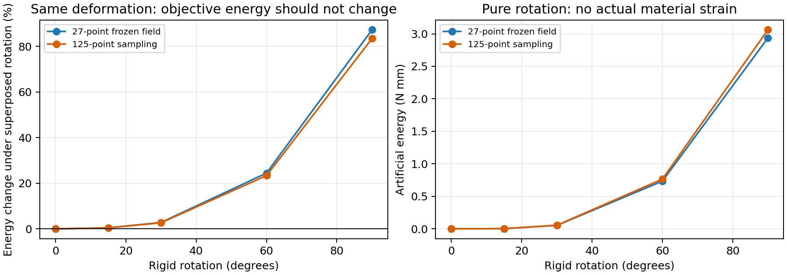

# 虚域能量／应变候选：理论与小核验证

更新2026-10-06。执行唯一主规划第2步的下一项：一个文献候选的理论、材料核和冻结场检查。**未新增完整TPMS压缩路径、Abaqus作业、完整路径AD或训练。候选未采纳，活动材料核已按原字节恢复。** 原积分报告和科学结果保持冻结。

## 研究问题与结论

薄壁之外的软孔隙只是背景网格的数值延拓，不是真实材料。上一轮125点检查发现原20%保存场有3378个负体积采样点，全部位于深孔隙；原全域Neo-Hookean公式在那里无定义。因此，本轮检验是否可以保留真实壁的材料和小变形刚度，同时使虚域材料求值合理。

**本轮找到了一项明确收益和一项实质局限。** 候选在这份125点保存场上，所有材料求值映射均为正，最小映射体积比0.278；公式、局部导数与原回归共16项检查通过。但候选能量在同一变形场叠加整体转动后变化，60°时增加约23%至24%，90°时增加约83%至87%。这说明不能把它直接作为可信的通用改进，也不能仅凭“没有NaN、梯度能算”接受。

这些百分比是**同一状态下的材料转动诊断**，不是与Abaqus的反力误差，也不是新压缩曲线。它们没有证明当前固定XYZ路径必然产生同样大小的误差，没有证明原约9.4%反力差或20%AD失败的唯一原因，更不否定固定背景研究路线的整体可行性。

## 候选怎样处理软域

保持diverse_28、L=10mm、t=0.5mm、原占据场φ、η=1e-4、界面宽0.05mm、E=10MPa、ν=0.3和XYZ边界不变。复用原HEX27 N32快路径的终点位移，不重新求解或变更质量。

采用一个Wang型候选：

`s = η + (1−η)φ`

`F_m = I + γ(φ)(F−I)`

`W_candidate = s [ W_NH(F_m) + (1−γ²) W_linear(ε) ]`

其中F是由节点位移得到的真实变形梯度；I为单位阵；ε是`(F−I)`的对称部分。`W_linear = μ ε_dev:ε_dev + κ/2 (tr ε)²`是原NH在单位阵附近的二次能量。γ是平滑开关，φ=0时γ=0、φ=1时γ=1；使用文献常用的βγ=500、阈值0.01。它们控制虚域本构切换，不是厚度、几何界面宽度或孔隙模量。

小变形下，NH项提供γ²倍的原二次能量，补偿项提供其余部分，所以初始刚度仍为s倍原刚度。纯实体φ=1时完全恢复原NH；纯虚域φ=0时只使用线性数值延拓。没有夹断真实J或映射J，也没有只求正J子域和。

公式及阈值核对来源为[Wang等2014](https://doi.org/10.1016/j.cma.2014.03.021)的方法与[Zhu等2020作者稿式9–11](https://backend.orbit.dtu.dk/ws/portalfiles/portal/236200354/Manuscript.pdf)。本项目将单元密度方案适配为真实Gauss点占据，并保持现有线性刚度尺度；没有引入文献拓扑优化的SIMP三次惩罚、热学或训练。这是项目候选适配，不能称为原论文对本TPMS的验证。

**`det(F_m)>0`只是候选公式的求值条件，不是实际体积比。** 原来的3378个`det(F)≤0`点依然存在；本轮没有把几何折叠消除。在有真实壁和过渡材料的位置，实际映射有效性仍需另行判断。该插值也不保证对任意变形都能保持映射正定。

## 实际完成的检查

11项候选检查覆盖实体／虚域极限、七个占据值的参考刚度、能量与应力一致性、含γ变化的占据总导数、深虚域反转和转动缺陷；另外5项为原显式积分与XYZ回归。共16项通过，pytest耗时11.63s。转动测试通过的含义是**正确暴露了预期的非零假能量**，不是客观性通过。局部AD与差分一致不认证完整20%路径导数。

随后同一冻结20%位移在27点和125点评估，主体159.28s：

| 冻结状态的采样规则 | 实际J最小值 | 实际J≤0点数 | 候选映射J最小值 | 候选映射J≤0点数 |
| --- | ---: | ---: | ---: | ---: |
| 原27点 | 0.03538 | 0 | 0.51245 | 0 |
| 125点 | −2.07283 | 3378 | 0.27803 | 0 |

125点中实际负J点最大φ约0.0001501，即均为很弱的虚域。候选全域能量在那里有定义；原NH的125点全域能量／内力仍为null，原正J子域诊断没有改写为总响应。

在原27点同一位移上，能量由3.758892变为3.743725N·mm，内力宏观轴向量由−2.006860变为−1.999118N；这只是同状态材料核变化，**不能当成候选重新平衡后的反力改善**。候选125点能量4.066042N·mm也不是真实积分收敛或实体精度认证。

## 为什么大转动检查没有通过

对各点F左乘同一个旋转矩阵Q，会改变整体朝向，保留局部实际伸长；客观的材料能量应满足`W(QF)=W(F)`。原NH满足这一性质，候选的线应变和`I+γ(F−I)`在γ<1时一般不满足。

| 对冻结场叠加整体转角 | 候选27点能量变化 | 候选125点能量变化 |
| --- | ---: | ---: |
| 15° | +0.447% | +0.422% |
| 30° | +2.784% | +2.644% |
| 60° | +24.426% | +23.319% |
| 90° | +87.237% | +83.426% |

即使从无应变状态只做90°整体转动，候选也产生约2.94／3.06N·mm的虚假能量；纯实体极限的能量仍为0。孔隙虽软，但背景中体积大，不能仅由η小就断言全局影响可忽略。薄壁屈曲涉及局部转动，这项局限与研究主线有关；表中整体转角不代表本TPMS所有局部点真实经历该角度。

近期[材料插值比较研究](https://link.springer.com/article/10.1007/s00158-026-04332-8)也讨论了有限应变与小应变混用的转动问题；本轮判断来自上述项目计算，不把文献的其他插值方案或优化结论直接套在本候选上。

## 决定与下一项

不将这个候选纳入活动显式程序，不启动其20%长路径，不用降低η或调切换阈值掩盖转动缺陷。候选曾在共享材料文件中实现并测试，现已恢复原文件SHA256；没有第二套FEM，也没有为未采用方案保留活动求解分支。

下一项只先核对**能剔除刚体转动的虚域延拓**，保留真实壁的原NH。共转思想是可参考的来源：[Dunning 2023](https://link.springer.com/article/10.1007/s00158-023-03712-8)研究的是2D、小应变但大转动的单元，支持原理，不认证当前3D薄壁／NH／JAX实现。先明确三维虚域能量、求值域及导数是否合理，再考虑一个小核候选；不直接把整套真实壁模型换成共转线弹性，也不自动引入SVD、接触、非局部正则化或新求解框架。

HEX20、混合HEX8／HEX27和η诊断继续作为后备，不同时推进。原约10%对壳工程结论仍限原离散模型；20%有效路径梯度未过事实不变。第3至4步等待可信版本，不提前训练。

## 证据与文件位置

正式证据根：`/home/xuehu/projects/tpms_jax/validation/virtual_kernel_20261006_r9`。

| 文件 | 用途 |
| --- | --- |
| input.json、probe_manifest.json | 预设候选、文献、固定输入、环境与哈希 |
| rule_4.json、rule_8.json、result.json | 原场／映射求值域、全域候选能量与转动诊断；非新路径 |
| checks.json、decision.json | 16项测试回执、未采纳判断、未执行项 |
| candidate.patch、check_at_run.py、experiment.py | 候选材料补丁及冻结实验记录，非活动程序 |
| source_before/、source_at_run/ | 修改前和测试时的材料文件原字节；仅本地追溯 |
| evidence_manifest.json、probe.log、rotation_diagnostic.png | 新旧证据哈希、完整日志与图 |

复现核测试可在独立临时检出中，以记录的base commit应用candidate.patch后使用check_at_run.py。冻结experiment.py保留本次原硬编码仓库／证据路径；重放保存场诊断需要把这些路径映射到隔离检出和新输出目录，同时只读引用原场，并记录重放脚本的新哈希。不能直接在当前已恢复的活动核上运行旧探针，也不能覆盖本轮结果。原场、几何、积分报告和Abaqus文件未移动或覆盖。本机材料快照不作为活动源码维护，也不重复上传完整求解器。

Windows执行记录：`work/virtual_kernel_20261006`。最新执行顺序仍仅维护在RESEARCH_PLAN.md。本轮只完成虚域理论／核这一项，没有完成整个四步规划。
