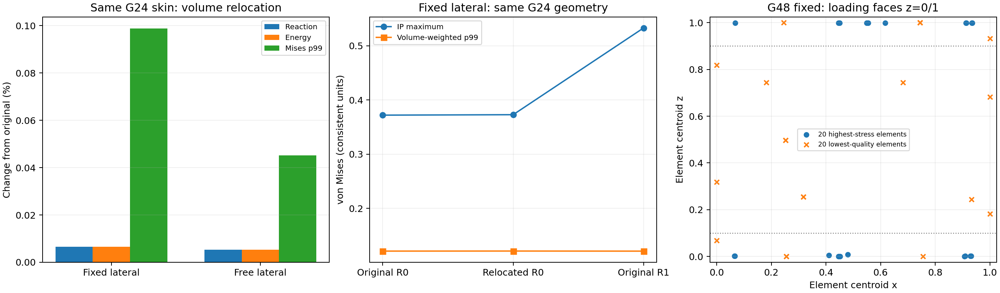

# 同几何体网格质量对整体刚度的影响（2026-10-02）

> 历史阶段记录：以下结果、测试数量及“下一步”保留当时口径。当前状态和后续顺序以 [研究主规划](../../docs/RESEARCH_PLAN.md) 和 [当前状态](../../docs/RESEARCH_STATUS.md) 为准；本次未改动该阶段原始数值证据。

本阶段服务于“正向计算可信 → 梯度验证 → 小规模逆设计”主线。完成六个已有 ODB 的只读诊断，以及两个新的 Abaqus 2026 同几何敏感性作业；预先规定的筛查全部通过。完整回归 **108/108，62.07 s**。正式成功 Abaqus 作业累计由 21 增为 23，datacheck 不重复计数。

## 方法与验收

从实际分析过的 G24R0 网格出发，仅以 Gmsh Relocate3D（10 次迭代）移动内部节点。表面节点坐标、四面体连接关系逐位不变；所有 33,600 个边界三角形保持，周期截面与二次中边节点仍匹配。单元数 67,254、二次节点数 124,403 不变，体积变化 5.55e-17。

复用原来的 INP 生成、datacheck、求解和 ODB 物理验收流程。原生 S/E/IVOL/ALLSE、反力平衡、控制功和周期跳跃全部通过。仅增加只读诊断工具和验证目录中的实验复现/汇总脚本，没有修改 JAX 求解、材料插值或默认周期边界。

在计算前写入 plan.json：反力/能量变化 ≤0.5%，体积加权 von Mises p99 变化 ≤2%，最低质量与 1% 质量分位值必须改善，且全部既有物理验收通过。这些是工作筛查门槛，不是严格误差界或材料标准。

| 横向条件 | 原网格 Fz | 重定位 Fz | 反力变化 | ALLSE 变化 | 应力 p99 变化 |
| --- | ---: | ---: | ---: | ---: | ---: |
| 固定 | -0.019813273102 | -0.019811978564 | 0.006534% | 0.006537% | 0.098810% |
| 自由 | -0.015248234384 | -0.015247433446 | 0.005253% | 0.005258% | 0.045154% |

变化率以原网格结果为分母。最低 mean-ratio 从 0.009543 提高到 0.012108；按单元数量统计的 1% 分位值从 0.030222 提高到 0.037203。Abaqus 畸变单元数从 11,078 降到 10,401，仍有警告，不作“网格质量完全合格”的声明。

## 诊断发现与研究边界

诊断直接读取原生积分点，核对全局张量顺序、单元/IP 标签、接受过的 INP/网格哈希及能量。von Mises 分位值按正 IVOL 加权，以经验累计分布的逆函数定义，不按单元数或节点平滑值统计。Abaqus 原生畸变警告集合的标签数与日志核对一致。

G48 的 q<0.1 单元承担总能量：固定 0.0384%，自由 0.0428%；整个 Abaqus 畸变集合承担固定 1.173%、自由 1.234%。这两组不是同一个集合。小能量占比不能直接推出刚度误差上界；本次实际重定位对照补充了对整体响应的敏感性证据。

| 原始模型 | 固定最大 von Mises | 固定体积加权 p99 | 自由最大 von Mises | 自由体积加权 p99 |
| --- | ---: | ---: | ---: | ---: |
| G24R0 | 0.371903 | 0.121023 | 0.325659 | 0.120838 |
| G24R1，同一几何 | 0.532715 | 0.120961 | 0.459042 | 0.120384 |
| G48R0，新几何 | 0.652698 | 0.120594 | 0.551676 | 0.120543 |

同一 G24 几何加密后，最大应力增长约 43%/41%，高分位值变化很小。记录的应力峰集中在顶底加载截面附近；G24 峰值所在单元也不一定是最差质量单元。因此“消除所有畸变”不是证明局部峰值收敛的充分条件。当前证据提示加载边界附近的应力集中影响，需要另行分析才能判断是否奇异；不宣称已经证明奇异性。

本阶段结论是：**在该 G24 几何与边界下，这次改善体网格质量的扰动对整体刚度影响很小，可继续整体刚度主线。**它没有证明所有网格误差都小于 0.007%，没有证明 G48 局部应力收敛，也没有消除投影与二值之间约 6% 的模型差异。

## 文件与复现

正式代码根目录：/home/xuehu/projects/tpms_jax。

完整新作业包：

~~~text
E:\ABAQUS\2026temp\Abaqus_Work\tpms_jax_abaqus\mesh_quality_20261002
~~~

原始作业包在同一上级目录的 binary_gyroid_20261002，未覆盖。

新包根目录保留两个 INP、expected、mesh、重定位缓存和方法记录；work/ 保留正式/预检查 ODB、DAT/MSG/STA、acceptance/diagnostics；diagnostics/baseline/ 和 diagnostics/relocated/ 分开保留诊断。两项新作业名字与原 G24 工况相同，但目录与 INP 哈希不同，必须按“包目录+工况+哈希”识别。

Git 保留 plan.json、relocation.json、两项新作业的轻量验收与原始运行日志、八项质量诊断、汇总和图。大型 INP/NPZ/ODB/完整 DAT 在本机，source_manifest.json 记录源码和两个新作业原始文件 SHA256（含 ODB）。

WSL 中生成新包，需使用新的输出目录：

~~~bash
cd /home/xuehu/projects/tpms_jax
.pixi/envs/default/bin/python validation/abaqus_mesh_quality/prepare.py \
  --source-package /mnt/e/ABAQUS/2026temp/Abaqus_Work/tpms_jax_abaqus/binary_gyroid_20261002 \
  --output /mnt/e/ABAQUS/2026temp/Abaqus_Work/tpms_jax_abaqus/NEW_QUALITY_FOLDER
~~~

把 run_abaqus_binary.ps1、extract_abaqus_binary.py、extract_uniform_baseline.py 复制到新包的 scripts/ 后，在 Windows PowerShell 运行本地 PS1：

~~~powershell
$pkg = 'E:\ABAQUS\2026temp\Abaqus_Work\tpms_jax_abaqus\NEW_QUALITY_FOLDER'
& (Join-Path $pkg 'scripts\run_abaqus_binary.ps1') -PackageDirectory $pkg -Cases @('binary_gyroid_G24_R0_C3D10_fixed','binary_gyroid_G24_R0_C3D10_relaxed_free') -Cpus 8 -Memory 8gb
~~~

本机 PowerShell 会把 WSL UNC 路径的未签名 PS1 当作远程脚本拦截，因此采用复制到 Windows 本地目录后运行。Python 提取器也使用包内路径。不要直接在 work/ 下寻找不存在的 scripts/。

诊断任一完成工况，可把 abaqus_mesh_quality.py 放在该包的 scripts/ 并运行：

~~~powershell
$pkg = 'E:\ABAQUS\2026temp\Abaqus_Work\tpms_jax_abaqus\mesh_quality_20261002'
& 'E:\ABAQUS\2026\Commands\abaqus.bat' python (Join-Path $pkg 'scripts\abaqus_mesh_quality.py') (Join-Path $pkg 'work\binary_gyroid_G24_R0_C3D10_fixed.odb') --expected (Join-Path $pkg 'binary_gyroid_G24_R0_C3D10_fixed.expected.json') --out (Join-Path $pkg 'diagnostics\relocated\binary_gyroid_G24_R0_C3D10_fixed.quality.json')
~~~

summarize.py 是本阶段固定文件布局的汇总/画图脚本，读取两个已保存的包，不提交作业。参数是 Windows 报告副本的 WSL 访问目录。它没有扩展为多项目配置框架。

## 下一步

本项整体刚度的网格敏感性检查可以关闭。局部最大应力保留为未完成项，不作为当前优化目标。下一批按总计划先补 N48、β20、E_min/E_s=1e-3 的投影参考，与现有 N32 比较，再决定是否需要 N64；之后进行连续设计场的梯度验证。当前不扩展 USDFLD、接触或非线性路线。

体节点重定位使用 [Gmsh 官方 optimize 接口](https://gmsh.info/doc/texinfo/gmsh.html#gmsh_002fmodel_002fmesh_002foptimize)；表面不变、体积不变与周期一致性由本次程序检查和实际作业证明。
