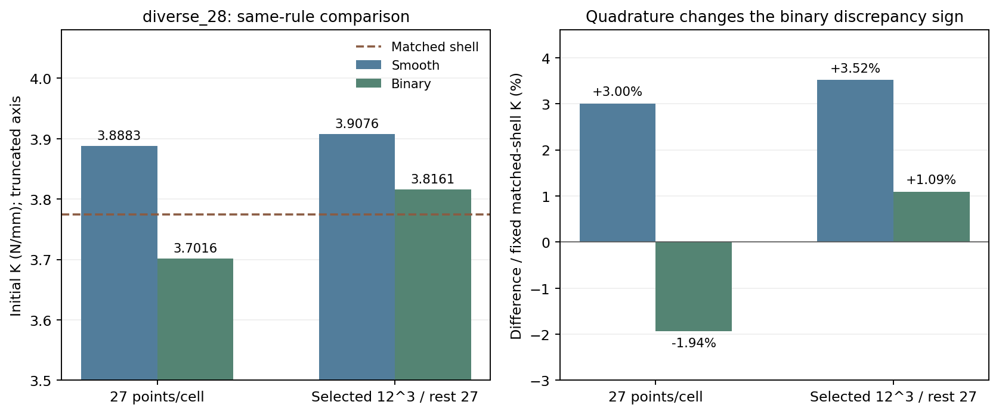
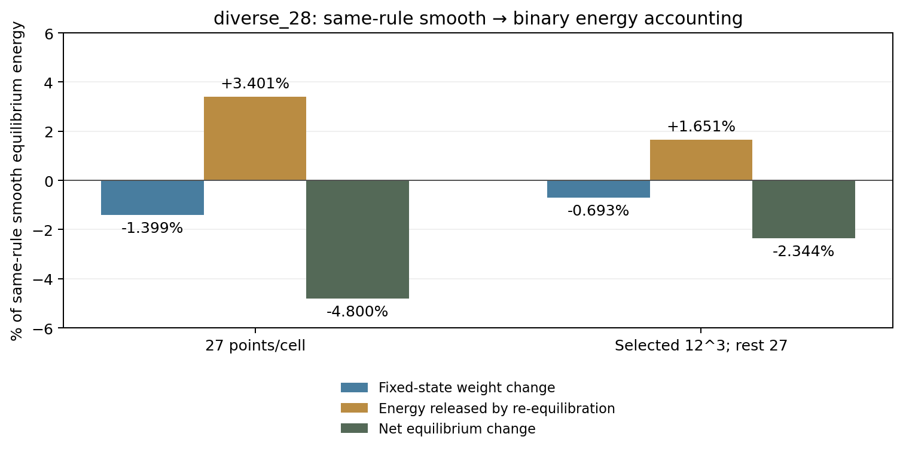

# diverse_28占据复核：影响得到重复验证，生产方法仍保持

2026-10-08，r43。完成原规划第1步，仅研究0.01%宏观压缩下的无惯性初始刚度。新增3次静态平衡，零新增Abaqus作业、20%路径或设计AD。生产程序/参数与原科学字节未改。

## 结果与科研含义

**取消平滑占据过渡，在diverse_28同一部分密积分下使K下降2.3435%；平滑对壳高3.5169%，二值高1.0910%。** diverse_04对应K下降2.1205%，方向和幅度接近。这使“占据场参与初始偏硬”从一个构型的现象变为两个构型的重复证据，但没有认证唯一主因或全域锐界面精度。

配对能量账目进一步表明，diverse_28固定平滑位移只改材料权重使能量下降0.6929%，随后重新平衡释放1.6506%，合计下降2.3435%。diverse_04对应0.6217%与1.4988%。平衡位移的改变大于固定状态净权重改变，支持后续关注位移协调，不能只按总材料量作修正。

## 本轮控制与独立选区

沿用r41已经检查通过的diverse_28 N32平滑状态及匹配壳K=3.7748837447547623N/mm。L10mm、t0.5mm、E10MPa/ν0.3、η1e−4、XYZ周期波动与宏观横向应变0保持。宏观压缩应变0.0001，对应位移幅值0.001mm。这里K单位N/mm，是初始静态切线，不是新的有限压缩曲线。

唯一材料场因素：平滑`φ=1/[1+exp((d−0.25mm)/ℓ)]`换成`φ=1[d≤0.25mm]`，ℓ=0.05mm/(2ln9)。占据取参考Gauss点、仍有η弱孔隙；没有删空单元、改壳或拟合厚度。

启动前按diverse_28自身r41平滑场选区：候选为任一原Gauss点占据在[0.01,0.99]的单元，按其原平滑单元能量降序排列，取覆盖候选能量80%的最小前缀。冻结得到3896/32768单元，覆盖原全能量73.7772%；没有套用diverse_04的1941单元。选区外仍为原27点，未密检查。

## 积分检查与一次配对确认

先独立求原27点二值平衡。随后对保存的平滑/二值两套位移，各自在平滑/二值两场下检查选区8/12点每轴积分。启动前固定：各能量、占据体积与占据距离平方矩的8/12相对差≤1%，分母为12级值；恒定η部分原点复现≤1e−10，原全能量复现≤1e−9。

全部关口通过，最大非恒定项8/12差0.0637401%。原中面补齐后的距离复现误差为0。之后仅做一次同规则配对：选区12³点（每单元1728点）/其余27点，各求平滑、二值平衡。没有追加网格、积分层级或改动判据。

| diverse_28积分规则 | 平滑K/(N/mm) | 二值K/(N/mm) | 平滑对壳 | 二值对壳 | 二值相对同规则平滑 |
| --- | ---: | ---: | ---: | ---: | ---: |
| 全域原27点 | 3.888256 | 3.701633 | +3.0033% | −1.9405% | −4.7996% |
| 自身3896单元12³/其余27点 | 3.907644 | 3.816068 | +3.5169% | +1.0910% | −2.3435% |

对壳分母始终是r41匹配壳K；占据影响的分母是同规则平滑K。这两种百分比不能混成同一误差分摊。

二值从原27点对壳偏软1.94%，变为部分密积分偏硬1.09%，说明积分能改变差异的符号。原27点下降4.80%也明显大于配对后2.34%，因此不应按“最接近壳”的单个值选择方法。8/12检查只覆盖所选区域与保存场，不是新平衡场/全域锐界面收敛证明。

三项新平衡全部通过原共享切线（原27点）、矩阵对称/平移与固定场重构（配对）、真实缩减残差、能量/宏观功及周期检查。最大真实残差约9.98e−11，配对能量/功最差约7.13e−12，周期差为0。仅报告被检查的离散初始状态，不外推全过程。

## 能量账目怎样解释刚度改变

记平滑与二值平衡位移为q_s、q_b，以相同宏观压缩及相同周期空间求得。线性初始能量满足：

`U_b(q_b)−U_s(q_s)=[U_b(q_s)−U_s(q_s)]−[U_b(q_s)−U_b(q_b)]`。

第一项固定q_s、只换材料权重；第二项为二值模型达到自身平衡而释放的能量。释放等于相容差位移的二值弹性能，可独立核查。四个原能量与恒等式关口均通过；配对恒等式相对误差约1.15e−12。

| 相对同规则平滑平衡全能量 | 原27点 | 自身选区12³/其余27点 |
| --- | ---: | ---: |
| 壁内恢复权重增加 | +3.3002% | +3.5188% |
| 去除壁外尾部减少 | −4.6993% | −4.2117% |
| 固定位移净权重影响 | −1.3991% | −0.6929% |
| 重新平衡释放（下行需要相减） | 3.4006% | 1.6506% |
| 最终平衡能量/K变化 | −4.7996% | −2.3435% |

同一微小压缩时U=½Kδ²，所以最后一行也为刚度变化。此分解以平滑状态为起点，依赖分解路径，不是唯一物理归因。不能把0.69%或1.65%当成对壳偏差的百分点，也不能据此命名为桥接、锁死或已识别的局部机制。

## 成本、输入修复与证据位置

阶段内部记录：选区10.47s，原二值46.21s，固定场检查30.47s，平滑配对69.85s，二值配对74.44s，能量账目43.10s，成功阶段合计274.54s（约4.58min）。每个主要尝试均低于900s预算；该合计不含脚本准备、输入适配修复、进程启动、部分文件IO和文档整理，不能当作整轮墙钟。

保留了三项程序准备中断：旧r6缓存缺少中面数组，补用同一r5原归档几何并精确复现距离；路径拼接错误；旧报告字符串替换计数错误。后两项均发生在模型构建/求解前。原日志和旧源码/配置保留，未放宽数值判据，未重试失败的数值求解。

正式目录：`/home/xuehu/projects/tpms_jax/validation/binary_diverse28_20261008_r43/`。`protocol.json`/`PROTOCOL.md`为冻结设计；`selection.json`/`selected_cells.npy`为自身选区；`original27/`、`smooth_mixed12/`、`binary_mixed12/`保存独立状态/关口；`fixed_check.json`保存两级检查；`energy_accounting/`复用r42账目方法；`comparison.json`与`summarize.py`为摘要/作图。中断副本在before_*目录，源文件保护清单及维护收据留本轮目录。大数组/原日志留本机，Git摘要不是完整实验备份。

## 可以推进到哪里

占据影响及位移再分布在两个构型上重复，这是积极进展。剩余二值对壳差依赖构型：diverse_04为4.24%，diverse_28为1.09%；选区也各有范围，不能宣称一个因素解释了全部初始差。

下一进入原规划第2步的机制设计：定位这类位移变化与界面几何的关系，再确定一项保留梯度通道的连续表示/积分改进。具体修正仍未选定，不马上以二值生产，也不调η、厚度、材料或阻尼拟合壳。初始改善成立后才接两构型1–5%短段；20%峰位和完整梯度仍后置。
