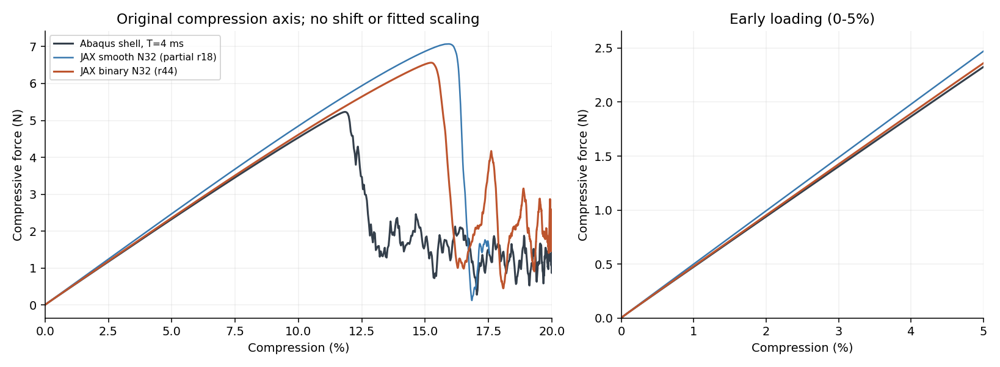
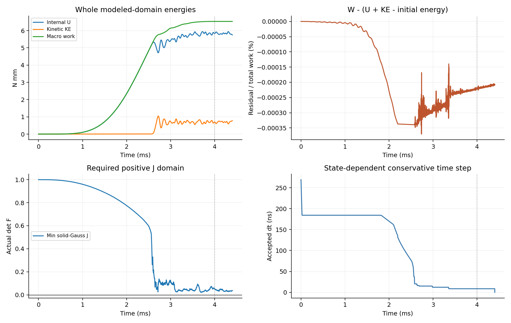

# r44：diverse_04二值完整20%——初始改善，整体差异仍较大

更新2026-10-09。本轮按用户明确要求，完成一次从零的N32二值占据20%压缩及保载。**算完了，但尚未达到与Abaqus壳整体差约10%的目标。** 原平滑模型初始刚度偏硬明显改善；大压缩峰位、曲线和功仍有差异，不能据此直接采用硬二值生产或宣布可以普遍替代Abaqus。

## 做了什么，以及二值的含义

保留diverse_04同中面、单胞边长L=10mm、薄壁厚t=0.5mm、N32背景HEX27、每单元27个Gauss点、NH实体E=10MPa/ν=0.3、η=1e−4、HRZ质量及XYZ周期波动，宏观横向应变为零。HEX27指27节点二次六面体；本例又使用27个体积分点，二者是不同概念。

将参考Gauss点上的平滑占据改为φ=1[d≤t/2]：距离中面不超过0.25mm的点取1，其余取0，边界计入实体。φ附着参考材料点，压缩时不重新按当前空间位置裁切。**二值发生在积分点，而非把整个背景单元删空。** 孔隙仍保留η小刚度与现有objective_void/C²延拓，HRZ质量按新φ重算；不是完全无填料的贴体实体。

原平滑/新二值积分体积分数为0.13251936/0.13275201，相对变化0.1756%；质量变化0.1754%。因此占据改变同时改变了材料权重、质量及有效材料检查域，不能把动力变化拆成单独刚度效应。η、真实厚度、实体模量、加载时长和阻尼均未用于拟合。

加载T=0.004s，以五次平滑函数从0到20%；随后0.0004s保载，最终实际时间0.0044s。从无变形、无应力、零速度开始，无阻尼/质量缩放/接触/塑性。比较原r20同速率壳，不新提交Abaqus作业。本轮零新设计AD。

## 完整路径与计算成本

共193505个时间步、11431条接受状态、0次回退；最终压缩20%，保载全部完成。原进程使用了之前的3小时计时预算，在19.962034%保存完整状态退出；这是预算停止，原failure.json保持，非数值失败。依本次完成优先要求，预留总6小时，并从该检查点的位移、半步速度、物理时间和步长原样接续，未从零重算。

接续标量最大相对差1.462e-16，q/v/time/dt保留，原6833条接受历史逐项保持。后段是同一轨迹的精确检查点延续，不能称短重放拼接或第二次从零成功。原阶段文件24项和原科学文件180项全部按哈希保持。

总UTC经过时间327.49min（5.458h）；两阶段推进计时器合计298.27min，其中状态切线频率上界检查146.72min。原阶段总计时器179.98min，UTC到接续启动约196.52min；两种时钟记录不同，未将差值解释为求解成本或隐去。6小时是按本次完成要求作出的资源预留，时间偏好问题未收到新答复，不声称用户另行批准了6小时。

启动前诊断适配器把常规减步底线从初始步长/16扩到/4096，高动能只记录不触发早停；实际F/J、材料有效性、状态频率界及有限回退仍保留。这些策略变动也会影响能否推进，不能只由本轮成功断言二值单独修好了原失效。生产scripts/thin_target_explicit.py字节不改；仍复用唯一显式入口和共享材料/内力核，不新建求解框架。

## 结果：开头明显改善，降载仍偏晚

下表初始K来自原r30/r40的无惯性静态证据；其余是本轮独立动态路径或明确标注的旧部分路径。压缩力取−Fz为正。

| 指标 | 原平滑N32 | 本轮二值N32 | 匹配壳 | 本轮判断 |
| --- | ---: | ---: | ---: | --- |
| 无惯性初始K / (N/mm) | 4.916455 | 4.719389 | 4.651219 | 对壳+5.7025%降到+1.4656% |
| 1%压缩力 / N | 0.500648 | 0.480482 | 0.474663 | 二值高约1.23%，原高约5.47% |
| 5%压缩力 / N | 2.471316 | 2.360633 | 2.325967 | 二值高约1.49%，原高约6.25% |
| 观察峰的压缩量 | 15.9409%（旧部分路径） | 15.2387% | 11.8241% | 仍晚3.4146个百分点 |
| 观察峰力 / N | 7.072391（旧部分路径） | 6.563870 | 5.229988 | 二值仍高25.5045% |
| 完整0–20%加载功 / (N·mm) | 无完整20% | 6.531181 | 4.658291 | 二值高40.2055% |
| 共同保载窗平均压缩力 / N | 无保载 | 1.951567 | 1.319616 | 二值高47.8890% |

完整0–20%曲线RMS差为1.877385N；在原压缩轴2001个等间隔点上计算，不平移峰位、不平滑或缩放曲线。以启动前冻结的同构型同速率壳峰5.229988N归一化为**35.8966%**；用旧固定峰2.258914N则为83.1101%，两种分母都保留。0–5% RMS为0.019581N，按匹配壳峰为0.3744%；这是全峰归一化量，不是每一点均只差0.3744%。1%/5%处实际相对力差见表。

旧平滑r18只覆盖到17.5363%，未补写20%结果。在0–17.5363%相同窗口，匹配峰归一化曲线差由旧平滑44.5570%降到二值37.3651%。这支持占据表示影响响应，但不能把旧部分路径的指标与本轮完整窗口直接作排名。观察峰是该动态加载段的原始最大反力，不是经认证的静态临界屈曲点。

本轮最终单时刻压缩力1.436065N、壳1.527607N，看起来只差约6%；但保载段有明显振荡，平均差仍47.8890%。因此不能挑一个接近的终点宣布通过。准确范围为1.040814–2.888799N；平均值按时间积分计算。

共同保载窗为[0.004000000000, 0.004399999976]s。原壳时间字段末点比标称4.4ms短约24ps，使用双方共同覆盖区间，不外推或改原时间。原壳报告的−1.346370N是另一个原有均值口径，保留原值；本轮两边均用共同窗的时间积分平均。

## 数值账目与适用限制

全建模域宏观功6.531181N·mm；最终内部能量5.750577、动能0.780617N·mm。最大已采样功—能量残差2.4176e−5N·mm，占总功0.0004%。这证明当前离散模型的推进账目很自洽，不证明真实几何或壳响应一定准确。末态KE/U为13.5746%，保留跳跃后的动能和振荡，不宣布准静态通过；旧壳的能量/惯性/人工能量关口失败仍保持。 壳终态ALLVD=2.197708N·mm、ALLAE=0.548417N·mm，其耗散与人工能量也不能忽略；这轮没有配对去除这些因素，不能由峰后差异认证占据或单元运动学唯一归因。

所有接受状态中的117093个φ=1实体Gauss点实际J为正，最低0.02160070；已接受推进端点dt√R最大1.77863858<2。除最后补齐时间的小步外，最小常规dt为8.6598ns；末步0.1191ns只为准确到达0.0044s，非新畸变触发的步长突降。没有夹断实际F或J。

φ=0虚域的实际J可为负，本轮最低-26.604939，最多36667个负J点；按保留的C²延拓在全F上求值，全部计入建模域总能量，不用正J子域和冒充总能量。原平滑域141282点与二值域117093点不相同，不能说原同一批翻转点已经被修好。有限端点采样也不能证明所有中间时刻有效或全局无自接触；PBC不建立镜像接触。

**积分限制仍重要。** r40原27点二值初始对壳+1.4656%，但同部分密积分后+4.2430%；其同规则平滑→二值K仅下降2.1205%。原27点结果包含积分敏感性。本轮完整动力仍用27点，没有新增全路径密积分检验，不能认证锐界面充分解析。

硬阈值对厚度/形态参数不连续，直接对采样φ作常规AD通常得到零或不可用导数；本轮未计算设计梯度。它是反事实诊断，连续场原路线和既有局部梯度证据保留，原NH完整20%厚度导数符号失败也不改写。

## 本次可以怎样判断

取消过渡使初始偏硬及峰力差减小，是有意义的证据。但初始接近后，壳约11.82%已降载，二值仍继续增载至约15.24%；曲线和功差仍大。因此，约5%的初始偏硬**不能独自解释全部大压缩误差**。在这一个二值离散模型中，显式推进可以完整算到20%并保载；在这个构型上达到与壳约10%整体差的目标尚未实现。

后续回到唯一近期规划的第2项：定位占据相关重新分布及界面几何，再选择一项保留可导性的修正；不按壳曲线调物理参数，也不直接切换硬二值生产。本轮不自动增加案例、密积分长路径、接触、塑性、训练或完整AD。失稳路径与模型运动学差异仍是待区分的问题，不宣称已找到唯一根因。

## 文件、复现及保留事项

正式目录为`/home/xuehu/projects/tpms_jax/validation/binary_full20_20261008_r44/`。协议protocol.json保持初始字节；资源变更在selected_continuation_budget.json。input.json、preparation.json、binary_gauss_field.npz是新输入；缓存由r15 gauss_field.npz的同一reference distance阈值化，仅把rho改为(d≤0.025)，QP/JxW/中面保持。run.py复用生产入口，continue_if_budget.py只等预算停，resume_budget.py只做一次精确接续；有效源码快照及日志均留本机。

full_from_zero/保留首段原failure/最后有效状态；continuation_from_budget/保留完整接受历史、频率界、最终field.npz/result.json。comparison.json、continuity_check.json、两阶段receipt、frozen_before.json及完成保护收据可核查口径和完整性。原failed/预算日志不删除。

两次只读后处理中断分别为旧壳末时刻舍入导致断言、NumPy布尔序列化；原脚本/原因保存在postprocess_attempt01/02，修复读取与输出类型后成功，无求解重试或数值判据放宽。原科学文件、INP/ODB和生产源码不移动。Git只保存精选配方、协议、摘要和图，不是完整大数组/日志备份。Windows output/r44_binary_full20_20261008/提供阅读副本。
