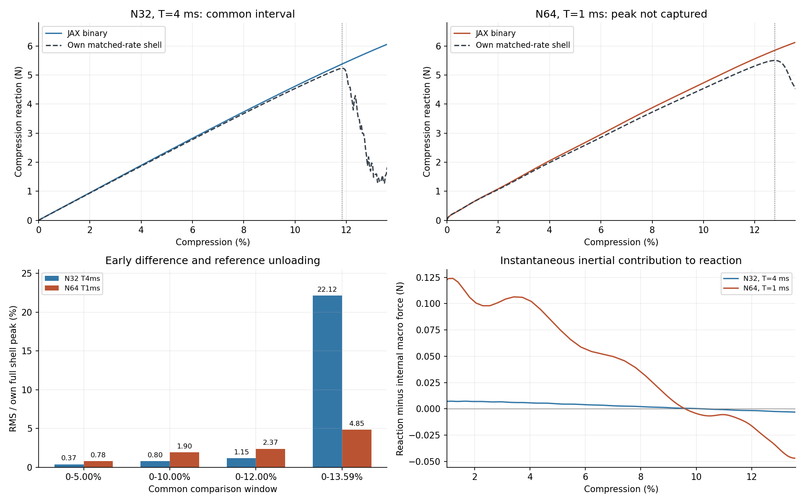

# r46：二值N32/N64复盘——误差口径、动力影响与下一步

2026-10-09。本次只整理文件并读取既有结果，没有新FEM、Abaqus作业、N32试验、N64接续或设计AD。349项原科学/源码/记录哈希保持，生产入口不改。r44完整20%未达原目标、r45预算停止且未捕获峰的事实均保持。

**当前不能概括为“N64反而更不准确”。** 新N64在部分峰前区间与自身壳参照的差较旧N32略大，但在双方共同覆盖的0–13.59%区间，其平均差反而较小。两种现象同时存在；而且两次加载时长不同，不能由此判定加密改善或恶化了空间精度。上一条35.39%是13.59%处的同压缩量力差，r44的25.50%是两个加载峰的力差，它们不是同一指标。

## 先把可比与不可比的量分开

r44是N32、T=4ms，完整压缩20%及0.4ms保载；r45是N64、T=1ms，只到13.5877%，没有峰后或保载。这里T是标称从零压缩到20%的物理加载时长，不是电脑运行时间。r45实际物理时间为0.5982ms，电脑计算与监控为118.38min。

两者都用0.5mm名义厚度、同diverse_04中面、NH E10MPa/ν0.3、η1e−4、HEX27/每单元27点、HRZ及XYZ周期压缩。二值发生在参考Gauss点，孔隙单元和C²延拓仍保留。N64单元边长减半，位移空间、二值几何采样、质量和稳定步长随之改变；T同时缩短四倍。每条背景路径都与自己同T的壳比较，但两个T的路径不是一个纯网格试验。

本次在已知结果后选取0–5%、0–10%、0–12%和共同末端窗口，属于解释口径的只读复盘，不是新的事前验收标准。旧r44/r45窗口、分母和失败标志不修改，也不把部分区间升级为完整20%通过。

上两图用相同压缩轴与相同显示范围，分别展示每条背景曲线和自身同速率壳。N32背景的实际加载峰在显示区间之外，N64峰未捕获；竖线标记各自壳峰。下左是共同窗口平均指标，下右是从原记录直接得到的反力惯性贡献。图不做压缩轴平移、反力缩放或拟合。

## 点差与平均曲线差给出了不同信息

同压缩量点差定义为`[F_background(ε)−F_shell(ε)]/F_shell(ε)`，压缩力取−Fz为正。

| 压缩量 | N32 T4ms对自身壳点差 | N64 T1ms对自身壳点差 |
| --- | ---: | ---: |
| 1% | +1.23% | +0.31% |
| 5% | +1.49% | +3.42% |
| 10% | +1.69% | +4.24% |
| 12% | +7.71% | +4.68% |
| 13.5877% | +231.96% | +35.39% |

在5%和10%处，新N64的偏差确实较大，但约3–4%，不是整体误差恶化的证明。壳发生降载后，两种背景仍在增载；此时壳力减小，点差会很大。13.59%处旧N32背景为6.0557N、旧壳1.8242N，新N64背景6.1237N、新壳4.5231N。两条背景力只相差1.12%，两条壳却处于不同的降载阶段。因此，本次指标变化很大程度上反映了各自参照在哪个动态阶段，不能简单解释为N64峰位已改善或网格没用。

RMS先在同一窗口2001个等间隔压缩点求力差的均方根，单位N，再除以各自完整壳加载峰（T4ms为5.229988N，T1ms为5.498738N）。这是全峰归一化平均量，不是每一点的相对误差。

| 共同覆盖窗口 | N32 RMS/N | N32/自身壳峰 | N64 RMS/N | N64/自身壳峰 |
| --- | ---: | ---: | ---: | ---: |
| 0–5% | 0.01958 | 0.3744% | 0.04270 | 0.7766% |
| 0–10% | 0.04172 | 0.7976% | 0.10469 | 1.9039% |
| 0–12% | 0.06021 | 1.1512% | 0.13054 | 2.3740% |
| 0–13.5877% | 1.15700 | 22.1224% | 0.26650 | 4.8466% |

同末端窗口加载功差为N32 +14.6963%、N64 +5.1674%。功沿原曲线对压缩位移积分，末端仅插值、不外推。JSON同时保留旧固定2.258914N分母：共同末端RMS分别51.2192%和11.7978%，不能选择最有利的分母宣布通过。

旧N32完整0–20% RMS35.8966%、功40.2055%、保载均力47.8890%仍是原结论；不能与N64部分窗口的4.8466%作完整性能排名。N64既没有完整20%，也没有可比的峰力差、完整加载功或保载量。

## 为什么加载时间影响现在的判断

显式求解的是动力平衡，质量乘加速度与材料内力共同决定状态。对同一smoothstep幅值，给定位移的速度随1/T缩放、加速度随1/T²缩放；T从4ms变1ms，对应规定运动的加速度尺度增至16倍。这个推导不意味着实际全部节点加速度或反力恰好乘16，因为周期波动位移和分支也会改变。

生产入口`observables`把材料内力的宏观投影记录为internal_macro_Fz_N，同时将节点完整加速度的惯性投影加入Fz_N。**internal_macro_Fz_N也是动力轨迹当前位移上的内力，不是重新求出的静态平衡解。** 不能把扣除反力惯性后的曲线称为无惯性刚度或准静态路径。

1%处旧N32总压缩力0.48048N、内部宏观力0.47336N，瞬时惯性贡献+0.00712N；新N64对应0.62002、0.49734、+0.12268N。壳总反力也随速率由0.47466变0.61812N。因此，新N64开头总力更高并不能直接证明背景初始刚度更高。N64本次没有新的无惯性初始K；原N32静态K证据仍单独有效。

到13.59%，N64总力6.12371N、内部宏观力6.17063N，瞬时贡献−0.04691N；对壳总力差为1.60061N。直接扣掉这0.04691N不会消除差异。但是，瞬时惯性小或末态KE/U=1.73%也不能排除此前惯性改变了位移与动态失稳分支，更不能认证全过程准静态。

Abaqus官方说明加速显式加载会增强惯性并改变响应；[显式动力分析](https://docs.software.vt.edu/abaqusv2025/English/SIMACAEANLRefMap/simaanl-c-expdynamic.htm)支持这一判断，并不要求把跳跃后的高动能一概当作失败。Liu等[弹性跳跃的延迟分岔研究](https://arxiv.org/abs/2010.07850)说明弹性系统也可能存在速率相关的跳跃位置；其拱模型不能直接量化当前TPMS的峰差。

既有同一壳的加载峰随T4ms/T1ms/T0.25ms分别为11.8241%/12.7867%/5.4701%。这是真实的速率敏感证据，不符合一个简单“越快峰越晚”的统一趋势。过快壳改变动态过程，是r45改回T1ms的原因；T0.25ms不是一条非零N64成功路径。

## 近期实验合起来说明了什么

**占据过渡影响初始响应，已经有两构型证据；它不是全部大压缩差异的解释。** diverse_04原27点平滑静态对壳+5.7025%，二值+1.4656%；同部分密积分为+6.5014%与+4.2430%，二值相对同规则平滑使K下降2.1205%。diverse_28自身部分密积分下对应+3.5169%与+1.0910%，K降2.3435%。r42/r43的能量账目表明，相容位移重新平衡释放大于固定状态净材料权重的改变。不能仅用总体积或过渡层直接储能解释，也不能认证某一连接处是唯一主因。

**较接近壳的粗采样结果可能包含误差抵消。** diverse_04二值从原27点到部分密积分，初始对壳差由1.47%回到4.24%；diverse_28从−1.94%回到+1.09%。所以更多空间信息不保证更贴近壳；它也可能消除原来偏软的采样误差。r45 N64二值体积分数较N32低0.2820%，只说明总体积变化小，不能排除局部有效截面、连接或弯曲分布差别。固定27点/单元也不等于锐界面充分积分。[有限胞综述](https://arxiv.org/abs/1807.01285)将高阶近似与几何积分列为不同组成，不能把单纯增加N当作全部因素同时收敛。

**大压缩的主要剩余问题是路径与降载时机。** r44二值已稳定完成20%及保载，初始接近后仍晚降载，说明需要从“继续修一个统一5%刚度系数”转向检查峰前变形和动态分支。r45小区间接近、峰附近分歧仍在；N64未捕获峰，不能宣称真实峰比N32早或晚。相同材料参数不等于壳与实体具有相同穿厚度运动学。官方[壳单元说明](https://docs.software.vt.edu/abaqusv2025/English/SIMACAEELMRefMap/simaelm-c-shellelem.htm)说明S3R允许横向剪切且有常规壳厚度方向应力假定，并非完整三维实体。壳的质量、转角、人工能量与默认体积黏性也保留；不能把壳当无误差真值。

**二值并未取消软孔隙，也没有解决设计导数。** η及C²虚域仍在，因此二值不能独立排除虚域支撑/运动学耦合。已有r6桥接是指定全部位移的共同保存态，不是独立动力路径；r25近零壳填料只至8.35%失败，未覆盖峰，不能证明填料对峰无影响。现阶段也没有一个独立同离散HEX27 Abaqus路径可以把实现与表示完全分离。

## 原因的优先级与科研可行性

最先消除的是已经确定的比较混杂：窗口、峰/末端口径和加载时间。接下来优先观察薄壁是否在同压缩量下出现不同局部转动、折叠或变形集中，再用一项同速率对照分离网格与时间。几何积分/背景位移空间与实体—壳差别仍有依据，但尚未定位哪一个主导峰错位。软孔隙、质量与数值耗散属于候选，不能通过拟合η、厚度、E或阻尼来消除。

已接受能量账目与实体J检查自洽，降低一般推进失控的优先级；它们不能证明物理响应准确。r45停止来自预算，不是数值失效。虚域折叠保留，不称全域无翻转或无自接触。跳跃后的动能可正常增大，旧准静态/人工能量关口及r17/r18/r21/r22等失败记录保持。

对长期目标的判断仍是：**值得继续，有限前向可行性已有证据，通用薄壁20%近似替代尚未证明。** diverse_28三厚度的完整前向比较在原约10%工作范围内；diverse_04在峰附近与后屈曲仍未过关。没有证据把问题概括为JAX平台不准确，也没有理由承诺任意构型必然能与壳接近。优先研究当前路径/表示问题，比提前训练或继续盲扫网格更合理。

原NH10%/15%厚度总导数通过、20% JVP与FD符号相反；新核局部/短块导数不认证完整20%或形态AD。硬阈值通常给出零/不连续几何导数，不作为最终生产方案。后续改进仍应保留连续参数进入能量、质量和推进的通道，前向可靠之后再验证完整梯度，训练继续后置。

## 下一轮不超过四步（本次不执行新计算）

1. **先用现有变形场定位分歧。** 比较5%、10%、12%保存状态及已有壳ODB的同压缩量帧，将位移映射回同一原中面，观察法向位移、局部转动和变形集中何时分开。只提取已有ODB，不重算壳；不追加r21/r22失败谱迭代，不直接命名“锁死/桥接”。缺少某状态如实注明，不把不同压缩量场当相同。
2. **只做一项同速率N32短对照。** 下一轮执行经用户确认后，取T1ms，与已有N64同厚度/η/材料/质量规则及加载函数。仍规定0→20%的smoothstep，只在共同13.59%左右截断或主峰后观察小段，不把13.59%改成新的加载幅值。这样与旧N32 T4ms比较可诊断速率，与现N64 T1ms比较可诊断已覆盖空间影响。本次不自动恢复先前取消的N32；单次预算和窗口启动前冻结，不接完整20%/保载。
3. **确有需要时才补N64峰。** 若前两步仍需实际N64峰来判别，则使用已保存q、半步速度、物理时间、dt和原质量/几何作精确接续，先验证连接初态。保持T1ms；不从零重算或中途改加载函数。建议新增增量预算最多90min，独立记录，不重置r45原2h账目；峰后0.3个百分点且连续三记录降载10%即保存停止，若预算到则仍保留未捕获结论。该预算是建议，不是本次已获延期。
4. **依据证据只确认或改进一个因素。** 若同速率对照/局部场指向界面截面或积分，先选一项保留可导性的几何/积分改进作短窗口确认；若指向动力/壳模型差别，先作对应一项受控辨别或限定适用范围，不强行改连续场拟合。具体候选尚未选定，不能从本文自动启动参数扫描。改善成立后再另行安排长路径与完整AD。

这四步没有安排更多构型、训练、接触/塑性、通用求解框架或N128。主要目的仍是解释并改进峰附近差异。后续唯一执行入口见RESEARCH_PLAN.md，历史报告的建议不自动形成待办。

## 文件整理与复核位置

正式只读复盘目录：`/home/xuehu/projects/tpms_jax/validation/binary_mesh_reassessment_20261009_r46/`，含精简analyze.py、回顾性protocol.json、comparison.json、一图、保护清单及本报告。Windows阅读为`output/r46_binary_mesh_reassessment_20261009/`。只读提取/绘图每次仅需数秒，不包括资料核对与文档整理；零新增求解成本。

r44/r45输入、接受路径、检查点、原失败、INP/ODB与冻结报告均留原位且哈希保持。r45唯一非零路径仍是peak_N64；full_N64只有旧T0.25ms零态准备。Windows r45阅读目录中的run_shell.py与两份已完成启动日志移至`history/completed_tools_20261009/r45_support/`，移动前后SHA256一致，未删除。生产仍只有WSL仓库一套。

当前入口修改前副本在Windows `history/before_r46_mesh_reassessment_20261009/`和正式`docs/history/before_r46_mesh_reassessment_20261009/`。入口只管导航，状态只报范围，机制说明集中解释，唯一规划只列下一轮四步；原Word/PPT仍为周总结快照。本次核查官方2025公开手册与作者摘要，未冒称逐页阅读全部本地论文或验证Abaqus2026全部实现。
