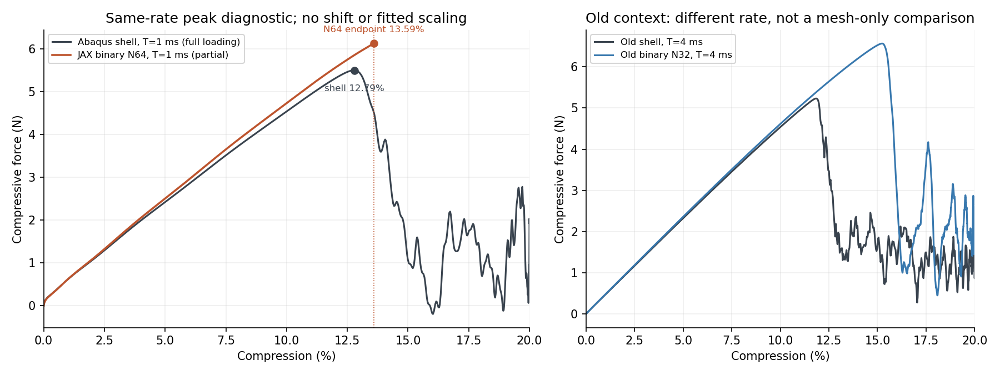
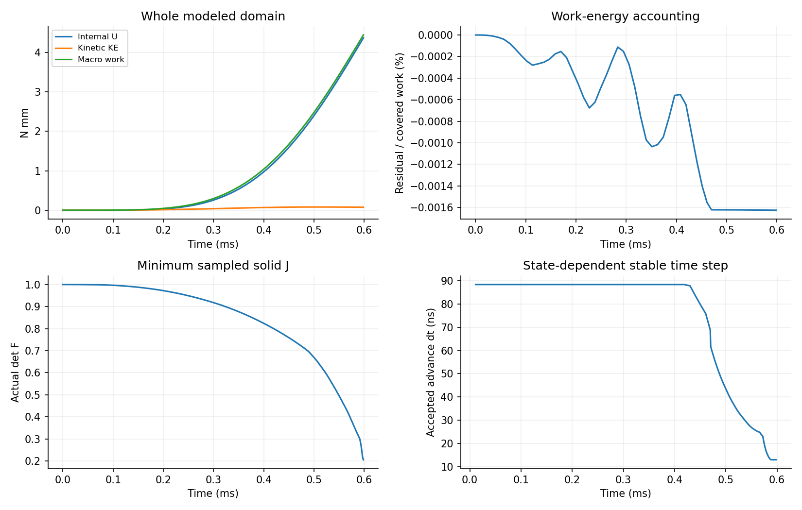

# r45：N64二值峰位诊断——预算内至13.59%，峰值尚未捕获

2026-10-09。本轮仅执行diverse_04的N64诊断。按用户最新要求取消新N32和保载，不要求完整20%，主要观察反力峰与峰后降载。**共同2小时预算结束时，N64达到13.5877%压缩，反力仍在上升；这不是已捕获的峰值。** 计算与监控UTC耗时118.38分钟，未自动延期，没有新增N32或设计梯度计算。

同T=1ms的Abaqus壳在12.7867%达到加载最大力5.4987N，随后降载；N64在13.5877%仍为6.1237N。同一13.5877%压缩处壳为4.5231N，N64高35.39%。因此，这次加密尚未消除已覆盖峰附近的错位；但N64自身峰位未知，也不能据此断言网格无影响或已找到唯一误差来源。

## 为什么做这次试验

r44的二值N32在小压缩时与壳接近，初始无惯性刚度仅高1.4656%，但T=4ms的反力峰仍为15.2387%，对应壳为11.8241%。这说明初始刚度改善不足以解释全部大压缩差异。用户提出加密至N64，检查0.5mm薄壁的空间解析是否影响峰位，并允许缩短加载至1ms或更短以控制成本。

N32的单元边长为10/32=0.3125mm，名义厚度跨约1.6个单元；N64边长为0.15625mm，跨约3.2个。这里的跨单元数是背景空间分辨率的直观尺度，不等于沿任意曲面法线恰好有几个规则单元。HEX27表示27节点二次六面体；每单元27个Gauss体积分点是另一个设置。加密会改变局部几何采样、相容位移与弯曲/失稳的解析，也增加内力、质量及稳定步长评估成本，不能预先保证峰位收敛。

## 实际模型与唯一有效路径

| 项目 | 本次实际设置 |
| --- | --- |
| 几何与名义厚度 | 原diverse_04中面，L=10mm、t=0.5mm |
| 实体材料 | Neo-Hookean，E=10MPa、ν=0.3，实体密度1e−9 tonne/mm³ |
| 背景离散 | N64：262144个HEX27单元、2146689节点、7077888体积分点 |
| 占据 | 各自N64参考Gauss点至周期中面距离d≤0.25mm取φ=1，其余φ=0；不从N32插值 |
| 几何体积分数 | 13.2377687%，由该参考Gauss采样积分得到 |
| 虚域及质量 | η=1e−4与objective_void/C²延拓保留，HRZ集中质量重算；没有删去空隙单元 |
| 边界及加载 | XYZ周期波动、宏观横向应变0；smoothstep目标0→20%，T=0.001s；峰后提前结束，保载取消 |
| 实际接受路径 | peak_N64/，从零开始，10128接受步、340接受记录，0数值回退 |

二值只是取消占据过渡：φ附着在参考材料点，随材料运动，不在每步按变形后距离重新分类。虚域仍是数值近似，不是实际填充材料。实际F及J=det(F)不夹断；二值实体点必须实际J>0，低占据虚域按原全F延拓计算，翻转与其能量均保留。不以仅正J子域之和替代总能量。

仅复用r28已验证的紧凑笛卡尔参考映射存储，保留共享材料/内力、基函数与唯一显式入口。生产程序字节不改。本次没有新增接触、塑性、阻尼或质量缩放，也没有拟合厚度、E、η或密度。硬二值只是诊断，未替换连续占据生产表示，也未用于几何自动微分。

## 加载时长与范围为何发生变化

初始资源探测的128步推进为38.39s、观察0.58s、状态切线界9.64s，初始安全dt约88.45ns。假定该dt及128步检查始终保持的乐观完整加载加保载估计：T1ms约79.41min、T0.5ms约39.70min、T0.25ms约20.26min。后来敏感阶段减步、16步检查使这个估计不再成立。

最初为完整20%及同速率对照预留，选择T0.25ms并计算一个同速率壳。用户随后明确取消N32及完整20%，改为只看峰后；同时T0.25ms壳的动态峰变为5.4701%，相对旧T4ms的11.8241%发生很大变化。因此在旧N64尚无非零接受步时主动中断准备，保留零状态、KeyboardInterrupt和全部源/输入/收据，改用用户原先建议的T1ms。没有将不同时长的变形轨迹拼接，也没有将旧准备中断称为材料或数值方法失效。

T1ms匹配壳保留原S3R网格、材料、密度、周期约束与Abaqus默认体积黏性，仅改INP三处加载时长/输出行。两项壳作业均完成并留在新目录。完整、有限性、目标及周期关口通过；原全程能量漂移、动能及人工能量质量关口仍为false，未改成通过。因此它是同速率动态参照，不是已认证的准静态真值。不同离散/动力积分、实体与壳运动学及虚域等差别仍然存在。

原在线停止定义为观察到加载最大力后推进1个压缩百分点，并且连续三个接受状态至少降载10%。在10.2971%仍处增载、尚未观察峰时，因后期成本增大，将峰后窗口收窄至0.3个百分点，降载10%与连续三行要求保持。该修订只改变用户允许的峰后观察长度，不改T、材料、质量、数值有效性或误差判据。监控进程更换为附着现有求解PID149137，求解器没有重启。最终两种窗口均未被触发，停止来自原共同预算内部保护。

## 曲线结果及正确解读

左图是本次同T1ms的直接对照。N64橙色线只覆盖至13.59%，末端仍在增载，标为endpoint。灰色壳曲线完整覆盖加载，用于显示其12.79%的峰及随后降载。右图仅保留旧T4ms的N32/壳背景，不与新N64作纯网格因果比较。没有平移压缩轴、缩放反力或选取相近终点来宣告通过。

| 压缩量 | N64压缩力/N | 同速率壳压缩力/N | 同压缩量力差，分母为壳 |
| --- | ---: | ---: | ---: |
| 1% | 0.6200 | 0.6181 | +0.31% |
| 5% | 2.5030 | 2.4203 | +3.42% |
| 10% | 4.7297 | 4.5374 | +4.24% |
| 12% | 5.5576 | 5.3093 | +4.68% |
| 13.5877%（N64末端） | 6.1237 | 4.5231 | +35.39% |

峰前增载段接近，壳降载后差异快速变大。这与失稳路径或模式选择的差别相容，但本轮未认证具体模式/唯一机制，不能仅凭曲线归因为虚域或单元类型。

N64已覆盖区间的最大值位于末端。该末端比壳峰压缩量大0.80095个百分点，力比壳整个加载段最大力高11.3658%；**两者都不是N64真实峰与壳峰的差。** N64峰位、峰后形状和峰后误差仍未知。若未来首次峰发生在13.59%之后，它至少不会在本次壳的12.79%附近已出现；不能据此确定最终峰位。

共同0–13.5877%区间，按2001个压缩轴等间隔点计算反力RMS=0.26650N：除以本次壳加载峰5.498738N为4.8466%，除以此前固定峰2.258914N为11.7978%。这是覆盖段平均偏差，不是每一点都在5%内，也不是完整20%通过。双方同覆盖区间加载功分别4.43895与4.22084Nmm，差+5.1674%。没有完整20%/保载指标，不以平均指标掩盖峰附近的35.39%点差。

## 数值推进与成本

最后接受状态物理时间0.5981645ms，压缩13.5877%，总模型内能4.36366Nmm、动能0.0753654Nmm，KE/U=1.7271%。全已采样路径宏观功与全模型内能加动能的最大残差为7.2168e−5Nmm，占覆盖功0.0016258%。这支持已接受离散动力推进的能量账目自洽，不认证真实薄壁响应或静态屈曲点。

936886个φ=1实体Gauss点在接受观察状态实际J为正，最小0.205722，没有实体材料无效点或数值回退。全域最小采样J为−14.8235，末态为−7.51575，最多27103个虚域负J点。虚域折叠按原延拓保留，不能称全模型无翻转；这些有限采样也不能证明全局无自接触或每个中间时刻皆满足更密积分关口。

初始安全dt=88.4545ns，末态保留dt=12.9252ns。原控制器仅减小dt，不自动放大；实际推进时间因此增长。接受端点最大dt√R=1.78929<2，其中R为状态切线行界的s⁻²估计，不是完整谱认证。原有限性、实体J和步长控制保持；高KE记录而不作为跳跃停止条件。最终failure.json记录TimeoutError及“Controlled forward budget stop; not a numerical method failure”，该文件名不意味着材料失效。

| 时间口径 | 本次记录 |
| --- | ---: |
| 共同准备/探测/两项壳/N64/监控 UTC总墙钟 | 118.375min（7102.500s，≤120min） |
| 新N64启动至结束 UTC墙钟 | 103.323min（6199.383s） |
| 求解器body内部计时 | 92.789min（5567.336s） |
| 状态界内部计时，包含于相应内部阶段 | 34.294min（2057.650s），不重复加到总墙钟 |

UTC与内部perf计时器结果分别保留，不将差额未经验证地归因为编译、IO或调度。本表不包含预算停止后文档整理/只读重绘时间。原2h预算没有重新起算或延长。初始资源探测是成本估计，不能代替实际路径成本。

## 这次能说明什么，下一步暂不执行什么

本次证明这套N64二值背景模型能在保留数值有效性控制的条件下稳定推进至13.59%；小压缩及峰前大部分反力与同速率壳比较接近。但壳已经降载时N64仍在增载，峰附近差异尚在，主要目标“测到N64峰并多算一点”未完成。不能据此宣布diverse_04完整20%或通用替代Abaqus通过，也不能将数值稳定等同于物理响应准确。

最新用户取消同速率新N32，旧N32为T4ms，新N64为T1ms；网格与加载速率同时不同，不能分离因果。以后如果仍只关注本次峰位，已有完整q/vhalf/time/dt/N检查点可作为重新设计预算的依据；没有自动接续，原预算停止保持。若改查物理或离散机制，应先用现有数据缩小范围，一次一因素；具体后续作业等用户看结果后再确定。不新增接触/材料/阻尼拟合、形态AD或训练。

原连续场方法、既有diverse_28有限范围20%结果及原失败/梯度范围保持。锐二值有积分敏感性且不提供可直接用于设计的连续几何导数，本轮结果没有解决完整20%有效梯度问题。

## 文件与证据位置

正式目录：`/home/xuehu/projects/tpms_jax/validation/binary_n64_20261009_r45/`。

- `peak_N64/accepted_path.json`、`stability_path.json`、`failure.json`：唯一实际从零T1ms路径与预算停止原记录；`last_valid_field.npz`保存q、vhalf、time、dt、N，可复核，未接续。
- `binary_N64_gauss.npz`、`preparation.json`：自身N64参考Gauss点二值缓存；原坐标/距离/积分权重来源为r28；没有N32空间插值。
- `protocol.json`、`user_steering_02.json`、`peak_followup_resource_revision.json`：原预算、取消N32/保载及峰后窗口修订。模板`input_N64.json`继承旧速率/目标等历史说明，实际时长以protocol及`peak_N64/input.json`/收据为准；保留原输入，不事后改科学字节。
- `full_N64/`：旧T0.25ms准备，仅零状态及主动KeyboardInterrupt，不是第二条非零路径。原零态文件哈希保持。
- `run.py`复用唯一生产显式入口，`run_shell_windows.py`只改原壳时间/输出；`monitor_peak.py`仅附着既有PID、不启动作业；`analyze.py`只读原结果生成JSON及两图。旧取消的顺序启动器留本机，不作当前执行入口。
- `comparison.json`、`completed_evidence.json`、`peak_N64_receipt.json`、`peak_monitor_receipt.json`：比较口径、原文件保护、成本与停止证据。JSON明确记录captured_N64_peak=null，观测最大值是末端，不当作已捕获峰。

原生Abaqus目录：`E:/ABAQUS/2026temp/Abaqus_Work/tpms_jax_abaqus/binary_n64_20261009_r45_shell_T0p001000/`；早期T0.25ms在同根`binary_n64_20261009_r45_shell_T0p000250/`。原INP/ODB留原位，提取副本在正式目录`abaqus/explicit_T*/results/`。Windows阅读副本在`output/r45_binary_n64_20261009/`，不是第二套生产程序。

249项原科学/源码哈希保持，生产显式入口SHA256仍为`56592d903e333d88b31804c9a317106865e64326655a221295a76513f1494967`。Git保存精选配方、协议、摘要及两图；大场、原日志、ODB和重复源快照留本机。当前入口修改前副本位于Windows `history/before_r45_binary_n64_20261009/`及正式`docs/history/before_r45_binary_n64_20261009/`。原Word/PPT仍为周总结快照，本次不重写。
