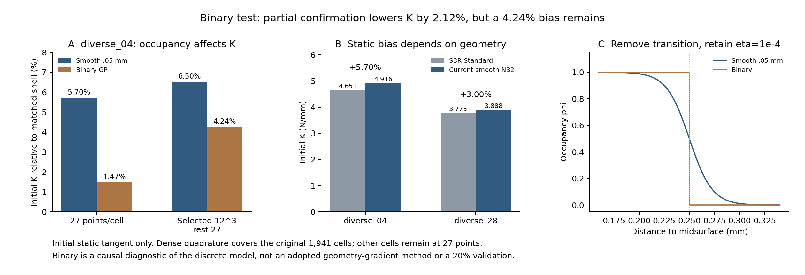

# 取消过渡影响初始刚度，但原27点的“接近壳”受到欠积分影响

2026-10-08，r40–r41。本轮完成用户提出的二值占据诊断，并完成原规划中diverse_28当前N32零态对照。**在diverse_04相同部分密积分条件下，取消sigmoid过渡使刚度降低2.1205%，对壳偏硬由6.5014%降至4.2430%。过渡处理是一个有影响的因素，但尚未解释全部偏差。** 原27点二值对壳仅高1.4656%，这一“接近”具有明显积分敏感性，不能直接作为生产改进。diverse_28当前平滑零态对壳高3.0033%，而非已经证实与diverse_04相同的5.7%。

## 二值试验改变了什么

原占据为 `φ=1/[1+exp((d−t/2)/ℓ)]`，d是参考积分点到周期三角中面的最近距离、t=0.5mm，ℓ=0.05/[2ln(9)]mm。宽度0.05mm指占据由90%降到10%的距离。二值直接改为 `φ=1[d≤0.25mm]`：壁内为1，壁外为0，不再有过渡带。

**二值发生在每个Gauss积分点，不是把整个单元按中心归类。** 一个HEX27背景单元可以同时含实体和孔隙积分点，位移仍由原二次形函数插值。原中面/最近距离、L10mm、N32、单元边长0.3125mm、HEX27、E10MPa/ν0.3、XYZ周期及宏观横向应变零保持。孔隙仍保留η=1e−4弱计算域，没有删除单元或同时降低η。因此检验的是取消占据过渡，不是取消人工孔隙或建立贴体实体。

零态共享材料切线为原三维线弹性张量乘以 `s=η+(1−η)φ`。二值壁内s=1、壁外s=η；过渡区域不再取中间模量。原NH/客观虚域/C²在零态共享同一小应变切线，本轮核对了该切线和全网格内力状态JVP。这里JVP是位移切线，不是设计变量梯度。

施加宏观压缩应变0.0001，即0.01%，对应位移0.001mm。独立求解周期波动的线性平衡，K=|Fz|/0.001mm；质量、阻尼、加载速度不进入方程。这是初始刚度，不是1%、5%或20%路径。直接复用冻结r30/r34算子及共享材料，新增仅为案例适配和后处理，没有第二套生产求解框架。

## 为什么不能只保留原27点的好看结果

先以原每单元27点独立求出二值平衡。随后在r33预先选定的1941个承载单元，对同一个保存位移以每轴8点、12点复积分。选区、规则、容差和分母在启动前固定，没有按本次结果重新挑区域。该区在平滑基准中占全能量约64.6%；它不是全域，也不保证涵盖二值状态所有重要区域。

二值固定场在该区的8/12点能量差0.2926%、占据体积差0.0543%，通过预定1%的部分确认关口。与该区原27点相比，12点复积分增加的能量相当于原二值全能量的15.6024%。**这15.60%不是新刚度误差：位移尚未重新平衡。** 它说明原27点对二值材料分布十分敏感，不能把1.47%的壳差直接解释为物理模型准确。

按冻结条件，只做一次“同1941单元每轴12点、其余仍27点”的二值重新平衡。原平滑r34采用完全相同规则，因而该组比较只改变占据函数。

| 相同积分规则 | 平滑K /(N/mm) | 二值K /(N/mm) | 平滑对壳差 | 二值对壳差 | 二值相对平滑变化 |
| --- | ---: | ---: | ---: | ---: | ---: |
| 全部原27点 | 4.916455 | 4.719389 | +5.7025% | +1.4656% | −4.0083% |
| 原1941单元12³点，其余27点 | 4.953612 | 4.848570 | +6.5014% | +4.2430% | −2.1205% |

共同壳K=4.651219N/mm。“对壳差”为K背景/K壳−1；“占据效应”为同规则K二值/K平滑−1，分母不同。不能将原27点平滑5.70%与部分密积分二值4.24%直接当纯占据效应，也不能分摊为TPMS唯一误差来源。

同部分密积分二值K比原27点二值高2.7373%。原27点材料加权体积从平滑132.6061mm³变为二值132.8387mm³，约增加0.1754%；二值占据体积为132.7520mm³，部分密积分后132.6076mm³。刚度下降不等于总体材料减少，可能涉及承载位置的材料分配、局部位移重平衡和积分共同作用。总体体积不是刚度差的因果分摊。

## diverse_28当前零态补上了什么证据

按原规划第3步，复用当前N32/HEX27/27点的实际Gauss占据缓存，求出diverse_28平滑0.05mm界面的独立初始静力。另做一项匹配Abaqus/Standard壳：保留当前原中面、0.5mm五截面点、S3R、全部2196个平动/转动周期方程和固定节点，将NH改为其精确零态线弹性切线，用小变形一步。

| 当前原27点平滑基准 | 背景K /(N/mm) | 匹配Standard壳K /(N/mm) | 背景对壳差 |
| --- | ---: | ---: | ---: |
| diverse_04，复用r30 | 4.916455 | 4.651219 | +5.7025% |
| diverse_28，新r41 | 3.888256 | 3.774884 | +3.0033% |

新diverse_28壳初始刚度与旧匹配初始壳一致，新增提取核对了全部周期方程；它不是从动态增载段拟合的刚度。两个构型均有无惯性偏硬，幅度不同，**尚未证明共同原因，也没有依据统一乘一个反力修正倍率**。本轮未计算diverse_28二值响应，不能外推diverse_04的占据效应。

## 检查与仍未认证的范围

两项二值平衡和diverse_28平衡通过预定静态关口：真实自由残差约1e−10，功平衡相对差最大9.2e−12，周期波动差为0；共享本构/全网格初始状态JVP及部分密积分矩阵对称、刚体平移、固定场能量重构通过。最大应变低于0.0045，原27点最小J大于0.995。

这些J是原27点检查，不能称全域无翻转或无接触。部分密积分未检查1941选区外的高阶积分，未做锐界面全域收敛。二值/平滑均为距离带实体，壳有自己的截面假定；本轮未认证实体与壳谁是真值，未定位剩余4.24%的主因。r39原轴向相消失败及探索性口径保留，未被本轮通过覆盖。

新壳总能与半功一致性通过，人工能占外功0.2103%；周期平动差最大8.73e−11mm、转角差0。原生输入、DAT/MSG/STA/ODB保持，无修改后重跑。旧大压缩失败、峰位错位和20%设计导数符号失败均保留；初始结果不外推至这些范围。

## 可导性与下一步判断

**用户的猜想有依据：占据过渡是一个可测的影响因素。** 但目前只确定它改变当前离散初始刚度，不能认证全部5%来自连接，或1.47%已是可信锐界面误差。二值原27点积分敏感性更强，必须保留这个风险。

直接对积分点阈值做自动微分，几何参数小幅变化时占据几乎处处不变，越过阈值则跳变，不能得到本项目所需的有效几何梯度。这不等于所有二值几何永远不可求导，形状导数等需要另设方法。当前二值仅作诊断，平滑生产保持；不从壳曲线挑宽度，不调t/E/ν/η或阻尼拟合。

下一项先在diverse_28复核同一占据因素，确认两构型效应是否一致；启动前冻结其自身必要积分诊断，不能照搬diverse_04选区。效应可重复后，再研究一项保留梯度的表示/积分改进；有可靠机制才做两构型1–5%短段。剩余位移近似、距离带与三维/壳差别保留；不重扫圆柱/N64，不提前跑20%或训练。执行只见[唯一规划](../../docs/RESEARCH_PLAN.md)。

## 成本与文件

二值原27点40.69s、固定场复积分1.47s、部分密积分再平衡53.23s；diverse_28背景39.10s，原生壳提交/完成24.63s、提取0.98s。各阶段低于冻结900秒上限，合计约160秒；文档、等待与编排另计。无重试或追加迭代。

正式二值诊断在 `/home/xuehu/projects/tpms_jax/validation/binary_occupancy_20261008_r40/`；代表构型在 `validation/initial_diverse28_20261008_r41/`。原生新壳INP/ODB在 `E:/ABAQUS/2026temp/Abaqus_Work/tpms_jax_abaqus/initial_diverse28_20261008_r41_diverse28/`。原数据不搬迁；Git保存摘要、可复现源码及图，重复壳输入与全节点提取留本机，克隆不是完整实验备份。
