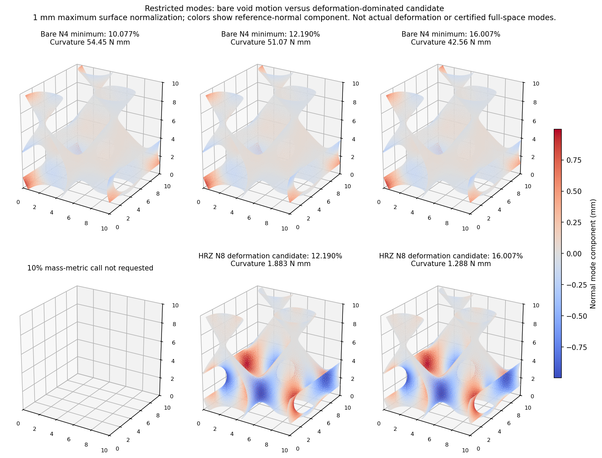

# 周期折叠模式诊断：r21结果与研究判断

2026-10-07。**有进展，但壳与JAX跳跃位置差异的主要原因仍未定位。** 两处保存态各收敛提取了六个零附近模式，并识别出一个变形候选；它尚不是原细网格的临界模式。完整20%跨构型前向、相应精度和完整设计梯度没有因此通过。

## 1. 为什么做这项诊断

长期目标仍是可信薄壁TPMS背景压缩与有效梯度，服务构型/参数学习和逆设计，仿真优先。当前瓶颈是diverse_04的跨构型前向：JAX观察峰15.9409%、7.072N，匹配快壳峰11.8241%、5.230N，相差4.1168个百分点，JAX峰力高约35.23%。r20把壳加载加快10倍，峰只推迟0.4080个百分点，速率不是充分解释。原固定跳跃增量方向的正曲率也不等于检查到了最易折叠方向。

本轮检查有没有遗漏软折叠方向。固定diverse_04中面、L=10mm、t=0.5mm、均匀可压缩NH E=10MPa/ν=0.3、XYZ周期波动及宏观横向应变0；原HEX27 N32/27点、HRZ、η=1e−4、界面0.05mm、objective_void/C²核与实际F/J保持。没有改物理参数或前向网格，没有推进时间、提交Abaqus或求设计梯度。

## 2. 方法与理论边界

在r18动态保存态10.0771%、12.1904%、16.0071%，固定宏观变形H，对完整积分储能U求机械位移切线K。K是二阶能量导数，反映当前很小附加位移的刚度，包含当前变形/应力的影响。共享材料核的位移JVP是机械切线，不是逆设计需要的完整路径设计梯度。

P把周期Q2 N4/N8扰动精确嵌入原N32位移空间，保留原平移固定，分别1533/12285自由度，Kr=PᵀKP。**N4/N8限制的是诊断方向，不是换粗网格重算压缩曲线。** 所有能量仍在原N32完整材料域的真实27点积分；子空间可以漏掉更局部方向，正性不认证原全空间稳定。

先按系数欧氏度量求Kr v=λv：N4三态各六个最低模收敛，但主要是虚域运动；N8三态在限定400次迭代内均未收敛，零收敛模。随后复用Kr与原HRZ质量Mr=PᵀMHRZP，在12.1904%/16.0071%两态求Kr v=λMr v；最小代数值提取因成本中断，没有产出谱。

最后一次提取预先固定σ=0，用移位逆寻找零附近六模，两态均收敛。零目标来自切线奇异的诊断问题，不是按壳峰值挑选。**零附近不等于全局最小代数值，不能排除其他负模。** 广义问题与移位逆排序依据见[SciPy eigsh说明](https://docs.scipy.org/doc/scipy/reference/generated/scipy.sparse.linalg.eigsh.html)。

这些保存态没有静态平衡认证。本轮固定H下的K谱也不是Abaqus载荷倍数屈曲结果，不能直接给静态临界压缩量。[Abaqus屈曲理论](https://docs.software.vt.edu/abaqusv2025/English/SIMACAETHERefMap/simathe-c-eigenbuckling.htm)的推导采用平衡基态及增量载荷，须保持分析范围区别。

## 3. 结果及数字含义

两态前三个零附近模式的整体平移惯性比例为97.00%～99.92%。用原HRZ质量加权平均位移，比较该平均平移的惯性与模式总惯性；原点固定下它们并非严格零能刚体运动，但主要是平移，不能直接叫薄壁折叠。没有证据说明这个分类问题造成了原反力差。

报告全部六模后，按零附近排序选首个变形惯性多于整体平移的模式，两态均为第4个。选择规则不使用壳反力。

| 保存压缩 | λ，s⁻² | 表面最大1mm归一化曲率，N·mm | 平移惯性比例 | 续接虚域曲率份额 | 原N32模式残差 |
| --- | ---: | ---: | ---: | ---: | ---: |
| 12.1904% | 3.2083e+07 | 1.88251 | 1.26% | 6.09% | 0.999822 |
| 16.0071% | 2.1744e+07 | 1.28774 | 2.93% | 8.97% | 0.999883 |

λ是原HRZ质量度量下的机械谱值，动态基态下不直接当成稳定振动频率。曲率是该方向零扰动处的二阶能量变化；正值表示这个方向局部仍有刚度。“表面最大1mm”只是模式归一化，没有真的施加1mm扰动，也不代表原模型的真实位移。

续接虚域份额为深虚域φ≤0.001和混合尾部0.001<φ<0.01的方向曲率之和除以完整域曲率，约6.09%/8.97%；φ是材料占据。它**不是总储能占比、反力误差或虚域造成的误差百分比**。这个方向的曲率以实体核心为主，不能推断虚域解释35%峰力差，也不能推断其对所有临界方向无影响。

候选投影残差约1.4e−11/2.0e−11，说明N8受限问题解得准确；回到原N32自由度，广义模式残差约0.99982/0.99988，仍很大。残差衡量Kδu与λMδu的差，**是模式近似误差，不是前向反力误差**。目前仍是受限候选，不是收敛的原N32模式或真正临界方向。

两候选中面位移的面积加权绝对相关性为0.999894（0表示正交，1表示方向一致，正负号不改变模态物理），形态几乎相同并随压缩软化，曲率约1.883→1.288N·mm。与快壳11.8632%→13.8245%实际折叠增量的相关性仅0.0260/0.0271。壳增量是有限动态变形，并非特征模态；比较不能作同模认证，目前也没有支持已找到双方共同折叠方向的证据。

上排为裸N4最低模，下排为HRZ N8变形候选。模式分别归一化，图中颜色不能直接比较物理刚度。10%未安排质量度量提取。

裸N4保留结果：

| 保存压缩 | 最低裸λ，依赖系数度量 | 占据加权运动比例 | 原细空间欧氏残差 |
| --- | ---: | ---: | ---: |
| 10.0771% | 8.2948e-05 | 0.0026377% | 0.999991 |
| 12.1904% | 8.23659e-05 | 0.0028258% | 0.999991 |
| 16.0071% | 8.12082e-05 | 0.0032747% | 0.999992 |

占据加权运动比例为∫φ|δu|²dV/∫|δu|²dV，很小意味着运动主要在空隙，不是体积分数。它与HRZ平移比例不同；裸λ也不能与质量度量λ直接比较。各模式完整域曲率分项、背景位移及残差保存在原数据，不用正J子域代替完整能量。

## 4. 科研判断及下一行动

本轮识别了模式诊断中的两个障碍：裸刚度排序受虚域软运动影响；质量度量下的零附近模式又需先识别整体平移。得到变形候选后，细空间残差和与壳相关性仍不足。**主要反力差异原因和可迁移修正仍未定位。** 更局部方向可能未被N8表示，是待验证假设，不能直接宣布锁定、虚域支撑或分支触发已经被证实。

diverse_28已有三个厚度完整20%范围保持，支持有限范围替代；diverse_04约10%目标仍未过，不能承诺通用20%替代。本轮没有新增证据推翻整体路线，也没有依据保证所有构型适用。设计梯度仍是独立关口：旧NH20%符号失败保持，机械切线通过不替代完整设计AD；训练后置。

下一项仍属原第3步：只在12.1904%这个已保存态，尝试一次原N32周期位移空间的机械模式细化，以本轮变形候选及残差为起点。执行前另记矩阵自由切线作用、原HRZ/平移固定的处理、整体平移分类、残差门槛、内存与单次成本上限；不直接组装786429阶稠密矩阵，不因未收敛无限重试。先判断是否漏掉更局部的薄壁折叠方向，再决定表示刚度/分支触发的针对性方案。前向网格、材料、占据、质量、PBC保持，不扫η/界面/积分/扰动幅值；不把滤除平移的诊断空间当作改变前向边界。若仍无可信模式，如实收口，不据此宣布全空间稳定或启动第4步。当前未生成或排队这项新计算。

这是原四步第3步内的下一项，不再扩成长规划。第4步所需原因/针对性条件未成立；r18仍只到17.5363%，没有新20%末态或保载，动态KE选项尚未实现。跳跃高动能单独不阻塞动态研究；旧准静态失败和壳人工能量/漂移不确定性保留。

## 5. 成本、失败及核对

| 调用 | 实际耗时 | 结果 |
| --- | ---: | --- |
| CPU准备/机械中断累计 | 1474.60s | 25min边界内停止；复用已完成10% N4 |
| 一次CUDA同算子恢复 | 167.45s | 三态N4完成，三态N8未收敛 |
| HRZ最小代数值调用 | 512.11s | 成本中断，无谱 |
| 最后固定零目标提取 | 33.58s | 两态各六模收敛，无继续谱重试 |

上述机械调用累计2187.73s（36.46min），不是一次前向时间。原CPU25min范围与额外一次CUDA15min范围分别预先记录；后者共用恢复/质量提取剩余预算，不声称全轮仅用25min。材料域解释另约9.28s，分类/绘图为后处理；无新增前向或训练成本。

可选依赖、字段、浮点断言、插值接口和慢收缩问题、中断原件留在attempt目录，没有改写成成功。首次后处理几何断言失败也保留：节点标签一致、三角形集合相同但排列不同，ODB坐标恰为原坐标单精度舍入，最大4.77e−7mm；按标签匹配完成图形，没有放宽物理判据。材料解释出现CUDA大块预分配告警，随后继续分配并以0退出；该次执行没有失败，收据保留告警观察而不重构原stderr日志。

原Gauss/周期映射、Q2嵌入、同核JVP列、切线对称性、直接/投影曲率均有记录；完整CPU/GPU N4矩阵相对差4.45e−15。实现核对不等于精度/稳定性认证。r15～r20共320科学文件和共享核/入口/距离/PBC原字节保持。

## 6. 文件位置及状态

- 正式实验：`/home/xuehu/projects/tpms_jax/validation/critical_mode_20261007_r21/`。原协议/恢复边界在protocol及execution_update；results为六组裸切线记录；physical_metric为零附近六模、分类与候选，physical_metric_attempt01为原中断；analysis为汇总及图。
- Windows阅读：本文件与`output/figures/CRITICAL_MODE_modes.png`；正式镜像docs同名和实验REVIEW。背景/主规划/状态/地图同步r21，历史报告不生成待办。
- 完成调用工具归档`history/completed_tools_20261007/critical_mode_20261007/`，不是第二套FEM或活动入口。科研原件/ODB/论文不移动或删除。
- 当前无运行中/排队作业，零新前向/Abaqus/设计AD，没有提交、推送或合并GitHub。
