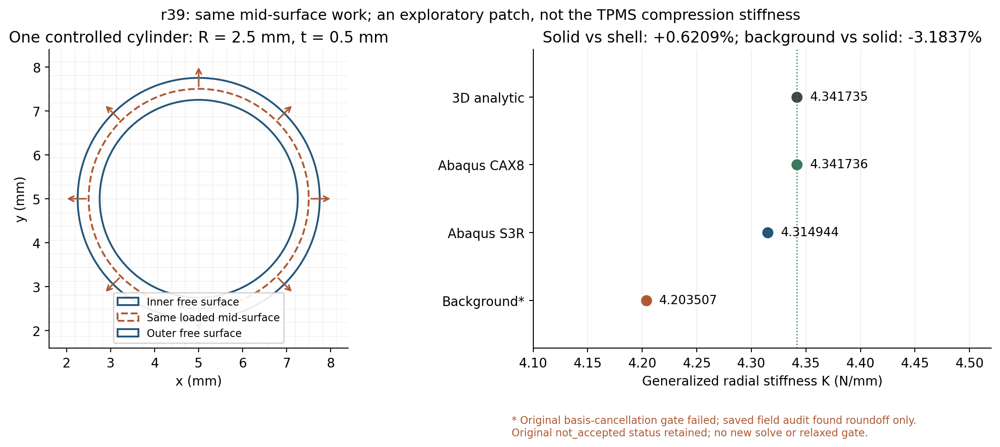

# 简单曲面三方判别：没有重现TPMS的约5%偏硬

2026-10-08，r39。按唯一规划第2步，先设计并冻结一个共同几何、共同载荷做功的圆柱薄壁补片，再执行一个背景解和两个Abaqus/Standard参照。**保形实体比S3R壳高0.6209%；背景保存解反而比实体低3.1837%。这没有找出TPMS的唯一误差来源，但不支持把其5.7025%统一解释为“实体自然比壳更硬”或“背景单元普遍偏硬”。** 背景有一项原检查未通过，独立检查指向舍入相消；原未接受记录保留，以下背景差异仅作有限范围、探索性判读。

## 为什么选这个试验

r36局部兼容模式几乎没有释放能量；r37/r38界面变陡有影响，但同部分密积分仍偏硬5.53%。继续在复杂TPMS中调数值参数，很难区分几何、位移空间和参照理论的影响。规则圆柱只有一个已知曲率，厚度可精确构造，三维弹性还存在独立解析解，适合短而可解释的判别。

共同中面半径R=2.5mm、厚度t=0.5mm、内外半径2.25/2.75mm，轴向代表长度B=0.3125mm。E=10MPa、ν=0.3；这里只用共享Neo-Hookean在零状态的线弹性切线，不做有限变形。t/R=0.2是单一受控诊断值，**不是测得的TPMS曲率比**。背景方框仍10mm、N32、单元边长0.3125mm、HEX27/原27点、η=1e−4、界面宽0.05mm；中面距离为精确圆柱距离，不使用TPMS三角片。

三者都轴向位移为零、其余位移沿轴向不变，即无限圆柱的轴向平面应变。该条件为补片的共同对称简化，不替换TPMS的XYZ周期压缩，也不重新比较其边界方式。

## 相同中面载荷与三维参照

所有模型都在同一个中面r=R向外受载。定义周向总径向广义力F=1e−4N，响应δ是同中面周向平均径向位移，外功为Fδ，K=F/δ。环上各力方向不同，笛卡尔合力为零；F是做功共轭的标量，不能把它理解为整环一个方向的合力。这里K也不是TPMS轴向压缩刚度，二者数值即使接近也不能互相替代。

背景按所有背景单元边界切分解析圆弧，再对中面载荷积分；8/12级力向量相对差4.14e−15。刚体平移和转动无外功，单位仿射径向变形对应F，检查通过。实体和壳使用控制点的等效径向模式与同一F，不在实体内表面和壳中面各自施加不同压力。

三维实体中面受力产生径向应力跳跃。两段解析解为`uᵣ=A±r+B±/r`，`σᵣᵣ=2(λ+μ)A±−2μB±/r²`；λ、μ由E、ν确定。内外自由表面σᵣᵣ=0，中面位移连续，外侧减内侧应力为`−F/(2πRB)`，四个条件决定四个系数。它保留完整三维弹性和环向应变，独立于背景积分与壳假定。**这种中面受力的应力跳跃是诊断载荷特点，与TPMS宏观压缩不同。**

Abaqus保形参照使用4个厚度方向CAX8二次轴对称实体单元；这是轴对称三维弹性的精确问题简化，不是平面应力模型，也不是重新建立完整C3D复杂体网格。[官方说明](https://docs.software.vt.edu/abaqusv2025/English/SIMACAEELMRefMap/simaelm-c-dimension.htm)明确保留径向、轴向和环向应变。

壳为128个周向段、2个轴向条带，共512个S3R。控制点使节点径向位移一致、切向和轴向位移及转动为零；这是本问题的对称径向模式，不能把该约束推广到TPMS。[S3R属于允许横向剪切的通用壳](https://docs.software.vt.edu/abaqusv2025/English/SIMACAEELMRefMap/simaelm-c-shellelem.htm)，本轮没有删除本构剪切或把背景改成平面应力。薄膜公式`K=2πBEt/[(1−ν²)R]`只用作壳合理性参照，不是一般曲面壳的精确解。引用为公开2025文档，实际计算为Abaqus 2026。

## 实际结果及各自分母

| 模型 | 径向广义K /(N/mm) | 结论与范围 |
| --- | --- | --- |
| 三维解析 | 4.341735 | 规则几何/共同中面力的独立连续参照 |
| Abaqus CAX8实体 | 4.341736 | 相对解析+0.0000201%，通过预定0.1%关口 |
| Abaqus S3R壳 | 4.314944 | 相对薄膜公式−0.009981%，通过预定2%合理性关口 |
| 背景保存解 | 4.203507 | 相对实体−3.1837%、相对壳−2.5826%；原检查未全部通过，保留探索性口径 |

实体对壳差为`K实体/K壳−1=+0.6209%`；背景对实体差为`K背景/K实体−1=−3.1837%`。两者分母不同，不把它们简单相加或从TPMS的5.7025%中扣除。背景加权体积2.435237mm³、二值实体2.454369mm³，低0.7795%；体积差不能直接解释全部刚度差，也不能当作误差分摊。

## 检查未通过究竟是什么

背景1024个真实HEX27胞，12675节点。轴向位移不变/Uz=0按列精确约化为8450个xy自由度；材料切线仍由原共享三维应力AD取得，解析一致误差4.44e−15。实际自由残差1.57e−13、规约反力/F约1.27e−14、功平衡和小应变检查通过。没有质量、阻尼或时间推进。

原代码将“约化后基函数轴向梯度相消”的有尺度绝对残差设为≤1e−12。这一门槛设置过严：实际为4.19e−12，而基函数梯度尺度为99.15，相对仅4.23e−14。独立重构同一保存解的实际轴向位移梯度为7.65e−18。证据表明这是舍入相消，而非可见轴向运动；**但原`not_accepted`与失败布尔值不改，未放宽门槛、未重算，也不宣布全部预定检查通过。** 审计仅读取既有场，源码和数字保存；没有用更多迭代或新网格追求通过。

两项Abaqus均完成，控制方程位移差最大1.30e−12mm；功误差2.85e−8/2.61e−9、人工能量均0。输入警告是只参与径向约束的辅助点上施加了无效自由度边界，未影响活跃径向控制；S3R还有本对称模式零弯矩提示。警告和原输入保留，没有修改材料/解控制后重跑。

## 对TPMS追查的意义与下一步

该例说明，有限厚度三维与壳确实能有差别，但本例只有约0.62%，不足以建立“5%都来自三维/壳”的通用解释。背景在本例没有表现出偏硬，结合旧平直膜向补片偏软，也不支持通过一个统一的模量倍率修正所有构型。**这些都是原因范围的限制，不是对原TPMS的归因证明。** 背景的平滑带、软孔隙、原积分和位移空间在这里仍共同作用；正负误差可能抵消，不能凭一个偏软例子排除所有位移近似限制。

圆柱没有TPMS的双曲率、三角片距离带、局部连接和复杂整体变形，且中面加载有应力跳跃。原diverse_04的无惯性5.7025%仍未解释，大压缩峰位和完整20%AD边界保持。下一按原第3步先取得diverse_28当前N32零态刚度及匹配初始壳，判断两构型是否确有共同静态偏差；有机制证据才修正及1–5%复核，不继续扫描圆柱曲率/网格/界面，不立即启动20%或训练。

成本：背景内部计时2.98s；两项Standard求解各9s，包含原生输入处理和收尾的交互时间约21s/20s，另加Python提取及只读审计。明显低于预定900秒计算预算，不把文档编写时间当求解成本。56项启动前冻结文件及旧科学字节均未改变，生产源码保持。

正式程序/协议/解析/结果/审计/图在`/home/xuehu/projects/tpms_jax/validation/curved_patch_20261008_r39/`；原生INP/ODB在`E:/ABAQUS/2026temp/Abaqus_Work/tpms_jax_abaqus/curved_patch_20261008_r39/`。原科学文件不搬迁。执行入口仍见[唯一规划](../../docs/RESEARCH_PLAN.md)。
