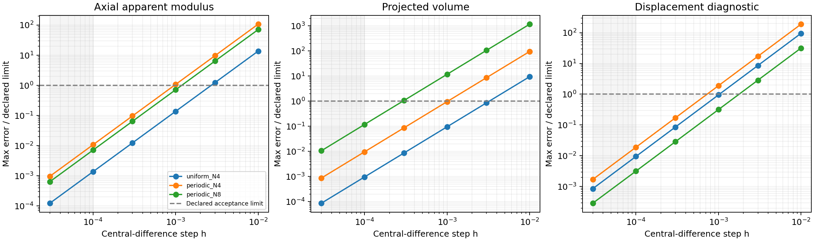

# 固定横向完整离散梯度链验证（2026-10-02）

> 历史阶段记录：以下结果、测试数量及“下一步”保留当时口径。当前状态和后续顺序以 [研究主线与四阶段计划](../../docs/RESEARCH_STATUS.md) 为准；本次未改动该阶段原始数值证据。

三组预设小网格检查全部通过，共 **132 次差分扰动前向求解**；完整回归 **125/125**，耗时 80.18 s。本阶段验证固定横向、小网格、固定 β/E_min 的一阶反向导数，没有进行优化。Abaqus 正式成功作业累计仍为 23。

## 研究主线与参数

在既有同离散 Abaqus 对照、二值整体响应、投影网格及参数检查之后，本阶段检验设计参数 → 真实 Gauss 密度 → 同一 FEM 方程 → 平衡位移 → 目标/体积的完整导数链。父基线为 84548b8c39cfa021dbd9bceae676bb14a08dc4e3。

沿用 E_s=10、ν=0.3、L=1、β=20、E_min/E_s=1e−3、εz=−0.01、线性 E 插值、HEX8 八点全积分、XY 周期及平整顶底加载面。横向固定仍指宏观 εx=εy=0，周期波动场 w 在许可的自由度上求解。网格与约束矩阵不随设计改变。

设计采用四个参数：c(X)=c0+ax·cos(2πx)+ay·cos(2πy)+az·cos(2πz)。这是 Gyroid 的周期水平集半宽场，不是物理壁厚或节点移动。θ=(c0,ax,ay,az)，用 c0>Σ|a| 保证整个单元内半宽为正。密度仍为原 geometry.density，位置仍为该 Problem 的真实 physical_quad_points，体积使用该 Problem 的 JxW。

先检查 N4 的 θ=(0.541062,0,0,0) 对统一 c 的导数；然后在 N4、N8 检查 θ=(0.541062,0.025,−0.02,0.015)，逐个参数方向和一个归一化混合方向。这里没有重新标定体积分数；Vf 随 θ 和离散网格变化，作为独立可导约束量记录。

## 求解与目标定义

新增 design_fem.py 只适配既有 make_density_problem：每个设计对象建立一个普通密度 Problem，将该实例的 set_params 绑定为纯 JAX 的 θ 参数入口，复用实际安装 JAX-FEM 的 ad_wrapper。原材料定律、网格、P_mat、默认 M4 和安装库均未改动。

对缩减方程 PᵀR(Pw_red,θ)=0，安装库的伴随先使用 PᵀKᵀP，再将伴随提升回完整自由度，与材料残差对 θ 的 VJP 相乘。源码指纹记录真实安装版本，而不是仅依据接口名称假设它支持周期约束。

前向和伴随都用此前精度对照采用的直接稀疏 spsolve 路径；前向 tol=1e−12、rel_tol=1e−10。此选择服务于小网格差分精度检查，不能推断大规模直接求解的成本。接口支持固定网格一阶反向微分；没有验证 jit/vmap、二阶导数、变网格形状导数或动态边界约束。

检查三个量：

- Eapp=2U/(V·εz²)，由真实积分能量定义的表观轴向模量。在本单位加载问题中与 Fz/εz 一致。位移控制下最大化 Eapp 等价于提高轴向刚度，不能套用力控制柔度的目标方向。
- Vf=Σ(ρ·JxW)/V，投影体积分数，其导数可用于设计中的体积约束。
- Qw=Σ节点|w|²/(节点数·εz²)，仅为检验完整伴随链的非平稳诊断量，不是优化目标或网格无关的物理量。

只检验平衡能量可能漏掉错误：在固定边界和准确平衡条件下，能量关于自由波动位移的偏导为零，显式材料导数就能给出正确设计导数。因此另核对 Qw；固定 w 时 Qw 对 θ 的显式导数为零，而真实总导数非零，必须经过位移解的伴随链才能通过差分检查。能量导数同时与冻结平衡位移的包络导数核对。

## 预设验收与结果

plan.json 在正式批次前保存模型、方向、停止规则及阈值。中心差分使用六个步长：1e−2、3e−3、1e−3、3e−4、1e−4、3e−5。每个方向、每个输出在最后两个预定步长都必须满足 |FD−AD|≤1e−8+1e−4·|AD|；不在看到结果后挑选步长。粗步长超过导数阈值是截断影响，仍保留其记录；任何扰动的前向物理检查失败则停止整个批次。

| 检查组 | Eapp | Vf | dEapp/dc0 | 最后两步最大误差/门槛 | 扰动前向次数 |
| --- | ---: | ---: | ---: | ---: | ---: |
| uniform_N4 | 3.4437720413 | 0.3396538108 | 6.9597580997 | 0.009524 | 12 |
| periodic_N4 | 3.4315605503 | 0.3382508498 | 7.1290712161 | 0.018966 | 60 |
| periodic_N8 | 2.3816986272 | 0.3511434196 | 6.1760391158 | 0.118513 | 60 |

所有组最后两步都通过。最大误差/门槛为 **0.118513**（门槛为 1）；最大相对差异为 **2.48e-05**，即 0.002480%。图中的误差随差分步长减小呈近二阶下降，与中心差分截断趋势一致。

N8 非均匀周期场的实际一阶导数如下：

| 参数 | dEapp/dθ | dVf/dθ | dQw/dθ |
| --- | ---: | ---: | ---: |
| c0 | 6.17603911581 | 0.687499525769 | -0.013949016908 |
| ax | 0.0317331060334 | -9.15250933682e-05 | -0.0183254604179 |
| ay | 0.00415567686706 | 0.000114151602697 | -0.0292676339733 |
| az | -0.567055963126 | -0.000107310127032 | -0.0131491511074 |

两组非均匀场的四个参数导数均有对应差分；统一 c 组只对 c0 做差分，不把该组其他列的 AD 输出额外计为已验证导数。Qw 梯度范数分别为 0.0104717、0.00917645、0.0394955，超过预设非零门槛 1e−7。

三个模型的统一 c 前向结果与原 M4 在相同直接求解设置下核对，反力和能量均通过 abs≤1e−10+1e−8·|参考值|。包络导数检查、AD 基准值与真实前向值一致性检查通过。伴随残差参数追踪后恢复具体材料状态，再次前向验证可正常复用同一个对象。

基准、统一 c 对照及全部正负扰动沿用原 M4 物理门槛。实测最大缩减残差 7.427e-18、反力平衡差 4.510e-17、反力与宏观应力差 8.674e-17、宏观功差 3.388e-19。八项新增测试覆盖周期性、参数域、原前向一致性、非平稳导数和具体状态恢复。

## 限制与下一阶段

这是每个离散问题的导数正确性证据，不是连续体梯度收敛证明。非均匀场 Eapp 在 N4/N8 为 3.431561/2.381699，粗网格响应明显不同；不能在 N4 优化后直接形成物理结论。此前 β20 均匀参数的 N64 网格结果也不能自动转用于所有新设计场。

本批只验证横向固定。原 solve_lateral_relaxation 中的 NumPy 探针/松弛计算尚未改为可导路径，不能把这里的结果写成自由横向导数也通过。投影体积分数二分标定也尚未可导；如果以后使用每次标定 c 的参数化，需要纳入隐函数链。当前 Vf 直接微分无需经过二分。

下一批先在 N8 验证自由横向的完整链：对设计相关横向响应矩阵及宏观松弛应变求导，差分同时检查松弛应变和位移诊断，避免再次只靠能量包络判断。随后在 N16 做少量代表方向复核，不展开全参数扫描。

通过后开展一个四参数、保持周期性和正半宽、受投影体积约束的小规模逆设计，先研究固定横向表观轴向刚度。优化结果与起始设计必须在相同 β/E_min、边界、体积定义下比较，再用更细网格复算前向响应。只有设计和收益明确后才做必要的二值 Abaqus 对照。局部应力、真实二值极限及论文新颖性均不由本阶段自动证明。

## 文件与复现

WSL 项目：/home/xuehu/projects/tpms_jax。新计算入口 scripts/check_design_gradients.py，新设计适配器 design_fem.py，新测试 tests/test_design_fem.py。正式三组 JSON、每个差分两侧的物理验收、AD 矩阵、计划、控制台、完整测试、图和 SHA256 在 validation/design_gradient_20261002/；Windows 访问路径为 \\wsl.localhost\Ubuntu-24.04\home\xuehu\projects\tpms_jax\validation\design_gradient_20261002。

~~~bash
cd /home/xuehu/projects/tpms_jax
.pixi/envs/default/bin/python scripts/check_design_gradients.py \
  --plan validation/design_gradient_20261002/plan.json --out-dir results/NEW_gradient_check
.pixi/envs/default/bin/python validation/design_gradient_20261002/summarize.py
~~~

计算入口拒绝覆盖已有正式结果，失败保存并停止；汇总程序只读既有结果，重算差分及验收，校验模型/方向/计算源码（当前文件或 Git 历史匹配）和 125 项回归，再生成汇总图及清单，不发起求解。前期 N4 可运行性检查单独保留在 results/design_gradient_smoke.json 和对应控制台，不重复计入三组正式证据。大型 Abaqus 归档位置不变，本轮没有新增 ODB。
