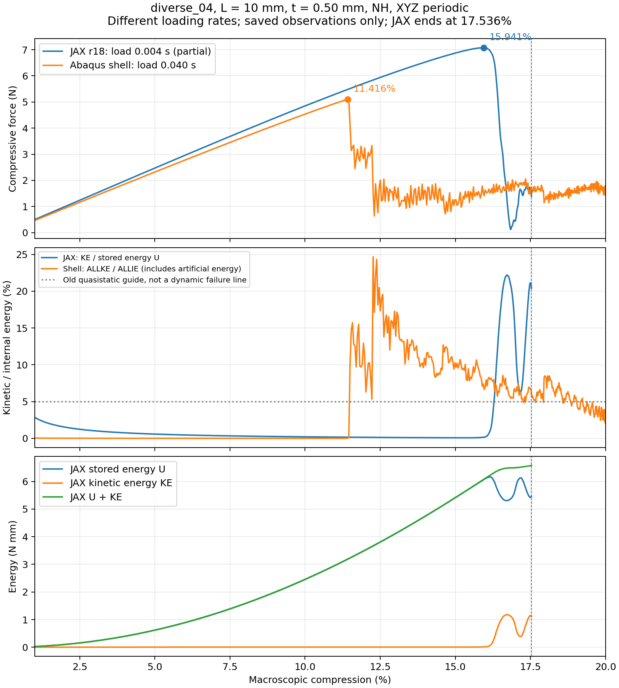

# diverse_04跳跃屈曲：动力学解释、位置差异与科研可行性

更新2026-10-07，r19。本文复用r15～r18记录，补充原作者/官方资料及本地论文阅读；本轮零新JAX前向、零Abaqus作业、零设计AD。实际执行只看[唯一近期规划](../../docs/RESEARCH_PLAN.md)，方法和历史范围见[综合说明](../../docs/TPMS_RESEARCH_REVIEW.md)。

## 1. 当前判断，以及此前需要纠正的侧重点

**跳跃时的高动能可以是正常动力学现象，不应该单凭KE/U超过5%就否定这条科研路线。** 此前把严格准静态门槛放在继续验证之前，限制得过严。用户当前首先要知道背景JAX能否对薄壁TPMS给出有用的压缩响应、能否解释与Abaqus的差异；不要求此刻把跳跃全过程做成静态平衡路径。

我们调整研究用途和下一轮评价范围，保留旧准静态失败。原5%动能/95%加载时长是项目为准静态比较设的门槛，不是所有动力学模拟的通用失败条件。r18仍只到17.5363%，不能因改变评价范围变成完整20%通过。

跳跃区动能升高、反力振荡，可以继续研究；非有限值、真实NH求值域翻转、时间步失控及无解释的数值能量增生，仍需区别。两条曲线都有跳跃支持它们存在失稳后的动力学响应，但还不能证明折叠模式相同或峰值准确。

## 2. 为什么跳跃难算，为什么会振荡

结构在压缩中储存弹性能。当原变形状态失去稳定性，结构可能很快转到另一形态；这段运动释放储能并产生速度。即使加载很慢，实际跳转也可能很快。低耗散弹性模型还会在新形态附近振荡，保载也不保证速度立即变成零。[Abaqus不稳定响应理论](https://docs.software.vt.edu/abaqusv2025/English/SIMACAEANLRefMap/simaanl-c-postbuckling.htm)允许采用含惯性的动力学方法处理失稳；[局部屈曲示例](https://docs.software.vt.edu/abaqusv2025/English/SIMACAEEXARefMap/simaexa-c-unstablestaticplate.htm)说明储能释放可以转成动能。

静态Newton在此处可能难收敛，因为平衡方程的切线接近奇异或存在不稳定分支。显式动力学不必逐步求解全局平衡，可沿实际运动越过跳跃，但仍受稳定时间步限制。Riks追踪的是另一种平衡路径问题，也不能自动解决局部模式选择；当前不因此新建Riks框架。

**必须区分三个位置：**静态稳定性丧失点、动态轨迹观察到的力峰值、快速折叠明显出现的位置。它们未必重合。本文11.416%和15.941%都是保存反力历程中的观察峰值位置，未通过特征模态证明为静态临界应变，也未认证纯snap-through还是分岔屈曲。[Liu、Gomez、Vella的原论文](https://arxiv.org/abs/2010.07850)研究弹性拱的动态延迟：加载速率会改变观察到的跳跃位置，即使材料没有黏性。其几何和线性时间坡道不同于本项目，提供机制依据，不给我们4.5个百分点差异的定量答案。

KE是动能，U是JAX模型的积分储能；KE/U大意味着当前运动中惯性不能忽略，不直接意味着解错误。官方[准静态能量说明](https://docs.software.vt.edu/abaqusv2025/English/SIMACAEGSARefMap/simagsa-c-qsienergybal.htm)中的5%～10%是大部分过程的准静态经验指导。我们本轮先研究动态阶段性可行性；若将未来20%反力用于静态性能学习，再单独检查稳定保载或速率影响。

## 3. 当前记录到底证明了什么

比较对象统一为diverse_04中面、边长10mm、厚0.50mm、均匀可压缩NH E=10MPa/ν=0.3、XYZ周期/宏观横向应变0，无接触/塑性。JAX为HEX27 N32、27点、HRZ、连续占据＋低占据C²虚域；Abaqus为8372节点、15914个S3R壳、5个厚度积分点，壳没有孔隙填料。物理目标相近，离散问题并不相同。

| 观察 | 解释与限制 |
| --- | --- |
| 双方跳跃前约2%～10%的若干观察点力差约6.5%～7%；共同1%点约7.54% | 早期整体响应接近，有前向可行性证据；不是所有时刻最大误差界 |
| 壳峰值约5.098N，在11.416%；JAX受控峰值约7.072N，在15.941% | 两个观察峰相差4.525个百分点，即10mm单胞约0.4525mm压缩行程；峰值力高约38.72%，不是微小差异 |
| r18只减时间步，与旧JAX共同1%、5%、10%、12%、14%、15%六点力最多差0.0101% | 原时间步主要解释后段爆发，不能充分解释更早的分支差异；六点不证明整条曲线完全相同 |
| r18有685个接受端点，至17.5363%；端点监测无未续接NH越界/非有限 | 改进后可以越过明显降载；接受端点不认证内部全过程，也无20%末态 |
| 末端KE/U20.41%，已观察全程功平衡差约0.00246% | 受控运动有良好的已观察能量一致性；能量平衡不是空间精度、正确分支或平衡性质证明 |
| 原壳完成20%及保载，但加载惯性、人工能量、漂移未过旧门槛 | 可作有条件动力学参照，不能自动视为实体真值；解除KE前置门槛没有消除人工能量/漂移不确定性 |

本轮进一步用原接受记录核对JAX峰值15.9409%至停止态17.5363%的变化：储能**减少0.60384 N·mm**，外载继续做功**0.50204 N·mm**，动能**增加1.10587 N·mm**。动能增量基本等于“释放的储能＋外载输入”，闭合差约0.0000095 N·mm。N·mm是能量单位，1 N·mm=0.001 J；不是位移误差。这支持将该段解释为受控的跳跃能量转换，而非没有能量来源的数值爆发；仍不证明折叠模式物理正确。

图上蓝线只到17.536%，虚线标出中止位置，之后没有JAX数据。橙线为原慢壳加载段，不含保载。第二图的JAX分母是U，壳分母是ALLIE，后者含人工能量；两个比值用于各自解释惯性，不能当完全相同的能量定义。第三图的储能下降和动能上升直接显示跳跃能量转换。曲线是保存端点连线，不是内部每步完整观察。

r17原首错为16.0249%处6个未续接NH点翻转，局部正频率下界dt×ω=11.69>2；dt/8短重放只证明该窗口改善。r18前置控制避开同类端点异常，按25min预算停，不能叫方法失败，也不能借原短重放补齐路径。末端20.41%并非20%压缩保载结束后的动能，它是17.536%仍加载中的瞬时值；没有理由把它当成最终静态性能。

## 4. 跳跃位置不同，哪些原因最值得优先查

现有证据没有唯一归因。以下排序是“最有信息量的研究顺序”，不是已经证实的责任比例，各因素不能相加凑总误差。

| 候选原因 | 项目证据与判断 | 下一项如何辨别 |
| --- | --- | --- |
| 加载速率/惯性引起动态延迟 | JAX加载0.004s，壳0.040s，相差10倍；JAX更晚跳跃与动态延迟方向一致，尚未证实因果。diverse_28快慢通过不认证diverse_04 | 复用现有壳，仅加载/保载时间缩短10倍，比较壳自己峰值位置是否移动 |
| 分支触发、网格引入的微小不对称 | 双方没有统一的显式物理扰动；不同网格/自由度/浮点噪声可能触发不同折叠分支。r17约10%中面波动方向余弦0.998，12%后降至约0.76～0.82；为邻近不同压缩帧，不能当相同应变严格模态证据 | 先复用原场看折叠位置和方向，速率不足时再定义一次同一周期触发诊断，不扫幅值拟合 |
| 壳与三维背景的弯曲/几何表示 | 壳直接表示中面转角和厚度截面；背景从三维位移与Gauss占据形成有效壁。总用料差约0.39%不保证局部弯曲刚度或临界模式一致；当前单元宽0.3125mm，壁厚约1.6个单元宽，二次节点不能冒称更多穿厚单元 | 若速率不足，针对实际折叠区域判断表示/临界方向；不立即做大范围网格或积分扫描 |
| 质量分布和数值耗散 | JAX HRZ含人工虚域质量；壳有转动惯量和默认数值控制。原壳末态ALLVD约2.428N·mm，不能说双方阻尼相同或壳完全无耗散；其全部来源尚未逐项分解 | 保留能量分项和输入事实，在必要的机制诊断中分离，不先调JAX阻尼贴曲线 |
| 连续界面与虚域对临界方向的约束 | r18峰前深虚域＋混合尾部总储能约0.9%、直接静态宏观反力约0.3%～0.4%，弱化“孔隙直接贡献大量力”的解释，但不排除临界方向支撑；高频限制方向深虚域曲率约99.85%是另一种量 | 如真实折叠方向证据要求，再作共享核方向性诊断；不盲降η、界面或改厚度 |
| 时间步误差 | 原后段数值爆发已有因果证据，前置控制改善；六个共同点几乎不变 | 不继续把无限减步当屈曲位置修正手段，保留数值保护即可 |

双方归一化加载形状本轮已只读核对：JAX用 `10s³−15s⁴+6s⁵`，s为加载时间比例；壳INP用SMOOTH STEP，数据为(0,0)、(0.040,1)、(0.044,1)，官方[幅值公式](https://docs.software.vt.edu/abaqusv2025/English/SIMACAECAERefMap/simacae-t-ampsmooth.htm)与该多项式一致。20%终值与保载比例均一致，主要输入时程差是时间尺度。即使NH无材料率效应，时间缩短10倍使同一归一化运动的速度增至10倍、规定加速度增至100倍，动力学方程仍会改变。

原壳INP没有显式体积黏性覆写。公开2025[有限应变壳理论](https://docs.software.vt.edu/abaqusv2025/English/SIMACAETHERefMap/simathe-c-finitestrainshells.htm)说明转动惯量处理及默认转动黏性；这是对数值机制的依据，实际安装2026的全部默认细节尚未逐项认证。不可把公开旧版本说明、实际ALLVD和本构黏性混成同一事实。

## 5. 用户论文提供的依据与边界

Qiu等《Experimental and numerical studies on mechanical properties of TPMS structures》（IJMS，2024，[DOI](https://doi.org/10.1016/j.ijmecsci.2023.108657)）比较壳、贴体实体和二值体素；薄弱连接只有一两层体素覆盖时可能丢失连接特征，较厚构型的体素表现改善。其壳也未在所有压密区间胜出。这个结果说明薄壁表示值得针对性诊断，也说明不能把壳曲线无条件当真值。它研究接触/弹塑性试样和C3D8R二值体素，不是当前周期NH连续占据HEX27，不直接给当前误差比例。此次阅读PDF10～13页，视觉复核12/13页。

Thillaithevan等《Inverse design of periodic microstructures with targeted nonlinear mechanical behaviour》（SMO，2024，[DOI](https://doi.org/10.1007/s00158-024-03761-7)）给出周期非线性目标曲线、软孔隙和自动微分的实现先例。其二维、修改SVK、静力框架不同于当前三维显式跳跃，支持长期方法组合有基础，不能替本项目认证20%路径梯度。此次阅读PDF4～8页，视觉复核5页。不宣称全部23篇精读。

## 6. 对“替代Abaqus并保留梯度优势”的客观判断

**当前值得继续，尚无证据要求因这一跳跃构型换方向。** 原diverse_28三个厚度已经有完整20%响应与壳的有条件一致性；diverse_04跳跃前力级接近，改进后能越过明显降载并记录合理的储能—动能转换。这是实际前向证据，不仅是曲线有相同趋势。

但“较通用”仍未证明：diverse_04观察峰值迟约4.5个百分点、峰值力高约39%，完整20%路径尚缺。若用于峰值/屈曲应变逆设计，这个差异会改变学习目标；若只用于跳跃前刚度，当前证据更强；若用于跳后吸能/平均平台，则需先补齐动态条件和完整历程。不能因为都出现跳跃，就把峰值差异认作10%以内。

梯度优势原则上仍可保留。固定初值、加载历史和可求值材料下，有限时间离散动力学路径可以做AD；跳跃不等于所有函数突然不可微。静态分支切换、接近奇异的平衡切线和动态事件位置却可能高度敏感，跨分支导数可能不稳定或不唯一。未来可同时考虑反力、功或明确窗口均值，但不能为了导数好看而改变研究性能目标。

项目证据仍分别报告：原NH10%/15%完整厚度导数通过，20%JVP +76.093668与FD −10.797551N/mm符号失败；新核局部/短块导数通过，完整20%未认证。占据、质量、仿射惯性、完整接受时间离散及目标提取均要纳入总导数；当前控制拒绝/减步决策未求导，形态距离和高维反向未认证。这些是未来关口，不是本轮立刻训练的理由。

因此最现实的目标是先得到**范围明确的薄壁周期压缩前向工具**，逐步解释跨构型差异，再核对可用梯度，而非此刻承诺接触/塑性压溃的全面替代。仿真能力是当前瓶颈，保持训练后置合理；无法给出可校准的成功百分比。

## 7. 下一项为何选现有壳的单速率诊断

把原壳加载/保载0.040/0.004s改成0.004/0.0004s，原中面、S3R网格、材料、厚度、PBC和控制不变。它不需要再开发复杂模型，通常比原壳长时程计算便宜，并能回答一个清晰的因果问题：**该壳模型快10倍后，观察峰值是否也明显推迟？**

若峰值靠近JAX，速率/惯性是重要解释；若变化很小，则应优先看触发分支和弯曲表示。无论结果如何，不能据此宣称两边动力学算子完全相同，不能用快壳替代严格准静态认证，也不再连续扫速度挑最接近者。本轮已将一次协议写入主规划和r19/next_protocol.json，尚未生成新作业包或提交计算。

本轮完成现有证据/评价口径，第2步单速率诊断、第3步一个剩余因素、第4步完整20%及范围收口，共四步；具体执行仅看主规划，不在本文另设待办。

## 8. 文件和复现

只读分析在正式仓库`validation/dynamic_branch_review_20261007_r19/`：history_analysis.json、response_energy.png、next_protocol.json、来源记录、REVIEW.md及哈希收据。冻结r15～r18共247文件约263MB；新图来自原接受JSON，不补造内部步/20%场。原ODB留E盘，用户PDF原件留桌面目录。

Windows活动状态已精简，旧入口在`history/before_dynamic_review_20261007/`；正式入口镜像与备份见文件地图。共享FEM、显式入口、材料常数和旧结果本轮均未改，不提交/合并GitHub。文献记录注明实际阅读范围，未取得的全文不冒称已读。
