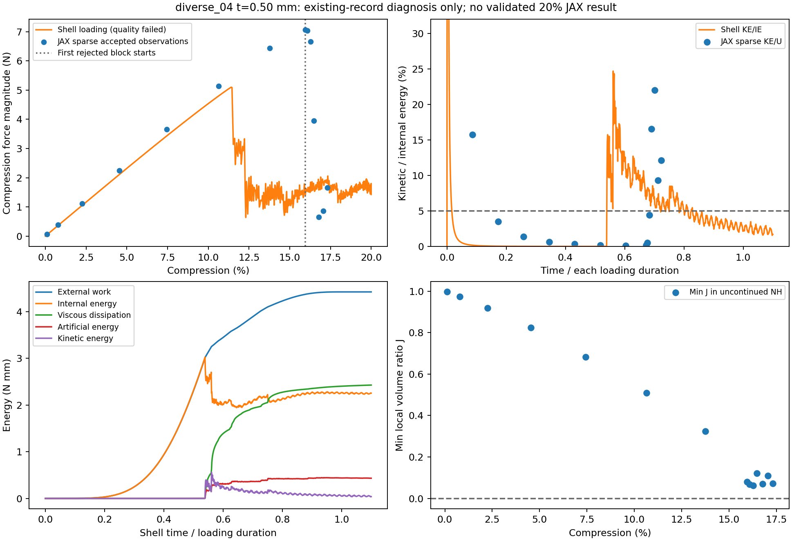

# diverse_04 几何迁移：第3、4步限定诊断与范围收口

更新2026-10-06。依据仓库450bc8f和冻结r15现有记录。本次完成后两步的分析与收口；**第2步“双方可信计算至20%并相近”的目标仍未通过，不能称四步全部验证成功。** 本次没有新时间推进、Abaqus作业、求解器修复、参数调整或设计梯度计算。

## 科研结论

当前路线在diverse_28的三个厚度采样点上有前向可行性证据；换成diverse_04后，既出现响应转折的明显差异，也出现JAX数值失稳。它说明当前方法有几何迁移限制，需要针对性处理；一个新构型失败不足以否定固定背景路线，也不足以承诺普遍替代Abaqus。

最有用的发现是：**双方反力在JAX首次非有限拒绝前就明显分开了。** 因此，后续即使解决“跑不完”的问题，也还要解释“转折不同”的问题。壳本次加载质量同样不足，不能将它直接当准静态真值，再把全部差异归到JAX。

## 1. 这次比较的物理问题

只改变用户原中面diverse_28→diverse_04；仍为边长10mm、参考厚0.50mm（边长5%）、均匀可压缩Neo-Hookean基材E=10MPa、ν=0.3。双方采用XYZ周期波动、宏观横向应变零，加载到20%后保载，无接触、塑性或质量缩放。不是摩擦压板试样。

JAX采用HEX27二次背景网格，每轴32个单元、每单元27个真实Gauss积分点；光滑恒厚距离带附着参考材料点，HRZ集中质量及既有中央差分推进。人工孔隙初始刚度比η=10⁻⁴，界面宽0.05mm，客观虚域+C²续接常数全部冻结。壳为匹配原中面的S3R、五个厚度积分点。JAX加载0.004s，壳0.040s，均有10%时长保载；它们是既定准静态候选路径，动态时间历程并不相同。

输入阶段的占据体积与壳面积×厚度差约0.39%，PBC代入和初始材料域通过限定检查。这支持继续比较，但体积接近不能保证弯曲、屈曲或全局厚度带完全相同；原四条法向末点失败及首次出口澄清仍保留。

## 2. 响应差异比数值拒绝更早出现

下表只使用原14条稀疏接受观察中明确存在的点；壳在相同压缩比例处线性插值，JAX不插值或补造曲线。反力以压缩幅值列出，原符号为负。

| 宏观压缩 | JAX反力，N | 壳反力，N | 差/该点壳幅值 | 解释 |
| --- | ---: | ---: | ---: | --- |
| 2.255% | 1.1201 | 1.0497 | 6.71% | 转折前，有限观测 |
| 4.541% | 2.2463 | 2.1088 | 6.52% | 转折前，有限观测 |
| 7.442% | 3.6544 | 3.4258 | 6.67% | 转折前，有限观测 |
| 10.641% | 5.1383 | 4.8007 | 7.03% | 双方尚在增载 |
| 13.765% | 6.4409 | 1.5613 | 312.53% | 壳已明显降载，JAX仍增载 |
| 15.966% | 7.0702 | 1.4390 | 391.34% | 首次拒绝块前一接受观察 |

壳加载峰值为5.0983N，出现在约11.416%压缩；约11.5%开始出现较高动能，反力下降并振荡。JAX记录到13.765%、15.966%仍增载，后续16.275%～16.773%的稀疏记录才出现明显降载及动能增大。不能由稀疏点给JAX精确屈曲临界值，也不能在没有匹配有效位移场时证明两者是同一屈曲模式。

312%和391%是**诊断点的局部相对差**，分母是此时已经降载的壳反力，不是完整曲线RMS，更不是材料物理误差。转折前的几个6.5%～7%点也不认证整个小压缩区间。0.112%的初始点相对差更大且动能占比高；原加载质量门槛从1%起算，因此不拿启动点作为稳定刚度验证。

本次不给完整1000点曲线RMS、20%保载反力差、完整输入功差或末态模式差：JAX没有完整路径和有效末态。新几何的双分母RMS口径保留，待将来有有效完整数据才计算。

## 3. JAX失稳能定位到什么程度

宏观压缩比例描述单胞被压短多少；J=detF描述每个积分点当前/参考局部体积比，两者不是同一个量。占据φ描述该参考点属于壁或孔隙的权重；φ≥0.01是未续接NH求值域，不是“1%压缩”。

首次拒绝块开始于15.966%压缩，当时接受观察的动能/储能仅0.160%，未续接NH域最小J=0.07987、无非正J点；全背景已有2075个负J虚域点。说明当时尚未观察到整体高惯性或未续接NH域翻转。**不能据此排除块内稍后发生的局部失稳、域越界或高频响应**，也不能说整个实体都没有问题。

| 保存的拒绝块末端 | 有限周期位移类/总数 | 完整有限节点单元 | 可作的诊断 |
| --- | ---: | ---: | --- |
| 1，约16.214% | 1/262144，仅固定类 | 0 | NaN已传播，不能还原首个失效点 |
| 2，约16.091% | 251775/262144 | 30846/32768 | 可检查有限单元子集，整体仍拒绝 |
| 3，约16.335% | 1/262144，仅固定类 | 0 | NaN已传播，不能还原首个失效点 |

第二块用同一真实27点规则、缓存周期类编号、规则背景单元形函数和同一材料能量/应力核作只读求值。积分点与权重对原缓存核对通过，但不是原FEM参考梯度的逐位重放；下列计数描述这个拒绝场的后处理重建，不是原求解器的在线首错记录。832842个来自完整有限节点单元的积分点中：

- 未续接NH域129807点：该子集未发现非正J或非有限能量/应力。
- 混合虚域11689点：有3个非正J，能量/应力仍可求值。
- 深虚域691346点：发现408个非有限J、1016个非有限能量点、928个非有限应力点；部分F分量虽有限，量级已足以使计算溢出。

这把**第二个拒绝末端仍可计算子集的溢出定位到深虚域**，支持后续重点研究人工域的局部稳定性。它不证明深虚域是首次触发原因：其余单元已含NaN，不能排除那些单元中的NH越界；块内最先失效状态没有保存。三份拒绝场都没有全域有效总能量，不用有限子集之和代替。

中央差分的稳定步长受当前最大频率限制；局部切线变大时，初始估计的步长未必继续适用。Abaqus的自动步长会估计当前频率/有效模量，项目当前入口主要是初始估计及拒绝后减半，二者不等价。这为“局部切线—时间步失稳”提供方法依据，**本次未测失效前切线或频率，仍是待验证机制**。[Abaqus显式理论文档，公开2025版](https://docs.software.vt.edu/abaqusv2025/English/SIMACAETHERefMap/simathe-c-expdynamic.htm)

3次拒绝后步长降至原1/8；最终监测17.445%、动能/储能19.74%，稀疏记录中最高22.03%。按实际质量疑点停止，调用11.37min；不是15min预算用尽，也不是已穷尽所有算法。中断未被现有Exception保存分支捕获，没有有效末态与完整接受路径。此次只记录该缺口，未修改入口或重新计算。

## 4. 壳的转折有物理意义，但参照质量不足

从11.497%至17.259%的连续采样区间，壳动能/内能超过5%；之后到约19.23%还有间歇超限。转折后的加载路径不能按低惯性准静态曲线直接使用。最后保载动能/内能1.70%并不能覆盖加载过程。

| 原质量指标 | 实测 | 原门槛 | 判断 |
| --- | ---: | ---: | --- |
| 从1%压缩起，加载时长中动能/内能≤5%的比例 | 67.16% | ≥95% | 未过 |
| 最大总能量漂移/全程最大外功幅值 | 6.76% | ≤1% | 未过 |
| 最大人工能量/全程最大外功幅值 | 10.06% | ≤5% | 未过 |

壳终态外功4.4237N·mm，内能2.2549N·mm，其中可恢复弹性能1.8222N·mm、人工能量0.4327N·mm；黏性耗散2.4279N·mm，约为终态外功的54.88%。这不是“54.88%的反力误差”：耗散、人工能量和惯性不能相加当力误差分解，动态释放能量也不等于全部由加载过快产生。

Abaqus内能已含人工能量，做能量平衡不能再加一次ALLAE；黏性耗散包含体积黏性等阻尼机制，人工能量可包含沙漏及壳横向剪切贡献，不能仅凭ALLAE判定单一沙漏原因。本模型未主动引入材料阻尼，保留默认显式体积黏性；本次未隔离各项来源。[Abaqus能量说明，公开2025版](https://docs.software.vt.edu/abaqusv2025/English/SIMACAEGSARefMap/simagsa-c-ovwstatenerbal.htm)

壳宏观RF·du积分与ALLWK差约0.032%，XYZ位移/转角约束通过，说明提取和边界检查有一致性。它们不能覆盖上述质量失败。11.4%的反力下降可能对应屈曲/突跳及动态释放，但现有证据不认证准静态临界点、接触或准确的真实三维后屈曲分支。

## 5. 迁移范围与长期目标

| 范围 | 完整至20% | 已有响应对照 | 质量与梯度边界 |
| --- | --- | --- | --- |
| diverse_28，t=0.45mm | 双方完成 | 反力6.80%、曲线3.55%、功5.44% | 原工程目标通过；壳严格能量仍未过 |
| diverse_28，t=0.50mm | 双方完成 | 反力6.81%、曲线4.93%、功5.97%；慢路径6.85/5.05/5.98% | 独立速率检查通过；完整新核20%AD未认证 |
| diverse_28，t=0.55mm | 双方完成 | 反力8.28%、曲线7.48%、功7.31% | 原工程目标通过；该厚度无独立速率复核 |
| diverse_04，t=0.50mm | JAX未完成，壳完成 | 完整20%差异不可计算 | 转折不同、JAX失稳、壳三项质量未过；迁移不通过 |

前三行曲线指标沿用原固定峰值分母2.258914N，不能用本次新壳峰值重算来改写旧结论。三厚度只认证已采样条件的工作指标，不认证所有连续厚度、全部TPMS、局部应力或接触/塑性。正的有限采样J也不证明无自接触，PBC不建立镜像接触。

科研可行性判断保持分层：
1. 已有薄壁背景前向工具在限定几何/材料/边界下达到相对壳约10%的工作目标，值得保留。
2. 跨几何泛化至20%当前尚未成立；本次展示了需要解决的实际限制，不能靠继续扫厚度或“取平均误差”绕过。
3. JAX可微材料接口保留；原NH低压缩导数与新核局部检查有证据，但完整新核20%设计梯度仍未认证。数值非有限状态和不同响应分支不能直接用于有效路径AD。训练继续后置。

## 6. 后续继续条件，仅作为方案，不在本轮执行

按用户要求，先完成后两步，问题处理留后续决定。优先级依据这次证据，而不是泛扫参数：

- **数值侧：** 下一次有针对性的复现前，应保全接受路径和最后接受状态；定位首个异常内部步、材料域及局部切线/时间步关系。记录保全是为修复获得证据，不另搭一套FEM。
- **响应侧：** 分开处理约11%～16%的转折差异和深虚域溢出。若继续把壳作为准静态参照，先解决其速率/能量/人工能量的不确定性；不能只将JAX跑通就认定对照通过，或按贴近壳挑厚度、η、阻尼。
- **迁移关口：** 同diverse_04、0.50mm获得完整有效路径及匹配参照后，才执行原完整曲线、反力、功和模式判据；否则明确限制适用范围。
- **梯度关口：** 完整可信前向之后，再按既有方案单独验证一致时间离散下的新核路径导数，不启动训练、形态AD或高维反向。

以上不是已排队作业，也不自动授权修复、新速率或全AD；下一轮开始前只针对实际问题更新唯一主规划。本轮两步已经收口，不另列远期长计划。

## 文件和可追溯性

正式目录：/home/xuehu/projects/tpms_jax/validation/geometry_transfer_review_20261006_r16。

- [原执行事实](../geometry_transfer_20261006_r15/STEP2.md)及step2_summary.json冻结，含首次启动/提取问题、停止方式和成本。
- [局部拒绝场诊断](rejected_endpoint_diagnosis.json)、[稀疏反力对照](partial_force_diagnosis.json)、[壳历程诊断](shell_path_diagnosis.json)为本次新增分析。
- [范围与继续条件](scope_decision.json)、[验证](verification.json)、evidence_manifest.json及frozen_before.json为本次收口/追溯。
- existing_record_review.py仅本轮只读后处理，复用共享材料核，无内力组装或时间推进；不是活动求解器。
- 初次后处理因拒绝场巨大数值的Inf不能序列化而中止；原脚本/日志保留postprocess_attempt01。只改诊断输出为“有限最大值+溢出计数”，未改输入、求解器或数值常数；第二次后处理成功。这不是新增仿真失败。

蓝点是JAX原稀疏接受观察，未连成完整曲线；橙线是壳完整加载记录。右上时间按各自加载时长归一化，不是相同物理时间。右下只显示接受观察中的未续接NH域最小J；它不证明块内全过程有效。
