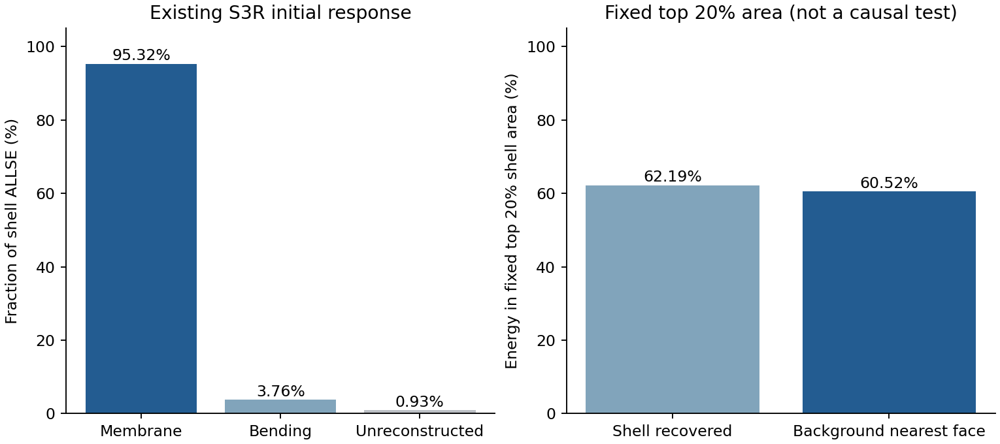

# 约5%的初始偏差应作为独立基础问题：路线收窄与r32机制定位

2026-10-08。用户认为diverse_04的5.70%无惯性初始偏差与diverse_28既有误差量级相近，希望确定是否为主要因素及下一步。我的判断是：**它很可能是早期反力差异的一项主要基线，值得优先解释；这个误差数本身还不是已定位的力学原因，也不能单独解释大压缩峰位错开。** 保持背景网格研究路线，将当前排查收窄到初始膜内承载和曲面厚度材料表示，不恢复高成本长路径。

本轮已按原第3步只读取r30已收敛背景状态、原中面和已完成壳ODB，没有提交新Abaqus分析，没有新FEM、切线或AD计算。提取已有S/E截面场1.44秒，局部能量后处理1.75秒；这是后处理耗时，不是新增仿真耗时。

## 1. 为什么赞成这个方向，为什么还不能认定共同主因

diverse_04当前N32无惯性初始刚度对同中面S3R/Standard高5.7025%，已有真实残差、宏观功和周期约束核对；所以初始偏差确实存在于静态离散模型，而不是仅由时间积分或反力惯性项产生。其与5%动态稳定增载的6%左右差异量级相近，说明初始基础偏差是值得优先处理的现象。

diverse_28当前慢N32在5%压缩处的动力/内部力对Standard差4.55%/4.43%，也提示可能有共同基础偏差。但那是有限压缩动态状态；旧4.98%的静态数字属于N64 HEX8。**diverse_28当前N32 HEX27零状态静态对照尚未完成。** 因此可提出共同机制假设，不能把两个数字的接近当作同机制认证。

这也不说明当前方法没有可行性：初始约5%对壳差异在原约10%的范围性工作目标内。我们需要理解来源并避免随构型失控，而不必把每个初始百分比消除到零。diverse_04大压缩失败和峰差则继续独立保留。

## 2. 单纯整体偏硬为何不必然改变屈曲压缩位置

对本项目固定ν、固定几何/占据、静态位移控制的纯弹性问题，若仅把所有材料刚度统一乘c，势能变为cΠ。周期波动位移的平衡条件从∂Π/∂w=0变为c∂Π/∂w=0；切线也整体乘c。因此平衡位移分支和切线失稳零点在这个理想静态问题中保持，而反力整体放大。

这说明，若5.70%仅是一个整体刚度倍率，它本身不能解释原壳约11.8%而JAX约15.9%的同速率观察峰。实际偏差可能来自局部膜/弯刚度分配、预应力和变形模式等共同建模因素，这些因素可以同时影响初始刚度和后续峰位，但必须分别验证。动态惯性/速率及不同分支选择不包含在以上静态推导中。

所以不通过降低E或给曲线乘经验系数来“解决”问题，也不从初始相近推断大压缩已经通过。

## 3. r32先看初始响应究竟由什么变形承担

从r30原S3R的S/E字段读取上下表面两个已保存截面点。初始同质线性截面条件下，平均值对应膜内应变/应力，沿厚度线性变化对应弯曲；用真实0.5 mm厚度和原三角面积积分。这是读取已完成响应，不重新求解。

膜内变形指壁面自身拉长、缩短及面内剪切；弯曲指穿厚度的拉压分布不同，使中面改变弯曲状态。压缩TPMS可以同时出现两者，初始阶段的比例不自动延伸到屈曲后。

| 原壳初始ALLSE中的量 | 储能比例 | 解释 |
| --- | ---: | --- |
| 重建膜内能量 | 95.3179% | 初始主要承载方式 |
| 重建弯曲能量 | 3.7568% | 初始占比较小，不代表屈曲后也小 |
| 未由现有S/E重建的剩余 | 0.9253% | 原输出没有请求横向剪切场，不能直接把余量全部命名为剪切 |

重建膜/弯合计99.0747%的ALLSE，满足计算前固定的1%差异关口。人工能ALLAE另外保留，未混入ALLSE分解。Abaqus输出E12是工程剪应变，能量中S12·E12计一次；字段标记也与此一致，本轮没有事后改变剪切约定凑能量。

因此当前初始偏硬更应从曲面膜内承载及穿厚度材料表示检查，不能继续用r27平板弯曲偏软当主要解释。该结论仅为初始阶段的排查优先级，不是弯曲误差与5.70%无关的证明。

## 4. 主承载区域和同一中面位移能量的对应

按壳已重建能量/面积从高到低排序，预先固定选取总中面面积前20%，实际19.9951%。该区域承载了壳重建膜弯能的62.1875%。背景高斯点按最近周期三角面映射到同一区域，其能量占背景总能60.5186%。主要承载区大体对应，不能说双方在初始阶段走了完全不同的变形路径。

该区域邻面法向变化代理较大：选定区域面积加权均值0.9252 mm⁻¹，其余区域0.5924 mm⁻¹。这个量是邻三角面法向夹角除以周期中心距离，不是真实主曲率，也不能取倒数当半径或据此认证壳是否足够薄。它只帮助定位曲面区域；高曲率与高储能相关本来可能是正常力学现象，不构成误差因果证明。

为了进一步区分位移模式与厚度材料表示，我把背景Q2位移准确插值到原中面节点，然后让背景与壳的已有位移使用**完全相同的三角中面、真实厚度和线弹性膜能公式**进行后处理。先用壳自己的节点位移重建膜能，与原ODB膜能相对差仅1.88×10⁻¹⁰，通过计算前固定的1%关口。

| 同中面膜能后处理，N·mm | 数值 |
| --- | ---: |
| 壳原ODB膜能 | 2.215856498×10⁻⁶ |
| 壳位移在同中面的膜能 | 2.215856498×10⁻⁶ |
| 背景位移迹在同中面的膜能 | 2.255525598×10⁻⁶ |

背景位移迹的膜能高1.7902%，比整体刚度5.7025%的差异小。这里并未重新求平衡，也没有把背景改成壳：它提示剩余差异值得从穿厚度能量、材料表示/积分和局部约束进一步分析。**不能直接将5.70%减1.79%并把余量指定为某因素。** 背景点态切向能量同时包含膜和弯效应，不能将其全部叫作背景膜能。

## 5. 背景点态能量分解的口径

用原Q2位移和原Gauss权重重建背景储能，与r30相对差2.22×10⁻¹⁶。采用各点最近中面法向，可以将原初始三维弹性能代数分成：切向平面应力能、法向应力释放量、横向剪切量。本轮所有Gauss点的份额分别96.9794%、0.8039%、2.2167%，点态恒等式相对差2.30×10⁻¹⁶。

这与r30仅在φ≥0.01点的0.5818%/2.0185%口径不同，不能直接比较成变化。深虚域离中面较远时，最近面坐标只用于代数分解和区域映射，不赋予它真实薄壁物理意义。各点独立释放应变一般不满足全局兼容，也包含真实三维效应，不是已经得到的可执行修正或因果贡献。

## 6. 下一步决定：小幅收窄，先一个有区分力的积分机制诊断

保持研究路线和物理参数，维持原四步，不扩展新的长期规划：

1. 已完成r29旧路径分析，区分初始动力/内部力与静态切线，保留历史范围。
2. 已完成r30当前N32无惯性初始对照，偏差5.7025%，两侧有效性检查通过。
3. 进行中的原因定位已完成r31膜向补片和r32已有场分析：初始以膜内承载为主，同中面位移迹膜能差1.79%，唯一根因未定位。下一项只检查当前曲面主承载区的材料表示/积分。固定N32已有静态位移、t/E/ν/η/界面和原几何，以局部密积分核查当前27点在穿厚度能量及有效截面上的偏差；不重新跑长路径，不修改生产27点设置。开始前固定选区、两级局部积分、误差口径和预算；密积分本身不稳定就保留不确定性，不无限加点，也不称已找到改进。
4. 只有上述证据明确指向一个因素，才做一次有依据的初始重新平衡，并在diverse_04/diverse_28按同口径验证。不能用倍率拟合。若初始约5%已可解释且在工作范围内，停止追逐零误差，再回到局部失稳/峰附近和完整20%，训练与完整设计AD继续后置。

第3项局部密积分尚未执行，第4项尚未执行。增加后处理积分用于识别原积分的偏差，与增加全域积分点后直接重跑20%是不同实验；不恢复r8失败路线，也不预告积分改善会修复峰位。

## 7. 理论来源及保存位置

常规壳的厚度方向应力假定、横向剪切和有限应变运动学与三维实体不同，因此相同E/ν/t不等于同一局部运动学。[Abaqus壳选择说明](https://docs.software.vt.edu/abaqusv2025/English/SIMACAEELMRefMap/simaelm-c-shellelem.htm)支持这个区别；实际软件为2026，本次公开理论页为2025，未将文献当作当前偏差的因果证明。[Abaqus张量约定](https://docs.software.vt.edu/abaqusv2025/English/SIMACAEMODRefMap/simamod-c-conventions.htm)明确输出工程剪应变，本轮以此及能量一致性核对S/E解释。

背景方法中几何表示、逼近空间和积分需要分层研究，有限胞综述介绍了虚域、高阶逼近及自适应积分的组合。[非线性有限胞综述](https://arxiv.org/abs/1807.01285)为本轮积分诊断方向提供方法背景，但当前项目不是已经具备完整FCM技术的实现，也不继承其精度认证。

正式源和数据：WSL `/home/xuehu/projects/tpms_jax/validation/initial_bias_mechanism_20261008_r32/`，含协议、只读ODB提取器、能量及位移迹分析、原始截面字段、区域数组、JSON和图。ODB仍在原r30原生作业目录；打开前后SHA256一致。旧生产/r15几何/r27源/r30状态及结果/r31结果按冻结清单保持，未提交/推送/合并GitHub，无活动作业。当前Windows只有本报告及图，完成辅助工具归档，旧入口原文留历史。
