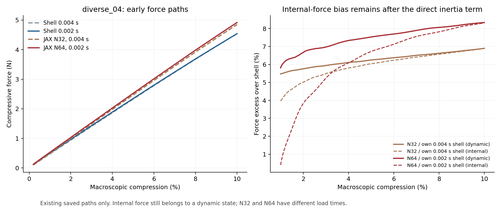

# r29只读分析：先解释初始增载偏硬，后续采用N32

2026-10-08。用户观察diverse_04与diverse_28在初始增载就比Abaqus壳偏硬，要求优先排查，并选择后续N32。**这是一轮已有数据分析和规划更新，不是新力学算例；无新静力、显式、Abaqus、材料切线评估或设计AD。** r28原报告、失败记录、曲线、场与收据保持。

## 1. 为什么调整排查顺序

初始增载已经偏高，说明不能只在跳跃、后屈曲和步长保护中寻找全部误差。先弄清稳定增载的刚度差，更容易区分几何表示、局部变形能力和动力影响，也可避免每次都计算完整20%。这里的结构刚度是反力随宏观压缩位移变化的斜率，单位N/mm，压缩1%对应10mm单胞缩短0.1mm；它不是基材E=10MPa。

N32和N64增载曲线接近，支持后续先用成本较低的N32。它们加载时间分别0.004/0.002s，且都未完成diverse_04完整20%，因此不把曲线接近称作网格收敛；也不能据此完全排除穿厚度分辨率或积分问题。N64保留为历史证据，不延长、不重试。

## 2. 只读数据确实支持初始段存在共同偏差

读取r18的diverse_04 N32、r28的N64、两份各自同速率壳；另读取r12当前C²核的diverse_28快/慢路径，与已有Standard壳加载曲线比较。全部力先取压缩幅值，再在相同压缩量插值；不移动横坐标、不平滑拟合原曲线。

| 5%压缩的既有记录 | JAX动力反力，N | JAX内部力，N | 壳反力，N | 动力反力比壳高 | 内部力比壳高 |
| --- | ---: | ---: | ---: | ---: | ---: |
| diverse_04 N32，0.004s；对应0.004s壳 | 2.4713 | 2.4665 | 2.3260 | 6.25% | 6.04% |
| diverse_04 N64，0.002s；对应0.002s壳 | 2.5216 | 2.5027 | 2.3450 | 7.53% | 6.73% |
| diverse_28 N32，0.004s；已有Standard壳 | 1.7014 | 1.6941 | 1.6125 | 5.51% | 5.06% |
| diverse_28 N32，0.008s；已有Standard壳 | 1.6859 | 1.6840 | 1.6125 | 4.55% | 4.43% |

diverse_04分母是各自同速率壳在5%的动力反力；diverse_28分母是既有Standard静力曲线，不称同速率对照。表中的“内部力”仍由动态路径中的变形状态求得；从反力中扣除直接惯性项，不能将该状态变成静力平衡，也不能将其与壳动力反力的差当作严格静态刚度误差。

但它给出有用的排查信息：diverse_04在5%的直接惯性提取项分别仅占动力反力约0.20%/0.75%，10%时更小；已有力差并非全来自反力表达式中多加了一项。diverse_28慢路径仍偏高，说明纯粹继续缩短/延长加载不是目前最有针对性的解释。

极初始阶段要另看：diverse_04在0.2%时直接惯性占比约N32 5.33%、N64 18.17%，1%约1.42%/5.12%；新N64在1%的内部力与壳动力反力仅差0.40%，并不说明其真实零状态刚度已吻合。加速段不能直接作为“结构静刚度”的测量。1–5%也含几何非线性，不等于严格的初始切线。

本轮另外以1001个均匀宏观位移点作带截距直线拟合，斜率、截距、拟合残差均写入analysis.json。1–5%窗口diverse_04动力曲线斜率分别比各自壳高约6.44%/7.99%，diverse_28快/慢比Standard高4.98%/4.65%。这是区间描述，不能冒称零应变切线。带截距拟合也与旧r7过原点拟合口径不同，不替换原4.54%等结论。

旧r5的diverse_28三向周期静力线性对照曾得结构刚度3.96283对3.77488N/mm，高4.98%。它是旧N64 HEX8，而不是当前N32 HEX27/C²求解；它降低“所有初始偏差都由显式造成”的可能性，不能直接认证当前静力误差或重复当成新算例。

## 3. 哪些原因更值得检查

现在没有证据指定唯一原因。优先顺序是先用无惯性的初始切线对照分流，再针对几何和局部运动学检查，而不是同时扫描多个参数。

**首先关注壳与背景实体能否实现相同的薄壁局部变形。** Abaqus S3R以中面位移和转动表达膜内变形、弯曲与横向剪切，并采用壳的厚度处理/平面应力条件；背景是完整三维位移场，跨实体、界面和孔隙共用形函数。两边同E、ν、t和宏观PBC，不等于局部运动学一样。真实薄壁在受力后通常能沿局部法向作泊松收缩；背景跨界面的位移近似和软域耦合若限制这种松弛，会额外存储能量并使整体偏硬。这是有理论依据的候选，尚无当前TPMS局部应力证据证明它主导。[Abaqus壳选择与厚度说明](https://docs.software.vt.edu/abaqusv2025/English/SIMACAEELMRefMap/simaelm-c-shellelem.htm)，[S3R有限应变运动学](https://docs.software.vt.edu/abaqusv2025/English/SIMACAETHERefMap/simathe-c-finitestrainshells.htm)。公开说明为2025，实际软件2026，不声称逐项核查版本差异。

宏观横向应变零不等于每一片倾斜薄壁的法向应变为零；两边都用相同宏观限制，也不能直接将3D背景叫作“局部平面应变”。三维法向应力不总是错误，曲率和局部约束也能产生它；不能直接删除该应力或全域换成平面应力就宣称改进。ν=0.3也不能仅凭偏硬就诊断为近不可压缩体积锁死。

**其次关注实际材料带是否与壳的名义厚度等效。** 当前占据是距离带sigmoid，初始切线倍率s=η+(1−η)φ。膜向承载受∫s dz影响，抗弯受离中面的距离平方加权影响；总用料相近并不保证两者相近。壳把0.5mm作为截面厚度，背景把距三角面片≤0.25mm附近转成连续材料权重；曲面棱角、面片法线与有限孔隙也能改变局部有效截面及连接。

这些已经有部分证据，不能全部重做：r7理想平壁的sigmoid膜厚几乎不增，弯曲厚度矩约增加2.04%；少数棱角位置距带宽增加约1.05%–1.21%、含平滑的局部弯曲矩约多5.34%–5.83%。同点连续与二值总材料量差很小。这反对“界面宽0.05mm等于在0.5mm上直接加0.05mm”的解释，也不能将上述百分比直接当作全结构反力误差。

**穿厚度采样仍是候选，但已有平板证据方向相反。** r27平直小板的Gauss抗弯矩低估23.40%/15.30%，背景是偏软；当前TPMS整体初始增载却偏硬。两者可由不同变形机制控制，不能统一写成“积分不足所以全部偏硬”，也不能未经证据断言正负误差正好抵消。有限胞文献将几何表示、位移近似与积分分开处理，支持按因素诊断；对尖锐/颗粒模型的结论不能直接认证本项目sigmoid薄壁。[几何平滑与有限胞研究](https://link.springer.com/article/10.1007/s00466-024-02512-1)。

**η底座和人工虚域保留为可检验因素，暂不当作首选调参。** r7旧NH末态的软域净内力约2.15%、全域η底座约2.02%，这是另一材料核的20%同状态分解，不是当前初始误差或删除软域后的因果结果。小η仍可能经重新平衡影响局部松弛，不能只看η=10⁻⁴就完全排除；也不能为了贴壳而降低η或改支撑。C²在初始J=1不触发NH截点续接，客观虚域按相同初始弹性常数校准，r27已有初始切线一致性证据；负J续接细节不宜当作严格零状态偏硬的第一解释。

材料/单位/反力尺度、周期映射和壳截面定义仍须一次定点核对，但已有解析、矩阵、保存态恢复与输入记录降低了明显实现错误的优先级。当前没有发现新单位错误；也不假设所有PBC与材料局部差异已完全排除。只核对匹配，不重新比较XYZ与压板压缩方式。

## 4. 后续最多四步，先短问题，再回到20%

1. **已有数据收口：本次已完成。** 明确力差、斜率、直接惯性项和参照范围；后续采用N32，原r28冻结，旧同速率N32完整20%候选及N64步长诊断降为后置，不新增长路径来回答初始刚度问题。
2. **优先一个当前N32的无惯性初始切线对照：未执行。** 从零状态取共享材料的线性化，保持当前Gauss占据、η、界面、HEX27/27点及XYZ约束；以宏观压缩a=10⁻⁴（0.01%）求周期线性平衡并比较结构刚度/储能/位移波动。先diverse_04；复用原S3R中面、厚度和PBC，必要时只生成一个小变形Standard参照，采用与NH初始切线等价的E、ν，不重建体网格。新作业仅为未来候选，本轮未提交。线性求解也可能受软域病态影响，启动前固定资源/预算/残差要求，不无限迭代；未收敛不能归因物理。
3. **根据第2步选择一个因素验证：未执行。** 若静力偏差仍在，先从有效静力场查材料权重/η底座与局部法向松弛；必要时只做一个有解析平面应力参照的膜向小试片，补r27已有弯曲诊断的空缺。若静力吻合而动态增载偏差仍在，则优先短增载的质量、加载加速度与反力定义，不同时调整界面/η/单元。相同状态能量分解只用于指路，不能直接扣掉某区域能量当作纠正误差。所有小试片/受控变化启动前明确因素、判据与预算。
4. **只保留有依据的改进并做两个构型短段检查：未执行。** 在N32上先看diverse_04及diverse_28的初始刚度与1–5%响应，兼顾位移模式和求解有效性，不能靠缩小E、t或加阻尼拟合反力。有改善后再单独规划峰附近及完整20%，步长瓶颈仍保留，训练/完整设计AD继续后置。不因初始刚度改善就预告峰位必然解决。

第2步是最有辨别力的下一项，不是第1步之后自动起算。短期目的不是增加算例数量，而是把“初始就偏硬”定位成可解释的模型/离散/动力因素。未来设计梯度仍须对完整链独立验证；线性材料切线不是设计变量梯度认证。

## 5. 可行性与文件状态

两个构型的初始稳定增载都呈数个百分点的系统偏高，值得优先处理，但目前没有看到它是不可改进的理论障碍。diverse_28限定完整前向依据仍成立，diverse_04大压缩分支和推进问题也仍未解决。最合理的评价是：有限前向可行性有依据，通用20%响应与有效设计梯度尚未证实；不提供缺乏证据的成功概率。

先排查初始刚度是回到基础机制，不是离开大压缩主线。初始刚度相近仍不能保证屈曲点相近，后者还取决于局部应力分布、几何刚度、分支触发与动态过程；之后必须回到它。本次不改变原约10%的有范围目标，也不把4%–8%当作任意构型的认证容差。

正式目录 `/home/xuehu/projects/tpms_jax/validation/initial_stiffness_review_20261008_r29`：REVIEW.md为本报告，analysis.json含全部插值/拟合/来源哈希，initial_response.png为图，read_existing_paths.py仅复现已有数据分析，organization_receipt.json记录整理。Windows只保留对应output/r29_initial_stiffness_review_20261008/README.md阅读入口及图/摘要。r28原目录和原INP/ODB保持。

本次整理更新背景、唯一规划、状态、机制解释与地图；根目录仍10个入口，不另加一套计划/生产程序。修改前文档在W/history/before_initial_stiffness_focus_20261008及R/docs/history同名目录，Windows完成的本轮辅助脚本移入history/completed_tools_20261008/r29_review_support；work仅留说明。原科学数据、生产源、安装库及论文保持，无GitHub提交。
