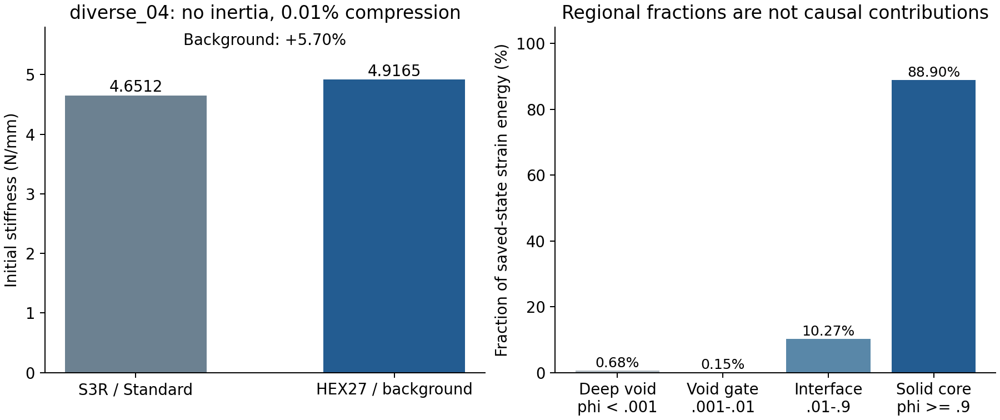

# 初始偏硬已在静态模型中复现：r30–r31排查结果

2026-10-08。继续当前连续占据场/背景网格路线，不转向GAN论文方法。此次完成原四步规划的第2步，并完成第3步中的一个膜向小试片；唯一误差主因和正式改进尚未找到，第4步未执行。

**diverse_04当前N32背景模型的无惯性初始刚度比同中面Abaqus壳高5.70%。** 因而初始偏差在静态几何、材料表示及离散运动学层面已经存在，不能只归于加载速度、质量或动态反力提取。平直膜向小试片能正确实现厚度泊松收缩，但其高斯采样材料量使刚度偏低6.80%；这降低了“实体单元普遍不能实现法向松弛”这一解释的优先级，也不能用平板偏软解释曲面TPMS偏硬。

## 1. 为什么先做零状态静力，而不继续长路径

此前diverse_04在5%压缩处，N32动力反力和内部力分别比同速率壳高6.25%和6.04%。内部力仍取自动态状态，删除反力公式中的惯性项并不等于把结构重新求到静平衡。N64早段也偏高，且大压缩已触步长底线。继续加密或重复完整20%会把初始偏差、失稳和时间推进混在一起。

本次直接对零变形状态取当前共享材料核的初始切线，求一个线性静态周期平衡。方程中没有质量、加载时长、阻尼和加速度。这使初始结构刚度成为可以单独比较的量。宏观压缩0.01%只是线性切线解的归一化幅值，不是新的完整有限变形压缩路径。

## 2. r30保持了什么，实际如何求解

仍是diverse_04原中面，单胞边长10 mm、厚0.5 mm、基材E=10 MPa、ν=0.3。背景是N32 HEX27、每单元27个高斯点，η=10⁻⁴、界面10–90宽0.05 mm，复用r15原真实积分点的占据数组；没有重新抽样几何或更改生产参数。占据是表示薄壁几何的数值权重，不是另一个真实材料。

位移仍写为仿射宏观压缩加周期波动，XYZ相对面波动一致，宏观横向应变为零。令压缩比例a=10⁻⁴，即0.01%，边长缩短δ=La=0.001 mm。初始刚度定义为K₀=|Fz|/δ，单位N/mm；它表示零变形附近每毫米压缩所需反力。

初始各向同性切线为σ=s[λ tr(ε)I+2με]，s=η+(1−η)φ，μ=E/[2(1+ν)]，λ=Eν/[(1+ν)(1−2ν)]。ε为对称位移梯度，φ为占据。该公式先与当前objective_void共享材料核在F=I的自动求导切线核对，再与整个网格共享内力的状态JVP核对。两次全网格相对差分别5.52×10⁻¹⁶、2.77×10⁻¹⁶。因此紧凑静态算子复用了同一个初始离散问题。

不组装巨大全局矩阵，使用独立、一次性的矩阵自由预条件共轭梯度诊断。只去除周期波动的三刚体平移，求完恢复原固定周期类；这只是平移规范的等价转换，不改变力学边界。启动前固定最多6000次迭代、900秒求解预算、真实自由残差≤10⁻⁸、能量半功差≤10⁻⁶，失败不追加迭代。实际1851次迭代、求解21.67秒，准备15.00秒，总37.40秒。

壳参考复用r15的8372个原节点、15914个S3R三角单元、0.5 mm五截面点、全部2538条平动/转动周期方程及原固定节点。新建一次Abaqus/Standard小变形线性作业，E、ν为原Neo-Hookean材料的精确初始弹性常数；没有将这一线弹性模型用于20%。没有接触、塑性或质量缩放。原Explicit输入/ODB保持不变，新作业26.59秒、提取0.94秒。

## 3. r30结果及其含义

| 指标 | 当前背景模型 | 匹配初始壳参考 |
| --- | ---: | ---: |
| 初始刚度K₀，N/mm | 4.916455 | 4.651219 |
| 0.001 mm压缩反力绝对值，N | 0.004916455 | 0.004651219 |
| 储能/总应变能，N·mm | 2.458227×10⁻⁶ | 2.325610×10⁻⁶，含人工能 |
| 真实自由残差相对范数 | 9.97×10⁻¹¹ | 完成一步，能量与约束检查通过 |
| 周期波动/方程最大差 | 0，归一化长度 | 8.73×10⁻¹¹ mm；转动方程差0 |
| 人工能/外功 | 不含此人工项 | 0.0391% |

差异预先固定以本次壳K₀为分母：(K背景/K壳−1)=+5.7025%。背景宏观半功与储能差5.31×10⁻¹⁴；所有采样J最低0.9970，最大线性应变分量0.00319。壳采用宏观控制节点RF求反力，配合半功核查；不能把MPC模型中某个物理面直接相加得到的RF当作相同反力定义。

这是一项有效的当前N32初始静态对照，初始差异低于原约10%的范围性工作目标。它与旧5%动力差异量级相近，但不能把两者相减当作分离出的惯性误差，因为压缩量及变形状态不同。它不认证峰位、完整20%路径、接触或完整设计梯度。壳也是一种近似参考，不是实物真值。

## 4. 读取同一个已收敛状态，能缩小哪些解释

| 占据范围 | 当前状态储能占比 |
| --- | ---: |
| 深虚域，φ<0.001 | 0.6807% |
| 续接过渡，0.001≤φ<0.01 | 0.1502% |
| 界面区，0.01≤φ<0.9 | 10.2711% |
| 实心核心，φ≥0.9 | 88.8980% |

背景占据积分体积132.519 mm³，刚度权重积分体积132.606 mm³；壳中面面积乘厚度133.032 mm³。后者是壳几何量，前者是曲面最近距离带的积分量，不假定完全相同。至少在总体材料量指标上，背景略少约0.32%，没有“总体变厚5.7%”的证据。

φ≥0.01的积分点按最近三角中面法向作点态能量诊断：在固定膜面应变、各点独立释放法向应力时，对应能量0.5818%总储能；独立释放横向剪切对应2.0185%。这些释放应变一般不满足整体位移兼容，也包含真实三维效应，不能直接当成可实现的修正或把几个百分比相加解释刚度误差。深虚域能量占比小也不证明删除填料重新平衡后影响同样小。

在原壳节点上用准确Q2插值评价背景位移，并移除两模型不同固定节点造成的刚体平移后，位移差RMS为6.50×10⁻⁶ mm，约为宏观位移的0.650%。这是未作面积加权的节点诊断，表明整体位移模式相近，不是局部应力或独立网格精度认证。

## 5. r31平直膜向试片：区分法向松弛与材料采样

仅补一个原规划允许的膜向试片，复用r27已有网格构造：长10 mm、宽1.25 mm、背景高2.5 mm，中面z=1.25 mm、壁厚0.5 mm；单元边长0.3125 mm、HEX27/27点、相同材料和占据规则。没有重跑旧弯曲试验，也没有扫网格或相位。

x两端规定0和0.001 mm位移，膜面另一方向uy=0；厚度方向uz自由，只固定一个平移。这里的边界为解析补片设置，不替换TPMS的XYZ周期条件。厚度平面应力条件σzz=0给出εzz=−ν/(1−ν)εxx，以及轴向膜模量E/(1−ν²)。把该模量乘实际积分的截面积、除以长度，就得到同一高斯材料场的解析刚度。

| 膜向刚度定义，N/mm | 结果 |
| --- | ---: |
| 当前有限元解 | 0.6401398765 |
| 按实际高斯材料场积分的解析值 | 0.6401398765 |
| 对同一连续场进行密积分的解析值 | 0.6870879121 |
| 真正0.5 mm二值薄片解析值 | 0.6868131868 |

自由残差3.84×10⁻¹⁵；有限元与同高斯解析刚度相对差8.46×10⁻¹⁴；厚度泊松收缩相对差3.99×10⁻¹²。准备10.07秒、求解0.46秒、总10.54秒。这说明共享实体单元在平直膜向状态可以正确实现法向松弛；没有发现一个普遍的泊松收缩实现错误。

但对真正薄片，结果仍偏软6.7956%，来源是此固定位置的高斯采样截面积偏少。同连续场密积分只比真实板高约0.04%，所以不能混淆“材料场的连续定义”与“粗高斯点实际积分”。结合r27旧弯曲偏软，可确认当前网格的薄壁采样会产生影响；其方向与曲面TPMS的初始偏硬不同，不能单独认定为后者根因。该补片不证明曲面上法向、膜弯耦合和壳近似全都正确。

## 6. 原四步进度及下一次的重点

1. 已完成r29旧路径分析，区分反力惯性与动态状态；历史结果保持。
2. 已完成r30当前N32无惯性初始切线与同中面壳对照，确认静态偏硬5.70%。
3. 已完成区域诊断及一个r31膜向补片，尚未定位曲面唯一主因。下一次只围绕曲面有效截面和局部膜弯运动学，从现有静态场的主要承载区域定位；优先读取现有中面/Gauss/壳应力与应变，不扫η、界面、网格或单元。只有明确指向某一因素后，才固定协议做一次重新平衡诊断。
4. 正式改进及N32两构型1–5%迁移尚未执行。没有依据前不调E/t/η/阻尼贴曲线，不把5.70%整体乘系数修正。初始问题处理后再另定峰附近和完整20%，训练与完整形态AD继续后置。

当前结论支持继续这条科研路线：初始离散求解及基础膜向运动学有独立证据，差异可在不跑长路径时稳定复现。但diverse_04完整20%与有效完整梯度仍未通过，本轮也没有消除该风险。

## 7. 文件位置与保存

正式程序仍仅在WSL `/home/xuehu/projects/tpms_jax`，本轮独立诊断放在以下目录，未另建生产求解器：

- `validation/initial_tangent_20261008_r30/`：PROTOCOL、共享切线诊断、收敛历史、线性状态、区域分析、对比JSON、图与正式报告。
- 其`abaqus/`：新壳INP、输入定义、提取器、结果、日志、状态与提交收据。
- `validation/membrane_diagnostic_20261008_r31/`：一个膜向试片的协议、复用r27的诊断、状态、结果与日志。
- 新壳原生作业：`E:/ABAQUS/2026temp/Abaqus_Work/tpms_jax_abaqus/initial_tangent_20261008_r30_diverse04/`，包含ODB等原生文件。

旧生产源、r15几何/壳输入、r27源及r30结果在各诊断冻结清单中按哈希核对；原数据、INP/ODB、周总结、论文和Word/PPT留原位。没有GitHub提交、推送或合并；本轮作业均已结束。Windows入口同步，完成辅助工具归档，原入口文本存历史快照。
