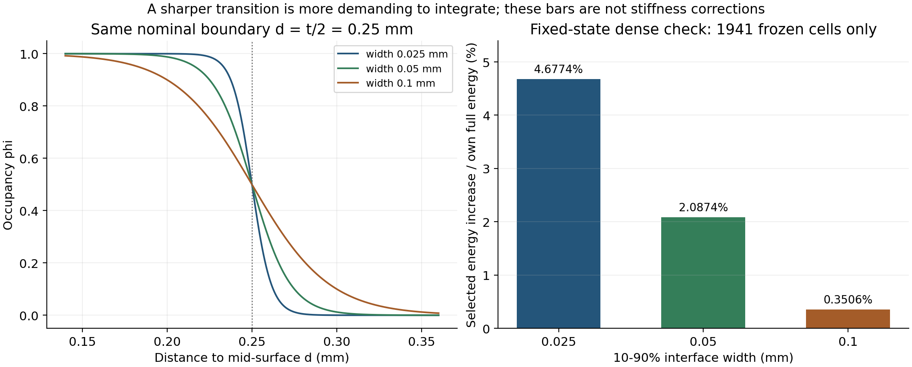
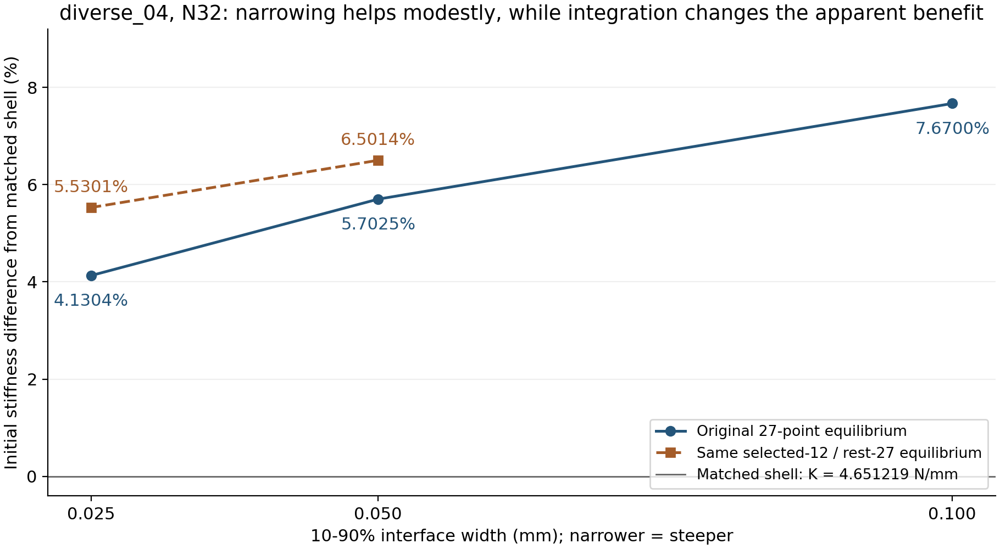

# 初始偏硬追查：界面陡峭度有影响，但尚未解释约5%差异

2026-10-08，diverse_04，N32。本轮完成原规划的一个兼容位移试探（r36）、用户指定的界面宽度试验（r37），以及由积分诊断触发的一次同规则确认（r38）。**界面变陡后刚度有所降低，但在相同部分密积分下仍比同中面壳高5.5301%；目前不能把陡峭系数认定为全部初始偏硬的来源。** 原生产宽度0.05mm、27点及显式路径未改。

## 为什么这次同时看刚度和积分

当前无惯性初始刚度为4.916455N/mm，同中面Abaqus壳为4.651219N/mm，差5.7025%。刚度是反力对压缩位移的初始斜率，本轮使用零状态弹性切线和平衡解；宏观压缩0.01%，对应0.001mm。质量、加载速度和阻尼不进入这个静力算子，因此本轮不重复显式惯性排查。

材料到孔隙的过渡可能影响有效承载截面；另一方面，过渡过陡时，有限Gauss点可能漏采界面附近的材料和应变能。**“参数改变后反力更接近壳”需要进一步判断是模型变化，还是欠解析采样带来的抵消。** 本轮先冻结宽度档位、其他参数、分母和停止条件，再计算；没有用壳曲线反选厚度或参数。

共同设置为L=10mm、t=0.5mm、E=10MPa、ν=0.3、η=1e−4，N32二次HEX27，XYZ周期波动、宏观横向应变为零。壳参照继承r30有效Standard初始解，没有新Abaqus作业。三项新诊断各自协议、源码和结果独立保存，之前失败与生产字节保留。

## 原规划的位移试探：这个模式不支持明显松弛

r36使用r34已平衡的诊断状态：原1941个选定单元采用12点每轴，其余仍为27点。每个选定单元仅允许一个局部法向模式，方向来自原中面最近三角片，而非壳反力。参考坐标ξ∈[0,1]³，模式为

`b=64∏ξj(1−ξj)，ψ=b[n·(ξ−1/2)]n，u=u₀+αψ。`

b使整个单元边界附加位移为零；27节点中的唯一内节点在中心，点积也为零。因此邻接连续性、原节点和PBC保持。n反号不改变ψ。固定节点时三维弹性能为`U=U₀+αg+α²k/2`，正刚度k下最优α=−g/k，释放`g²/(2k)`；这是真正相容的位移变动，不是把积分点应力直接删去。

| r36结果 | 含义 |
| --- | --- |
| 原节点、整个边界与法向符号核查误差均为0 | 所定义附加模式满足兼容条件 |
| 同积分r34全能量重现相对误差3.77e−15 | 没有混用原27点与密积分基线 |
| 8/12级释放总量相对差0.5488%，g的L2差0.8836%、k的L2差0.0358% | 通过预定聚合积分关口，不宣称每个单元量都已独立收敛 |
| 12级释放5.873859e−11N·mm / r34全能2.476806e−6N·mm | 仅0.0023715%，远低于预定0.5%相关性关口 |
| 最大采样附加位移5.19e−7mm | 这个模式下松弛极小 |

因此不做该模式的全局重新平衡，也不追加模式扫描。**阴性只排除这个边界和节点固定的局部模式，不能排除所有位移近似限制。** 释放能量不是新全局刚度，不能从5.7025%中直接扣除。

## 陡峭系数如何表示，为什么会影响结果

我们采用`φ(d)=1/[1+exp((d−t/2)/ℓ)]`，d为参考点到周期中面的距离；φ≈1代表壁内，φ≈0代表孔隙。以占据从0.9到0.1的距离作为界面宽度w，则`w=2ln(9)ℓ`。1/ℓ越大越陡；这个有单位的逆长度不能与早期解析Gyroid投影的无量纲β混为一谈。

| 预定宽度w/mm | 逆长度1/ℓ /(mm⁻¹) | 相对原陡峭度 |
| --- | --- | --- |
| 0.025 | 175.777966 | 2倍 |
| 0.050 | 87.888983 | 原值 |
| 0.100 | 43.944492 | 1/2 |

三档均保持φ=0.5边界在d=t/2=0.25mm，名义壁厚仍0.5mm。初始共享材料切线的权重为`s=η+(1−η)φ`：Lamé常数一起乘s，初始局部模量为sE，ν保持0.3。降低宽度会同时增加界面内侧、减少界面外侧的材料权重，且平衡位移会改变；不存在所有结构“越陡一定越软”的一般定理。

连续过渡的主要目的仍是让几何参数连续进入固定网格材料积分。固定网格上以平滑Heaviside近似材料边界并求设计敏感性已有[公开方法依据](https://doi.org/10.1016/j.cma.2012.06.005)，本次实际读取出版商摘要和引言片段，直接打开全文403；该工作不是当前TPMS精度或20%梯度的认证。变陡也会使`∂φ/∂d=−φ(1−φ)/ℓ`更集中，既要求积分，也需要以后单独核对有效设计导数。本轮没有计算新AD。

## r37：原27点下，变陡确实降低初始刚度

两个新宽度各自独立平衡，0.05mm基线复用r30，不把它重复计算记为新试验。

| 宽度/mm | 初始K₀ /(N/mm) | 对匹配壳差异 | 对原背景K₀变化 | 占据积分体积/mm³ |
| --- | --- | --- | --- | --- |
| 0.025 | 4.843335 | +4.1304% | −1.4872% | 132.651353 |
| 0.050，原r30 | 4.916455 | +5.7025% | 0 | 132.519358 |
| 0.100 | 5.007969 | +7.6700% | +1.8615% | 132.448499 |

两档新解的实际自由残差均约9.94e−11，功恒等式相对误差分别1.60e−11、8.62e−12，周期波动差为0。原积分点的线性化J和小应变核查通过，只是本次初始采样检查，不外推大压缩有效性。

## 为什么不能直接采用4.13%那一档

对三档各自原27点平衡场，只在同一1941个冻结单元作8/12点每轴复积分。各自占据、状态和分母匹配，选区外不变。

| 宽度/mm | 12级相对原27点选区能量增加 | 该增加 / 自身全模型原能量 | 8/12级选区能量差 |
| --- | --- | --- | --- |
| 0.025 | +7.2666% | +4.6774% | 0.06377% |
| 0.050 | +3.2302% | +2.0874% | 0.006914% |
| 0.100 | +0.54146% | +0.35056% | 0.002086% |

8/12两级的能量和占据体积都通过预定1%局部稳定关口。界面越窄，本选区原27点与较密积分的差越大。这里每列都是**固定场积分指标**，不是新平衡K₀或可从壳差异里相减的误差份额。它支持进一步做同积分平衡，而不是无限加点。

## r38：相同部分密积分下，变陡的改善仍在，但较有限

r37结果触发一次补充确认，另行在启动前冻结协议。只算0.025mm，将其与已有r34的0.05mm相比；两者均使用同一1941单元12点每轴、其余原27点的规则。占据宽度在**所有**积分点改变，位移空间、材料和几何不改。这一对照能区分宽度影响和前述27点的采样变化。

| 同规则对照 | 宽度/mm | K₀ /(N/mm) | 对匹配壳差异 |
| --- | --- | --- | --- |
| r34，已有有效状态 | 0.050 | 4.953612 | +6.5014% |
| r38，新独立平衡 | 0.025 | 4.908435 | +5.5301% |

宽度减半使同规则刚度降低**0.9120%**，对壳差异缩小**0.9713个百分点**，仍剩5.5301%。同一0.025mm从原27点改为该部分密积分后，K反而增加1.3441%。这说明原27点观察到的改善同时受积分处理影响，不能仅以4.1304%接近壳就采纳窄界面。

新解1971次迭代，实际自由残差9.89e−11，功恒等式误差2.01e−11，PBC差0；算子对称、刚体平移及r37固定场能量重现通过。相同规则指**相同部分密积分**，不是全域高精度三维真值：选区外未检查，0.100mm也没有新密积分平衡。因此不把结果解释为锐界面收敛或连续带误差上界。

## 当前判断与后续收口

用户提出的因素值得查，而且已查出可重复的影响；但证据不支持“只调陡峭度便能消除5%左右差异”。该因素仍保留为几何表示的一部分，生产暂不改。r36阴性也没有认证原位移空间充分。下一步按原规划阴性分支，先设计一个易建的简单曲面三维实体/壳/背景初始补片，以共同中面、有限厚度和边界分离实体/壳模型差异与背景近似差异，避免反复盲调复杂TPMS。

这次不再增加宽度档位、不追加局部模式、不重试N64，也不启动20%或梯度。diverse_04大压缩峰位/时间步问题及完整20%AD失败保持原结论；初始改善不自动解释失稳峰。最终目标仍是有范围的可信压缩和有效设计梯度。

内部计时：r36约2.73s；r37准备7.96s、两档求解/指标25.79s和15.75s、局部后处理1.95s，总52.23s；r38准备26.33s、求解/指标26.43s，总52.77s。合计约1.80min，不含Python导入和文档整理。r36/r37/r38冻结文件分别39/39/45项，运行前后核对；新诊断通过各自有意义的检查，生产未改因而未重复整套208项测试。

正式文件均在`/home/xuehu/projects/tpms_jax/validation/`下：`compatible_mode_20261008_r36/`、`interface_width_20261008_r37/`、`interface_width_mixed_20261008_r38/`。各有协议、源码、结果、日志，状态NPZ只保留本机；本报告和两图正式保存于r38。唯一后续顺序见[当前规划](../../docs/RESEARCH_PLAN.md)。
