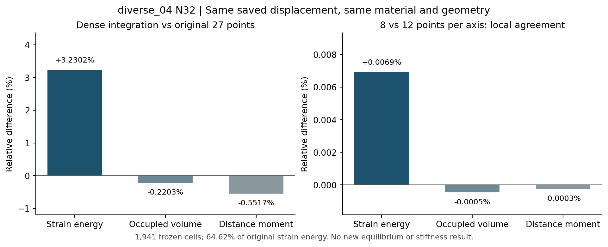
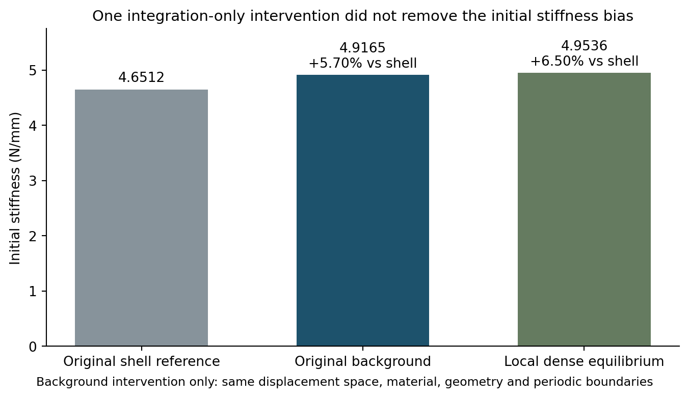

# 局部积分会影响响应，但没有消除约5%的初始偏硬

2026-10-08，r33–r34。**本次继续以查明初始5.7025%差异为重点，而不是把它当作“已经足够小”而放弃解释。** 固定原位移的局部密积分发现稳定的采样差异；随后仅改变相同区域的积分、重新达到初始静态平衡，背景刚度反而略增，与原壳差异变为6.5014%。这为排查提供了反证：补足这片主要承载区域的积分不能消除偏硬。剩余主因仍未定位，没有修改生产方法或宣称完成20%与设计梯度验证。

## 为什么做这次检查

原r30已消除质量、加载速度和阻尼的影响：diverse_04当前N32背景初始静态刚度4.916455 N/mm，同中面S3R/Standard壳4.651219 N/mm，背景高5.7025%。真实残差、宏观功/内能与周期检查通过，因此初始差异不是直接惯性反力导致。r31平直膜向补片的法向泊松收缩正确，同高斯点解析值一致，但对真实薄板偏软6.7956%；这降低了“通用法向收缩实现错误”的优先级，不能据此排除曲面约束。

r32读取原壳静态场，膜内储能为ALLSE的95.3179%，弯曲3.7568%，未重建0.9253%。同中面、真实厚度与同一膜能公式下，背景/壳已有位移迹的膜能差1.7902%。这些是同状态后处理证据，不是5.70%的因果贡献；不能把百分比相减，给剩余项取一个原因名字。既然初始以膜内承载为主，本次检查优先针对主承载曲面的材料与应变积分，而非再次加密整个网格或运行20%路径。

## r33：保持同一位移，只改变局部后处理积分

选区沿用r32固定的壳重建储能密度最高的前20%中面面积。背景单元只要至少有一个原Gauss点同时满足φ≥0.01、最近周期中面三角面在该区域，就入选；运行前冻结列表与SHA256，共1941个单元，占32768个单元的5.9235%。积分的是这些完整背景单元，并非恰好只积分前20%面积下方的材料。这片单元在原位移场下贡献全域储能的64.6216%，覆盖主要承载区，但其余单元没有做密积分。

固定原Q2位移场，在每个积分点按同一形函数评价应变。初始材料能为W₀=λ(tr ε)²/2+μ ε:ε，λ和μ由同一E=10 MPa、ν=0.3决定；真实能量密度为[η+(1−η)φ]W₀，η=10⁻⁴。占据φ仍为原周期三角中面距离的sigmoid带：名义厚度0.5 mm，10–90%界面宽0.05 mm。这里是原NH在零态的初始线性切线，没有改变有限变形材料、厚度或界面参数。

先重现原27点占据与能量；再仅在冻结单元使用每轴8点及12点Gauss-Legendre规则，即每单元512及1728点。**积分点增加不代表节点或位移自由度增加**：背景网格仍N32 HEX27，原位移保持不变。选区、两个层级、900秒预算和1%层级相互差关口在运行前固定，未根据结果改变。

| 固定选区的积分量 | 原27点 | 每轴8点 | 每轴12点 | 12点相对原值 |
| --- | ---: | ---: | ---: | ---: |
| 占据体积M₀，mm³ | 32.688825 | 32.616674 | 32.616824 | −0.2203% |
| 距离二阶矩M₂，mm⁵ | 0.685055 | 0.681274 | 0.681276 | −0.5517% |
| 储能U，N·mm | 1.588546×10⁻⁶ | 1.639973×10⁻⁶ | 1.639860×10⁻⁶ | +3.2302% |

M₀=∫φdV表示材料占据量；M₂=∫φd²dV表示到最近中面的材料距离分布，不能直接当成弯曲刚度。储能还受到各点应变的权重影响。因此，即使体积略减，能量仍可能增加，不能按材料体积的百分比推断反力百分比。

两密积分层级的能量、M₀、M₂相对差分别为0.006914%、0.000462%、0.000253%，均通过预定1%关口；这里只称该选区积分量相互稳定，不称全域积分或物理解收敛。选区能量增加相当于原全域储能的2.0874%，此时仍不是新刚度。原常系数ηW₀能量不变，因为规则Q2初始应变的多项式能量已能由原3×3×3高斯规则精确积分；新差异来自非均匀占据与应变的耦合积分。

## r34：只替换上述单元的积分，再求一次初始静态平衡

固定状态的能量差不能直接判断平衡后的刚度：换积分后，原位移通常不再满足新离散平衡，允许的位移会重新分配。因此，在两级局部积分稳定之后，执行一次单因素因果对照。1941个单元采用已检查的每轴12点规则，其余30827个单元仍用原27点；节点、Q2位移空间、原中面、t/E/ν/η/界面、XYZ周期波动与宏观横向应变零全部相同。宏观压缩为10⁻⁴，即0.01%，端部位移量0.001 mm。此处不使用质量或阻尼，没有新Abaqus作业，壳参考也未改变。

独立诊断复用r30周期初始静态PCG结构，仅加入冻结区域的新旧单元矩阵差。矩阵的对称性、刚体平移零能与r33固定状态能量重现先通过，再进行一次重新平衡。总预算900秒，最多6000次迭代，不追加预算或层级；“是否接近壳”与“数值求解是否有效”分开判断，不设必须改善的结果关口。

| 同一初始压缩与参考 | K₀，N/mm | 相对原壳 |
| --- | ---: | ---: |
| 原同中面S3R/Standard壳 | 4.651219 | 基准 |
| 原N32背景，全部27点 | 4.916455 | +5.7025% |
| 仅1941单元密积分后重新平衡 | 4.953612 | +6.5014% |

新背景刚度相对原背景增加0.7558%；与壳的相对差增加0.7989个百分点。若仍固定原位移，混合积分全域储能为2.509541×10⁻⁶ N·mm；重新平衡后为2.476806×10⁻⁶ N·mm，释放3.273512×10⁻⁸ N·mm，但仍高于原背景储能2.458227×10⁻⁶ N·mm。这个结果也说明，不能把r33局部能量的+3.23%或全域能量量级的+2.09%直接当成新刚度变化。

1750次迭代收敛，真实自由残差9.99×10⁻¹¹；宏观功/内能相对差6.38×10⁻¹²，周期波动差0，恢复原固定平移点，有限性与原初始小应变关口通过。另用8个按固定列表等距抽取的单元、固定随机种子34、3组位移，核对新旧单元矩阵与直接应力积分，最大相对差2.99×10⁻¹⁵。此额外实现检查没有改变预定求解关口或“改善”判定。采样的最大初始应变下降，但不据此认证全域变形精度或屈曲路径。

## 对5%来源的判断，以及后续顺序

本次可以排除的是**“补足这片主要承载区的积分就能消除初始偏硬”**；该干预反而略增刚度，暂不采纳为生产修正。不应扩大成“积分没有影响”，更不能扩大成“所有积分误差都被排除”：其余单元仍保持原规则，曲面材料表示及可实现的变形也未改变。初始5.7025%差异仍然是待解释的基础问题。

当前更值得追查的是曲面三维实体与壳的局部运动学、穿厚度松弛及材料带表示如何共同改变承载。它们即便具有同一E/ν/t，也不是同一个离散物理模型；局部法向应力或剪切能并不自动是错误，也可能含真实有限厚度效应。下一项只复用r30/r34两组已有位移，沿原冻结区域与中面方向比较固体内部、过渡界面、低占据区域的穿厚度应变/应力剖面及法向/剪切能量。协议、选区、阈值和分母启动前固定；使用同一口径，避免用点态释放的几个百分比扣掉整体误差。先判别差异集中在何处，再决定是否有依据进行一项可兼容的初始平衡干预，不直接把各点改成平面应力。

不继续加积分层级、加密N64或反复扫E/t/η/阻尼，不给曲线乘拟合系数。原四步第1～2步保持完成，第3步完成本次局部积分因果检验但曲面原因仍未定位，第4步生产改进及两构型短段未执行。现有前向可行性证据、diverse_04完整20%未通过及完整设计梯度未认证的边界保持；不把初始偏差认定为全部峰位错开之因。

## 计算成本与保存位置

r33选区准备0.916秒；同状态积分与检查1.693秒，8/12两密积分主体分别0.281/0.782秒。r34矩阵准备及编译28.156秒、平衡求解与末态检查23.220秒，总51.375秒；额外实现核对与绘图单独完成，未改变物理求解。以上为脚本内部计时，不含工具调用与文档整理。

正式证据仅在WSL `/home/xuehu/projects/tpms_jax/validation/local_quadrature_20261008_r33/` 和 `validation/local_reequilibrium_20261008_r34/`。r33保存预定协议、选区哈希、原/两级逐单元积分数组、基线检查与结果；r34保存独立诊断、预定协议、矩阵核对、收敛记录、新静态位移、结果及图。Windows仅有本阅读报告与两图。原生产文件、旧科学数据、原INP/ODB保持；本轮没有GitHub提交、推送或合并，没有活动作业。

r33首次启动因NumPy布尔值不能直接JSON序列化而停止，未进入密积分；仅将两处检查转换为Python bool后继续，原失败日志及修复收据保留。没有改变数值规则或事后放宽检查。r33是无FEM的后处理，r34是独立的一次初始FEM平衡干预，两者范围分别记录，不能混写。
