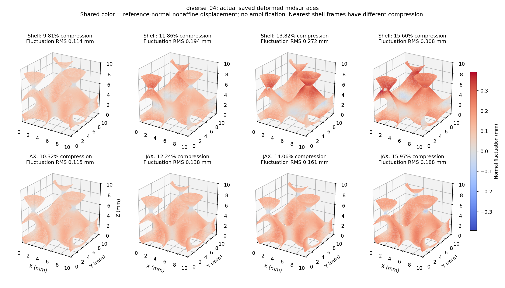
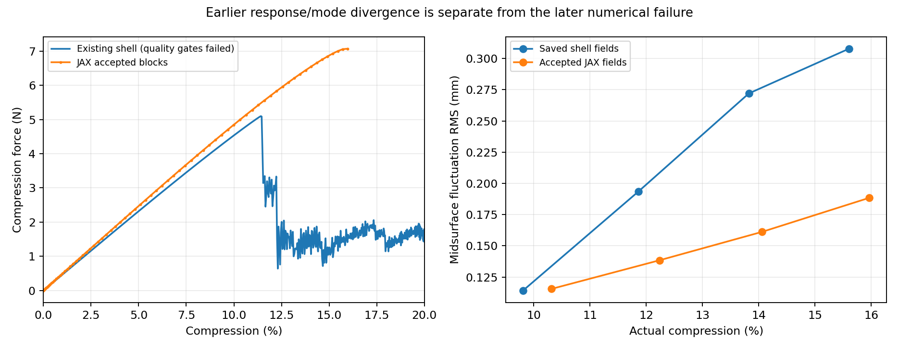

# diverse_04机制定位与短步长因果试验

2026-10-07，r17。研究目标仍是：薄壁TPMS能否用背景网格/JAX可信计算大压缩，并为以后有效梯度提供基础。本轮完成新规划第1步及第2步的一次短因果试验；没有完成新的20%验证，没有启动设计AD或训练。

## 主要结论

已有足够证据把两个问题分开。约11%～14%的壳/JAX转折差异发生在本次数值崩溃之前，双方逐渐走向不同的变形路径。约16%的首次数值崩溃则包含明显的显式步长失效：软孔隙局部畸变增大，当前刚度对应的高频已超过初始步长可稳定积分的范围，随后同一背景运动场拖动6个NH积分点翻转，产生NaN。仅在这一时间窗口缩小dt即可避免原来的崩溃，但不能据此认证20%或解决较早的分支差异。

原r15/r16失败与壳质量失败均保留。新结果支持继续研究时间推进，而不支持宣布通用替代Abaqus已经完成。

## 做了什么；参数是否改变

原diverse_04中面，单胞边长10mm、壁厚0.50mm、均匀NH实体E10MPa/ν0.3、密度1000kg/m³，XYZ周期波动、宏观横向应变0。HEX27 N32、65³节点、每单元27Gauss点、HRZ质量、η=1e−4、界面宽度0.05mm、objective_void原C²常数全部保持。JAX加载/保载时间0.004/0.0004s；本轮仅读取既有壳0.040/0.004s ODB，没有新增Abaqus作业。两个原加载速率并不相同，此事实不掩盖。

唯一显式入口只加可选留存/重放诊断。共享材料、单元内力、HRZ、中央差分公式及ExplicitXYZ类保持。原参数定位仍按原128步分块推进，首次拒绝后从块起点逐步重放，保存首错前后并停止。拒绝重放不并入主接受路径。另一次短因果试验从真实最后接受状态出发，只改变dt，按原加速度重定位半步速度以保持同一中心速度，重放同一物理时窗。

## 1. 首次异常的先后关系

| 位置 | 实际压缩 | 观察 |
| --- | --- | --- |
| 主路径最后接受块 | 15.96624% | q、能量、内力均有限；NH最小J=0.07987；动能/应变能0.160% |
| 重放第29步，首错前 | 16.02294% | NH仍全正J，最小0.07758；虚域最小J=−278.83；动能/应变能突增到25.17% |
| 重放第30步，首错 | 16.02489% | q及J仍有限，但6个未续接NH点负J、能量/应力NaN；其中3点占据≥0.5 |

q是周期波动位移，J=detF是当前与参考局部体积的有向比。NH原材料必须J>0；软孔隙允许报告实际翻转，不能把实际负J夹正。占据φ≤0.001为深虚域，0.001<φ<0.01为混合虚域尾部，φ≥0.01为未续接NH域；φ不是第二种真实材料。

在首错前一步，所有材料应力仍有限，深虚域最大F范数约15.44；到首错步，深虚域F范数约338、有限应力范数约6.49×10⁷MPa。周期波动最大值从约1.66mm跳至36.04mm，远超10mm单胞尺度。这是数值爆发，不能当真实压缩响应。首个NaN在NH越界时出现，旧r16拒绝末端发现的深虚域溢出属于更晚的传播现象，不能再当首次触发证据。

这些数据定位的是本次同设备/原算法重放下、按原有效性判据观测到的首错；不认证未积分位置或无限精确的全局起始机制。主路径共有79个块端观察（含初态），到15.9662%；随后29条有效内部重放观察仍为诊断，首错前一步虽有限但质量已差。

## 2. 为什么怀疑步长；是否有独立证据

中央差分对冻结的无阻尼线性正频率要求dt×ω_max≤2。这里没有组装全系统刚度，也没有修改负刚度；只用共享能量的机械切线，在首错最大位移增量附近选81个周期自由度，计入其全部27个邻接单元，采用原全局HRZ质量组装限制矩阵。其最大特征值给全系统最大正频率的下界。

| 同一局部支撑上的冻结状态 | dt×ω的下界 |
| --- | --- |
| 初态 | 0.659 |
| 14.0586%接受态 | 0.973 |
| 15.9662%接受态 | 1.524 |
| 首错前一步16.0229% | 11.693 |

下界超过2足以说明该冻结切线已违反原dt的正频率界限；低于2不能认证全系统稳定。首错前这个局部界限要求dt不大于约4.61×10⁻⁸s，而原dt为2.693×10⁻⁷s，至少大约5.85倍过大。矩阵对称误差约2.3×10⁻¹⁶，直接Rayleigh商与特征值一致。负特征值保留，它们不是本诊断用来“夹正”的对象；这也不是全局屈曲模态或设计梯度。

另将该最高局部正频率方向的Rayleigh曲率按材料域分解：深虚域99.9078%、混合虚域尾部0.0598%、未续接NH域0.0325%。这直接支持该局部高频主要由深虚域大畸变驱动；它是选定方向的切线贡献，不是总能量、总反力的占比，不认证整个结构的屈曲首因。原频率结果保持，新增分解在patch_frequency_domains.json。

据此能判断：初态波速估计不能保证大畸变后的时间稳定性，等128步块末出现NaN才回退可能错过局部快速失稳。不能仅据一次冻结切线宣称所有早期差异都由dt造成。

## 3. 单因素短重放结果

步长选择原值1/8=3.367×10⁻⁸s，依据上面的至少5.85倍超限加安全余量，未按壳反力选参数。原128步对应34.474微秒；新步长走1024步，物理时间、材料、占据、质量、初始中心速度与加载函数保持。

| 项目 | 结果 |
| --- | --- |
| 起点→终点 | 15.96624%→16.21386% |
| 是否越过原16.02489%首错时刻 | 是 |
| 监测中NH翻转/非有限量 | 0/0 |
| 终点NH最小J | 0.04793，仍较小且在下降 |
| 终点动能/应变能 | 1.995%，未过本窗口5%停止线 |
| 终点动态压缩反力 | 6.852N，仅作局部窗口记录 |
| 整个调用 | 75.12s，含重新构建/编译；原参数定位436.32s |

缩小dt改变了原崩溃窗口的行为，因此时间推进失稳是有证据支持的改善方向。该结果只证明这一短窗口避免了原失败；不能推断其后都稳定、真实壁永不翻转、20%已通过或曲线准确。短路径从已有中途状态出发，不能拼装成新的完整20%接受路径。也未认证每个内部步的全部空间点。

## 4. 较早的转折差异仍是什么问题

壳ODB的真实场减去整体仿射压缩，再移除面积加权平移；JAX的Q2波动位移插值到原中面同一组节点，以相同方式对齐。波动RMS是位移向量长度平方的面积加权平均再开方，单位mm，表示偏离整体压缩的程度；模式余弦接近1仅表示方向分布相似，不是精度或屈曲认证。

| 壳/JAX实际压缩 | 壳/JAX波动RMS(mm) | 模式余弦 |
| --- | --- | --- |
| 9.81% / 10.32% | 0.114 / 0.115 | 0.998 |
| 11.86% / 12.24% | 0.194 / 0.138 | 0.816 |
| 13.82% / 14.06% | 0.272 / 0.161 | 0.760 |
| 15.60% / 15.97% | 0.308 / 0.188 | 0.814 |

壳在降载后明显增加弯曲/非仿射变形，JAX这段增加较缓，支持路径/模式差异。双方是最近保存帧，压缩不完全相同；没有壳峰值恰好11.416%的场，不插造该时刻状态。图没有放大变形，也不把壳当实体真值。壳降载时动能、人工能量和耗散明显增长，原加载惯性、能量漂移、人工能量三项未通过；壳动态分支真实性与背景方法的虚域支撑、厚度方向弯曲表达仍需区分。本轮没有测得可把这些因素排序的证据。

## 现在的判断和下一步

这次比“调参数让曲线接近”更有针对性：定位到了原先缺失的首错状态，取得了步长超限证据，并用只改dt的短窗口试验检验。它降低了“求解器无缘无故算不了”的不确定性，支持继续沿背景网格/JAX路线研究。但diverse_04完整20%前向与跨构型替代结论仍未通过，完整梯度仍未认证。

主规划第2步下一项是一个前置、状态相关的时间步控制候选：复用共享材料切线与原质量，用分批单元贡献形成质量归一化刚度的保守绝对行和上界，限制正频率时间步；不把有限次幂迭代的下界冒充安全上界，不投影真实负刚度。先在已保存状态验证界限/内存/耗时，再按价值决定一次完整前向。如果保守界限过度压低dt或NH域仍塌陷，报告其限制再选择虚域候选，不无限缩步凑完成。

此控制首先处理数值崩溃。第3步才处理转折/分支与壳参考质量；第4步才作有限迁移。自接触、塑性或新虚域能量都没有自动加入。未来路径AD需另核对实际接受时间网格与控制决策，目前不继承旧AD认证。

## 文件与验证

正式实验：`/home/xuehu/projects/tpms_jax/validation/mechanism_20261007_r17`。`original_diagnostic/`含接受块路径、四个接受场、最后接受态、首拒绝块及逐步重放前后状态；`short_dt_replay/`只含短窗口输入/路径/状态。两者各有运行源码，不冒充完整20%。`analysis/`有全27点材料域统计、局部切线与频率、模式/曲线图；`shell_frames/`为只读旧ODB提取。顶层manifest/receipt/log保留输入、源码和调用成本。

程序为`/home/xuehu/projects/tpms_jax/scripts/thin_target_explicit.py`，默认关闭诊断，仍只有一套共享FEM内力。相关维护检查20/20通过（CPU27.72s）：包含真实周期NH的块/逐步等价、首错保留、短重放中心速度与物理时间窗一致性。它们不认证大模型精度或完整设计AD。新增留存元数据跟随实际接受态的dt，防止后续失败试验的减步dt错配半步速度。

r15/r16共94个旧文件SHA256全部保持；共享材料/周期/原线性模块和锁定环境原字节保持。没有新Abaqus作业、完整AD、训练或几何扫描。本轮未提交GitHub，程序与文档为本地研究改动；原主规划保存在history。详细追溯见verification.json与evidence_manifest.json。
