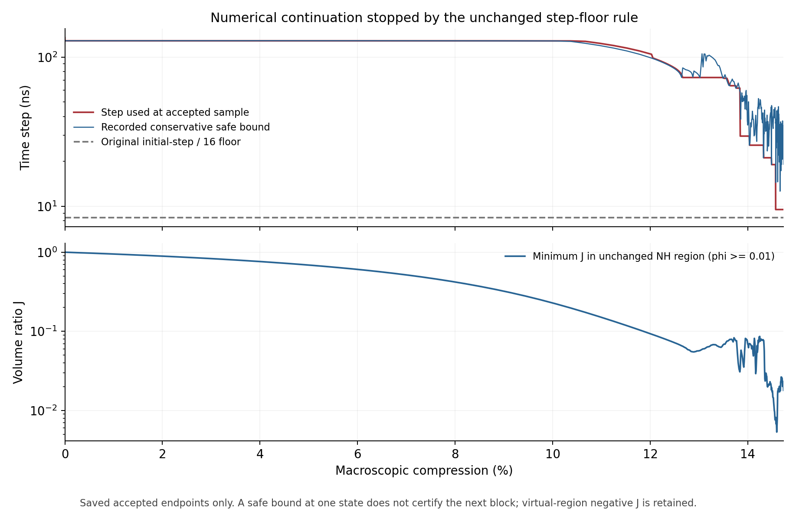
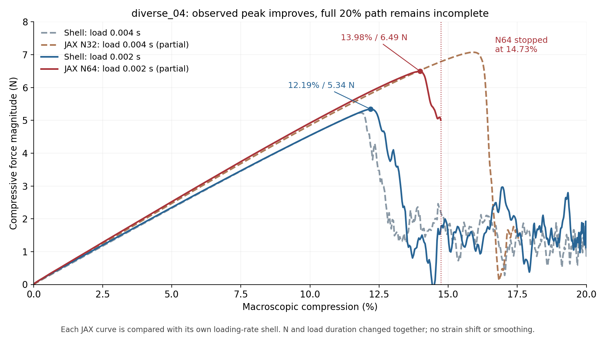

# r28：N64尝试结束，峰值更接近壳，但尚未完成20%压缩

更新：2026-10-08。本报告读取已保存路径、壳提取数据和停止记录；没有重新提交Abaqus、继续JAX求解或开展梯度/训练。**本次确有部分改善，但不能宣布N64解决了误差，也不能认定研究路线不可行。**

## 1. 这次到底做了什么

前一轮平板弯曲诊断r27发现：0.5mm壁厚只跨N32背景的约1.6个单元，窄占据带的采样可能使抗弯截面矩明显偏低。因此，本轮直接尝试diverse_04的N64完整压缩，看空间分辨率提高是否能让响应更贴近壳模型。N表示单胞每个方向的单元数，并非每个单元节点数；HEX27表示每单元27节点的二次位移近似，27个Gauss点负责材料积分，两者含义不同。

| 项目 | 实际设置与变化 |
| --- | --- |
| 目标结构 | diverse_04，同一中面；单胞10mm、壁厚0.5mm（边长的5%） |
| 背景分辨率 | N32→N64；单元边长0.3125→0.15625mm；壁厚约跨1.6→3.2个单元 |
| N64规模 | 262144单元、2146689节点、7077888积分点 |
| 材料、几何表示 | NH基材E=10MPa、ν=0.3；sigmoid占据、η=10⁻⁴、界面10–90%宽0.05mm；objective_void/C²规则保持 |
| 位移、积分与质量 | HEX27、每单元27点、HRZ正集中质量；新参考Gauss点重新计算占据、质量和稳定步长 |
| 边界 | XYZ周期波动，宏观横向应变零；与之前相同，不是摩擦压板试验 |
| 时间 | 用户授权缩短：加载0.004→0.002s，保载0.0004→0.0002s；先完成同速率壳参照，再一次JAX从零尝试 |
| 计算范围 | 显式中央差分；支撑因子仍1，不带r26的0.1；未加入JAX阻尼、质量缩放、塑性或接触 |

N64资源存储适配已通过小非均匀模型等价核对，材料和内力仍调用唯一生产入口。分辨率和加载时间在本次一起变化：下面每条JAX都对自己的同速率壳比较，**不能把新旧JAX之差全部归为网格效应**。NH本构没有速率项，也不意味着动态曲线不受加载时间影响。

## 2. 完成范围和停止原因：不是预算耗尽

新壳完成20%与保载；N64从零路径接受了12896步，到14.732049%压缩、物理时间0.001264446s后停止，没有20%末态或保载数据。流水线总墙钟7012.23s，约1小时56分52秒；JAX求解包装段6239.91s（约104分钟），受控推进主体6223.79s。3小时上限没有耗尽。主体中稳定上界评估约33.37分钟，占32.2%，观测约3.22分钟；这是已记录的计算成本，不是新计时试验。

最后接受的反力幅值为5.00672N。停止记录是“Finite rollback reaches unchanged initial/16 safeguard”。三次试算块均因端点的保守正频率上界不允许该步长而拒绝。最后使用dt=9.525ns；规则要求下一次减半到4.762ns，但原保护底线是8.416ns，于是停止。这是有限减步保护触发，不是因跳跃区动能较高而停止，也不是延长墙钟就能自动解决。

显式方法不必每步做全局Newton，但仍需满足与最大振动频率有关的稳定步长限制。Abaqus理论同样给出中央差分的频率条件，并区分保守估计与真实系统极限；本项目使用的保守上界不是已经求得的真实临界频率。因此，既不能直接越过保护继续，也不能由触底单独断言物理结构已无法计算。[Abaqus显式理论（公开2025手册，安装版本2026）](https://docs.software.vt.edu/abaqusv2025/English/SIMACAETHERefMap/simathe-c-expdynamic.htm)。

## 3. 响应有何改善，哪些地方仍然不好

图中反力取压缩幅值；旧N32数据是原r18接受路径，只到17.5363%，不是完整20%。新N64也只有14.7320%之前的路径。两条壳曲线完整覆盖20%，但与背景是不同离散模型。

| 在各自已覆盖加载段内观察到的最大反力 | 旧N32/0.004s | 新N64/0.002s |
| --- | ---: | ---: |
| JAX峰所在压缩量 | 15.9409% | 13.9817% |
| 对应同速率壳峰所在压缩量 | 11.8241% | 12.1900% |
| 峰位置差 | 4.1168个百分点 | 1.7917个百分点 |
| JAX峰力 | 7.07239N | 6.49489N |
| 对应壳峰力 | 5.22999N | 5.34091N |
| 峰力相对差 | +35.23% | +21.61% |

新N64已出现一次明显降载：由6.49489N下降到已接受末端的5.00672N，下降约22.91%。所以它不仅算了初始增载段，也覆盖了一次局部峰及部分下降过程。**峰值确实比旧组合更接近壳，仍明显偏晚、偏高；这只是覆盖段的最大反力，不是完整20%路径的全局峰认证。**

为了避免拿不同终点的误差直接比较，另取两组都有数据的相同压缩窗口，不移动横坐标、不择优平滑，在1001个等压缩点上比较。曲线指标是反力差的均方根RMS（单位N），除以各自同速率壳的加载峰力；它不是每一点的相对误差。功是压缩力沿宏观位移的积分，单位N·mm，功差用对应壳的功作分母。下表是事后明确标注的描述性窗口，不替换启动前的完整验收要求。

| 相同窗口指标 | 旧N32对0.004s壳 | 新N64对0.002s壳 |
| --- | ---: | ---: |
| 1–5%曲线RMS/匹配壳峰 | 1.74% | 2.06% |
| 1–10%曲线RMS/匹配壳峰 | 3.51% | 4.18% |
| 0–10%功差 | +6.44% | +7.75% |
| 1–14.7320%曲线RMS，N | 1.84849 | 1.69505 |
| 同窗口RMS/匹配壳峰 | 35.34% | 31.74% |
| 0–14.7320%功差 | +32.85% | +28.58% |

早期1%、5%、10%三个位置，新N64力差分别约+5.81%、+7.53%、+8.34%。这支持低压缩段仍相对接近，不支持“加密后早期精度更好”：上述早期指标略差。越过壳的降载点后，两者分支错位，曲线和功差显著增大。将峰略微提前与整段曲线已经准确混为一谈是不合适的。

原固定历史分母2.258914N也保留：1–14.7320%窗口的RMS/历史峰为旧81.83%、新75.04%。它来自早期另一参照，不能与当前匹配峰归一的31.74%混用；原35.34%也不能与旧17.5363%终点的指标当作同窗口比较。启动前要求完整20%及保载，当前完整验收为空，未追认通过；覆盖段指标已经显示不只是“尚未算完”一个问题。

## 4. 从保存记录能排除什么，仍不能排除什么

**接受态没有记录到未续接NH域的材料定义失败，但局部压缩很严重。** J=detF是积分点的局部体积比，不是宏观压缩量。φ≥0.01是必须实际J>0的NH区域，既有实体核心也含低占据界面；接受端点中最小J约0.00534，末端约0.017995，均为正。不能将这个最小值直接称作实体核心，也不能用有限端点采样认证全部内部步骤或所有空间位置。

低占据人工域仍有真实负J，最大记录15918点，全部位于φ<0.01；全部积分点最小J约−21.31。C²人工续接保持实际F/J并使该域能量可求值，没有把翻转修成正体积，也没有建立自接触。负J点数占总积分点约0.225%，不是能量占比，更不是“可以忽略的物理空气”证明。

**能量平衡没有显示接受路径总体爆炸，但它不能证明物理曲线准确。** 保存接受态的最大储能+动能与外功缺口，除以最大外功，约0.00335%；末端KE/U约6.94%，1%之后的最大记录约10.16%。允许跳跃阶段动能上升的约定保持，旧准静态关口不改写为通过。能量一致说明当前离散模型推进有内部一致性证据，不能消除占据、弯曲、质量或分支误差。

峰处宏观动力反力6.49489N，内部力对应6.30130N，显式惯性提取项约占2.98%。即便仅对该状态取内部力，它比壳峰仍高约17.98%。因此，当前差异不能只归为“反力输出多加了一个惯性项”；整个状态仍由动态推进产生，这也不是静力修正结果。

**当前步长瓶颈不宜直接沿用r26的深虚域解释。** 对保存的最大上界行做位置核对：初始、10%、12%、观察峰及末端的相邻参考单元，均同时覆盖部分壁/界面/虚域，不是全为φ≤0.001的深虚域。该检查只定位已有记录，不是行贡献分解，更不是拒绝端点根因定位。当前不能断言降低η或支撑就能解决。

步长控制只减不增，并在拒绝后减半；末端接受态记录的安全上界约为使用步长的2.01倍，说明该政策可能有成本限制。但下一块恰恰未过端点上界，所以这个比例不能授权直接把dt翻倍。近小J时材料切线增长、保守估计与控制政策各有多少贡献，仍需局部证据。

## 5. 参照和归因的限制

新旧壳只改了加载/保载与输出时间间隔，网格、中面、材料和周期约束保持。新壳峰比旧壳晚0.3660个百分点，峰力高2.12%。这提供时程影响的实际尺度，但不能把壳的速率变化直接当作JAX的速率误差上限；JAX离散质量与虚域均不同。

新壳完整且周期约束核对通过，但全程能量漂移约6.02%、人工能量/最大外功约11.15%、末端KE/内部能约18.26%，未过原严格质量关口。它是允许动态跳跃下的有条件工程参照，尚非高质量准静态真值。没有据此放宽当前JAX目标，也不能对本次偏差宣称全部是JAX或全部是壳造成。

r27已经证明特定平板的采样抗弯误差；r28证明提高分辨率与缩短时程的组合改变了复杂构型的峰。两者连起来支持“空间表示值得继续研究”，但尚未建立“薄壁采样就是diverse_04峰错位的唯一原因”。壁厚跨3.2个单元也不是准确性保证，界面仍窄，曲面方向、三维与壳运动学、几何刚度及动态分支触发可能参与。

## 6. 对科研可行性的实际含义及后续顺序

diverse_28在三个厚度采样的完整20%前向结果仍成立，其限定反力/曲线/功最差差异8.28%/7.48%/7.31%，不能因本次失败抹去。diverse_04则继续暴露两个独立问题：屈曲前后响应分支仍与壳有较大差别；数值推进在固定步长底线前不能完成20%。本次改善是真实记录，距离跨构型约10%的工作目标仍有明显距离。

当前方法可以给出有依据的限定薄壁响应，尚不足以承诺通用20%替代Abaqus。自动微分接口与已有局部证据保留；r28没有设计求导，不能增加完整路径梯度认证。原NH20%厚度导数符号失败、新核完整20%与形态梯度未验证的事实保持。仿真精度与推进优先，训练继续后置。

建议下次先做**一个N32、加载0.002s的匹配路径**，复用本次壳，不建新复杂Abaqus模型。它补上相同加载速度的N32/N64因果对照，再判断峰提前有多少是网格参与；窗口、分母和预算启动前固定。之后仅在既有N64保存态针对步长上界作局部贡献诊断，区分壁/界面刚度、人工域及保守控制的影响。只有有依据且短块稳定性通过，才考虑一次受预算约束的完整重新推进；不拼接短重放为完整路径，不直接提高步长或降低材料保护，不盲试N128。这里仅给建议，本次没有自动执行后续。

## 7. 文件、整理和保留

唯一正式目录：`/home/xuehu/projects/tpms_jax/validation/n64_resolution_20261008_r28`。本报告正式为REVIEW.md，Windows阅读仅保留output/r28_n64_resolution_20261008/README.md。

| 文件/目录，相对正式r28目录 | 用途 |
| --- | --- |
| protocol.json、before_rate_revision/ | 启动前规则、缩短时程前规则，不事后修改 |
| full_from_zero/accepted_path.json | 一次从零接受路径，至14.7320% |
| full_from_zero/stability_path.json、rejected_blocks.json、failure.json及保存场 | 接受态上界、拒绝块、停止与检查点证据 |
| abaqus/explicit_T0p002/results/shell.json | 新壳原始提取及质量检查 |
| comparison.json | 原自动比较：完整性false，完整验收null |
| analysis_summary.json | 本次只读同窗口指标、峰对比与保存记录定位 |
| force_comparison.png、step_and_material.png、response.png | 核心反力图、推进保护图、原四面板诊断 |
| pipeline_progress.json、pipeline_receipt.json、full_receipt.json | 原结束与计算停止记录；returncode=1保留，不改成成功 |
| postprocess_repair_receipt.json | 原绘图参数错误已修复，重读结果成功；comparison.json哈希未变 |
| organization_receipt.json | 当前文档同步、受保护文件哈希、辅助工具归档记录 |

新壳INP/ODB留在 `E:/ABAQUS/2026temp/Abaqus_Work/tpms_jax_abaqus/n64_resolution_20261008_r28_shell_T0p002`。正式求解、原数组与日志不搬迁；Windows已完成制作/传输工具放history，当前入口不再并列“暂停”“执行中”等旧状态。历史文档快照保留。

原流水线的绘图错误是Axes.set不接受linthresh；本次改为Axes.set_yscale接收它，仅修复已保存结果的画图。原比较JSON、流水线失败收据、六生产/环境文件、三安装库文件及六项关键旧证据保持。没有修改物理生产程序或提交GitHub。
