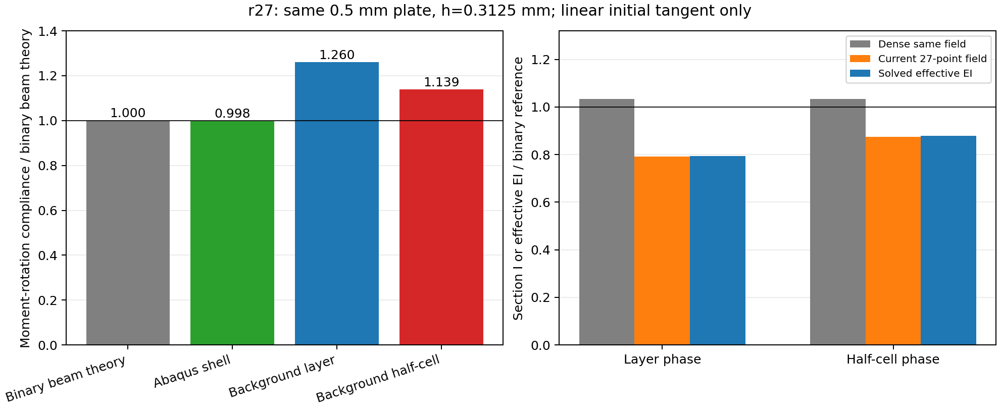
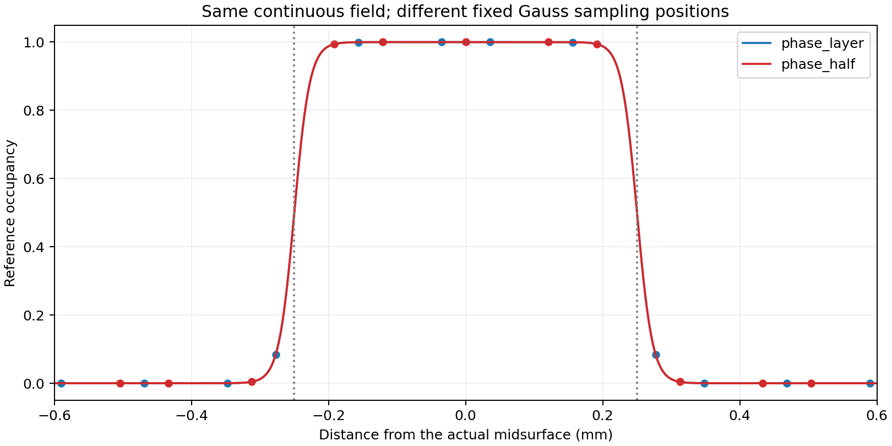

# r27：薄板弯曲暴露积分采样偏差，TPMS峰位原因仍未确定

2026-10-08。**两次背景静力求解都有效，一次独立Abaqus壳参照通过，但背景对壳的弯曲柔度误差为26.26%和14.14%，没有通过预设±10%目标。更明确的进展是：当前27点对同一连续场的截面二次矩低估23.40%和15.30%；实际求出的弯曲刚度与该采样二次矩预测仅差约0.35%。本例主要问题指向薄壁占据的积分采样，不支持“背景基础弯曲一律偏硬”。**

这是主规划第3步选定的小型诊断。r25近零填充失败和r26预算停止保持；没有延长r26、提交有限填充、恢复VUEL或模式搜索，也没有新增TPMS20%路径或梯度计算。运行前定义在[PROTOCOL.md](PROTOCOL.md)，机器数据在[comparison.json](comparison.json)。

## 1. 为什么先研究一个平直薄板条

diverse_04的同速率观察峰仍为壳11.8241%、JAX15.9409%。直接在复杂TPMS中同时解释弯曲、膜拉伸、几何折叠和动态触发，很容易把数值失败误作某个物理因素无影响。r26只到13.0777%，没有完整峰窗口，却表明弱化虚域会使深孔隙畸变并拖慢推进。因此本次先去掉屈曲、惯性和大畸变，问一个更基础的问题：当前薄壁背景表示能否正确计算初始弯曲？

小问题失败不等于整个研究不可行；若能分解误差，就能提出有依据的改进，而不是调厚度、模量或阻尼去贴参考曲线。此前diverse_28的有限20%前向依据保持，不能被这个薄板结果改写，也不能反过来掩盖此处的采样问题。

## 2. 两端怎样保持物理参数对应

薄板条长10mm、宽1.25mm、厚0.5mm；基材E=10MPa、ν=0.3。一端夹持，另一端施加纯弯矩My=0.0001N·mm，其他边自由。该局部试验采用悬臂，是为建立明确的弯曲参照；原TPMS的XYZ周期压缩边界完全未改。本次不重新比较TPMS压缩边界。

背景盒10×1.25×2.5mm，32×4×8个HEX27单元，共1024单元、9945节点、29835位移自由度，单元边长h=0.3125mm，厚度只有1.6h。每单元仍为3×3×3=27个Gauss点。HEX27是27节点二次位移单元；27个积分点是另一个概念，二次位移能力不能保证一个很窄的占据过渡层积分准确。

连续占据φ采用原厚度距离函数，界面10%～90%宽0.05mm，η=1e−4，C²门控和虚域公式不变；r26诊断倍率没有带入。平中面距离为|z−zc|。这里的初始材料权重是s=η+(1−η)φ。不是把真实薄板改成另一种材料，也没有调整物理厚度。

背景刚度使用原共享material_stress在F=I处的自动微分切线，配合原JAX-FEM/Basix形函数、真实Gauss点及权重，独立求解自由位移的线性平衡。该切线已与s倍线弹性Lamé张量核对，最大分量差3.55e−15。只是本次独立静力诊断使用SciPy稀疏直接求解；不是改造生产显式入口，也不是新的通用求解框架。HRZ质量和显式时间推进在静力问题中不参与，因而本次不能评价质量/时间步因素或完整有限应变算法。

Abaqus2026/Standard用一个64×8的S4R壳网格，512单元、相同板条/夹持/总弯矩。小变形线弹性E/ν取原NH的初始切线；不是改用线弹性来声称20%超弹性已验证。壳端弯矩按宽度权分配到节点转角，背景则施加与s(z)加权的轴向面力偶，扣除形心并归一化，使净力为零、总弯矩相同。两端总载荷与能量共轭量对应，局部载荷分布和自由度并非逐点等价。

两个预先固定的嵌入位置是zc=1.25mm（中面在网格层面）和zc=1.40625mm（平移h/2）。物理薄板完全相同；只改变它相对于背景积分点的位置。二者复用同一壳参照。有限背景盒软域的密集连续截面矩只变化约0.0567%，远小于本次9.60%的柔度变化；没有把有限盒误称无限平移不变。

## 3. 为什么要同时看柔度和截面二次矩

纯弯曲中，截面惯性矩I=∫(z−z̄)²dA决定EI。离中面越远的材料，对抗弯的贡献按距离平方增大；只看体积/平均占据可能错过弯曲误差。二值矩形薄板I0=b t³/12=0.0130208333mm⁴，EI0=0.130208333N·mm²。

本次广义端转角Q=fᵀu/My，柔度C=Q/My，有效刚度EI_eff=My·L/Q。柔度越大表示越容易弯，刚度越小；柔度百分比与刚度百分比不能混用。二值Euler–Bernoulli梁理论C0=76.8(N·mm)⁻¹。壳有独立UR转角，背景用端部位移与力偶的功定义Q；二者可比但不要求单个点位移一致。

还分别计算同一sigmoid/η的密集连续积分I_s，以及当前实际27点给出的I_q。I_s是在原定义下用独立一维高精度积分求得，不是修改模型或重算全网格；I_q来自当前实际Gauss坐标、占据和体积权重。于是可以依次区分：二值薄板到连续场的模型差，连续场到有限积分的采样差，以及实际自由平衡的运动学/端部差。

## 4. 结果：数值有效，弯曲精度未通过

| 情况 | 柔度C，(N·mm)⁻¹ | 相对壳柔度 | 有效EI，N·mm² | I_q相对密集I_s | EI_eff相对E I_q |
| --- | ---: | ---: | ---: | ---: | ---: |
| Abaqus壳 | 76.614758 | 基准 | 0.130523 | 不适用 | 不适用 |
| 中面在网格层面 | 96.737328 | +26.26% | 0.103373 | -23.40% | +0.348% |
| 平移半个网格间距 | 87.447354 | +14.14% | 0.114355 | -15.30% | +0.339% |

壳柔度比二值梁理论小0.2412%，通过预设5%参照关口。根部弯矩平衡相对误差约2.02e−9，合力平衡通过；ALLAE/ALLSE约0.00138%，通过1%人工能量关口。它在此小问题中是有效参照，仍不称所有TPMS壳结果是真值。

背景自由残差分别约1.12e−11与4.88e−11；能量与外功二次项、净力/弯矩、矩阵对称性和共享切线全部通过。实际F/J评估的最小J分别0.99884和0.99879，最大小应变范数不足0.00168，处于协议限定的小变形范围。因此这是有效计算揭示的精度失败，不是求解器崩溃、材料翻转或未收敛数据。

图左全部以二值梁理论柔度作分母，图右以二值截面矩或EI作分母；表内26.26%/14.14%的分母则是实际壳柔度，二者略有不同。图右蓝柱（独立求解的有效EI）紧邻橙柱（当前采样截面矩预测），灰柱表示原连续场的密集积分，并非新参数模型。

密集连续I_s分别0.0134484538和0.0134560793mm⁴，比物理二值I0高约3.28%和3.34%。这包括界面过渡及有限盒软域，并不是全由孔隙造成。当前实际I_q只有0.0103013828和0.0113968081mm⁴，比各自I_s低23.40%和15.30%。独立求解EI_eff相对E I_q仅高0.348%和0.339%。这种数量对应支持“本例积分采样误差主导有效弯曲偏软”；不足以完全排除小的端部、三维泊松和位移近似影响。

两个嵌入位置柔度相对第一位置变化−9.6033%，超过运行前固定的5%敏感性线。截面加权面积相对密集参考仅低约6.83%和2.75%，而二次矩偏差更大，说明体积接近并不能保证弯曲正确。

两条连续占据曲线在各自中面坐标下重合，点的位置却不同。薄壁边缘的材料贡献受有限采样影响，且弯曲会放大离中面材料的权重。0.05mm的过渡层相对于h=0.3125mm很窄；不能因为使用二次单元和27点就跳过这个问题。

## 5. 怎样更新误差来源判断

此前假设局部薄壁弯曲可能偏硬，本次必须据实修正：在该平直、轴对齐、小变形薄板中明显偏软，且采样相位敏感。通用的“HEX27锁定导致全部问题”没有得到支持；本例实际EI与采样预测接近，也没有证据说JAX初始材料切线有大的实现差错。

这不能直接解释diverse_04的观察峰为什么比壳晚4.1168个百分点。TPMS包含曲面各方向、膜力、几何刚度、局部折叠和动态触发，一个平板EI不是整个非线性稳定算子的替代；本次方向也不是简单的“整体变硬所以晚屈曲”。更可靠的判断是：**薄壁占据采样是一个已经量化、会改变局部弯曲能力的因素；它是否主导TPMS峰错位，仍需受控验证。** 软域/质量/触发等候选没有被排除。

原r8统一提高积分点的20%路径失败继续保留。它说明当时的整体候选没有通过，不说明27点已经准确，也不说明任何局部积分改进都无效。增加积分会暴露不同的软域畸变、材料域和步长成本；因此不能盲目在全部单元上增加点，或以峰位贴近程度挑积分规则。

## 6. 下一项怎样有依据地推进

仍留在小型弯曲诊断，只研究界面附近的复合/子域积分：位移节点与HEX27基函数不变，材料、η、界面、厚度、两个相位和物理载荷不变，把积分空间与位移空间分开。先固定一个正权重的局部积分规则、停止条件和判据，再比较同一I_s及独立壳柔度；体积分与端部载荷积分须一致更新。此报告只作选择，不已运行或采纳该修正。

有限胞原研究采用子域积分处理穿过背景单元的界面，支持上述诊断路线；其重点是正确解析材料权重，不是只增加位移自由度。[Kudela等2015原文](https://link.springer.com/article/10.1186/s40323-015-0031-y)、[体素有限胞研究2020](https://link.springer.com/article/10.1007/s00419-020-01719-x)。这些来源讨论的主要是尖锐界面，本项目为窄sigmoid场，不能直接声称已经复现其方法或继承精度结论；将其用于当前问题是待验证的项目判断。

建议新协议把I_q对I_s的误差约2%及对壳柔度约5%作为本次修复的诊断目标，并保持原数值有效性关口；这是下一项的新目标，r27原±10%的失败不改写。先做平板一次受控候选；若没有恢复，不扫描许多参数。若恢复，再另立TPMS低成本诊断，关注弯曲/膜力及采样方向后才决定是否值得从零20%。自适应选点本身可能有离散决策，今后须明确其梯度边界；本次没有形态AD认证。

## 7. 成本、文件与可复现边界

背景两次总计约23.60s。第一/第二次准备1.53/0.19s、矩阵组装8.57/8.47s、线性求解1.27/1.94s。一次Abaqus作业22.04s；后处理和工具准备另计。没有需要安装的新库，没有扩展生产程序。

Abaqus分析第一次就成功；初始后处理曾因节点集层级KeyError失败，v2又因NumPy bool_不能序列化失败。Abaqus python两次都返回0，因此退出码不足以认证提取成功。已只读修复为已声明根节点标签和内建float，v3成功输出shell.json，启动器补上结果文件与结构核查。原v1/v2、日志和作业凭据保留，没有重提作业；INP/ODB的SHA256均保持。见[postprocess_correction.json](postprocess_correction.json)和[final_receipt.json](final_receipt.json)。这些是结果提取错误，不是力学分析失败。

正式目录：`/home/xuehu/projects/tpms_jax/validation/plate_bending_20261008_r27/`。`diagnostic.py`包括本项静力求解、壳输入导出及比较；`extract_shell.py`只读提取，`run_abaqus.py`只适用这个小算例，不构建通用框架。两相位的`result.json`与`field.npz`分别保存自由解及Gauss占据/J。原生作业在`E:/ABAQUS/2026temp/Abaqus_Work/tpms_jax_abaqus/plate_bending_20261008_r27/`，输入与ODB留原位。Windows仅复制报告、图、协议和比较JSON。

启动前冻结的6个生产/环境文件和r26/r18两项旧证据逐字节核对保持。原Git已有修改，不称仓库洁净；本轮没有提交、推送或合并。没有新增完整20%、保载、接触、塑性、设计梯度或训练证据。

理论参照：[MIT纯弯曲讲义](https://web.mit.edu/course/3/3.11/www/modules/bstress.pdf)、[Abaqus官方弯曲基准](https://docs.software.vt.edu/abaqusv2025/English/SIMACAEBMKRefMap/simabmk-c-linbending.htm)。官方网页为公开2025版，实际运行2026。二次位移可以表示纯弯曲这一基础依据，不能替代对当前窄连续场的积分检查。
