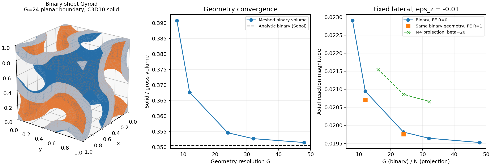

# tpms_jax 阶段总结、计算档案与后续工作计划

核查日期：2026-10-02。数值代码基线：`26c47d69516cd5fab7f2481c23d8eaa78bb37378`。本报告依据实际仓库、已完成 Abaqus 2026 作业及已归档验收文件整理。以下“已完成”均与证据对应；后续计划不计入完成工作。本次总结未重新提交 Abaqus 作业。

## 1. 当前进行到哪一步

项目已完成 M0～M4 的正向线弹性计算基础，以及三层独立 Abaqus 验证。现在的里程碑是：**已验证的正向计算与模型差异研究基线**。下一步先处理贴体网格质量、区分投影模型与二值模型差异的来源，再进入梯度验证和逆设计。

当前统计为 **21 个正式成功的 Abaqus 作业：19 个静力响应分析、2 个单元矩阵生成作业**。其中最近的二值阶段为 13 个：2 个均匀 C3D10 基准、11 个二值 Gyroid 工况。预检查作业、失败试输入和重复提取不重复计为研究工况。另有 M4 的 10 个固定横向 JAX 工况和单独新增的 N32 自由横向参考。

最近完整程序回归记录为 **102/102 通过，83.60 s**。这是现有测试集总数，不能把各阶段 62、71、91、102 相加。此次总结读取该测试记录，并校验已归档源码和原始文件，没有为文档整理重复跑大型求解。

| 层次 | 已完成内容 | 当前结论 | 尚未覆盖 |
| --- | --- | --- | --- |
| 正向 JAX 基础 | 几何、体积分数、HEX8 弹性、周期边界、积分点设计场、横向松弛、M4 敏感性 | 当前小应变固定设计场的计算和一致性检查可用 | 梯度正确性、优化闭环 |
| 均匀实体基准 | 3 个 C3D8、2 个 C3D10 解析对照 | 加载、符号、宏观自由度、周期约束和提取通过 | 非均匀材料下单元等价性 |
| 同一离散问题 | 单元矩阵诊断；N4/N16 线性矩阵输入对照 | 独立积分、组装、周期约束和求解得到一致响应 | 原生 C3D8+USDFLD、大网格可扩展 UEL |
| 真正二值实体 | C3D10，几何 G8～G48，固定/自由横向，固定几何 FE 加密 | 两种边界的整体响应均通过 1% 加密筛查 | 局部应力收敛、曲面高阶几何、实验验证 |

## 2. M0～M4 的工作回顾

### 2.1 M0：环境与最小验证

WSL Ubuntu-24.04 为研究代码环境，Pixi 管理并锁定依赖。原始环境初始化、环境测试和 JAX-FEM smoke test 已进入 Git 历史。实际求解使用项目 Pixi 环境中的 PyPI `jax-fem==0.0.12`；`/home/xuehu/projects/jax-fem` 是只读参考源码，不能把它当成此次运行导入的版本。

当前归档记录包括 Python 3.13.15、NumPy 2.4.6、SciPy 1.17.1、Gmsh 4.15.2，JAX 配置采用 float64。Windows Abaqus/Standard 为 2026，ODB 通过其自带 Python 读取。两个 Python 环境负责不同任务，不混用 `odbAccess` 与 WSL 常规 Python。

### 2.2 M1：几何与连续设计场

定义单胞周期 L=1，令 X=2πx/L、Y=2πy/L、Z=2πz/L，Gyroid 隐式函数为：

$$G=\sin X\cos Y+\sin Y\cos Z+\sin Z\cos X.$$

二值 sheet Gyroid 实体域为 `|G|≤c`，当前 c=0.541062。连续设计场为：

$$\rho=\operatorname{sigmoid}[\beta(G+c)]-\operatorname{sigmoid}[\beta(G-c)].$$

已实现隐式函数、二值掩码、连续投影、体积分数积分、c 标定、β 敏感性及 ParaView 输出，并修复 VTI 数据的 VTK X-fastest 顺序。**c 是隐式阈值，不能直接写成恒定物理壁厚；ρ 是刚度插值代理场，不能直接称为实际材料质量密度。**

### 2.3 M2：均匀实体有限元和周期边界

先完成均匀单位立方体 HEX8 线弹性、受约束/自由自由度的残差检查，再实现全 XYZ 周期最小基准，随后建立实际研究使用的 XY 周期和平整顶底加载面压缩模型。XYZ 周期能力的均匀测试不等于已经完成 Gyroid 的六工况均匀化。

### 2.4 M3：非均匀积分点场与自动横向松弛

把 ρ 计算在模型自身真实物理 Gauss 点，按积分点插值 E，完成首个 Gyroid 正向有限元。随后利用固定材料场线弹性响应对宏观应变的线性关系，自动求解满足平均 σxx=σyy=0 的横向应变；构建时间与四次求解时间分别记录。

本项目实际完成的 M3 内容是积分点材料场和横向松弛。早期 README 中把 M3 写为“自动微分与逆设计”属于规划名称；**目前没有以这些验收记录证明自动微分梯度或优化算法正确**。

### 2.5 M4：数值敏感性与审查修复

原始审查对象为 `a71c3b1`。进一步修复记录 `d75a7da` 包括：失败后停止整个研究并保存部分 CSV、非零退出；避免对缺失或失败工况继续做汇总；按需保留大型 Problem；应变统一使用 sym(H)；二值参考体积分数同样以 JxW 加权；用确定性的失效注入覆盖不同失败位置；核对松弛分支的唯一 Problem 构建与积分点材料场。

修复后完整重跑 10 工况，全部 `status=ok`。与原保存结果相比，最大反力相对变化约 1.12e-8、能量相对变化约 2.84e-12，物理结论不变。原记录最大缩减残差为 3.924e-12，修复后为 2.928e-12；此前“全部 ≤2.3e-13”的口头概括过于乐观，报告以实测记录为准。

九个耦合工况均为固定横向、e_min=E_min/E_s=1e-3：

| N | β=10，Fz | β=20，Fz | β=40，Fz |
| --- | --- | --- | --- |
| 16 | -0.023033618 | -0.021551564 | -0.021240774 |
| 24 | -0.022517022 | -0.020862791 | -0.020382485 |
| 32 | -0.022335874 | -0.020662766 | -0.020218818 |

第十项为 N32、β20、e_min=1e-4，Fz=-0.02045441490，相对 e_min=1e-3 的幅值下降约 1.008%。β20 的 N24→N32 相邻变化约 0.968%；这些是离散化/模型参数指示量，不能作为对真实实体的误差上界。β 会同时改变过渡带和积分体积分数，不能把 β40 自动视为比 β20 更准确。

这份 10 行 CSV **没有 β 的自由横向扫描**。后续新增 N32 自由横向参考单独保存在 `validation/abaqus_binary/projection_N32_relaxed_free.json`，没有改写原十行 CSV。M4 审查证据见 [M4 验证说明](https://github.com/xuehu13/tpms_jax/blob/26c47d69516cd5fab7f2481c23d8eaa78bb37378/validation/m4_review/README.md)。

## 3. 三层 Abaqus 验证的计算内容与结果

### 3.1 第一层：完整均匀实体解析基准

统一参数 E=10、ν=0.3、L=1、εz=-0.01。三个原生 C3D8 工况均为 N4，共 64 单元、125 个物理节点，加三个宏观控制节点：

| C3D8 工况 | Abaqus Fz | 解析 Fz | ALLSE | 状态 |
| --- | --- | --- | --- | --- |
| 固定横向 | -0.13461539149 | -0.13461538462 | 0.0006730769 | 通过 |
| 给定解析横向应变 | -0.10000000149 | -0.10000000000 | 0.0005000000 | 通过 |
| 自动自由松弛 | -0.10000000149 | -0.10000000000 | 0.0005000000 | 通过 |

固定横向解析 σxx=σyy=-0.05769230769；自由横向解析 εx=εy=+0.003、σxx=σyy=0。原生 C3D8 的最大反力相对误差约 5.11e-8，全节点仿射位移最大差异 2.24e-10。三个作业均无求解错误或警告。

进入 C3D10 路径后，另做固定/自由两项均匀仿射 patch test，48 个四面体、125 节点；同样核查解析应力、总能量和全部节点位移，均通过。均匀基准证明流程基础正确，但由于位移为仿射场，不能单独证明两个 HEX8 离散算子完全相同。

### 3.2 单元矩阵诊断：解释原生 C3D8 和 JAX HEX8 的差异

运行规则立方体及轻微畸变 HEX8 的两个无约束单元矩阵作业，比较完整 24×24 刚度；保留六个刚体零模态，没有靠边界条件隐藏差异。

| 单元几何 | Abaqus 与 JAX 的矩阵 Frobenius 相对差异 | JAX 与独立八点全积分 | Abaqus 与独立 B̄ |
| --- | --- | --- | --- |
| 规则立方体 | 28.291964% | 3.87e-16 | 4.97e-15 |
| 轻微畸变 | 28.331242% | 3.51e-16 | 4.84e-15 |

当前 JAX 对应八点位移型全积分，实测 Abaqus C3D8 对应体积项修正的 B̄ 预测；均匀仿射模式的矩阵作用仍一致。这与官方对一阶实体选择性体积积分的说明相符，见 [Abaqus 单元理论](https://docs.software.vt.edu/abaqusv2025/English/SIMACAETHERefMap/simathe-c-solidisoquadhex.htm)。网页为可访问的 2025 版，表中行为由本机 2026 实算核查。

**28.29% 是单元矩阵范数差异，不能写成 Gyroid 总反力误差。**这里覆盖两种均匀材料单元，不能把它直接外推为任意非均匀场的相同定量差异。原始矩阵和比较代码见 [单元算子诊断](https://github.com/xuehu13/tpms_jax/blob/26c47d69516cd5fab7f2481c23d8eaa78bb37378/validation/abaqus_element/README.md)。

### 3.3 第二层：相同 HEX8 Gauss 材料场、相同线性离散方程

独立 NumPy/SciPy 代码在真实 Gauss 点计算材料场和 `Ke=Σ Bqᵀ Dq Bq JxWq`，与实际 JAX 切线核对后，通过 Abaqus 的线性用户单元矩阵输入，让 Abaqus 独立组装、施加周期约束并求解。矩阵由独立积分生成，没有从 JAX 刚度直接复制。

| 工况 | Abaqus Fz | 反力相对差异 | 全节点位移最大绝对差异 | 重建能量相对差异 |
| --- | --- | --- | --- | --- |
| N4 固定 | -0.03443771973 | 1.97e-08 | 2.55e-10 | 4.47e-08 |
| N16 固定 | -0.02155156434 | 1.34e-08 | 4.64e-10 | 4.47e-08 |
| N16 自由 | -0.01668704674 | 2.97e-08 | 4.65e-10 | 4.49e-08 |

N16 独立矩阵相对差异 2.47e-15、密度最大差异 1.33e-15。事先设定反力/能量相对阈值 1e-6，全节点位移绝对阈值 1e-8；三项最终均通过。

N16 自由工况首次使用 JAX 默认迭代参考时，局部位移最大差异 1.508e-8，未通过位移标准。保持 Abaqus INP 字节及结果不变，采用同一方程的高精度直接参考后，差异降至 4.649e-10。首次失败与诊断均留档，没有放宽阈值。代码增加显式可选 `solver_options`，未指定时保持原默认行为。

此路径没有原生 S/E/IVOL/ALLSE；能量用 Abaqus U 和独立 Ke 重建，另核对 `0.5 RF·U`。它已验证相同离散方程，但**不构成原生 C3D8+USDFLD 的验证**。当前每单元一种用户类型受 U1～U9999 限制，不能直接用于 N24/N32。已知“用户单元不支持单元输出”警告逐条检查；错误及其他类型警告均为零。证据见 [同离散问题对照](https://github.com/xuehu13/tpms_jax/blob/26c47d69516cd5fab7f2481c23d8eaa78bb37378/validation/abaqus_discrete/README.md)。

### 3.4 第三层：真正二值 Gyroid 贴体实体

实体内部 E_s=10、ν=0.3；孔隙没有单元，没有 E_min 和灰度过渡。把背景四面体与 ±c 等值面相交，生成封闭三角皮肤，Gmsh 在这个边界内重划体网格，再生成 C3D10。该几何是解析二值域的**分片平面贴体逼近**。C3D10 中边节点取直线中点，单元阶次为二次位移，几何仍是分片平面。

G 表示构造等值面的背景几何分辨率；R 表示在同一个几何上细分 FE 网格。G 的变化会改变实体体积，R 的变化应保持体积。G 与 JAX 的 N 含义不同，不能认为 G32 与 N32 有相同单元数或同等精度。

裁剪单胞在普通欧氏空间里有主体和两个角部实体；XY 周期匹配后连通为一个结构，未删除角部碎片。全部二次节点参与周期匹配；几何闭合、相对面三角剖分、正 Jacobian、体积和约束消元都在提交前检查。

11 个二值静力工况的正式结果如下；两个均匀 C3D10 基准另计：

| G | R | 横向 | 节点 | C3D10 单元 | 实体体积分数 | Fz | ALLSE | 畸变单元 |
| --- | --- | --- | --- | --- | --- | --- | --- | --- |
| 8 | 0 | 固定 | 11,822 | 5,849 | 0.390770255 | -0.02290255763 | 1.14512783e-04 | 1,038 |
| 12 | 0 | 固定 | 28,841 | 14,628 | 0.367634999 | -0.02094602026 | 1.04730105e-04 | 3,490 |
| 12 | 1 | 固定 | 192,607 | 116,928 | 0.367634999 | -0.02070912719 | 1.03545630e-04 | 33,890 |
| 24 | 0 | 固定 | 124,403 | 67,254 | 0.354627106 | -0.01981327310 | 9.90663684e-05 | 11,078 |
| 24 | 0 | 自由 | 124,403 | 67,254 | 0.354627106 | -0.01524823438 | 7.62411728e-05 | 11,078 |
| 24 | 1 | 固定 | 854,039 | 538,032 | 0.354627106 | -0.01975533925 | 9.87766980e-05 | 111,078 |
| 24 | 1 | 自由 | 854,039 | 538,032 | 0.354627106 | -0.01520683896 | 7.60341936e-05 | 111,078 |
| 32 | 0 | 固定 | 239,663 | 134,110 | 0.352728572 | -0.01964192092 | 9.82096099e-05 | 20,360 |
| 32 | 0 | 自由 | 239,663 | 134,110 | 0.352728572 | -0.01510629896 | 7.55314904e-05 | 20,360 |
| 48 | 0 | 固定 | 651,229 | 388,464 | 0.351482895 | -0.01952391118 | 9.76195588e-05 | 28,635 |
| 48 | 0 | 自由 | 651,229 | 388,464 | 0.351482895 | -0.01501407754 | 7.50703839e-05 | 28,635 |

其中 G24R1 最大规模为 **538,032 个单元、854,039 个节点**。固定和自由工况使用逐位相同的坐标及连接关系，确保比较的是横向条件差异。已生成输入包、执行求解、读取原生积分点 S/E/IVOL 和 ALLSE，并通过所有物理一致性检查。

## 4. 核心结论及其适用范围

### 4.1 二值模型的整体加密筛查

| 指示量 | 固定横向 | 自由横向 | 本阶段筛查限值 |
| --- | --- | --- | --- |
| 几何 G24→G32 的反力相对变化 | 0.872% | 0.940% | 报告过程，不作最后一档验收 |
| 几何 G32→G48 的反力相对变化 | 0.604% | 0.614% | 1% |
| 同一 G24 几何，FE R0→R1 的反力相对变化 | 0.293% | 0.272% | 1% |
| G48 实体体积与独立解析域采样的相对差异 | 0.287% | 同一网格 | 1% |

表中反力变化均以较细结果为分母。较粗的 G12R0→R1 固定工况变化 1.144%，不能泛称“全部 FE 加密变化都小于 1%”。固定几何 FE 证据目前在 G24，不是 G48R1；尚未完成完整 G×R 双向极限分析。

解析域体积分数用 8 次扰乱 Sobol、每次 2^21 点独立采样，均值 0.3504759073、均值标准误约 1.58e-5；G48 实体为 0.3514828950。原 c 标定并非严格 0.350000。采样标准误、相邻网格变化率和 1% 筛查均不等于确定性误差上界。

### 4.2 投影模型与二值实体的反力差异

| 横向工况 | M4 N32，β20，e_min=1e-3 | 二值 G48，R0 | 投影幅值高出（二值为分母） |
| --- | --- | --- | --- |
| 固定 | -0.02066276647 | -0.01952391118 | 5.833% |
| 自由 | -0.01594378106 | -0.01501407754 | 6.192% |

差异定义为 `(|F_projection|-|F_binary|)/|F_binary|`。当前 M4 材料插值为 `Eq=E_s[e_min+(1-e_min)ρq]`，是线性 E(ρ)，没有额外 SIMP 幂。N32β20 投影体积分数为 0.3506883914。

自由横向 εx/εy：投影 0.003593782/0.002476978，二值 G48 为 0.003647882/0.002405141。应先核查裁剪与边界的作用，不能凭这两个数直接宣称无限周期材料的本征各向异性。

这约 6% 的差异是重要的模型对照结果，但同时含有投影过渡、虚拟孔隙刚度、体积分数变化、两边残余离散影响。现有数据还不能把它全部归因于 β，不能当作 Abaqus/JAX 求解器差异，也不能由此证明连续设计场已达到二值实体极限。



### 4.3 已有证据可以支持的表述

可以写：当前线弹性固定材料场下，相同 HEX8 离散方程在两套独立积分/组装/求解流程中得到一致响应；原生 C3D8 与当前 JAX HEX8 的单元公式差异已用实际矩阵解释；在相同 XY 周期与平整顶底边界下，二值模型的整体加密指示量降至 1% 以内，投影基线仍表现出约 6% 的有限分辨率反力差异。

现阶段不能写：已验证 USDFLD；已验证局部最大应力；已取得全 XYZ 周期等效弹性张量；已验证屈曲、塑性、接触或大变形；已完成自动微分逆设计；已有创新性或发表保证。这些都需要另外的证据。

## 5. 数值定义、验收标准和剩余风险

### 5.1 统一载荷与宏观量

所有上述压缩比较采用 Abaqus/Standard、小应变线弹性、NLGEOM=NO。E、长度、力采用一致的任意单位，尚未指定 E=10 的具体 MPa/Pa 含义。压缩应力和加载反力为负；L=1、总体积 V_gross=1，不是只用实体体积计算宏观刚度。

XY 周期的总位移跳跃为 `u_slave-u_master=H·(X_slave-X_master)`。底面 uz=0，顶面 uz=QZ.U3=-0.01；顶底 ux/uy 可局部波动。固定横向 QX/QY 为零；自由横向 QX/QY 不施加位移或外力，由平衡决定宏观松弛。角点固定 ux/uy 去除刚体平移。周期从自由度不重复消元，也不再施加冲突 BC，符合 [Abaqus 方程约束规则](https://docs.software.vt.edu/abaqusv2025/English/SIMACAECSTRefMap/simacst-c-equation.htm)。

这里的“自由横向”指零宏观横向广义力，不是逐节点取消周期性；上下平面加载也不是摩擦压板接触。它给出该边界工况的表观轴向响应，未等同于无限周期材料的六分量均匀化。

二值宏观应力为 `σ_macro=∫solid σ dV/V_gross`；实体平均应力 `∫solid σ dV/V_solid` 单独列出。单位单胞里二者相差实体体积分数，不能混用。整体功核对 `U=0.5 V_gross σ_macro:sym(H)`、`0.5 RF·U` 和内部能量。

### 5.2 原生二值 ODB 验收

| 项目 | 实际核查内容 | 阈值或规则 |
| --- | --- | --- |
| 作业完整性 | STA 完成、最终帧达到载荷、DAT/MSG 诊断 | 未完成/错误/未知警告即停止 |
| 文件对应 | 实算 INP/网格 SHA256、ODB 坐标、标签与积分点一致 | 不凭文件名认定正确 |
| 几何与积分 | 每 C3D10 四个积分点、IVOL 正值、积分体积与网格体积 | 相对 1e-6 等既定核查 |
| 整体平衡 | QZ 反力、总体积宏观应力、顶底反力平衡 | 响应相对 1e-6 |
| 能量 | ALLSE、0.5∫S:E dV、控制功、宏观功相互对照 | 相对 1e-6 |
| 位移约束 | 周期跳跃、加载面位移、固定或自由横向条件 | 位移绝对 1e-8 |
| 均匀 patch test | 解析应力/能量、全节点仿射位移 | 基准专属检查 |

Abaqus E 输出的剪切是工程剪切，六分量 S·E 不再额外乘 2；这与 JAX 张量双重缩并的表示须正确转换，见[官方应变约定](https://docs.software.vt.edu/abaqusv2025/English/SIMACAEMODRefMap/simamod-c-conventions.htm)。大 ODB 已采用 [FieldBulkData 批量访问](https://docs.software.vt.edu/abaqusv2025/English/SIMACAEKERRefMap/simaker-c-fieldbulkdatapyc.htm)并复制数组，以实例/单元/IP 排序匹配；与旧逐点读取在最大已完成 G24R1 工况比较，差异仅为舍入，ALLSE 无差异。

### 5.3 剩余风险的优先级

1. **贴体网格质量和局部应力：最高优先级。**G48 有 28,635 个畸变单元，G24R1 有 111,078 个；细网格的最小 mean-ratio 约 1e-4 甚至更低。整体功和平衡通过不保证应力集中可信，单纯增加单元数也不必然改善质量。
2. **几何与 FE 残余影响。**G48 尚无同几何 R1 结果；当前全局筛查支持阶段性比较，未证明精确二值极限或局部应力误差界。
3. **投影差异尚未分解。**原 c、不同 β 的体积分数及 E_min 都参与比较；尚无等体积分数系列、E_min→0 的系统研究和足够加密的 β 极限。
4. **局部解对求解精度更敏感。**已有自由工况的参考失败案例说明，全局残差与局部位移验收必须分别检查；后续不能只看总反力。
5. **资源与数据保全。**细网格以 8 GB 内存限制触发已核查的外存求解回退；Abaqus 仍成功完成。ODB 不在 GitHub，需保留 E 盘原始作业。二值 13 个正式 ODB 总计约 1.31 GiB；目录还有 datacheck ODB，不能按 ODB 个数统计正式工况。
6. **边界和研究目标。**若目标是等效材料常数，必须另建全 XYZ 周期；若目标是实验压缩，需要压板、接触、真实材料和尺寸。改变这些条件后应建立新基准。

已经修复而非待解决的程序问题：G48 共享交点浮点去重造成的非流形几何异常，已采用统一边端点顺序和缓存交点并加入回归；完全重复的体单元只按相同连接关系去重，随后重验拓扑/周期/体积。初次失败记录保留。没有删除真实小实体碎片来掩盖问题。

## 6. 文件在哪里，以及应该看什么

### 6.1 正式项目、参考目录与当前报告

| 用途 | 完整位置 | 说明 |
| --- | --- | --- |
| 正式 WSL 项目 | `/home/xuehu/projects/tpms_jax` | 唯一研究代码工作目录，当前使用 main |
| Windows 访问正式项目 | `\\wsl.localhost\Ubuntu-24.04\home\xuehu\projects\tpms_jax` | 与上行同一个目录 |
| JAX-FEM 参考源码 | `/home/xuehu/projects/jax-fem` | 只读参考，不是本次实际导入路径 |
| 更早的验证工作区 | `/home/xuehu/projects/jax-fem-workspace` | 未动，勿与正式仓库混用 |
| 当前完整报告 | `/home/xuehu/projects/tpms_jax/validation/project_status_20261002.md` | 随 Git 归档 |
| 计算与文件索引 | `/home/xuehu/projects/tpms_jax/validation/project_status_20261002_inventory.json` | 21 个正式作业及实际路径 |
| Windows 可读报告副本 | `C:\Users\xuehu\Documents\Codex\2026-10-01\referenced-chatgpt-conversation-this-is-an\tpms_jax_project_status_20261002.md` | 可从当前聊天打开 |

Windows Codex 工作区的 `work/tpms_jax` 是早期传输辅助克隆，仍保留原有本地状态，不能代替 WSL 正式项目，也不应在那里继续研究。此次 Git 同步只使用提交包和专用引用，没有覆盖其未提交文件。

### 6.2 Git 中保存的轻量研究证据

下表路径均以 `/home/xuehu/projects/tpms_jax/` 为根：

| 相对目录或文件 | 内容 | 首先查看 |
| --- | --- | --- |
| `validation/m4_review/` | 原始/修复后十行 CSV、求解日志、环境、比较及哈希 | `README.md`、`fixed.csv`、`summary.json` |
| `validation/abaqus_uniform/` | 三个 C3D8 INP、理论参数和实际验收 | `verified/summary.csv`、各 acceptance |
| `validation/abaqus_element/` | 两个原始矩阵、独立算子预测、比较 | `comparison.json`、`README.md` |
| `validation/abaqus_discrete/` | N4 示例、N16 轻量验收、初次失败和精度诊断 | 各 acceptance、`precision_diagnostic.json` |
| `validation/abaqus_binary/` | 13 工况参数/验收、MSG/STA、DAT 摘录、图及参考 | `summary.json`、`comparison.csv`、`README.md` |
| `validation/abaqus_binary/full_tests.txt` | 最近 102/102 全回归 | 记录不等于 Abaqus 工况数 |
| `validation/abaqus_binary/source_manifest.json` | 最终脚本 SHA256 和版本 | 参数清单另记录实际 INP/网格哈希 |
| `validation/abaqus_binary/global_response.png` | 几何、体积分数、固定横向反力图 | 图含 G24 固定几何 FE 加密点 |
| `validation/abaqus_validation_progress.md` | 各阶段范围与进度 | 本次更新主线状态 |

`results/` 默认忽略，里面的 M4 CSV 和 VTU/VTI 可用于工作，但正式可追溯记录已保存在 validation。`/tmp/m4v3.log` 等临时日志可能在 WSL 重启后丢失，后续依据归档日志。报告及证据也可从 [GitHub main](https://github.com/xuehu13/tpms_jax/tree/main/validation) 浏览。

### 6.3 Windows Abaqus 原始作业目录

| 阶段 | 完整包目录 | 正式作业数 |
| --- | --- | --- |
| 三个均匀 C3D8 | `E:\ABAQUS\2026temp\Abaqus_Work\tpms_jax_abaqus\uniform1001\abaqus_uniform_baseline` | 3 |
| 单元矩阵 | `E:\ABAQUS\2026temp\Abaqus_Work\tpms_jax_abaqus\element_comparison_20261002` | 2 |
| 同离散 N4 | `E:\ABAQUS\2026temp\Abaqus_Work\tpms_jax_abaqus\discrete_comparison_20261002` | 1 |
| 同离散 N16 固定/自由 | `E:\ABAQUS\2026temp\Abaqus_Work\tpms_jax_abaqus\discrete_comparison_verified_20261002` | 2 |
| C3D10 均匀及二值实体 | `E:\ABAQUS\2026temp\Abaqus_Work\tpms_jax_abaqus\binary_gyroid_20261002` | 13 |

每个包的根目录保留 INP、expected 参数/哈希、完整网格或 Gauss 场/参考；`work/` 保留 ODB、DAT、MSG、STA、控制台及提取报告；`scripts/` 保留运行时所用提取器。单元矩阵 `*_STIF1.mtx` 也在工作目录。

最大 G24R1 的正式固定结果示例：`E:\ABAQUS\2026temp\Abaqus_Work\tpms_jax_abaqus\binary_gyroid_20261002\work\binary_gyroid_G24_R1_C3D10_fixed.odb`。最细几何自由结果示例：`E:\ABAQUS\2026temp\Abaqus_Work\tpms_jax_abaqus\binary_gyroid_20261002\work\binary_gyroid_G48_R0_C3D10_relaxed_free.odb`。

完整 DAT 可能含几十万行畸变单元标签；Git 保存原始 MSG/STA、诊断摘录和完整 DAT 哈希/大小，大型 DAT/INP/NPZ/ODB 仍在本机。GitHub 是代码与轻量证据的备份，尚不是全部原始数据的异地备份。建议后续为各包建立带 SHA256 的独立数据备份；本次没有移动或删除原始作业。

### 6.4 主要程序分工

| 程序（正式项目根目录下） | 用途 |
| --- | --- |
| `geometry.py`、`volume.py` | Gyroid、投影场、体积分数和阈值 |
| `fem.py`、`pbc.py`、`density_fem.py` | 正向有限元、周期约束、积分点 E 与横向松弛 |
| `scripts/m4_numerical_study.py` | 十工况耦合/虚拟孔隙研究和一致性检查 |
| `scripts/prepare_uniform_baseline.py`、`extract_uniform_baseline.py` | 解析基准输入与原生 ODB 提取 |
| `scripts/abaqus_element_comparison.py` | 规则/畸变单元矩阵准备与比较 |
| `scripts/prepare_abaqus_discrete.py`、`run_abaqus_discrete.ps1`、`extract_abaqus_discrete.py` | 独立 Ke 输入、命令求解和位移/反力验收 |
| `binary_gyroid.py` | 裁剪几何、闭合/连通/质量审计与体网格 |
| `scripts/prepare_abaqus_binary.py` | C3D10 INP、周期方程、mesh/expected |
| `scripts/prepare_binary_lateral_pair.py` | 在实算固定网格上生成逐位相同的自由模型 |
| `scripts/run_abaqus_binary.ps1` | datacheck、求解、诊断和提取；支持 ExtractOnly |
| `scripts/extract_abaqus_binary.py` | U/RF/S/E/IVOL/ALLSE 原生验收 |
| `scripts/estimate_binary_volume.py` | 独立解析域采样 |
| `scripts/capture_binary_projection_reference.py` | 单独新增 M4 N32 自由参考 |
| `scripts/capture_abaqus_binary.py`、`plot_abaqus_binary.py` | 轻量归档、指标汇总和科学图 |

## 7. Git 合并情况与本次复核

用户已授权在验收后合并。本次数值代码以 fast-forward 方式整合到 main：`ef2b7d2 → 09680e4 → 26c47d6`，并已同步 GitHub；不重写历史、不强制推送。阶段分支继续保留，原始验证提交可独立引用。本报告及进度说明在该数值基线后作纯文档归档，当前 main 最新文档提交以 Git 历史及 Windows 合并回执为准。

合并前仓库干净、main 是验证分支祖先、`git diff --check` 无问题，远端 main 无额外新提交。此次复核 **11 个源码 SHA256 全部匹配，13 组 INP/mesh/DAT 共 39 个哈希全部匹配，13 个正式 ODB 全部存在且大小匹配记录**。ODB 的存在/大小检查不是 ODB 内容 SHA256；物理验收依据已保存的原生提取结果。源码未变化，因此沿用已完成的 102/102 回归，不重复计算来增加“通过次数”。

| 主要提交 | 已实现内容 |
| --- | --- |
| `a71c3b1` | 原始 M4-A 修复与耦合表 |
| `d75a7da` | 审查后的失败处理、定义一致性、复现证据 |
| `1062b32`～`ef2b7d2` | 均匀基准准备、提取修复、三工况实际验收 |
| `09680e4` | 单元算子诊断、相同 Gauss 场的线性离散对照 |
| `26c47d6` | 二值 C3D10、13 工况、双边界加密及约 6% 对照 |

合并表示将可复现、明确适用范围的计算工具纳入稳定基线，不会消除已记录的网格质量警告，也不会把局部应力或 USDFLD 改为“已完成”。后续实质研究改动在新 feature 分支推进，按批次留证据后再合并。

## 8. 后续工作计划：按证据门槛逐步推进

### A. 先处理贴体网格质量，并评估其对整体/局部结果的影响

首先利用现有 ODB 和网格做无新求解的诊断：畸变单元位置、mean-ratio 分布、与薄壁/表面/加载截面的关系；读取原生积分点 von Mises/能量密度，使用 IVOL 加权分位数、固定物理子域平均及能量占比，区分局部尖峰与稳健指标。极值、加载棱边和潜在边界奇异性单独报告；不以节点平滑云图或任意剔除高应力区证明收敛。

随后在 **保持同一 G24 表面几何、体积和周期匹配** 的条件下改善表面三角形与体网格。先对比两种网格、固定/自由横向，共 4 个新作业上限；在小批次完成前不直接提交更大 G48R1。若移动表面改变几何，须列为新几何工况而非同几何网格对照。不得通过删除小真实碎片或正体积单元提高指标。

门槛：正 Jacobian、闭合与周期一致、同几何体积一致、全部既有物理检查通过；畸变位置/比例及低质量尾部明确改善；整体反力/能量变化目标 ≤0.5%。局部稳健应力指标拟采用相邻加密 2%～5% 的工作筛查，需在计算前按选定指标和子域写入计划；这不是材料标准或严格误差界。若局部极值随加密持续增长，先诊断边界奇异性，再确定可报告的量。

交付：质量分布图、积分点应力/能量图、同几何敏感性表、原始警告和新的验收记录。如果论文目标仅是整体刚度，也至少完成网格质量对整体响应的敏感性核查。

### B. 分解目前约 6% 的投影—二值模型差异

保持现有 XY 周期和平整加载边界，先做固定横向，再扩展到关键自由横向工况。先新增 N48、β20、e_min=1e-3，与现有 N32 配对；只有反力变化仍显著时再考虑 N64，不能先堆满参数组合。

在足够解析过渡带的 N 上分别改变 β=10/20/40，观察反力、投影体积分数和过渡带解析程度。E_min 在同一 N、β 下逐步取 1e-3、1e-4、必要时 1e-5，并同时监测病态性和解精度；不能认为让 E_min 越小就自动得到可信二值极限。已经存在的重叠工况复用，不重复计算。

另外建立 **相同 c 系列** 和 **匹配体积分数系列**：后者重新标定 c(β)，分开报告“几何定义改变”和“灰度过渡改变”。比较总体积宏观应力、反力、能量和松弛应变，不用简单的 F/V 归一化替代真正的等体积分数建模。

门槛：每一批的残差、平衡和能量先过验收；目标网格变化 ≤0.5%～1%；如果离散变化与待解释的参数变化同量级，继续加密或诚实报告分辨率限制。交付误差来源表，明确哪些影响已隔离，哪些仍耦合；避免无依据地把各误差视为可线性相加。

### C. 原生 C3D8+USDFLD：按论文需要开启的独立路线

当前严格离散对照已通过矩阵路径，USDFLD 不是关闭这个验证里程碑的前置条件。若研究需要商业软件原生非均匀积分点应力输出，再开启这条路线。

先只读核查 Abaqus 2026 的子程序编译器与许可证，再用均匀场、小型分层场和 N4 Gyroid 测试，之后 N16。USDFLD 在材料点计算/查表 ρ，把 FIELD/FV 与线性 E(FV) 绑定；保存并核对物理点坐标、单元/IP 标签和实际场输出。当前设计场固定在参考构形，不能因大变形坐标更新而不经意改变材料定义。只用单元中心值或节点平均值不满足积分点对照要求。[官方 USDFLD 接口](https://docs.software.vt.edu/abaqusv2025/English/SIMACAESUBRefMap/simasub-c-usdfld.htm)明确它在材料点重定义场，后续以本机 2026 编译及输出验证为准。

USDFLD 提供材料场，**不改变原生 C3D8 的 B̄ 公式**。应先对照独立的“相同材料场+C3D8 算子”预测，再与 JAX 进行带明确公式差异的响应比较；不能强行要求它与八点全积分 Ke 逐项相等。需要扩大严格全积分对照时，再评估通用 UEL 或可扩展矩阵输入，突破当前 9999 类型限制。

交付：编译记录、FV/SDV/坐标点表、均匀及非均匀小模型、原生应力/能量验收。未通过前不将它写入已完成列表。

### D. 梯度正确性验证，然后做小规模逆设计

先选择当前边界下的表观轴向刚度或应变能目标，分别对 c 和少量连续场参数做 AD 与中心差分/方向导数对照，扫描差分步长，区分求解容差和差分截断误差。自由横向目标必须包含平衡得到的 εx/εy 随设计变量的变化，不能冻结松弛状态再宣称是总导数。

暂拟梯度工作门槛为稳定步长区间内方向导数相对差异 ≤1e-3；接近零的导数另用绝对尺度，并核查多方向、不同网格和容差。先验证几何、材料、求解和约束的完整导数链，再让优化器进入闭环。

最小设计研究可用保持周期性的少量 Fourier 参数控制 c(x)，约束投影体积分数并加入长度尺度控制，先低维、粗网格，再 β 延续和网格加密。均匀 c 在固定体积分数下自由度不足，不能把单个 c 调到目标体积就包装成结构逆设计。

每个优化设计必须重新生成对应二值实体，用改善后的 C3D10 路径独立检验整体刚度、体积与连通性；同时核对优化中的代理场与二值结果差异，保留优化前后数据。优化器“收敛”本身不是物理验证。

### E. 根据论文目标选择全 XYZ 均匀化或实验/非线性验证

若目标是材料等效常数，在二值 Gyroid 上建立全 XYZ 周期的六个独立宏观应变模式，提取 6×6 C_eff，核查工程剪切约定、对称性、正定性和能量一致性；将它与当前 XY 平面压缩报告分开。均匀立方体上先用解析各向同性张量回归。

若目标是打印件压缩，则需要真实材料参数和尺寸、压板接触/摩擦、实验边界与可能的塑性/大变形/屈曲；每增加一种物理机制先独立基准，不把现有线弹性单胞直接当作实验曲线预测。

文献调研应围绕最终采用的参数化、梯度方法、约束、验证深度和结果展开，用现有原始论文建立对比表。跨软件一致性和严谨验证构成方法可信度；是否成为论文创新点取决于后续方法与应用结果，现有报告不作“没人做过”的结论。

### 执行顺序与分工

| 顺序 | 近期任务 | 交付/停止条件 | 执行者 |
| --- | --- | --- | --- |
| 当前完成 | 冻结正向基线、合并 main、归档总结 | 代码/证据匹配，报告可追溯 | Codex |
| 下一批 | 现有网格和应力诊断，再 4 个以内同几何质量敏感性作业 | 通过物理验收并量化质量影响；失败先诊断 | Codex |
| 再下一批 | N48β20 起步的离散/投影影响分解 | 参数作用大于分辨率指示量，或明确报告限制 | Codex |
| 研究主线 | 梯度验证、小规模设计与二值复核 | 导数、约束、独立正向结果通过 | Codex；用户确定最终科研问题 |
| 按需路线 | USDFLD、全 XYZ 张量、非线性或实验 | 每条路线单独基准后再扩展 | Codex；用户提供必要材料/实验信息 |

代码、INP、命令提交、提取、失败诊断、报告和 Git 由 Codex 直接完成，不再需要 GLM 转达。用户目前不必手动导入 CAE 或补交既有路径；后续需要用户确定论文主目标、实际材料/实验数据或新软件环境授权时再集中提出。

下一批仍使用新作业目录，先小后大、串行运行大型作业，参考已验证的 cpus=8 与 memory=8gb，不同时挤占全部 WSL/Windows 内存。若诊断或验收失败，停止该批而非继续生成貌似完整的汇总。

## 9. 复查和复现命令

以下是复现说明，**本次总结没有运行这些求解命令**。新计算请使用新目录，避免覆盖已验收 ODB。大作业主要需要求解时间和磁盘，优先用 ExtractOnly 复查已有结果。

### 9.1 WSL：读取代码状态与运行测试

```bash
cd /home/xuehu/projects/tpms_jax
git status --short --branch
git log --oneline -5
.pixi/envs/default/bin/python -m pytest tests/ -q
```

M4 的常规脚本会写工作用 `results/m4_numerical_study.csv`，需要保留现有版本时先另存；Git 中原始/修复证据不随常规脚本自动覆盖。

### 9.2 Windows PowerShell：只复核现有二值 ODB

```powershell
$repo = '\\wsl.localhost\Ubuntu-24.04\home\xuehu\projects\tpms_jax'
$pkg = 'E:\ABAQUS\2026temp\Abaqus_Work\tpms_jax_abaqus\binary_gyroid_20261002'
& (Join-Path $repo 'scripts\run_abaqus_binary.ps1') `
  -PackageDirectory $pkg `
  -Cases @('binary_gyroid_G48_R0_C3D10_fixed',
           'binary_gyroid_G48_R0_C3D10_relaxed_free') `
  -ExtractOnly
```

ExtractOnly 仍会刷新该包的 diagnostics/acceptance/extract 文本；原始 ODB 不改。若要核对“最新版提取器”，先比较或更新包内 `scripts/`，保存原提取器/哈希，不要仅更换启动 PS1 就假定包内 Python 已同步。

### 9.3 WSL：在新目录准备一个二值固定/自由配对

```bash
cd /home/xuehu/projects/tpms_jax
.pixi/envs/default/bin/python scripts/prepare_abaqus_binary.py \
  --n 24 --refinement 1 --lateral fixed \
  --output results/new_binary_package
.pixi/envs/default/bin/python scripts/prepare_binary_lateral_pair.py \
  --fixed-expected results/new_binary_package/binary_gyroid_G24_R1_C3D10_fixed.expected.json \
  --output results/new_binary_package
```

将新包复制到新的 E 盘目录，并附上 `scripts/extract_abaqus_binary.py` 和 `scripts/extract_uniform_baseline.py`。然后用 PS1 运行 datacheck、求解和提取：

```powershell
$repo = '\\wsl.localhost\Ubuntu-24.04\home\xuehu\projects\tpms_jax'
$newPackage = 'E:\ABAQUS\2026temp\Abaqus_Work\tpms_jax_abaqus\NEW_UNIQUE_FOLDER'
& (Join-Path $repo 'scripts\run_abaqus_binary.ps1') `
  -PackageDirectory $newPackage `
  -Cases @('binary_gyroid_G24_R1_C3D10_fixed',
           'binary_gyroid_G24_R1_C3D10_relaxed_free') `
  -Cpus 8 -Memory 8gb
```

`NEW_UNIQUE_FOLDER` 是示例占位路径，先准备完整输入包再执行。脚本拒绝覆盖已有 ODB；计算是否成功以完成记录、诊断和物理验收为准，不能只看 bat 退出码。用户仍可用 Abaqus/Viewer 打开 ODB 看图，但计算与验证已可全部由代码完成。

## 附录：正式成功作业名

以下 21 项在 JSON 索引中逐项对应完整目录、ODB/矩阵和证据文件；带 `_check` 的预检查结果不在本列表：

- `uniform_xy_fixed`
- `uniform_xy_relaxed_prescribed`
- `uniform_xy_relaxed_free`
- `c3d8_regular`
- `c3d8_distorted`
- `discrete_gyroid_N4_fixed`
- `discrete_gyroid_N16_fixed`
- `discrete_gyroid_N16_relaxed_free`
- `binary_gyroid_G12_R0_C3D10_fixed`
- `binary_gyroid_G12_R1_C3D10_fixed`
- `binary_gyroid_G24_R0_C3D10_fixed`
- `binary_gyroid_G24_R0_C3D10_relaxed_free`
- `binary_gyroid_G24_R1_C3D10_fixed`
- `binary_gyroid_G24_R1_C3D10_relaxed_free`
- `binary_gyroid_G32_R0_C3D10_fixed`
- `binary_gyroid_G32_R0_C3D10_relaxed_free`
- `binary_gyroid_G48_R0_C3D10_fixed`
- `binary_gyroid_G48_R0_C3D10_relaxed_free`
- `binary_gyroid_G8_R0_C3D10_fixed`
- `binary_uniform_C3D10_fixed`
- `binary_uniform_C3D10_relaxed_free`

原始单阶段报告与验收文件保留。后续新结果应新增日期/分支/清单，避免用修改旧结果的方式改变当前里程碑结论。
