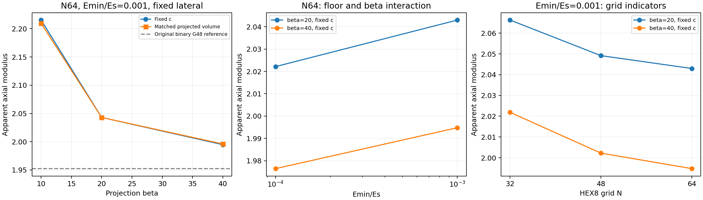

# 投影参数影响与体积分数匹配（2026-10-02）

本阶段完成预先限定的七个新增 JAX 工况，全部为横向固定；全部物理验收通过，完整测试 **117/117**。本轮新增 Abaqus 作业为 0，正式成功作业累计仍为 23。现在可以在明确模型定义的基础上进入小网格梯度验证；梯度和优化尚未验证。

## 研究问题与定义

主线仍是可验证的 TPMS 力学前向模型 → 完整导数链 → 小规模逆设计。本次回答：加密后的 β 影响是否仍明显？虚拟孔隙刚度与 β 是否交互？固定 c 时的体积分数变化能否解释主要 β 效应？

父基线为 a8b20e2834d77126907f5db283de92f17f344964。保持 E_s=10、ν=0.3、L=1、εz=−0.01、HEX8 八点全积分、E=E_min+ρ(E_s−E_min)、XY 周期及平整顶底加载面。固定横向表示宏观 εx=εy=0；不限制全部侧面节点的横向波动。本轮不是全 XYZ 周期均匀化，也不改变为接触压板或非线性模型。

复用上阶段 N64、β20、E_min/E_s=1e−3 基准。新计算分别为固定 c 的 N64 β10、N48/N64 β40、N64 β20/40 低 E_min，以及 N64 β10/40 的投影体积分数匹配。plan.json 在计算前列出七项、停止门槛和解释范围，未扩展参数扫描。

## 固定 c：β 与网格

c=0.541062，E_min/E_s=1e−3。下表均为 N64：

| β | c | 投影 Vf（Gauss/JxW） | Fz | 积分能量 U |
| --- | ---: | ---: | ---: | ---: |
| 10 | 0.541062000000 | 0.3513382288 | -0.022153232759 | 0.000110766163795 |
| 20 | 0.541062000000 | 0.3506870775 | -0.020429776956 | 0.000102148884781 |
| 40 | 0.541062000000 | 0.3505280533 | -0.019947960135 | 9.97398006765e-05 |

β40 的 N48→64 反力变化为 **0.373872%**，能量变化相同到舍入量级，通过预设 0.5% 优选门槛。β20 已有对应变化 0.302691%。β10 本轮只增加 N64；旧 N32→新 N64 的跨度指示量为 **0.824443%**，不能把它写成 N48→64 的配对结果。这些均为离散化指示量，不是严格误差界。

固定 c 的 β10→40 反力幅值跨度，以 β20 为分母，为 **10.794404%**。β40 的反力幅值比 β20 减少 2.358405%。网格加密后 β 影响仍是模型选择问题。

## 虚拟孔隙刚度与交互

在同一 N64、同一 c 的四个角点比较：

| β | Fz（E_min/E_s=1e−3） | Fz（1e−4） | 幅值减少（原 1e−3 为分母） |
| --- | ---: | ---: | ---: |
| 20 | -0.020429776956 | -0.020221570159 | 1.019134% |
| 40 | -0.019947960135 | -0.019764840370 | 0.917987% |

取 R=|Fz|，四角交互为 R(40,1e−4)−R(40,1e−3)−R(20,1e−4)+R(20,1e−3) = **2.5087031717e-05**，相对 β20、1e−3 基准为 **0.122796%**。该数值表示本组有限参数变化中的交互，不能建立可线性相加的连续体误差预算。

低 E_min 两项均通过原物理门槛；求解时间没有明显增长。但低 E_min 没有单独做 N48→64 配对，不能把 1e−3 的网格指示量当作低 E_min 已证明的误差界。

## 匹配投影体积分数

目标固定为既有 N64 β20 的积分投影 Vf=0.35068707752194，而不是二值 G48 的 Vf。对每个 β，用该 Problem 的真实 physical_quad_points 和 JxW 二分标定 c(β)，绝对容差 1e−10。各工况仅建立一个 Problem；自由横向的代码路径也由 N8 实际测试验证，标定后材料场在探针求解中保持同一值。

| β | 匹配后的 c | 投影 Vf | Fz（N64，E_min/E_s=1e−3） |
| --- | ---: | ---: | ---: |
| 10 | 0.540073038079 | 0.3506870775 | -0.022096760308 |
| 20 | 0.541062000000 | 0.3506870775 | -0.020429776956 |
| 40 | 0.541303816484 | 0.3506870775 | -0.019960585789 |

体积分数匹配后，β10→40 幅值跨度仍为 **10.456181%**。因此本组主要 β 效应不能只用总材料用量变化解释；过渡带及其空间分布仍影响整体响应。

匹配会改变 c，从而改变 |G|≤c 对应的二值几何。此系列没有生成匹配 c 的二值 Abaqus 模型，不能把它与旧 c=0.541062 的二值参考直接解释为同几何误差。图中旧二值水平线只提供原问题的响应尺度，不能用 Fz/Vf 归一化代替实际体积分数匹配。

## 与既有二值参考及验收边界

原二值 G48 固定 Fz=−0.01952391117811203。固定 c 的 N64 β20、1e−3 比它高 4.639776%；β40、1e−3 高 2.171947%；β40、1e−4 高 **1.234021%**。最后的较小差异仍包含二值几何/FE 离散、HEX8 离散、平滑过渡、积分体积和虚拟孔隙影响，不能据此宣布已得到真实二值极限，或为了贴近参考值直接选参数。

七项物理验收仍采用：数值有限；缩减残差、顶底平衡、功恒等式 ≤1e−8；反力与宏观应力一致性 ≤1e−6。实测最大缩减残差 1.019e-16、顶底不平衡 1.173e-15、反力一致性差 5.211e-15、功差 8.389e-18。这是方程求解与恒等式检查，不是模型与实验的一致性证明。

本轮大网格参数比较均为固定横向，没有据此为自由横向给出参数结论。二值局部最大应力仍未收敛；USDFLD 编译路径仍未验证；这些限制均保留。原十行 M4 CSV 未覆盖。

## 程序、文件与复现

程序只增加一个实际 Gauss/JxW 的标定函数，以及既有单工况接口的可选 c/target_vf 参数。默认 M4 公式和 CSV 列不变。标定是前向二分计算，尚不支持自动微分；不能把它直接包入优化器而忽略 c 随参数变化的导数。新增八项测试检查体积权重、单 Problem、固定/自由前向路径、密度逐位一致及 c 对同点二值参考的作用。

WSL 项目：/home/xuehu/projects/tpms_jax；本阶段七项 JSON、控制台日志、预设计划、测试、汇总图和指纹在 validation/projection_effects_20261002/。Windows 可访问 \\wsl.localhost\Ubuntu-24.04\home\xuehu\projects\tpms_jax\validation\projection_effects_20261002。既有二值输入和 ODB 仍位于 E:\ABAQUS\2026temp\Abaqus_Work\tpms_jax_abaqus\binary_gyroid_20261002。

~~~bash
cd /home/xuehu/projects/tpms_jax
.pixi/envs/default/bin/python scripts/capture_binary_projection_reference.py \
  --N 64 --beta 40 --emin-ratio .001 --lateral fixed --solver petsc \
  --target-vf 0.35068707752194295 --out results/NEW_matched_case.json
.pixi/envs/default/bin/python validation/projection_effects_20261002/summarize.py
~~~

单工况输出拒绝覆盖已有文件；固定 c 可省略 target-vf 或显式使用 --c。汇总程序只读已保存结果，重新核对物理验收、参数、体积、源码来源及完整测试，再生成图和 summary.json，不发起求解。source_manifest.json 记录本轮源码/证据以及复用输入的 SHA256；既有计算源码按父提交或 c13b1c7 追溯，安装的 JAX-FEM 指纹沿用上阶段清单。

| 新工况 | 求解秒数 | 主机进程峰值 MiB |
| --- | ---: | ---: |
| N64_beta10_emin3_fixed_c | 87.25 | 12421.3 |
| N48_beta40_emin3_fixed_c | 32.22 | 5930.9 |
| N64_beta40_emin3_fixed_c | 91.15 | 12423.0 |
| N64_beta20_emin4_fixed_c | 89.86 | 12419.3 |
| N64_beta40_emin4_fixed_c | 92.08 | 12434.3 |
| N64_beta10_emin3_matched_vf | 85.76 | 12425.2 |
| N64_beta40_emin3_matched_vf | 91.94 | 12436.4 |

全部使用已交叉验证的 PETSc CG/GAMG（rtol=1e−11、atol=1e−13、max_it=5000、未收敛报错），JAX 装配仍在 GPU。没有修改安装库或全局环境。

## 下一阶段的有限范围

先复用明确的 β20、E_min/E_s=1e−3 前向基准，在小网格验证固定横向的能量/轴向刚度对 c 的完整导数，再加入少量保持周期性的 Gyroid 厚度场参数。约定位移控制下的目标与体积约束，避免把力控制柔度公式直接套用。用多步长中心差分和多个方向核对 AD；预先规定容差、失败停止及通过后再加密的门槛，保留失败数据。

体积约束优先直接对投影 Vf 求导；若采用每次标定 c 的参数化，必须加入隐函数链。自由横向后续还需要计入松弛宏观应变随设计的变化。梯度通过后才开展一个小规模受体积约束的逆设计，并复核前向响应；只有设计改变带来明确物理问题时才生成新的 Abaqus 对照。当前七项小批次结束，不继续扩大参数扫描。
