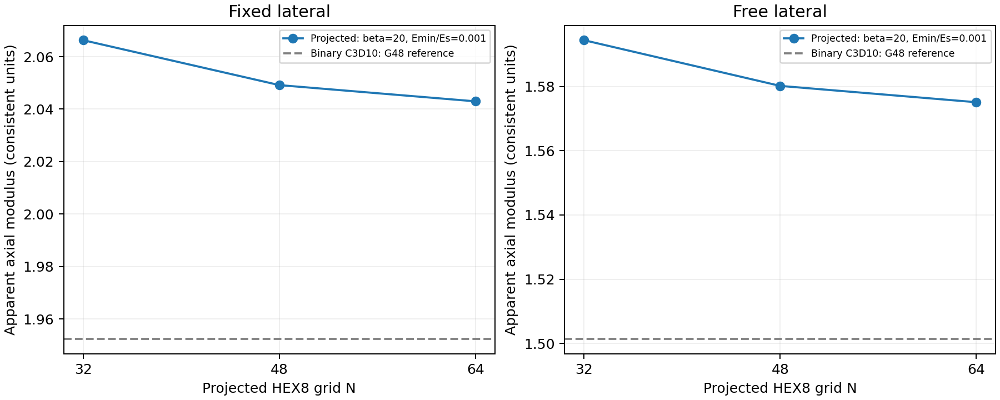

# 投影模型网格验证：N32 → N48 → N64（2026-10-02）

> 历史阶段记录：以下结果、测试数量及“下一步”保留当时口径。当前状态和后续顺序以 [研究主线与四阶段计划](../../docs/RESEARCH_STATUS.md) 为准；本次未改动该阶段原始数值证据。

本阶段完成四个新增 JAX 投影主工况（N48/N64，固定/自由横向）和一个 N48 线性求解器交叉核对。全部物理检查通过，完整回归 **109/109**。二值 Abaqus G48 参考复用既有结果；正式 Abaqus 作业累计仍为 23。本阶段没有验证梯度，也没有进行优化。

## 参数、计算与验收

保持 c=0.541062、β=20、E_min/E_s=1e-3、E_s=10、ν=0.3、L=1、εz=-0.01，线性插值 E=E_min+ρ(E_s−E_min)。ρ 在同一 HEX8 网格的真实八点 Gauss 位置计算。XY 周期、平整顶底加载面和原刚体约束不变；固定宏观 εx=εy=0，自由工况同时求 εx、εy 使总体积平均横向应力为零。

| 投影网格 N | 固定 Fz | 自由 Fz | 积分投影体积分数 |
| --- | ---: | ---: | ---: |
| 32 | -0.020662766471 | -0.015943781063 | 0.350688391 |
| 48 | -0.020491616025 | -0.015801640025 | 0.350686341 |
| 64 | -0.020429776956 | -0.015750861738 | 0.350687078 |

反力与总体积宏观应力、缩减残差、顶底平衡、宏观功与积分能量、数值有限性均沿用 M4 门槛；自由横向额外明确检查 |σxx|、|σyy|≤1e-8。原十行 M4 CSV 保留，工作用 results/m4_numerical_study.csv 与 validation/m4_review/fixed.csv 字节一致；N32 自由参考也未覆盖。

计算前 plan.json 规定相邻网格反力和能量变化优选≤0.5%、最大筛查≤1%，分母为更细网格响应。N32→48 固定/自由反力变化为 0.835222%/0.899533%，只满足最大限值；考虑它与约 1% 的 E_min 效应同量级，继续加密。N48→64 变化降为 **0.302691%/0.322384%**，反力和能量均达到优选门槛。这些是离散化指示量，不是严格误差界。

## 求解资源与交叉核对

N48 默认路径的实际显存占用采样约 4.5 GiB，机器 GPU 总显存约 8 GiB。为避免 N64 在线性求解阶段复制大矩阵至 GPU，采用已安装 JAX-FEM 的 PETSc CG/GAMG 选项；局部 JAX 装配仍在 GPU。核心改动仅给 evaluate_case 透传已有 solver_options，默认调用保持原行为。

先通过 N8 固定/自由实际交叉测试，再在 N48 固定模型核对：反力相对差异 3.308e-09，能量 1.524e-11。计算前 resource_adaptation.json 的门槛是 abs差≤1e-10+1e-6·abs默认值。PETSc 设置 rtol=1e-11、atol=1e-13、max_it=5000、未收敛报错，且最终真实物理残差仍须通过既有检查。

N64 固定有 262,144 个单元、2,097,152 个 Gauss 点；CPU 进程峰值约 12.1 GiB。精确主机峰值、时间和 JAX 设备见每项 JSON 的 runtime/t_build/t_solve。显存值是运行时采样，不是测得的峰值。没有修改已安装 JAX-FEM 或 WSL 全局配置。

## 与二值参考的差异及限制

沿用 G48 C3D10 二值参考，N64 投影反力幅值仍高出固定 **4.6398%**、自由 **4.9073%**，以二值反力幅值为分母。早期 N32 的约 5.83%/6.19% 对照包含更大的投影离散影响，因此不能继续把“约 6%”当作已经分离的投影误差。

该差异仍包含平滑过渡、虚拟孔隙刚度、两侧剩余离散误差、积分体积与几何差异。β、E_min 和匹配体积分数系列尚未在本次新增细网格上验证，不能将其拆成可线性相加的误差项。二值局部最大应力仍未收敛；当前研究对象是相同边界下的整体轴向响应，不是全 XYZ 均匀化张量。

## 文件和复现

代码根目录 /home/xuehu/projects/tpms_jax；本阶段参数、五组 JSON/控制台、完整测试、汇总图和 SHA256 均在 validation/projection_grid_20261002/。该目录通过 Windows 路径 \\wsl.localhost\Ubuntu-24.04\home\xuehu\projects\tpms_jax\validation\projection_grid_20261002 访问。复用的二值完整包位于 E:\ABAQUS\2026temp\Abaqus_Work\tpms_jax_abaqus\binary_gyroid_20261002。

用新的文件名运行，输出已存在时程序拒绝覆盖：

~~~bash
cd /home/xuehu/projects/tpms_jax
.pixi/envs/default/bin/python scripts/capture_binary_projection_reference.py \
  --N 64 --beta 20 --emin-ratio .001 --lateral fixed --solver petsc \
  --out results/NEW_projection_N64_fixed.json
~~~

自由工况将 lateral 改为 relaxed_free；N48 默认路径可省略 solver。summarize.py 只读既有计算结果，重建本阶段汇总和科学图，不发起求解。source_manifest.json 保存当前源码、实际安装的 JAX-FEM 三个关键文件、历史计算源码版本和证据 SHA256。N48 默认计算源码保存在 c13b1c7；后续数据中的源码哈希按当前文件核对，历史哈希按该提交或父基线核对。

## 下一步仍沿研究主线

先在该分辨率基础上小批次分离 β 与 E_min 的作用：固定横向优先复用既有 β=10/20/40 数据，新增必要的细网格配对；更陡过渡带要单独检查分辨率。E_min=1e-4 与 1e-3 在同一 N、β 对照，监测条件性及真实残差；不直接把更低 E_min 当作可信二值极限。随后用真实 Gauss 权重标定匹配投影体积分数的 c(β)，与“固定 c”系列分开报告。

在这些模型差异清楚后，先在小网格建立目标的完整导数链，对 c 及少量周期连续场参数做 AD/中心差分多步长和多方向核对，再推进小规模逆设计。自由横向导数包含松弛应变随设计变化的作用。当前没有为梯度、优化或局部应力作已完成声明。
