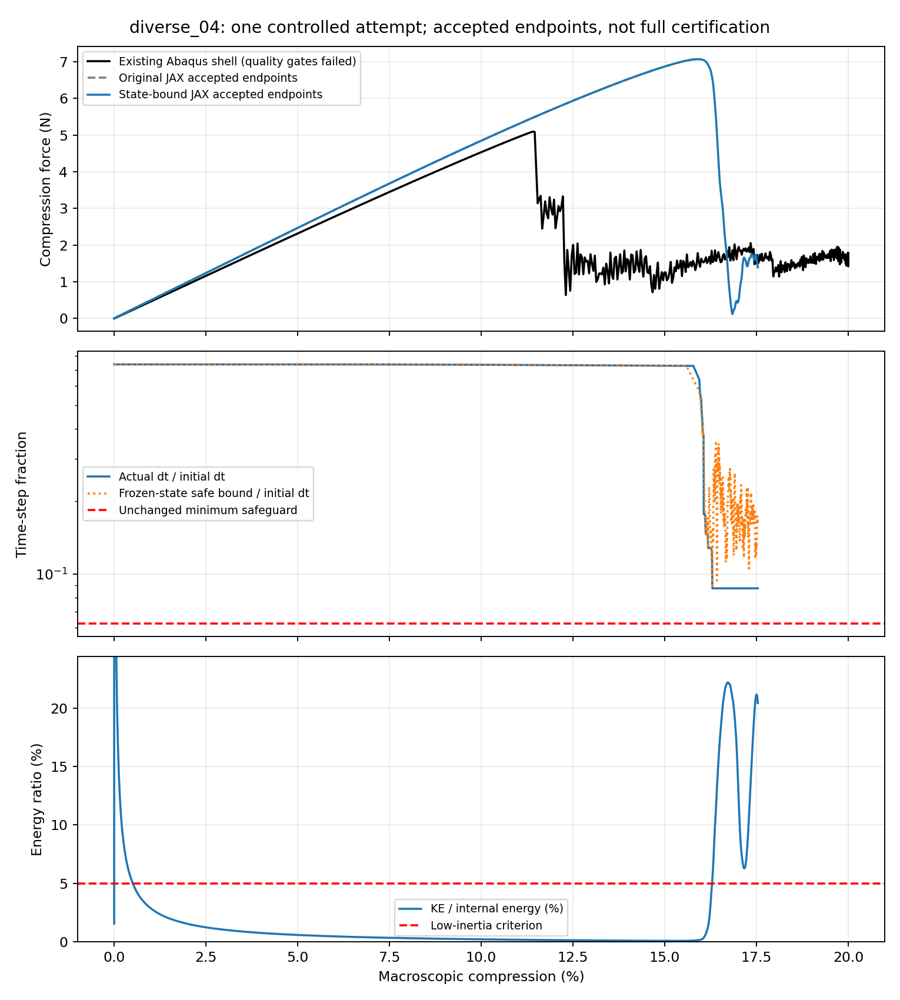

# diverse_04前置时间步控制：取得的进展与尚未解决的问题

2026-10-07，r18。目标仍是薄壁TPMS在背景网格/JAX中可信计算大压缩，为后续有效梯度和逆设计提供基础。本轮完成了保存态界限/成本评估、一次从零开始的受控前向及停止后的只读分析；没有完成20%验证，没有新Abaqus或设计AD作业。

## 这次是否有进展

**有。前置时间步控制避开了原16.0249%的数值爆发，将材料有效的接受路径推进到17.5363%；但目前仍不能作为可信准静态20%响应。** 实际停止原因是预设25分钟推进预算。独立的后验分析又表明，已发生的惯性使这条路径无法达到原准静态时长要求。因此不能把它说成“只是多给点时间就能通过”，也不能把预算停止说成JAX方法本身算不了。

更重要的是，两个问题现在有更清楚的区分：显式时间积分失稳已有改善证据；壳约11.42%降载而JAX约15.94%才到达本次观察峰值的差异仍在。下一步重点应是降载机制、分支触发和参照质量，不能继续单独缩步或调参数贴壳。

## 改了什么，理论依据是什么

diverse_04原中面、边长10mm、厚0.50mm、均匀NH实体E10MPa/ν0.3、XYZ周期波动和宏观横向应变0均保持。HEX27 N32/27积分点、HRZ质量、η=1e−4、界面0.05mm、objective_void/C²常数、JAX加载0.004s/保载0.0004s保持。壳仍复用既有0.040s/0.004s作业；两者加载时间不同的事实不掩盖。没有新阻尼、接触、塑性、质量缩放或几何变化。

中央差分的允许时间步受当前最高正频率约束，不能只凭初态波速一直使用同一dt。Abaqus也依据当前材料响应估计稳定步长；改变步长时半步速度需要一致处理。此处参考可访问的官方2025理论页，安装软件是2026，本轮未核实所有版本差异。[Abaqus显式动力学理论](https://docs.software.vt.edu/abaqusv2025/English/SIMACAETHERefMap/simathe-c-expdynamic.htm)

本项目候选在每个接受块前，由唯一共享材料核的机械切线计算单元节点刚度，再使用实际周期HRZ质量归一化，得到 `B=M^(-1/2) K M^(-1/2)`。K表示位移变化引起的内力变化，M是当前这套离散模型实际使用的质量。逐单元绝对行和、周期归并及三角不等式给出谱半径上界R；因此采用 `dt≤0.8×2/sqrt(R)`。固定平移自由度的行列排除，所有材料域均参与。[绝对行和界的数学依据](https://www.cs.utexas.edu/~flame/laff/alaff/chapter09-summary.html)

绝对值只用于估计界限，实际内力、能量和物理负刚度没有被投影或夹断。初始时间步约为原值74%；后续只减不增。一般每128步检查，敏感状态每16步检查；块末若频率界限超限或材料失效则保留拒绝场、有限回退。最低步长仍为初始值1/16，预算和原能量/惯性门槛不放宽。

必须区别上下界：r17局部正频率**下界**超过2，足以证明原dt超限；r18保守**上界**超过2，只说明当前保守策略要求减步，不证明实际最高频率一定超限。当前界限针对冻结端点的线性正频率，不能证明块内非线性全过程、未积分位置或物理分支正确。

## 实际结果及数字含义

| 项目 | 实际结果；含义 |
| --- | --- |
| 保存态评估 | 重复界限调用约0.76s，编译临时内存约79MiB；这是机械诊断成本，不是设计梯度成本 |
| 受控前向 | 从零至17.5363%，685个接受端点记录（含初态）；完整20%及保载未完成 |
| 停止 | 预设推进预算25min；整个调用25.50min，另含构建/编译与留存 |
| 拒绝 | 1个块末保守频率界限超限，回退后继续；不是该块被当作接受路径 |
| 接受端点材料 | NH越界0、非有限0；最小NH体积比J为0.02463，仍提示严重局部压缩 |
| 实际最低dt | 2.356×10⁻⁸s，为初始值8.75%；没有降破初始1/16保护 |
| 端点频率检查 | 接受块起点dt√R最大1.600，块末最大1.822，均符合本协议 |
| 末端惯性 | 动能/内能20.41%；加载阶段观察峰值22.19%，不能忽略 |
| 已观察加载质量 | ≥1%加载区间低动能时长占比91.10%；这不是完整路径指标 |
| 完成质量的最有利上界 | 假设剩余加载全部低动能，最终占比最多94.02%，仍低于原95% |
| 已观察功平衡 | 输入功6.57483N·mm，与内能＋动能的相对差0.00246%；只限本次观察区间 |

J=detF是局部当前体积与参考体积的有向比。未续接NH域要求实际J>0；末端最小值0.09579位于占据接近1的实体核心，不能把所有严重压缩都解释为界面尾部。深虚域和混合尾部仍有实际负J，按原候选全F求值保留；没有夹正实际翻转。有限端点/积分点检查不认证处处有效或无自接触。

“低动能”仍定义为KE/U≤5%。已观察高惯性时长195.03微秒，剩余加载时间最多1071.24微秒。按原右端点时长口径，把剩余全算成低惯性，分母最多3262.56微秒，因此占比上界为 `1−195.03/3262.56=94.02%`。程序实际触发的是预算停止；后验质量结论独立报告，不改写停止原因。

功平衡小而动能大并不矛盾：内能可以转成动能，能量仍守恒。官方屈曲示例也说明局部失稳释放会形成动能；这与纯数值爆发应区别，但不证明本TPMS分支物理正确。准静态还需要独立控制惯性。[局部失稳示例](https://docs.software.vt.edu/abaqusv2025/English/SIMACAEEXARefMap/simaexa-c-unstablestaticplate.htm)，[准静态能量判断](https://docs.software.vt.edu/abaqusv2025/English/SIMACAEGSARefMap/simagsa-c-qsienergybal.htm)

图中壳到20%来自既有作业，质量失败仍保留；两条JAX仅画真实接受端点。动能图纵轴聚焦后期约0～24%，初期小应变启动峰截顶；初始记录完整保留，加载质量仍按原≥1%区间计算。没有把短重放拼接到此路径，没有给部分路径计算完整20%RMS、保载反力差或输入功差。

## 较早的差异是否只是dt太大

以下为真实路径在共同压缩比例处的反力插值，单位N。压缩比例是单胞整体轴向缩短比例；表中力取压缩幅值。只用于已完成共同区间的诊断。

| 压缩 | 原JAX | 受控JAX | 既有壳 |
| --- | ---: | ---: | ---: |
| 5% | 2.47132 | 2.47132 | 2.31967 |
| 10% | 4.84938 | 4.84933 | 4.53582 |
| 12% | 5.72977 | 5.72987 | 2.92757 |
| 14% | 6.52820 | 6.52836 | 1.59358 |
| 15% | 6.87120 | 6.87189 | 1.25511 |

1%、5%、10%、12%、14%、15%这六个采样处，新旧JAX最大相对差仅约0.0101%。所以，不能再把12%以后的大差异主要归给原dt：JAX在数值有效的阶段已走上不同分支。受控路径观察峰值7.07239N位于15.9409%，壳既有峰值5.09832N位于11.4161%；这不是双方精确静态屈曲载荷认证。

虚域的两种作用也需要分开。停止态限制频率的81自由度局部支撑上，最高正频率方向的曲率约99.85%来自深虚域；它解释计算步长负担，不是总反力的份额。通过共享能量/应力的独立积分，在约10%～16%的四个保存态，深虚域＋混合尾部仅占总内能约0.9%，其直接静态宏观反力份额约0.3%～0.4%；停止态约为2.97%/1.37%。各域相加与原总内能和静态宏观反力吻合。

因此，**“虚域限制显式步长”有证据，“全部力差就是孔隙直接支撑”没有证据**。低总能量份额仍不能排除对临界模式/分支触发的影响；未续接NH域还包括连续界面部分，不全等同于二值实体。不能据此盲降η、改厚度或只选择贴近壳的数值。

壳也未成为合格真值：原低惯性占比67.16%、能量漂移6.76%、人工能量10.06%仍未过。既有INP未显式覆写体积黏性；可访问的Abaqus理论说明壳转动亦有线性体积黏性阻尼。其实际版本设置和各耗散来源需要区别，不能把全部ALLVD直接归因于某一个机制，也不能认为JAX无阻尼与壳天然是相同动力学问题。

## 对可行性的判断和下一项

本轮增加了继续研究的依据：保留原材料和几何，前置控制确实避开了原首错，得到更长的有限、近能量守恒路径。它降低了“背景方法只能无缘由崩溃”的不确定性。但diverse_04的20%可信前向、跨构型约10%响应一致性及新核完整梯度仍未完成。旧diverse_28范围保持，不能被新局部成功扩大。

下一项按唯一主规划处理较早降载与准静态条件：复用双方已有真实保存场，比较折叠位置/模式及关键弯曲方向的实体、界面、虚域切线作用；结合原壳质量判断后，才选择一次有因果解释、可承受的共同分支或加载条件对照。没有自动新增阻尼、接触、几何扰动、慢加载作业或训练，也不再靠无限减步延续这条已无法通过质量门槛的路径。

材料核与时间推进仍在JAX中；机械切线计算不是设计AD认证。未来完整梯度必须包括占据、HRZ质量、仿射惯性和实际接受时间离散，并处理或明确冻结控制产生的时间网格；拒绝/减步决策导数、本候选20%完整AD及形态距离导数尚未认证。

## 文件、程序与验证

正式实验：`/home/xuehu/projects/tpms_jax/validation/step_control_20261007_r18`。

- `saved_state_probe/`及manifest/log：保存态上界、重复耗时、编译内存，不推进时间。
- `controlled_forward/accepted_path.json`、`stability_path.json`：真实接受端点和对应界限；`last_valid_field.npz`的“valid”仅指材料/有限性有效，不代表准静态质量通过。
- `controlled_forward/rejected_block_01.npz`、`failure.json`：拒绝场与实际预算停止；没有`result.json`或20%末态。
- `analysis/controlled_analysis.json`、`quality_bound.json`、`endpoint_tangent_diagnosis.json`：部分响应、质量上界及域/切线诊断；`controlled_response.png`为图。
- `forward_manifest.json`、`forward_receipt.json`、`control_protocol.json`、`source_notes.json`：输入、源码、实际调用和理论来源；运行源码留在输出`source_at_run/`。

正式入口仍是`/home/xuehu/projects/tpms_jax/scripts/thin_target_explicit.py`，新控制默认关闭。仅为原block增加可选运行时dt，仍复用同一中央差分/内力；除block接口外类方法AST保持，去掉可选dt接口后默认block AST与原件完全一致。相关26项检查通过，包含实际周期残差的谱界检验、固定/运行时dt等价、控制完整小模型及预算留存；不认证大模型精度或设计AD。

r15/r16/r17共174个冻结文件哈希保持，共享材料/几何/周期模块及环境原字节保持。只读域后处理首次漏传scale参数，原失败源码/日志保留于`postprocess_attempt01/`；修复后域积分与实际总量核对通过，没有改前向或重跑力学。Windows `work/step_control_20261007`是调用/阅读/整理工具，不是第二套FEM。当前没有运行中或排队作业；本轮没有提交GitHub。
