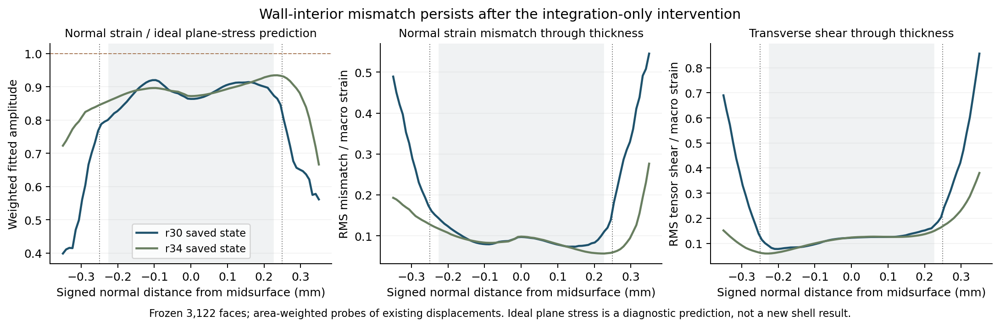
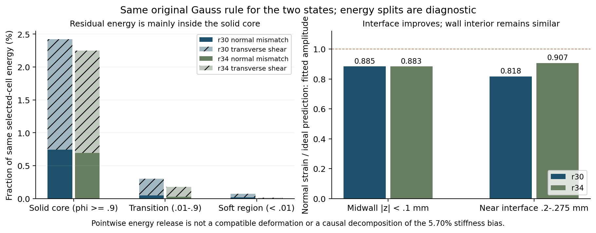

# 5%初始偏硬继续定位：差异不仅在界面，更应检查曲面壁内运动学

2026-10-08，r35。**本次没有改变材料或重新求解，只比较了两组已有静态位移。** 得到的关键线索是：补足局部积分后，界面附近的法向变形更接近局部平面应力预测，但壁内主体差异基本不变，整体刚度仍偏高。因此，当前更值得验证的是背景位移近似对曲面壁内变形的限制，以及真实三维有限厚度与壳模型的差别，不能继续把界面积分不足作为偏硬的充分解释。5.7025%主因仍未认证，没有把几个能量百分比当成它的分解。

## 问题从哪里来，为什么现在检查壁内变形

diverse_04原N32初始静态背景刚度4.916455 N/mm，同中面S3R/Standard壳4.651219 N/mm，背景高5.7025%。双方原初始求解、能量与周期检查通过，背景没有质量或阻尼，所以直接惯性不是这项静态差异的原因。平直膜向补片的泊松变形与同积分点解析值通过，而曲面仍偏硬；初始壳储能95.32%来自膜内承载，仅3.76%来自弯曲。因此，现阶段应关注曲面壁局部的伸缩和剪切，而非重跑长压缩或继续加密整个网格。

r33固定原位移，主要承载区局部密积分稳定；r34仅替换同一1941单元的积分再求初始平衡，刚度4.953612 N/mm，对壳高6.5014%，未改善。因此积分会影响结果，但补足该区域并不能消除偏硬。本次将两组已收敛位移拿到同一观察位置比较，追查补积分改变了什么、还有什么没有改变。

## 如何比较，避免把不同数据口径混在一起

沿用原冻结1941个背景单元，在相同原27个Gauss点、相同物理积分权重下评价r30/r34两组位移。材料分区运行前固定为φ<0.001、0.001≤φ<0.01、0.01≤φ<0.9、φ≥0.9，分别表示深软域、软域尾部、过渡带和接近完整基材的主体。φ是材料占据，不是另一种实际材料的组分。

各能量份额分母为“该状态在同一1941单元、同一27点规则下的总储能”。r34这项共同规则后处理能量不是其自身混合积分平衡能量，不能拿它重新计算K0或与壳反力直接对照。r30的全域和选区储能、r32已有法向/剪切分解均重现到预定10⁻¹⁰关口内，支持比较口径的一致性。

此外，沿r32原固定主承载区域3122个三角面质心的法向，读取从中面−0.35至+0.35 mm的81个观察点，每状态252882点。中面两侧名义壁面在±0.25 mm；每个位置的φ仍按原周期中面距离求值。使用已有Q2形函数求位移梯度，不增加节点或高斯积分层级，不新求平衡。线上的均方根和拟合量采用原面片面积权重，这是剖面观察，不是新的体积积分。

## 用什么理论量判断法向变形

取原中面局部单位法向n，把三维小应变分为切面应变εT、法向应变εnn=n·ε·n和横向剪切εnt。对同一均匀各向同性材料，若假定局部法向应力为零，那么由胡克定律得到：

`εnn_ps = −ν/(1−ν) · tr(εT)`，本项目ν=0.3。

这是假定平面应力时的理想法向应变，可以收缩，也可以膨胀；不是从壳ODB读取到的真实厚度应变。实际εnn与该预测的差异产生法向残差能。三维材料能可在每一点严格拆成切向平面应力能、法向残差能与横向剪切能，三项之和等于原三维能。本次只是代数诊断，不能把这些点独立松弛视为一个满足位移连续性和周期边界的新解。

为避免局部预测过零引起百分比发散，使用加权拟合系数 `c=Σ(w εnn εnn_ps)/Σ(w εnn_ps²)`。c=1表示实际法向应变在拟合幅度上符合该理想预测；c≈0.9表示整体投影幅度略低，不表示所有点均少变形10%，更不表示整体刚度误差10%。均方根残差另行保留，以区分幅度变化与空间分布差异。图中剪切使用应变张量εnt，不是工程剪应变2εnt。

## 结果：界面有所改善，壁内差异保留

| 同一观测口径 | r30原状态 | r34局部密积分平衡状态 | 含义 |
| --- | ---: | ---: | --- |
| φ≥0.9主体法向拟合系数c | 0.9043 | 0.9039 | 主体法向差异基本不变 |
| 中层\|z\|<0.1 mm，面积加权c | 0.8845 | 0.8832 | 壁内法向变形与理想预测存在稳定差异 |
| 近界面0.2≤\|z\|<0.275 mm，c | 0.8175 | 0.9068 | 界面法向变形明显接近理想预测 |
| 主体法向残差能/选区总能 | 0.7430% | 0.6947% | 不是整体刚度的因果贡献 |
| 主体横向剪切能/选区总能 | 1.6808% | 1.5514% | 仍有壁内剪切承载，不能直接删掉 |
| 过渡带法向+剪切能/选区总能 | 0.3007% | 0.1755% | 界面残差下降，但整体K0反而升高 |
| φ<0.01全部储能/选区总能 | 0.2358% | 0.0911% | 直接软域储能小，不证明其耦合影响为零 |

φ≥0.9主体本身占选区总储能的89.59%/88.58%。法向残差与剪切相关的能量主要落在这部分实体内部。图上的壁内曲线在两状态间接近，而壁外及界面差异较大。这比仅统计一个全域能量占比更有区分力：补积分确实改善了某些界面局部变形，却没有移除主体的三维变形差异，也没有改善整体偏硬。

## 这些差异是否已经证明背景网格不准确

还不能。存在两类需要分开的解释：背景Q2位移在较少穿厚度单元中可能不够自由，使曲面法向松弛或剪切变形受限；另一方面，真实有限厚度三维实体也允许局部法向应力与更丰富的厚度变化，本就不必逐点满足壳的简化假设。相同E、ν、名义厚度和中面，并不使两种模型的局部运动学完全等同。

Abaqus公开壳选择说明明确区分常规壳的厚度方向零应力/泊松效应，以及S3/S3R等通用壳允许横向剪切。因此，不能把背景中的所有剪切能都称为错误，也不能把背景εnn与平面应力预测的差异直接认定为锁死。本次用的是公开2025理论说明，实际分析软件2026，未认证所有版本实现差异。[Abaqus壳选择与厚度说明](https://docs.software.vt.edu/abaqusv2025/English/SIMACAEELMRefMap/simaelm-c-shellelem.htm)。

面片法向也有局限：原Gauss最近点在边/角附近时，法向只是代理；切向距离比例超过预定0.05标记的点携带选区能量9.63%/9.80%，均保留，没有删点。法向线质心中层的最近面没有切换，支持中层比较；在z≈+0.254 mm时最近面变化面积比例约0.864%，到+0.35 mm约2.44%；负侧壁外最大约7.96%，说明两侧壁外的面片代理质量并不相同。两侧均记录，未筛掉切换点；中层最近面不变，壁外剖面不能当完整曲面主曲率或真实三维应力测量。没有用少数大局部相对差来放大整体误差。

所以当前判断是：**曲面壁内的位移近似与三维/壳模型差别值得最高优先级验证；界面积分不足、直接惯性或深软域储能占比都不能单独解释5.70%。** 这仍是有数据支持的候选排序，不是根因认证。初始偏硬也不能自动解释后续屈曲峰位错开。

## 下一项如何更接近因果，而不扩大程序规模

下一先准备一个可兼容的局部法向翘曲试探：只在已有冻结单元中，让壁内多一种厚度方向的位移变化；原节点与单元边界位移保持，使相邻单元连续、周期波动不变。采用原三维材料能与既有密积分，保留t/E/ν/η/界面，不能按壳结果选择幅度。幅度由能量决定，不给反力乘拟合系数。

技术上只考虑每冻结单元一个预先定义、在所有单元边界和原27节点上为零的附加法向模式；方向依据旧几何法向，不做模式谱搜索。首先推导并核对连续性、原节点零位移、刚体不增能及同一材料能定义，冻结模式、来源、分母与预算后再做固定原节点的能量试探。**这项试探尚未执行，也不是重新全局平衡所得的刚度。** 若出现足够明确的可实现松弛，再决定是否需要一次初始重新平衡；若没有，不追加大量模式或新框架。它将检验离散位移是否过于受限，不能直接把三维本构换成平面应力。

原四步第1～2步完成，第3步继续查主因，第4步生产改进与两构型短段尚未执行。N32/生产27点/HRZ保持，N64与动态长路径不恢复。代表算例已有前向可行性证据保持，diverse_04完整20%及有效完整设计梯度仍未认证；本次没有设计AD或训练。

## 文件、成本与保存范围

正式目录 `/home/xuehu/projects/tpms_jax/validation/thickness_kinematics_20261008_r35/`：独立后处理diagnostic.py、运行前协议/选区哈希、result.json剖面与分区、两图和本报告。准备0.049秒，后处理3.126秒；没有FEM/Abaqus求解成本，绘图和文档整理单独计。所有预定能量重现、恒等式、有限性及预算检查通过，36项原来源/协议哈希保持。原生产、科学数组、状态、INP/ODB和旧失败不改。本轮无GitHub提交、推送或合并，无活动作业。

Windows只保存一个阅读报告与两图，支持工具完成后归档；根入口与WSL当前文档同步，旧入口原文保存。周总结仍为2026-10-07快照，没有重复制作Word/PPT或引入另一套生产程序。
