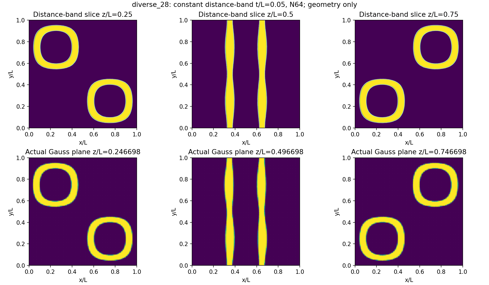

# 第1步：5%恒厚距离带的表示检查

2026-10-04。用户把本轮厚度改为单胞边长5%；本步已完成，结论是**几何/真实Gauss输入具备进入小变形对照的条件**。没有位移求解、Abaqus作业或训练，不能把本步叫薄壁力学精度通过。

## 对象与方法

复用diverse_28周期三角中面（9351节点、17986三角面）。它是一般周期隐式形态，不是旧经典Gyroid c带；原壳厚0.328595mm不改。新L=10mm、t=0.5mm，在标准化单位胞中t/L=0.05。

定义实体为距周期中面不超过t/2的距离带，截取到单胞。采用27个周期图像和双精度三角面AABB距离，测的是面内最近点，非顶点云距离；依据[libigl官方方法](https://libigl.github.io/tutorial/)与[绑定接口](https://libigl.github.io/libigl-python-bindings/api/igl/)。输入中面拼接单独检查，周期取模不用于掩盖裂缝。

rho=sigmoid((t/2-d)/ell)。d是无符号几何距离；rho是材料占据，非物理密度。单侧占据10%～90%的过渡宽为2ln(9)ell，本轮取0.05mm=壁厚10%，ell≈0.011378mm。以后对厚度求导固定ell，不同时改变正则化尺度。孔隙模量比η=1e-4；先复用现有E=10MPa、ν=0.3，下一步新壳须同值。XY力学周期、宏观横向fixed、平整z端与既有平动锚点口径已锁定。距离预处理不认证形态可微映射；只有固定中面上的厚度投影保持JAX。

## 实际结果与含义

- 周期粘合后中面为一个连接分量；非流形边/方向冲突为0，三方向边界坐标匹配差为0。它是几何拓扑检查，不是有限元响应证明。
- N64有262144个HEX8、每单元8点，共2097152个Problem自身真实Gauss点。t/h=3.2是尺度关系，不是弯曲充分解析定理。材料场与该Problem.rho逐位一致。
- 275886点rho≥0.95；85124点处于0.05～0.95过渡；1736142点rho≤0.05。这些阈值只用于显示/统计，不改变连续材料场。所有中面三角中心所在单元都测到实材，最小单元最大占据约0.99999998，没有此诊断下的漏壁。
- Gauss加权投影体积分数0.151649（15.1649%）；同点二值占据0.151634；面积×厚度名义值0.152163。体积分数是整个单胞的用料比例，和厚度/边长5%是不同量；它们接近不等于实体力学误差已知。
- 单元平均占据≥0.5的六邻接周期网格为一个连接分量；两侧孔隙通道诊断各维持一个连接分量。阈值连接只是表示诊断，不认证细小连接或真实接触。
- 512个面积加权三角中心法向截线的带宽约0.5mm。全17986面双侧端点有3个距离略低于名义值2%以上的标记；复查都命中共享边的相邻三角面，夹角约15.2°～15.4°，实际截线带宽0.50527～0.50606mm，比名义值多1.05%～1.21%。记录为局部折面偏置效应，不是这些点检测到远处壁碰撞；没有通过改t/η消掉它，也未证明全局偏置映射单射。
- 截面图人工复核：连续距离带与最近实际Gauss平面保留同一形态；两排z坐标略不同，标题已标明。黄色rho≈1，紫色rho≈0。

## 成本与继续条件

主要进程总壁钟932.73秒（15.55分钟）；capture函数主体853.67秒，Gauss距离查询1.247秒；峰值进程RSS约3.92GiB，未触发内存保护，未施加时间截止。外围启动/导入/保存指纹等成本不以主体计时冒充全部时间。主体还执行了既有逐单元背景映射检查，这是独立网格核查，不是压缩平衡成本；后续同一背景应复用已核对几何与权重，避免重复该慢检查。预算停止与方法失败分开。

152/152维护检查通过（108.50秒），原842个冻结证据不变。只新增libigl 2.6.3及小型surface_distance几何接口，未改FEM/周期/有限应变求解器。通过几何初筛后，下一步比较约0.01%小变形的刚度、能量与主要弯曲模式；不先批量跑大压缩或训练。

## 输入与复现

`input.json`锁定输入；`input/shell_mesh.inc`保存原中面及指纹；`gauss_field.npz`保存真实坐标、JxW、距离、占据和中面；`step1.json`原始捕获，`local_geometry_diagnostics.json`复查，`step1_decision.json`收口。大数组/原始日志留在本机，Git只发布必要输入、源码、摘要和图。后续复用缓存须与新Problem的实际Gauss坐标/权重一致，不能只凭数组形状匹配。

执行入口：`.pixi/envs/default/bin/python scripts/prepare_thin_target.py validation/thin_target_20261004_r5`。已完成目录拒绝覆盖；复现须复制锁定input.json与input/到新的实验目录。旧三个参数带宽、厚度与物理模型不自动混入本轮。
