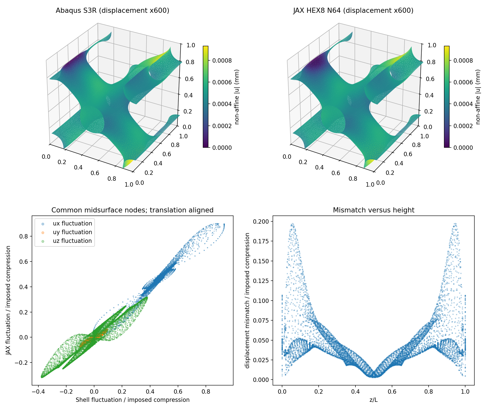
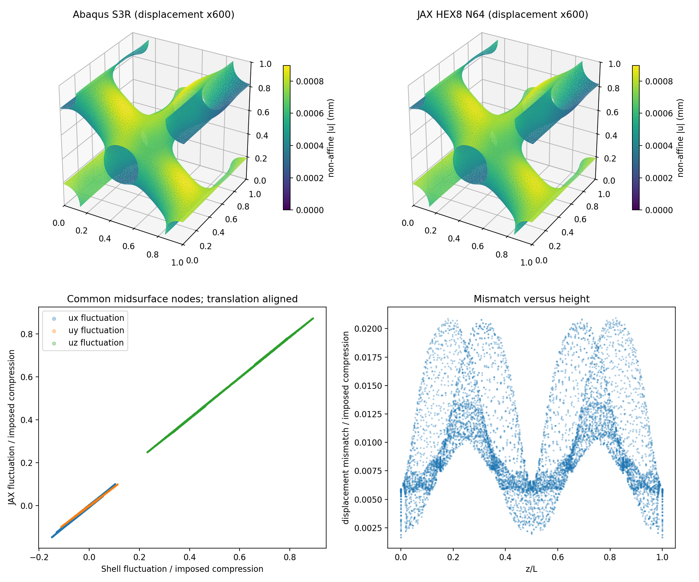

# 第2步：5%薄壁的小变形对照与端部诊断

2026-10-04。本轮完成两组匹配线弹性计算：原XY周期/平端加载，以及规划允许的一组XYZ周期边界诊断。**原平端对照未通过；三向周期单胞对照通过工作初筛。** 这给出薄壁背景法的积极前向证据，也揭示端部加载口径尚未闭合。本轮不进入大压缩、梯度或训练。

## 1. 计算的是什么

延续第1步diverse_28周期三角中面，单胞边长L=10mm、厚度t=0.5mm，即t/L=5%。它是一个方便独立比较的周期薄壁代表，不是全部TPMS构型认证。JAX用N64固定HEX8背景网格（262144单元，厚度约3.2个单元宽），在自身2097152个真实Gauss点采用第1步恒厚距离带。光滑单界面10%～90%宽度0.05mm，孔隙模量是实体的η=1e-4。η是虚拟域正则化，不是物理第二种材料。

Abaqus2026/Standard采用同一9351节点、17986三角面的S3R壳中面，厚度0.5mm、5个厚度积分点。两边基材均为E=10MPa、ν=0.3；本轮只求线性小变形，关闭几何非线性，没有塑性、接触、摩擦、质量缩放或新增稳定化。原用户旧壳材料/厚度/Explicit作业不改，不拿旧曲线当本轮参考。

施加轴向压缩0.01%，即名义位移Δ=−0.001mm。K=|Fz|/|Δ|，单位N/mm，表示这套几何和加载下的轴向刚度。也可写成受约束的轴向等效模量C=|Fz|/(L²·0.0001)，单位MPa；宏观横向应变固定，不能把C直接称为侧向自由的杨氏模量。线性响应的力与压缩量成正比，这一个加载点用来检查斜率，尚无大变形曲线。

JAX内部L归一为1，回到物理L时位移乘L、力乘L²、能量乘L³。本轮已统一输出mm、N和N·mm，避免单位错配。

## 2. 原定平端压缩结果

X/Y对边周期，宏观横向应变为0。JAX将上下整个实体截面uz保持平整；壳把截线中面节点uz设为0/Δ，截线转动仅受横向周期关系约束。两者表面看似同样平端，但壳中面端与有厚度的实体切面不是完全等效的运动学边界。两边只用必要的平移基准消除刚体位移；不同基准的中面位移比较仅平移对齐，没有旋转/幅值拟合。

| 量 | JAX N64 | Abaqus S3R | 判断 |
| --- | --- | --- | --- |
| 轴向刚度K，N/mm | 3.119686 | 2.200303 | JAX较壳高41.78%，未过10%工作门槛 |
| 上端反力Fz，N | −0.003119686 | −0.002200303 | 同一−0.001mm名义压缩 |
| 物理弹性储能，N·mm | 1.559843e−6 | 1.091435e−6 | 壳另有8.71619e−9人工能量 |
| 主要非均匀位移模式余弦 | 0.993853 | 比较值 | 接近1表示整体方向/分布相近，不代表刚度正确 |

JAX数值内部检查全部通过：周期条件、平端条件、缩减残差、顶底反力平衡、反力与平均应力、内能与宏观功一致。恢复后的最大缩减残差为5.62e−18（单位胞计算单位），并不是与壳的误差。壳周期位移误差为0，平端输出误差约4.75e−11mm；壳反力平衡与总能量/外功通过。

在共同中面节点用HEX8三线性插值比较位移，按中面面积加权：整体位移差的相对均方根约7.48%；扣除共同均匀压缩后的非均匀位移差约11.07%。“扣除均匀压缩”是为了观察弯曲/侧向变形而不是被共同的加载位移掩盖。近上下各10%高度区域的位移差均方根/名义压缩为8.82%，中间80%高度为4.53%，差异更集中在端部。壳与实体局部应力、壳转动没有逐自由度比较，也未认证。



## 3. 唯一补充诊断：同时改为三向周期

没有改变厚度、N、界面宽度、η、材料或中面。仅让两边都在X/Y/Z拼接周期，施加Hzz=−0.0001、其余宏观梯度为0，移除平端截面要求。壳平移和转动周期；z对边的总位移差等于宏观压缩位移。这里模拟周期材料内部单胞的均匀化压缩，不是带真实端面/压板的有限试样。

| 量 | JAX N64 | Abaqus S3R | 判断 |
| --- | --- | --- | --- |
| 轴向刚度K，N/mm | 3.962826 | 3.774884 | 相对差4.979%，通过10%初筛、接近5% |
| 与宏观压缩共轭的轴向力，N | −0.003962826 | −0.003774884 | 是周期胞广义加载力，不是压板接触力 |
| 物理弹性储能，N·mm | 1.981413e−6 | 1.883473e−6 | 差5.200%；计入壳人工能量后总储能差4.979% |
| 非均匀位移模式余弦 | 0.999852 | 比较值 | 三个位移分量的模式也接近 |

面积加权整体位移相对差2.986%，非均匀位移相对差1.791%，中面法向位移模式余弦0.999776。两组模式图均已人工查看，没有明显漏壁、错接或反向的整体模式。位移模式近似一致是前向证据，不是独立应力精度、屈曲或梯度认证。

两边改为XYZ后刚度都升高，而不是通过把某一边人为调软来靠近。差异从41.78%降到4.98%，再结合端部位移差集中，**强烈提示端部及壳/实体边界等效性是原差异的重要来源**。但同时改变了z拼接条件，不能严密定量地把42%全部归于端部，也不能宣布N64没有弯曲/界面误差。XYZ通过不能代替原XY平端验收。



## 4. 能量、约束和计算成本怎样读

Abaqus默认壳数值公式有人工应变能ALLAE，本轮未调整其参数。原平端ALLAE/ALLWK=0.792%，XYZ为0.210%；两组均低于本轮额外的1%参考质量检查。线性外功应与ALLSE+ALLAE比较，不能只与物理弹性能ALLSE比较。首次提取遗漏这一项，原记录保留，修正后只重新读同一个ODB，没有重算或换输入。有关能量定义见[Abaqus官方说明](https://docs.software.vt.edu/abaqusv2025/English/SIMACAEOUTRefMap/simaout-c-std-wholeandpartialmodelvariables.htm)。该1%是本轮筛查选择，不是通用误差上界。

周期方程采用独立星形从属关系，每个从属变量只消元一次，不再施加边界条件；上下宏观加载由独立控制节点读反力，再以能量/外功检查。避免把方程内部约束力漏算为外部反力，依据[Abaqus约束说明](https://docs.software.vt.edu/abaqusv2025/English/SIMACAECSTRefMap/simacst-c-equation.htm)。S3/S3R是同一通用三角壳，不是真实实体的精确解；[官方壳说明](https://docs.software.vt.edu/abaqusv2025/English/SIMACAEELMRefMap/simaelm-c-shellelem.htm)也说明其厚薄壳近似。

JAX两次实际求解分别156.70秒、114.79秒，主体建模约4.09秒、3.34秒；原启动进程187.61秒在JSON写入阶段退出，XYZ完整进程136.75秒。原位移已保存，仅重新后处理约6.58秒恢复JSON，没有第二次平衡求解。故本轮是2次JAX求解、2次Abaqus分析；不是多轮扫参。两份新脚本已修正输出类型与能量口径，核心FEM/求解器/环境未改。

XYZ实际峰值主机RSS12.21GiB；原平端采样峰值11.44GiB（不能当严格峰值）。5秒内存采样未触发保护；它不是瞬时硬上限，之后有限应变内存仍需留意。两次都显著短于约15分钟主要尝试参考，当前不需要先做成本优化。

高孔隙区定义ρ≤0.05，其积分能量占比为平端1.387%、XYZ1.046%；含过渡带和虚拟材料贡献，不能直接叫“η造成的误差”，也不能据此严格排除孔隙刚度影响。它不支持把全部42%简单解释成孔隙储能。

## 5. 现在的科研判断与下一步

目标5%薄壁能实际求解，且在一致周期单胞条件下已有刚度和模式的积极独立证据，路线可行性比第1步更明确。当前不能认定“此N64实现已准确替代原平端壳模型”，更不能外推1%/5%/20%压缩、塑性接触或有效设计梯度。

**第2步按边界分开收口；第3/4步未启动。下一项先明确原平端壳/实体的等效加载定义及适用对象，再接入分段压缩。** 若之后采用XYZ单胞区间，须在唯一主规划中明确说明研究的是周期材料内部响应，不能静默代替有限试样的端面压缩。原平端未通过项保留，本轮唯一必要诊断已用完，不再自动扫N/厚度/η或临时加接触/稳定化。

## 6. 文件与复现

正式结果：`/home/xuehu/projects/tpms_jax/validation/thin_target_20261004_r5/step2/`；下属`diagnostic_xyz/`单独存诊断。各有input.json、thin_shell.inp、jax.json、shell.json、comparison.json、review.json、modes.png；JAX位移jax_field.npz和日志仅在本机，Git忽略。原第1步输入/缓存/记录保持原字节。首次输出错误、脚本版本及图保存在本机source_*与原作业目录，不作为第二套维护程序。

原始Abaqus作业：`E:\ABAQUS\2026temp\Abaqus_Work\tpms_jax_abaqus\thin_target_20261004_r5_step2`与末尾`_xyz`目录，含INP、ODB、dat/msg/sta、提取脚本和结果。review.json保存原始文件SHA256。

维护入口只有`scripts/thin_target_linear.py`（prepare/jax/compare及唯一XYZ诊断开关）和`scripts/extract_thin_shell.py`（只读ODB提取）。复用density_fem.py、fem.py、pbc.py，不复制求解器。新目录运行示例：

```text
python scripts/thin_target_linear.py prepare validation/你的新实验目录
python scripts/thin_target_linear.py jax validation/你的新实验目录
abaqus job=thin_shell input=thin_shell.inp cpus=4 interactive
abaqus python extract_thin_shell.py thin_shell.odb input.json shell.json
python scripts/thin_target_linear.py compare validation/你的新实验目录
```

prepare需要该新目录具有第1步格式的锁定输入/缓存/检查；拒绝覆盖完成输出。Abaqus命令在独立作业目录运行，提取结果回传对应step2目录。以上是复现接口，不是要求重跑已完成案例。维护测试152项是上一提交记录；本轮新增脚本语法检查、实际两组对照与冻结证据检查，不把维护测试冒充科研通过。
