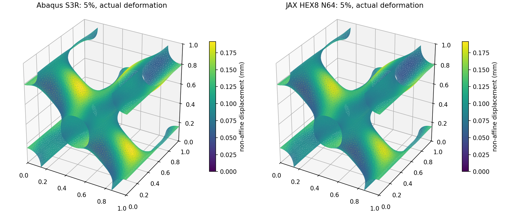

# 第3步：5%壁厚TPMS的XYZ周期有限应变压缩

2026-10-04启动，2026-10-05收口。用户明确后续统一XYZ三向周期，原平端/周期差异后置。本轮只推进原四步中的分段压缩，没有训练、设计梯度或边界诊断。

## 结论与主线作用

**目标薄壁在1%、5%工程压缩下能用N64固定背景JAX-FEM算到平衡，与匹配Abaqus弹性壳的主要变形及整体反力通过工作初筛。10%也算到平衡，但没有通过对照验收，20%未提交。** 这补上了目标厚度的有限应变可行性证据；没有证明任意TPMS或真实压溃可以直接替代Abaqus。

| 工程压缩 | JAX反力幅值 N | 壳反力幅值 N | 反力差 | 物理储能差 | 去平移模式余弦 | 最小J | 判定 |
| --- | --- | --- | --- | --- | --- | --- | --- |
| 1% | 0.389053 | 0.369327 | 5.34% | 5.39% | 0.999742 | 0.968046 | 工作初筛通过 |
| 5% | 1.739639 | 1.612465 | 7.89% | 6.54% | 0.999809 | 0.843743 | 工作初筛通过 |
| 10% | 2.572357 | 2.252645 | 14.19% | 9.17% | 0.999847 | 0.588114 | 未接受，停止扩展 |

反力取压缩力的正幅值；原JSON的Fz负号表示向下。工程压缩a=名义缩短量/初始边长，1%、5%、10%分别是10mm单胞缩短0.1、0.5、1mm，不是壁内处处有同样应变。相对差=|JAX/壳−1|，是两种近似的差别，不是真实误差界。余弦在共同中面上按面积加权，先去除不同固定点引入的平移，再去除共同任意平移；越近1，非仿射位移空间分布越一致。它不认证局部应力、壳转动或临界屈曲。第2步原模式数字含不同的共同平移口径，不能与这里直接比较。

## 同一个输入怎样进入大变形

复用第1步周期三角中面、名义壁厚0.5mm、物理10%～90%界面宽0.05mm、N64（262144 HEX8、2097152 Gauss点）及η=1e-4。ρ是实体占据近似，η是孔隙/实体模量比，不是异质材料课题。本轮不调整它们来拟合参考；新Problem的实际Gauss坐标和积分权重与缓存逐位比较。厚度/单元宽t/h=3.2仍只表示尺度，没有做完整精度收敛。

总位移u=H·X+w，X是初始位置，w在XYZ三向周期；宏观F̄=I+H=diag(1,1,1−a)。只轴向压缩，横向宏观应变固定，三个平移自由度用一个周期类固定。三向周期不是三个方向同时压缩。ρ仍属于初始材料点；背景拓扑不变，但F=I+H+∇w会变化，孔隙也随背景变形。

本构采用此前均匀实体验证过的可压缩Neo-Hookean：W=μ/2[J^(−2/3)tr(FᵀF)−3]+κ/2(J−1)²，J=detF为局部当前体积/初始体积。E=10MPa、ν=0.3匹配初始线弹性，μ=E/[2(1+ν)]、κ=E/[3(1−2ν)]；Gauss能量、第一Piola应力和切线同乘η+(1−η)ρ。P=∂W/∂F是对初始面积的应力，宏观轴向反力与其平均Pzz核对。单位转换为位移×L、反力×L²、能量×L³（mm、N、Nmm）。

壳参考沿用相同S3R中面、0.5mm初始厚度、XYZ平移/转动周期及宏观轴向控制点，采用*Hyperelastic, Neo Hooke，C10=1.923076923MPa、D1=0.24MPa⁻¹，nlgeom=YES；厚度可以变化。壳是平面应力/厚度运动学近似，背景是三维实体，不能逐自由度或局部应力硬对齐。该材料是匹配的弹性延拓基准，没有实验材料标定，也不含塑性、摩擦或自接触。[Abaqus超弹性定义](https://docs.software.vt.edu/abaqusv2025/English/SIMACAEMATRefMap/simamat-c-hyperelastic.htm)，[S3R当前厚度输出](https://docs.software.vt.edu/abaqusv2025/English/SIMACAEOUTRefMap/simaout-c-std-elementsectionvariables.htm)。

## 质量、范围与停止判断

JAX三个完成点均通过原方程平衡、反力平衡、反力/平均P、能量分区、周期及正J检查。最小J约束的是包括软孔隙在内的局部体积比；正值避免局部反转，不能证明整体映射没有自相交。ρ≤0.05点的储能占比只是软域影响线索，不是物理误差百分比。按三个点及模式图，没有观察到明显壁穿透；没有进行全局接触距离证明、稳定性特征值分析或多单胞屈曲认证。

工作初筛沿用整体反力/储能相对差≤10%、模式无明显异常。这个门槛用于决定能否继续，不是精度认证。1%、5%通过；10%不通过，现停止扩大范围，保存最后有效1%/5%状态。10%“未接受”不能改写为“方法算不动”或“明确发生真实失效”。

| 压缩 | Newton校正次数 | 求解秒 | 完整进程秒 | 峰值RSS GiB | 壳能量/外功差 | 软孔隙储能占比 |
| --- | --- | --- | --- | --- | --- | --- |
| 1% | 2 | 141.2 | 169.7 | 11.87 | 0.070% | 1.080% |
| 5% | 3 | 237.7 | 278.5 | 11.86 | 0.462% | 1.279% |
| 10% | 4 | 485.3 | 544.1 | 11.86 | 1.294% | 1.809% |

壳外功ALLWK也用控制点反力-位移的梯形积分独立核对。ALLSE为物理弹性储能，ALLAE为人工能量，比较JAX物理能量时单独使用ALLSE，并另报ALLSE+ALLAE。非线性不使用0.5Fδ恒等式。起初程序用了0.1%的壳能量平衡检查；5%未过。只细分一次参考加载（最大时间增量0.1改0.02，物理输入不变），反力几乎不变，残差约0.46%仍在，故本轮透明采用≤1%的可行性质量门槛，并保留原严格检查false；原因尚未定位，不称严格能量守恒。10%约1.29%，继续记为未通过，不再提高门槛。

观察点之间的JAX连线只为读图，不认证整段连续曲线或唯一稳定分支。宏观J平均与1−a一致指整个包含孔隙的背景体积，并非实体骨架的体积比。没有把原均匀体20%成功外推到本薄壁。

## 必要实现修正及真实计算次数

复用既有Newton/PETSc GMRES-GAMG及FEM/PBC，只在共享工厂增加XYZ和本Problem实际Gauss场入口。N64首次内层GMRES在很小残差处重启检查失败；1%调整内层容差后过了该点，但第二次装配触发内存保护。释放已被PETSc复制、下一轮会覆盖的旧COO数值V（约1.13GiB），不近似切线。重复切线与独立残差差分一致，155项维护检查通过。安装的JAX-FEM、材料势和FEM/PBC实现没有改动。

5%左预条件残差仍发生重启舍入停止；修改正交化单独未解决。最终使用右预条件GMRES、原方程残差范数，内层rtol=1e-8/atol=1e-12，外层Newton仍tol=1e-10，最终物理残差独立重算；没有禁用失败检查。预条件残差与真实残差尺度不同，不把旧报警叫结构畸变。[PETSc残差范数](https://petsc.org/release/manualpages/KSP/KSPSetNormType/)，[重启残差检查](https://petsc.org/release/manualpages/KSP/KSPGMRESSetBreakdownTolerance/)。

共7次JAX进程尝试：3个成功观察点、4次求解设置/内存停止；共4个Abaqus分析：1%、5%原加载、5%细分、10%。壳ODB接口/单精度检查修复只是重读原ODB，没有隐藏增加力学作业。1%用保存的线性位移预测，5%/10%复用前一成功状态预测。成功进程累计16.54分钟；含停止尝试累计23.58分钟，与上表单点成本分开。没有100/300秒截止，内存保护保留。

## 文件与下一项

正式目录`/home/xuehu/projects/tpms_jax/validation/thin_target_20261004_r5/step3_xyz/`，`a0p010000`、`a0p050000`、`a0p100000`保存input、jax/shell/comparison JSON及位移NPZ、模式图、日志、进程资源记录；`attempt*`保留停止原字节，`source_at_run`按当时SHA保存源码。`step3_decision.json`是本轮唯一收口结论。大型数组/源码快照/原始日志本机保留，Git不是完整实验档案。Git只发布三个完成观察点的INP；重复尝试的INP保留在原目录，哈希在原输入及本轮核验记录中，未删除或改写。

原始第3步input JSON从第2步复制，保留了线性epsilon_z=-0.0001和diagnostic_xyz等历史元数据；实际加载以compression、macro_F、INP及JAX位移场H为准，分别为1%、5%、10%。这些字段未参与本轮有限应变求解。原输入及其SHA保持不动；当前prepare入口已更正未来输入的epsilon_z并注明用户选定XYZ，避免误读，无须重复力学计算。

Abaqus原始INP/ODB在`E:\ABAQUS\2026temp\Abaqus_Work\tpms_jax_abaqus\`下四个`thin_target_20261004_r5_step3_xyz_*`独立目录。Windows阅读副本在`work/thin_target_step3_20261004/`。正式维护入口只有`scripts/thin_target_finite.py`和只读提取`scripts/extract_thin_finite.py`，不复制FEM。

下一项仍是原第4步：优先用1%已通过观察点检查物理厚度t对平衡反力的总梯度，再按证据决定是否补5%多点损失。保持物理界面宽度固定，少量正负差分和壳变化方向核对；不把固定状态偏导当平衡总导数，不启动训练或重开边界/网格扫描。
