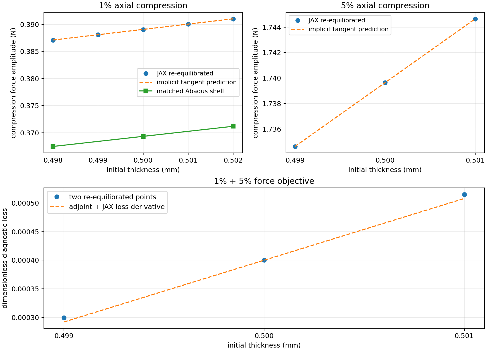

# 第4步：薄壁TPMS厚度的平衡总梯度与两点反力损失

2026-10-05。原四步本轮按限定范围收口。仍为diverse_28代表周期中面、L=10mm、t=0.5mm、XYZ轴向压缩/横向宏观应变固定；训练与完整精度认证后置。

## 结论及研究主线作用

**当前N64薄壁表示在1%、5%已通过前向初筛的加载点，可以给出经过重新求平衡差分检查的厚度总导数；1%的独立壳厚扰动同向且幅值接近。两个加载点组成的简单性能损失，其链式梯度也通过差分。** 这为以后性能驱动参数设计补上了有效梯度证据，尚未完成构型族/网络训练或真实压溃认证。

| 压缩 | 平衡总导数 N/mm | ±0.001mm中央差分 N/mm | 数值导数差 | 固定位移偏导 N/mm | 平衡校正占总导数 |
| --- | --- | --- | --- | --- | --- |
| 1% | 0.979164 | 0.979165 | 0.000147% | 0.783805 | 19.95% |
| 5% | 5.012674 | 5.012684 | 0.000202% | 3.520740 | 29.76% |

这里Q是压缩反力的正幅值，原Fz负号表示向下；t是初始物理壁厚。dQ/dt的N/mm表示每增加1mm壁厚的局部反力变化率，不能拿这样大的实际增厚直接使用线性预测。基准t=0.5mm附近，小幅增厚提高反力；无量纲敏感性(t/Q)·dQ/dt在1%、5%分别为1.2584、1.4407，即厚度小幅增加1%，反力约增加1.26%、1.44%。这是局部近似，不外推到其他构型/厚度/压缩机制。

1%还用±0.002mm核查：中央差分0.979170582N/mm，两种步长一致。0.001/0.002mm分别是基准厚度的0.2%/0.4%，不是网格加密。四个1%扰动及两个5%扰动都重新求到平衡，正J/软域J、周期、反力平衡和平均P一致性检查通过；波动位移变化很小，未见局部分支跳变，但未做稳定性谱认证。

## 为什么不能只对材料场求偏导

ρ=sigmoid[(t/(2L)−d)/ℓ]，d为第1步缓存的归一化周期中面距离；ℓ=0.005/(2ln9)，对应物理10%～90%界面宽0.05mm。求厚度导数时距离、中面、N64网格、物理界面宽、η=1e-4及材料均固定。∂ρ/∂t=ρ(1−ρ)/(2Lℓ)，单位1/mm；t变化不会重新计算最近三角形距离，也不意味着形态导数已成立。新Problem真实Gauss坐标/权重逐位核对，中心ρ与原缓存逐位一致。

设w为满足XYZ周期的位移波动，R(w,t)=0为平衡方程，K=∂R/∂w为切线。总导数是dQ/dt=Q_t−λᵀR_t，λ满足Kᵀλ=Q_w；Q_t是固定w的偏导，后一项包含平衡位移随厚度变化的影响。表中的校正占比约20%/30%，省略它会明显低估此响应的梯度。不能把原线性能量包络规则直接用于这个有限应变反力。

本轮复用安装版JAX-FEM的切线装配、周期缩减及PETSc线性解。当前保守势能U满足R=U_w，正反力Q=L²U_a/V0（a为工程压缩）；混合偏导给出Q_w=L²R_a/V0，JAX JVP计算R_a、R_t和固定状态Q_t，随后只做一次转置线性解。该等价反力规则避免保留N64完整反向计算图，没有改FEM/材料/平衡方程，也未对Newton迭代历史反传。小网格独立维护检查与安装版ad_wrapper的总梯度、差分和显式Q_w一致；目标N64则以真实重新平衡差分验收。伴随方程相对残差约1e-8，源平衡残差沿用并重算核对保存状态。

理论采用隐式求导/伴随思想，[JAX-FEM论文](https://arxiv.org/abs/2212.00964)支持可微有限元服务逆问题；本项目的通过结论来自上述本地检查。转置接口复用[PETSc MatTranspose](https://petsc.org/release/manualpages/Mat/MatTranspose/)。当前入口返回该反力目标的一阶灵敏度；尚未认证N64任意目标的通用ad_wrapper、整个网络反传或高维形态反向成本。

## 独立壳参考及多加载点损失

1%匹配壳只补t=0.498/0.502mm两项分析，几何、材料、XYZ和加载不变。壳导数0.929534N/mm，与JAX方向相同，幅值差5.339%；壳无量纲敏感性1.2584。两个壳的能量/外功差约0.070%，连原0.1%严格诊断也通过，周期/人工能量/当前厚度检查通过。这里的差是两种近似模型之差，不是真实误差界。5%没有新增独立壳厚导数，那里只认证数值总导数；此前前向7.89%差和壳约0.46%能量质量记录仍有效，不提升其精度结论。

两点损失ℒ(t)=0.5Σ[Q_i(t)/Q_i0−0.98]²，i取1%、5%，Q_i0为固定基准反力。0.98只是一个比基准低2%的诊断目标，用于检查性能目标到厚度的链式导数；没有反推厚度或拟合壳偏差。基准ℒ=0.00040000；JAX对损失的反力偏导与两个伴随总导数相乘求和，dℒ/dt=0.107964632/mm；两点均重新平衡的±0.001mm差分为0.107967996/mm，相对差0.003116%，通过预定1%门槛。此处只有两个观察点，不认证整条连续曲线或失稳/接触分支。

虚线是0.5mm处的一阶预测；底部损失是非线性函数，两端点可以与直线有二阶偏离。检查的是中央差分的局部斜率，不要求整段函数是一条直线。

## 成本、停止尝试和文件

中心平衡解复用第3步保存结果，零新增中心前向求解；新增2次伴随、6次完成的扰动前向、2项Abaqus分析。伴随完整进程为108.8/110.2秒，约1.8分钟；这是已存平衡解的反向成本，新设计还需另计前向成本。8个完成进程累计17.53分钟；含停止尝试的进程时间和为27.47分钟，后者有调度重叠，不能当标准顺序路径成本。

三次停止完整保留：首次0.498mm在RSS11.765GiB、仍可用2.356GiB时触及原75%WSL预算，未报告实际OOM/负J；本轮改为min(12GiB,80%WSL)进程上限、可用内存至少1.5GiB。随后提前启动0.501mm与未退出0.499mm重叠，是agent调度错误，新进程被保护停止，旧进程在无进展后由agent中断；不把这两个受干扰尝试归为方法失败。隔离重试通过，本地启动器增加单进程锁；没有改变物理输入或Newton/PETSc容差。原日志/进程记录和补充解释分开保存。没有旧100/300秒截止，保留内存/正J保护。

正式证据在`/home/xuehu/projects/tpms_jax/validation/thin_target_20261004_r5/step4_thickness_a01/`及同级`step4_thickness_a05/`：input、adjoint/jax、各t0p*前向/位移/进程、原源码source_at_run。主收口为a01下step4_decision.json，本报告只维护一份。新增维护入口`scripts/thin_thickness_gradient.py`。新增两个针对性测试核对安装版ad_wrapper、显式反力位移偏导及重新平衡差分；完整157项维护检查通过（112.82秒）。；原核心、环境和第1/2/3步保持原字节。大型数组/源码快照/日志本机留存，Git保留必要摘要、两份壳INP、图和报告；重复停止尝试INP不重复发布。

Abaqus原始目录为`E:\ABAQUS\2026temp\Abaqus_Work\tpms_jax_abaqus\thin_target_20261005_r5_step4_t0p498000`及`t0p502000`，包含INP/ODB/dat/msg/sta、只读提取结果。Windows阅读/一次性收据在`work/thin_target_step4_20261005/`。20%、接触、塑性、形态导数、训练和逆优化均未启动。

## 四步后的研究判断

本轮已形成一条连续证据：目标薄壁表示成立 → XYZ小变形壳对照积极 → 1%/5%有限应变前向初筛 → 同对象厚度总梯度及两点性能损失检查通过。对这个代表对象，固定背景路线值得继续，JAX梯度优势已在有限定的性能参数方向上发挥出来。10%对照未过、整个构型族/局部应力/形态导数和真实大压溃仍有缺口；不宣告JAX全面替代Abaqus。原四步按该范围收口，下一轮再围绕实际缺口制定短期计划，训练继续后置。
