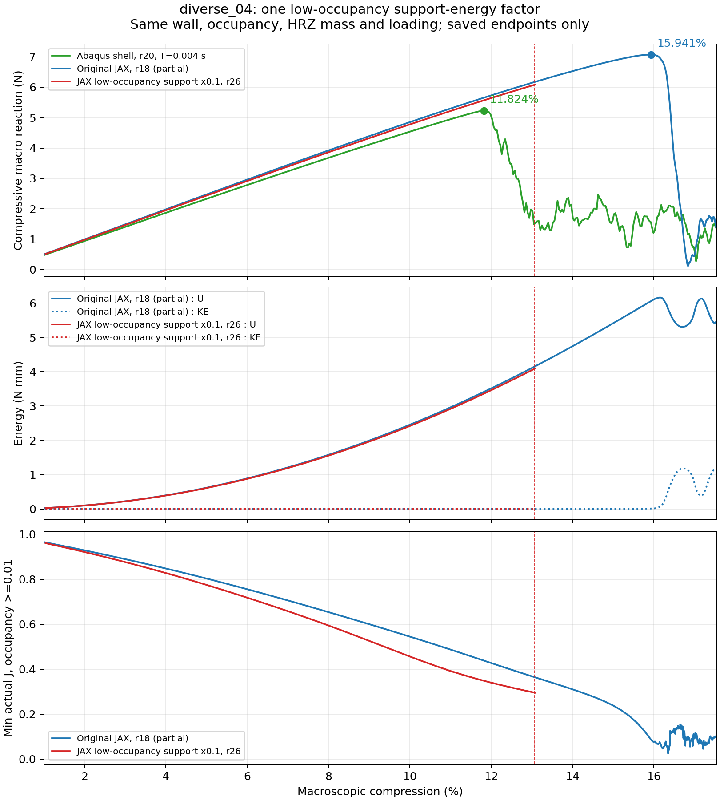
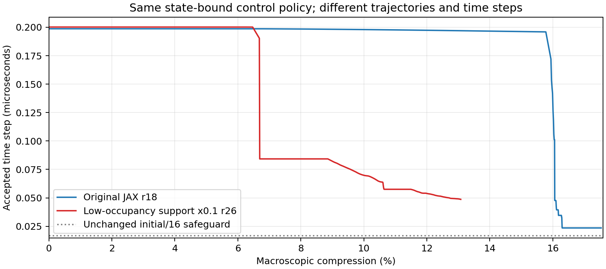

# r26：降低低占据支撑能量的单因素诊断

r26单次从零诊断已执行至13.0777%，1500s主体预算停，未覆盖预设完整峰区间。本次发现了可解释的数值瓶颈：弱化支撑后，虚域畸变使控制步长的保守频率上界增大，步长显著减小。**这不是已证明的TPMS降载峰误差来源，也没有得到可采用的精度改进。** 没有符合预设定义的观察降载峰；不能将截断末点当作峰值。不延长预算、不重试、不据此断言软域对峰位无影响。

## 问题与唯一改变

研究对象仍为diverse_04、10mm单胞/0.5mm壁厚、NH E10MPa/ν0.3、XYZ周期波动和零宏观横向应变，HEX27 N32、每单元27个积分点。占据、0.05mm界面、η1e−4、HRZ质量、参考材料坐标和加载时程保持原样。没有接触、塑性、阻尼或质量缩放。

只将几乎为空的区域的原能量乘预设因子：φ≤0.001为0.1；0.001<φ<0.01沿原C²门控平滑回到1；φ≥0.01完全保持原NH域。内力和切线由同一新能量求导，质量不乘因子。不是将所有过渡材料改为十分之一，更不是改变壁厚/实体模量拟合壳曲线。参考场整体材料缩放因子积分仅减小约0.0795%，这个积分不是结构弯曲刚度或实际能量份额。

原生产程序保持字节不变。独立适配器导入唯一显式入口，复用其推进和数值保护；只有诊断终点和旧高KE持续时长停止项两处受检适配：原20%/0.004s五次时程保持，目标诊断到17%，不保载；允许跳跃高KE，原准静态失败保持。初始名义步长仍按原0.0044s计算，实际步长由同一切线保护政策决定，可能与原路径不同。启动前协议见[PROTOCOL](PROTOCOL.md)，适配证据见`effective_controller.txt`。

## 从零路径实际算到了哪里

保留715个接受端点、1次拒绝/回退，末端压缩13.0777%，末端步长0.048694μs。停止原因为`Controlled forward budget stop; not a numerical method failure`。原r18在相同1500s预算下到17.5363%，本次没有覆盖原JAX约15.9409%峰；不能比较新旧JAX峰移动，也不符合启动前“不敏感”判读条件。

这次越过原快壳约11.8241%的观察峰位置后仍没有相应降载，因此至少没有在已覆盖范围内重现壳的峰和降载。原壳也不是物理真值，其原人工能量/阻尼/周期误差与准静态质量记录继续保留。

图中原JAX曲线仍只到17.5363%；新曲线到13.0777%截断，不能把其末点读成屈曲峰。圆点仅标已满足“峰后覆盖0.5个百分点且降载至少10%”的观察峰。曲线没有平移、平滑或拼接短重放。

实际共同主窗口为1%–13.0777%，不是预设完整1%–17%。RMS表示整段反力差的均方根；相对值分别除以历史固定2.25891N和匹配壳观察峰5.229988N，二者不能混用。功为反力沿压缩位移的积分，表中为前者相对后者的差异。

| 比较 | RMS(N) | /原固定2.25891N | /匹配壳峰5.229988N | 压缩功差 |
| --- | ---: | ---: | ---: | ---: |
| 新/原JAX，实际共同窗口 | 0.057804 | 2.559% | 1.105% | -1.513% |
| 新JAX/壳，实际共同窗口 | 0.873673 | 38.677% | 16.705% | +12.440% |
| 原JAX/壳，实际共同窗口 | 0.908829 | 40.233% | 17.377% | +14.168% |
| 新/原JAX，完整1%–8% | 0.036458 | 1.614% | 0.697% | -1.488% |

完整1%–8%早期窗口已覆盖；主/峰区间未完整覆盖，所有共同区间数字只在表述的区间有效。主窗口对壳差异也包含越过壳峰后的分支错位，不能当作均匀刚度误差。

## 为什么更软反而更慢：保存态提供了直接线索

显式步长依赖切线刚度与质量的比值。现有控制使用质量归一化刚度的保守绝对行和上界R（单位s⁻²），它不是屈曲特征值；安全步长取1.6/√R，并保留原初始步长/16下限。反力或储能很小的虚域，也可能由于极小质量和严重畸变而决定这个上界。

各自首个超过10%的保存态作CPU局部重构：新路径为10.0070%，原路径为10.0771%，不是完全相同的变形状态。新路径控制位置在参考坐标[3.59375, 0.0, 7.5]mm，4个相邻单元的108个积分点全部属于深虚域，最大φ仅2.144e-10。该处最大局部方向伸长约18.24倍，实际J最小-0.2632。这些是虚域背景自由度的大畸变，不是壁体被拉长18倍。

该位置R=5.2637e+14，约为原路径同期最大上界的8.05倍；局部重构相对差4.00e-15。原路径同期最大上界的量级主要来自NH域，新路径在此保存态则完全由深虚域贡献。该局部储能只有0.000112314N·mm，说明“局部能量很小”不能保证它不控制步长。分区绝对行和一般不可相加当作百分比，这里深虚域外积分点为零才可直接定位。

末端保存态的局部重构见`bound_location.json`，控制位置[3.59375, 0.0, 7.5]mm，分区证据只针对该保存态；有限采样不证明全过程均由同一位置控制。弱化能量会改变整个虚域位移场，严重畸变后有限延拓的切线仍可能增大。这是本次减步的有证据解释，不是“降低模量必然更不稳定”的普遍定理，也没有定位真实临界屈曲模式。

## 数值有效性、成本与结论边界

接受端点的真实NH域无非正J积分点，最小实际J=0.295039；全背景最小实际J=-13.023791，翻转保留在低占据域，不夹断F/J。接受端点的dt√R最大1.806947≤2。仅检查保存端点，不能认证每个内部步、接触不存在或完整20%物理解。

总前向耗时1529.48s（25.49min），其中控制主体1501.99s（包含首次切线/推进编译），准备与主体之外耗时约27.49s；主体切线上界分析547.15s、观测68.36s，属于主体而非额外重复计费。局部检查、只读保存态分析另计。端点梯形积分的最大能量差/最大累计功约0.000114%，仅是采样能量诊断，不是逐步能量证明。

15项实现一致性检查通过，包括能量/P/切线倍率、虚域翻转处有限性与客观性、HRZ质量公式不变、组装内力等于能量梯度和诊断终点。首次检查误要求两次GPU周期归并逐位相等；修正为节点质量逐位一致、周期归并仅允许舍入差（实测1.11e−16），保留原检查稿和修正记录。此项没有改变科学参数或启动前判读阈值。

原6个程序/环境文件、占据场、输入及旧JAX/壳参考均通过冻结哈希核验。未改默认材料/正式求解器，未提交新Abaqus作业，未提交/推送/合并Git。没有做本次设计AD，原NH20%梯度符号失败及新核完整20%/形态梯度缺口保持。

**科研判断：不能从本次说软域不是峰误差原因；也没有证据把0.1倍作为正式改进。能确认的是，简单削弱近空域会使该算例出现更严重的虚域畸变和更早的步长成本瓶颈。** 薄壁表示、局部弯曲/折叠和触发仍是候选。

## 下一项只选小型薄板弯曲诊断

按主规划第3步，下一项选固定厚度、材料与现有背景表示的小型薄板弯曲对照，先在不发生跳跃、接触或虚域大畸变的载荷下，分辨近壁连续表示/Q2运动学是否给出明显偏硬的弯曲响应。参考可用解析薄板关系和简洁壳模型；不再重建复杂TPMS，不调厚度/η/阻尼拟合。启动前再固定一个问题、载荷/分母/判据，当前未提交。若弯曲异常再针对该机制考虑改进；若不足以解释，另立协议考虑分支触发，而不是同时扫描参数或恢复失败谱搜索。

这保持研究主线：先确认可信薄壁力学，再谈完整梯度与学习。diverse_28已有20%范围证据不被本次失败推翻，但跨构型通用替代的缺口仍未消除。

正式原始路径：`/home/xuehu/projects/tpms_jax/validation/void_support_20261007_r26/`。本轮仅一次forward，保存路径和原程序未改；Windows为阅读本。
